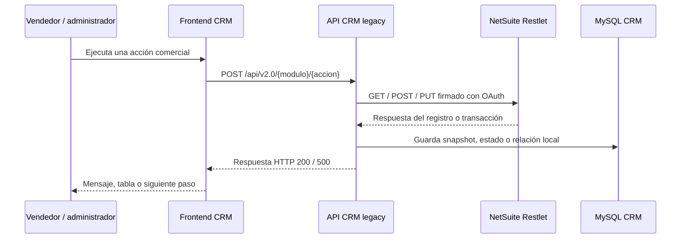

# 01 — NetSuite: integración y proceso de ventas

> **Última modificación:** 2026-07-09 (jueves)
>
> **Estado:** avance de primera fase. El mapeo de campos se cerrará cuando se revisen los Restlets y deployments dentro de NetSuite.

## Resumen ejecutivo

El CRM Ventas se comunica con NetSuite desde el backend Node/Express mediante la librería `nsrestlet`. El backend firma las solicitudes con credenciales OAuth configuradas por variables de entorno y expone la operación al frontend mediante endpoints `POST` bajo `/api/v2.0`.

La integración observada es principalmente **transaccional y bajo demanda**:

- el usuario ejecuta una acción en el CRM;
- el frontend llama a la API CRM;
- la API consulta, crea o actualiza un registro en un Restlet de NetSuite;
- el backend guarda o actualiza el contexto local en MySQL cuando aplica;
- la respuesta regresa al frontend para mostrar el resultado.

## Endpoints remotos identificados

| Restlet | Uso observado | Operaciones locales asociadas | Certeza |
|---|---|---|---|
| `script=1763`, `deploy=1` | Operaciones de creación en NetSuite. | Crear lead, oportunidad, estimación y orden de venta. | Comprobado en código. |
| `script=1764`, `deploy=1` | Consulta y edición de registros. | Consultar cliente/lead, expediente, estimación, orden de venta, búsqueda guardada y editar lead/estimación/orden. | Comprobado en código. |
| `script=1774`, `deploy=1` | Acciones de reserva y cierre. | Pre-reserva, caída de reserva, reserva y cierre firmado. | Comprobado en código. |

### Ambientes detectados

El código usa URLs con cuenta de producción (`4552704.restlets.api.netsuite.com`) y sandbox (`4552704-sb1.restlets.api.netsuite.com`). El uso detectado debe validarse antes de afirmar que todos los flujos productivos apuntan al mismo ambiente:

| Módulo | Ambiente observado |
|---|---|
| Leads / expedientes | Producción. |
| Oportunidades | Sandbox en el módulo de creación. |
| Estimaciones | Sandbox en las llamadas del archivo revisado. |
| Órdenes de venta / reportes | Producción. |

> **Pendiente importante:** validar si la diferencia sandbox/producción es intencional, histórica o una configuración que debe corregirse.

## Autenticación

La API carga desde entorno los siguientes grupos de configuración, sin exponer valores en esta documentación:

- consumer key y consumer secret;
- token ID y token secret;
- realm/account ID;
- firma OAuth;
- secreto JWT de sesión del CRM.

El objeto `accountSettings` se utiliza con `nsrestlet.createLink(...)`. Los secretos deben permanecer únicamente en el entorno de ejecución o el gestor de secretos; no deben copiarse a Markdown, GitHub, logs ni capturas.

## Frecuencia: qué sí y qué no hace el sistema

### Sincronización bajo demanda

Estas operaciones llaman a NetSuite cuando el usuario o un flujo de negocio las dispara:

- consultar un lead por ID;
- crear o editar un lead;
- crear una oportunidad;
- crear, consultar o editar una estimación;
- enviar una estimación como pre-reserva;
- registrar caída de pre-reserva;
- crear, consultar o editar una orden de venta;
- enviar reserva, caída de reserva o cierre firmado;
- actualizar un expediente desde NetSuite;
- consultar una búsqueda guardada para reportes.

### Tareas programadas observadas

Los cron del backend no usan `nsrestlet`; trabajan sobre MySQL, correo y Outlook:

| Tarea | Frecuencia | Zona horaria | Función |
|---|---:|---|---|
| Oportunidades menos probables | Diario, 01:00 | `America/Costa_Rica` | Inactivar oportunidades con la regla de antigüedad configurada, actualmente 3 meses. |
| Limpieza de calendarios | Diario, 06:00 | `America/Costa_Rica` | Cancelar/limpiar eventos vencidos según las reglas del módulo. |
| Reportes de leads | Diario, 14:00 | `America/Costa_Rica` | Revisar carga y atención de leads y enviar alertas por correo. |
| Invitaciones de citas | Cada minuto | Proceso del servidor | Enviar nuevas citas y reprogramaciones pendientes. |

**Conclusión de primera fase:** no se observó un proceso programado que descargue masivamente todos los registros de NetSuite. La frecuencia real de una carga externa adicional debe confirmarse en infraestructura, NetSuite y logs de producción.

## Enlaces internos

- [Flujo y matriz de registros](./flujo-y-registros.md)
- [Arquitectura general](../README.md#mapa-rápido-del-sistema)
- [API CRM legacy](../02-api-crm/README.md)
- [Manual del proceso de ventas](../04-manual-usuario/proceso-ventas.md)
