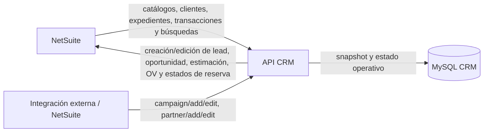

# NetSuite — flujo, registros y matriz CRM vs. ERP

> **Última modificación:** 2026-07-09 (jueves)
>
> **Estado:** avance de primera fase; los nombres exactos de campos de NetSuite deben confirmarse contra cada Restlet.

## Flujo comercial completo

```mermaid
flowchart TD
    L["Lead / cliente interesado"] --> S["Seguimiento\nWhatsApp, nota, evento"]
    S --> D{ "¿Continúa activo?" }
    D -- "No" --> P["Perdido\nse registra motivo y bitácora"]
    D -- "Sí" --> O["Crear oportunidad"]
    O --> E["Crear estimación"]
    E --> R{ "¿Se envía a pre-reserva?" }
    R -- "No" --> E2["Editar / dar seguimiento a estimación"]
    R -- "Sí" --> PR["Pre-reserva"]
    PR --> RC{ "¿Se formaliza la venta?" }
    RC -- "No" --> CA["Pre-reserva caída"]
    RC -- "Sí" --> OV["Orden de venta"]
    OV --> RES["Reserva"]
    RES --> CF["Cierre firmado"]
    CF --> FIN["Seguimiento de comisión, pagos y cierre"]
```

## Matriz de registros

| Registro / concepto | ID que conserva el CRM | Datos que el CRM almacena | Operación NetSuite observada | Sistema de referencia funcional |
|---|---|---|---|---|
| Lead / cliente interesado | `idnetsuite_lead` y `idinterno_lead` | Nombre, correo, teléfono, proyecto, subsidiaria, campaña, empresa, referencia, moneda, asignación, estado, acción, seguimiento y bitácora. | `GET customer`, `POST lead`, `PUT` de información/estado. | NetSuite para datos maestros de cliente; CRM para seguimiento comercial y bitácora. |
| Administrador / asesor | `idnetsuite_admin` | Nombre, correo, rol, supervisor, subsidiaria, estado y token de sesión local. | Se usa como identificador de empleado/asesor en payloads; no se observó en esta copia un Restlet dedicado de usuarios. | NetSuite para el ID operativo; CRM para sesión, rol y reglas de visualización. |
| Campaña | `id_NetsauiteCampana` | Nombre y estado de campaña. | Alta/edición entrante mediante `/campaign/*/crm`, con Stored Procedures locales. | NetSuite o integración externa para catálogo; CRM para selección y relación con leads. |
| Corredor / partner | `id_netsuiteCorredor` y `valoridNetsuite` | Nombre, categoría, empresa, teléfono, correo y estado. | Alta/edición entrante mediante `/partner/*/crm`. | NetSuite o integración externa para catálogo; CRM para vinculación al lead. |
| Expediente de unidad | `ID_interno_expediente` | Código, proyecto, vivienda, estado, precios, áreas, planos, entrega, cuota y fecha de modificación. | `GET customrecord_ix_record_exp_unidades`; actualización puntual desde `/expedientes/updateExpediente`. | NetSuite para inventario/unidad; CRM para consulta y selección en oportunidad. |
| Oportunidad | `id_oportunidad_oport` | Cliente, empleado, expediente, estado, probabilidad, pronóstico, fechas, rangos, total proyectado, subsidiaria, memo y trazabilidad de estados. | `POST oportunidad` para crear; ediciones de estado/probabilidad se procesan en CRM y algunas reglas afectan el registro local. | Compartido: NetSuite para transacción/maestro; CRM para gestión y trazabilidad. |
| Estimación | `idEstimacion_est` y `tranid_est` | Relaciones con lead/oportunidad/expediente/asesor, caducidad, monto, estado, pre-reserva, caída y comprobante del cliente. | `POST estimacion`, `GET estimate`, `PUT estimate`, `POST prereserva`, `PUT caida`. | NetSuite para transacción y líneas; CRM para ciclo operativo y estados auxiliares. |
| Orden de venta | `id_ov_netsuite` y `id_ov_tranid` | Relaciones, subsidiaria, fechas, precios, comisión, reserva, caída, contrato, cierre firmado, aprobaciones y pagos. | `GET salesordersExtraer`, `POST salesorder`, `PUT ordenVenta`, `POST reserva`, `PUT cierre_firmado`. | NetSuite para la transacción; CRM para control operativo, aprobaciones y seguimiento. |
| Búsqueda guardada | `searchId` de la solicitud | El resultado se entrega al reporte; no se observa una tabla local dedicada en este flujo. | `GET savedSearch`. | NetSuite. |

## Campos compartidos identificados

Estos campos aparecen tanto como datos de negocio en el código de integración como en las tablas locales. La correspondencia exacta de nombre externo aún debe confirmarse:

| Dominio | Identificadores compartidos | Datos compartidos probables |
|---|---|---|
| Cliente | ID NetSuite del cliente/lead y `idinterno_lead`. | Nombre, correo, teléfono, empresa, subsidiaria, proyecto, campaña y referencia. |
| Asesor | `idnetsuite_admin`, `id_empleado_lead`, `employee_oport`, `idAdmin_est`, `id_ov_admin`. | Asesor, supervisor, rol y subsidiaria. |
| Unidad | `ID_interno_expediente`, `exp_custbody38_oport`, `idExpediente_est`, `idExpediente_ov`. | Código, proyecto, tipo, estado, precios y áreas. |
| Oportunidad | `id_oportunidad_oport`, `id_ov_opt`, `idOportunidad_est`. | Cliente, asesor, unidad, estado, probabilidad, fecha de cierre y total. |
| Estimación | `idEstimacion_est`, `id_ov_est`. | TranID, monto, caducidad, estado y relación con la oportunidad. |
| Orden | `id_ov_netsuite`, `id_ov_tranid`. | Cliente, unidad, monto, reserva, cierre firmado, comisión y fechas. |

> **Importante:** “compartido” significa que el código usa el mismo concepto o identificador en ambos lados. No significa que exista una sincronización bidireccional automática ni que los campos estén siempre iguales.

## Qué almacena el CRM

El esquema local conserva información necesaria para operar el proceso comercial sin consultar NetSuite en cada pantalla:

- **Contexto de cliente:** contacto, asignación, proyecto, subsidiaria, campaña, corredor y estado.
- **Actividad comercial:** bitácoras, notas, llamadas, eventos, citas y seguimiento.
- **Pipeline:** oportunidades, probabilidades, condiciones, fechas de inactividad y trazabilidad.
- **Inventario consultable:** expediente de unidad con datos de precio, medidas, planos y entrega.
- **Transacciones operativas:** estimaciones y órdenes de venta relacionadas con cliente, oportunidad y unidad.
- **Controles de operación:** reserva, pre-reserva, caída, cierre firmado, aprobación, comisión y comprobantes.
- **Sesión y permisos:** usuarios locales, roles, token JWT almacenado para invalidación y estado del usuario.

## Qué permanece en NetSuite

Con la evidencia disponible, NetSuite conserva o expone:

- maestros y datos transaccionales que el CRM consulta mediante Restlets;
- clientes/leads, oportunidades, estimaciones, órdenes, expedientes y búsquedas guardadas;
- IDs internos y números de transacción utilizados como llaves de correlación;
- el resultado oficial de operaciones que el CRM envía al ERP.

El CRM no debe considerarse reemplazo del ERP: es la capa de gestión comercial, seguimiento y operación que presenta los datos necesarios y registra el avance del proceso.

## Qué hace cada dirección de integración



## Verificaciones requeridas para cerrar la matriz

- Comparar cada `rType` con el tipo de registro real en el Restlet.
- Confirmar si `idinterno_lead` es el mismo ID que `idnetsuite_lead` o una llave local adicional.
- Confirmar quién actualiza automáticamente `admins`, `campanas`, `corredores` y `expedientes`.
- Confirmar si cambios hechos directamente en NetSuite se reflejan en el CRM fuera de las acciones manuales.
- Confirmar reglas oficiales para `status`, `pre_reserva`, `pre_caida`, `reserva_ov`, `caida_ov` y `cierre_firmado_ov`.
- Probar una transacción en sandbox y documentar request, response y fila MySQL resultante con datos ficticios.
