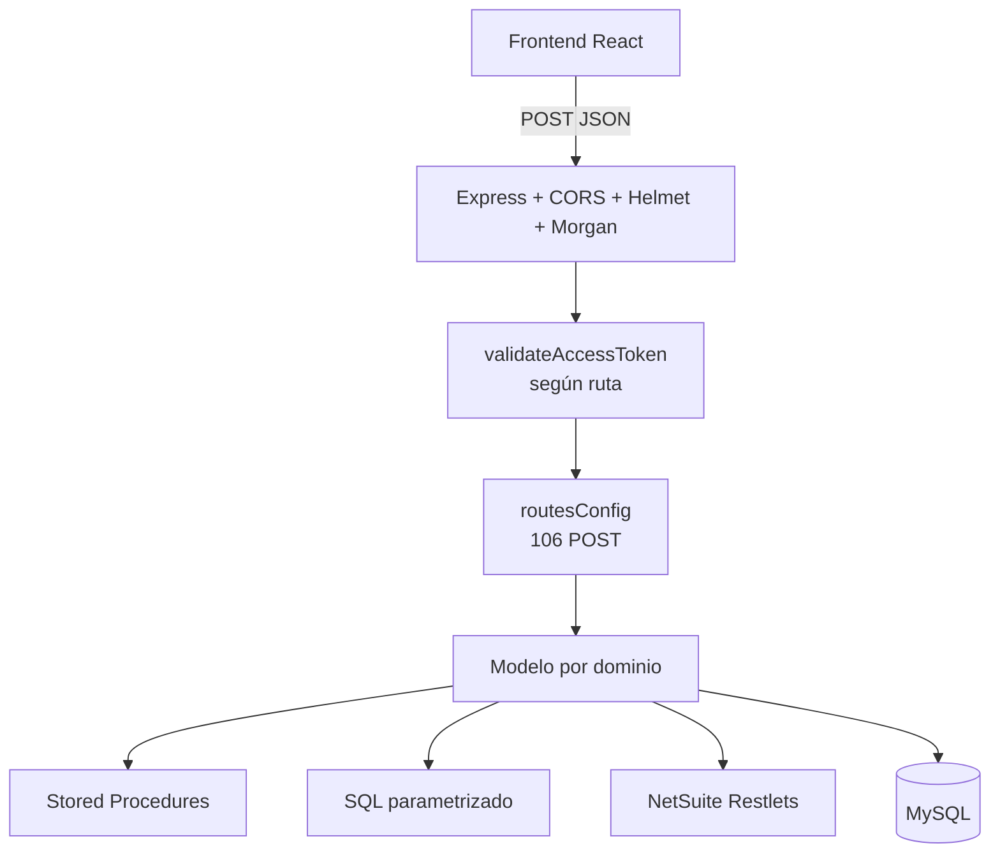

# 02 — API CRM legacy

> **Última modificación:** 2026-07-09 (jueves)
>
> **Estado:** avance de primera fase. La API no tiene un OpenAPI formal en la copia revisada; este documento es el inventario derivado de `src/routes/idpRoutes.js` y los modelos.

## Identidad y arquitectura

| Elemento | Valor observado |
|---|---|
| Runtime | Node.js / Express 4.17.1. |
| Entrada | `src/AppCrmVentas.js`. |
| Prefijo | `/api/v2.0`. |
| Puerto local por defecto | `7000` según el comentario y `PORT`; el frontend local usa `7000`. |
| Puerto de ejecución alternativa | El comentario de ruta menciona `6000`, pero la expresión actual usa `process.env.PORT || 7000`; se toma `7000` como valor efectivo. |
| Producción referenciada por frontend | `https://api-node-v2.roccacr.com/api/v2.0/`. |
| Base de datos | MySQL mediante `mysql2/promise`, pools separados para `produccion` y `pruebas`. |
| Respuesta | Los handlers llaman `helpers.manageResponse`: éxito HTTP 200 con el resultado del modelo; error HTTP 500 con el error. |
| Rutas registradas | 106 rutas activas `POST` en `routesConfig`, más `GET /`, webhook de Microsoft y middleware global. |



## Contrato común de la API legacy

El frontend centraliza la solicitud en `src/api/api.js`:

```json
{
  "token_access": "token configurado por ambiente",
  "database": "pruebas | produccion",
  "sqlQuery": "",
  "type": "",
  "...parametrosDelModulo": "..."
}
```

Reglas observadas:

- todas las operaciones legacy del frontend se envían como `POST`;
- `token_access` se compara con `process.env.TOKEN_ACCESS` dentro de `req.body`;
- el modelo recibe el `req.body` completo;
- el `database` recibido determina el pool de MySQL utilizado;
- la respuesta no está unificada en un envelope `{ ok, data, error }`: depende del modelo/Stored Procedure;
- las cuatro rutas de campañas y partners se registran con `allowNoAuth` para integraciones externas.

## Middleware y controles actuales

- **Helmet:** agrega headers de seguridad HTTP.
- **CORS:** permite una lista fija de origins en el código; producción, pruebas, localhost y el dominio de NetSuite aparecen en la lista.
- **Límite de body:** JSON y URL encoded hasta 1 MB.
- **Morgan:** `combined` en producción y `dev` en otros entornos.
- **Token de integración:** `validateAccessToken` valida el valor enviado en `token_access`.
- **JWT de usuario:** el login genera un JWT y lo persiste en `admins.token_admin`; `usuario/validarToken` verifica firma, expiración y coincidencia con el token persistido.

### Puntos que requieren revisión de seguridad

1. El token de integración legacy viaja dentro del body y no mediante `Authorization`.
2. Las rutas `/campaign/add/crm`, `/campaign/edit/crm`, `/partner/add/crm` y `/partner/edit/crm` no pasan por `validateAccessToken`.
3. El campo `database` llega desde el cliente; el despliegue debe asegurar que no sea posible seleccionar un pool fuera del alcance del usuario.
4. La API Kapso dedicada tiene un modelo de autorización distinto; consultar [su sección técnica](../03-crm-frontend-kapso/kapso.md).

Estos puntos se documentan como controles observados y pendientes de validación, no como cambios implementados en esta entrega.

## Documentos de esta sección

- [Arquitectura, seguridad y operación](./arquitectura-y-seguridad.md)
- [Catálogo de endpoints](./catalogo-endpoints.md)
- [Cron jobs y sincronizaciones](./procesos-y-crons.md)
- [Integración NetSuite](../01-netsuite/README.md)
