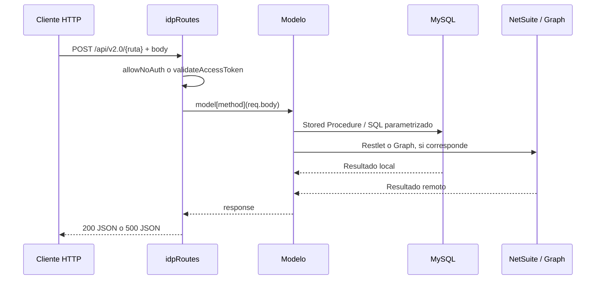
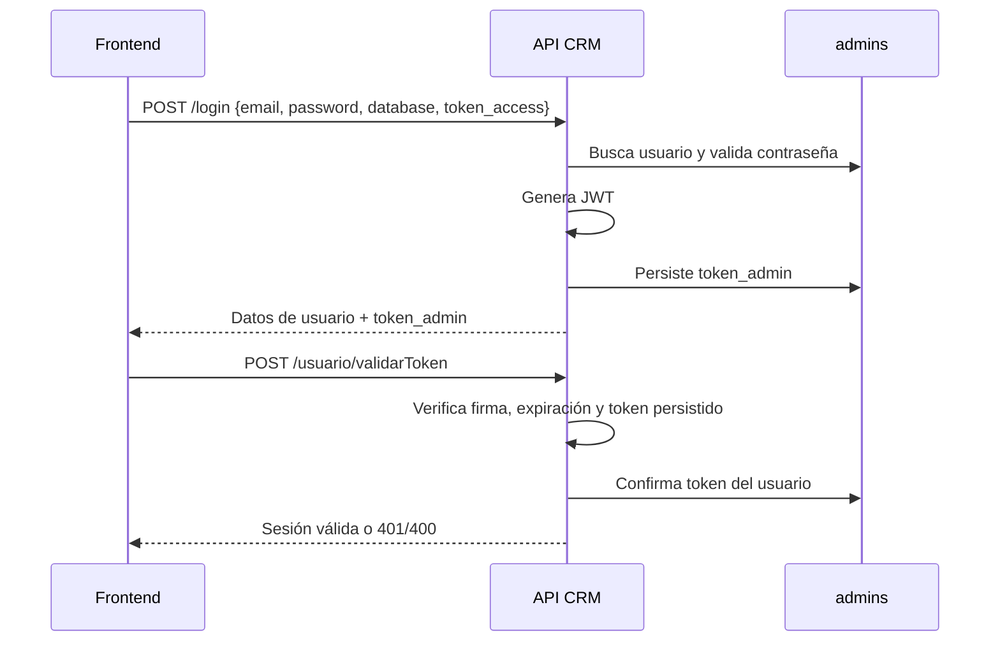

# API CRM — arquitectura, datos y seguridad observable

> **Última modificación:** 2026-07-09 (jueves)

## Estructura por responsabilidades

| Capa | Ubicación | Responsabilidad |
|---|---|---|
| Arranque | `src/AppCrmVentas.js` | Express, middleware, CORS, crons y listener HTTP. |
| Registro de rutas | `src/routes/idpRoutes.js` | Prefijo `/api/v2.0`, auth por ruta, catálogo de handlers y webhook Microsoft. |
| Handlers de dominio | `src/models/**` | Consultas, reglas de negocio, llamadas a NetSuite y actualizaciones MySQL. |
| Acceso MySQL | `src/models/conectionPool/conectionPool.js` | Pools, Stored Procedures y consultas parametrizadas. |
| Respuesta | `src/utils/helpers.js` | Convierte éxito a HTTP 200 y errores de modelo a HTTP 500. |
| Integración NetSuite | `src/models/*/*Netsuite.js` y algunos modelos transaccionales | Construcción OAuth Restlet y operaciones `GET`, `POST`, `PUT`. |
| Integración Outlook | `src/models/calendars/outlook*.js` | Graph subscriptions, webhook y delta sync. |

## Flujo de una solicitud

## Persistencia principal

| Tabla | Rol en el CRM |
|---|---|
| `admins` | Usuarios, rol, relación con NetSuite, estado, sesión y supervisor. |
| `leads` | Cliente/interesado, datos de contacto, asignación, proyecto, campaña y estado comercial. |
| `info_extra_lead` | Datos adicionales del cliente: identificación, nacionalidad, profesión, ingresos, motivo y momento de compra, entre otros. |
| `bitacoras` | Historial de notas, contacto, pérdida, seguimiento y acciones del lead. |
| `calendars` | Citas, eventos, recordatorios y relación con lead/oportunidad/Outlook. |
| `expedientes` | Unidades/proyectos consultables para oportunidades y estimaciones. |
| `oportunidades` | Pipeline, probabilidad, estado, pronóstico, unidad, cliente y trazabilidad. |
| `estimaciones` | Cotización/estimación, monto, caducidad, pre-reserva y caída. |
| `ordenventa` | Orden, reserva, cierre firmado, comisión, aprobaciones y estado operativo. |
| `campanas` / `corredores` | Catálogos relacionados con lead. |

## Autenticación y sesión

## Manejo de errores

- Error de negocio o de modelo: se captura en `handleRequest` y se devuelve como HTTP 500.
- Error de autenticación de integración: HTTP 401 con mensaje de token inválido.
- Error JWT expirado: respuesta de aplicación con `statusCode` 401.
- Error de Restlet: se registra en consola y se propaga al handler.
- Error global de Express: respuesta de texto `Something went wrong!` con HTTP 500.

## Recomendaciones para la siguiente fase

- Generar OpenAPI 3.1 a partir de `routesConfig`, cuerpos reales del frontend y respuestas de Stored Procedures.
- Sustituir el token de body por `Authorization: Bearer` o una credencial de integración en un canal controlado.
- Separar el rol de autorización de la selección de `database`.
- Registrar `requestId`, usuario, ruta, duración y resultado sin guardar tokens ni PII.
- Centralizar los Restlet URLs y ambientes en configuración, evitando mezclas de sandbox y producción por archivo.
- Añadir pruebas de contrato para endpoints que crean reserva, cierre firmado y órdenes de venta.
