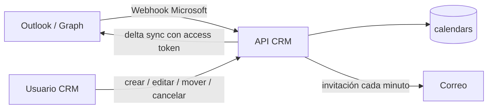

# API CRM — procesos automáticos y frecuencias

> **Última modificación:** 2026-07-09 (jueves)

## Tareas que arrancan al levantar la API

`src/AppCrmVentas.js` importa los módulos de cron durante el arranque. Esto significa que cada instancia del proceso puede iniciar sus tareas automáticamente.

| Módulo | Expresión | Hora efectiva | Acción |
|---|---|---:|---|
| `cronsOportunidad.js` | `0 1 * * *` | 01:00 CR | Inactiva oportunidades menos probables con antigüedad de 3 meses; registra transición y bitácora cuando las columnas existen. |
| `cronsCalendars.js` | `0 6 * * *` | 06:00 CR | Ejecuta limpieza de calendarios/eventos vencidos en producción. |
| `cronsLeads.js` | `0 14 * * *` | 14:00 CR | Calcula carga de leads nuevos y leads que requieren atención; envía alertas de correo con deduplicación diaria. |
| `correoCitas.js` | `*/1 * * * *` | Cada minuto | Procesa invitaciones nuevas y reprogramadas de citas. |

## Cron de leads

El proceso consulta leads con acciones `NUEVA = 0` y `SEGUIMIENTO = 2`, estado activo y tipo `01-LEAD-INTERESADO`. También calcula alertas por vendedor:

| Clasificación | Cantidad de leads |
|---|---:|
| `ok` | Menos de 10. |
| `warning` | De 10 a 19. |
| `danger` | 20 o más. |

Cuando corresponde, envía enlaces directos al listado de leads del CRM y usa locks diarios en el directorio temporal del servidor para no duplicar el correo.

## Cron de oportunidades

La regla revisada es la de oportunidades de menor probabilidad con un umbral de 3 meses. El job tiene control de concurrencia en memoria, métricas de ejecución y una función de ejecución manual exportada.

## Calendarios y Outlook

Además de los cron, el módulo de calendario expone una sincronización dirigida por eventos:

La sincronización Outlook no es NetSuite; se mantiene separada y sus endpoints están en el catálogo de calendarios.

## Lo que no debe confundirse con sincronización automática

- Una consulta de expediente al abrir un modal no equivale a una carga nocturna completa.
- Crear una oportunidad, estimación u orden desde el CRM es una operación bajo demanda.
- El cron de leads revisa MySQL; no llama a NetSuite.
- El worker de Kapso sí es periódico, pero pertenece a la API NestJS dedicada y no a la API CRM legacy.

## Verificación operativa recomendada

- Confirmar que producción ejecuta una sola instancia de cada cron o que existe coordinación entre instancias.
- Revisar el timezone configurado en el proceso, no solo el del código.
- Guardar última ejecución, duración, cantidad procesada y error en un monitor central.
- Validar que los locks temporales sobreviven a reinicios según la política esperada.
