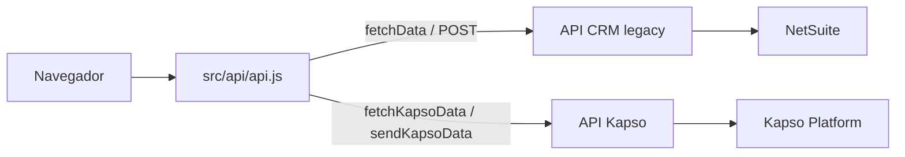

# 03 — CRM frontend y Kapso

> **Última modificación:** 2026-07-09 (jueves)
>
> **Estado:** avance de primera fase. Se documentan la arquitectura visible del frontend de producción y la API Kapso NestJS revisada.

## Contenido

- [Arquitectura del frontend](./frontend.md)
- [API Kapso y sincronización WhatsApp](./kapso.md)

## Separación de APIs

El frontend utiliza dos bases de URL:

| Integración | Local | Producción |
|---|---|---|
| API CRM legacy | `http://localhost:7000/api/v2.0/` | `https://api-node-v2.roccacr.com/api/v2.0/` |
| API Kapso dedicada | `http://localhost:8002/api/v1/` | `https://kapso-crmventas.rdghub.com/api/v1/` |

## Módulos visibles en el menú

- Inicio y KPIs.
- Buscador general.
- Leads: activos, nuevos, atención, totales, perfil, consulta, creación, edición, seguimiento y pérdida.
- Calendario Outlook y lista de eventos.
- Expedientes.
- Oportunidades: listado, creación, detalle y estimaciones.
- Órdenes de venta: cotizaciones y clientes con cierre firmado.
- Reporte de comisiones para rol administrador.
- Configuración Kapso para rol administrador.

## Acceso a la sección Kapso

La ruta frontend `/configuracion/kapso` está protegida por `RoleAdminOnlyRoute` y solo se renderiza cuando `rol_admin === 1`. La pantalla permite configurar relaciones administrador ↔ línea Kapso, no crear directamente un usuario de NetSuite.

## Documento de usuario

El procedimiento paso a paso está en [Manual de usuario](../04-manual-usuario/README.md).
