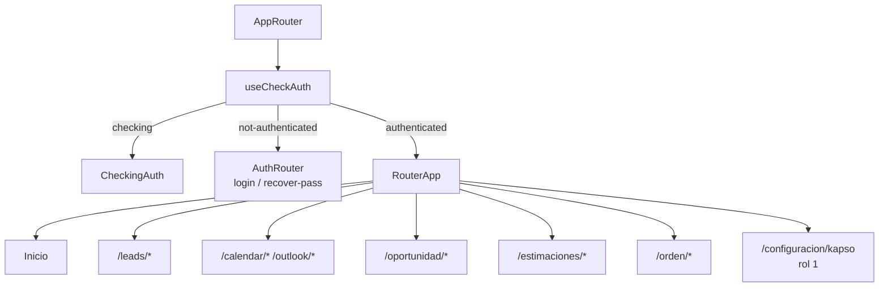

# Frontend CRM — arquitectura y navegación

> **Última modificación:** 2026-07-09 (jueves)

## Stack observado

| Capa | Tecnología |
|---|---|
| Build | Vite 5.3.4. |
| UI | React 18.3.1, React Router 6, Bootstrap, Material UI y componentes propios. |
| Estado | Redux Toolkit y React Redux. |
| HTTP | Axios y `fetch` en `src/api/api.js`. |
| Tablas | DataTables, React Data Table y AG Grid según módulo. |
| Autenticación Microsoft | `@azure/msal-browser`, `@azure/msal-react` y Microsoft Graph. |
| Calendario | FullCalendar y sincronización Graph vía backend. |
| Exportación | PDF, XLSX, `html2canvas` y `jspdf`. |

## Enrutamiento

## Estado de autenticación

1. `useCheckAuth` determina si existe sesión válida.
2. Mientras valida, se muestra `CheckingAuth`.
3. Si no hay sesión, se guarda la ruta de destino y se presenta login.
4. Login y recuperación usan la API CRM legacy.
5. Después de autenticarse, el router devuelve al usuario a la ruta solicitada.
6. Para administrador (`rol_admin === 1`) se habilitan reportes y configuración Kapso.

## Patrón de llamadas

`src/api/api.js` mantiene dos clientes ligeros:

- `fetchData(endpoint, requestData)`: `POST` al API CRM legacy con body JSON.
- `fetchKapsoData(endpoint)`: `GET` al API Kapso.
- `sendKapsoData(method, endpoint, requestData)`: escribe al API Kapso con `POST`, `PATCH` o `DELETE`.

El frontend convierte los errores Axios en `{ ok: false, errorMessage }`, por lo que cada pantalla debe revisar `response.ok` antes de mostrar éxito o recargar la tabla.

## Rutas funcionales

| Área | Rutas relevantes | Componentes principales |
|---|---|---|
| Leads | `/leads/lista?data=1..6`, `/leads/perfil`, `/leads/crear`, `/leads/edit`, `/leads/note`, `/leads/loss`, `/leads/follow_up`, `/leads/consultar`. | `LeadsPage`, vistas de listado, perfil y acciones. |
| Oportunidades | `/oportunidad/lista`, `/oportunidad/crear`, `/oportunidad/ver`. | `Page_oportunidad`, vistas de creación, lista y detalle. |
| Estimaciones | `/estimaciones/view`. | `Page_Estimaciones`, `VerEstimacion`, modales de edición. |
| Órdenes | `/orden/lista`, `/orden/view`, `/orden/cierre-firmado`. | `Cotizaciones`, listados y `VistaOrdenVenta`. |
| Calendario | `/calendar/outlook`, `/events/list`, `/events/actions`. | FullCalendar, eventos y acciones. |
| Kapso | `/configuracion/kapso`. | `Page_Kapso`, `View_Kapso`, provider dedicado. |

## Acciones comerciales del lead

Desde el menú contextual del lead están implementadas las siguientes acciones:

- abrir WhatsApp;
- WhatsApp y nota de contacto;
- crear nota;
- crear evento;
- dar como perdido;
- colocar en seguimiento;
- crear oportunidad;
- listar oportunidades;
- llamar al cliente;
- ver perfil;
- editar lead.

Las acciones de pérdida, seguimiento, nota y contacto generan entradas en la bitácora y actualizan campos de estado/acción según el flujo elegido.

## Configuración Admin–Kapso en el frontend

La pantalla permite:

1. buscar por administrador, correo o número;
2. filtrar por administrador, línea Kapso y estado;
3. paginar y ordenar la tabla;
4. crear una asignación;
5. editar administrador, línea o estado;
6. activar/desactivar la relación;
7. eliminar la relación;
8. expandir una fila para revisar estado del administrador, Kapso y sincronización.

## Observaciones para mantenimiento

- Hay providers de Kapso que referencian `kapso/integrations` y `kapso/integrations/:id/templates`; esas rutas no aparecen en el catálogo de controladores de la API Kapso revisada. Debe validarse si son código legacy no utilizado o una funcionalidad pendiente.
- El frontend conserva endpoints legacy con nombres históricos y errores de ortografía (`get_Specific_Lead`, `getAllStragglers`, `editarInformacionLead_Netsuite`). No deben renombrarse sin actualizar consumidores y documentación.
- Las URLs se seleccionan por `window.location.hostname`; cualquier nuevo ambiente debe incorporarse explícitamente y probarse.
