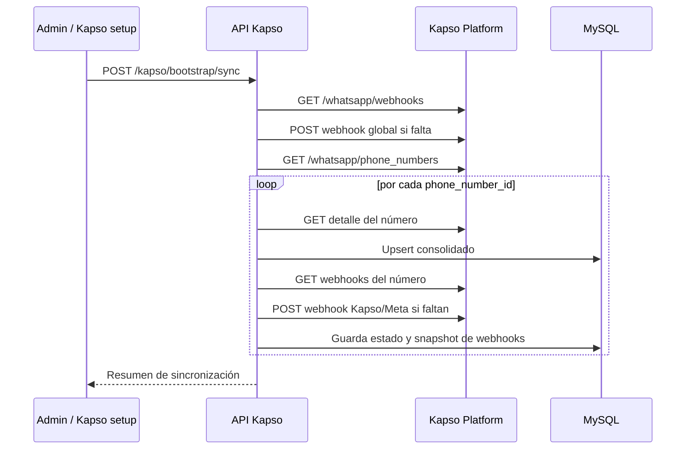

# API Kapso — arquitectura técnica y sincronización

> **Última modificación:** 2026-07-09 (jueves)
>
> **Fuente:** `API_Kapso`, aplicación NestJS con TypeORM/MySQL.

## Propósito

La API Kapso es un servicio dedicado para integrar el CRM con Kapso Platform y WhatsApp. Mantiene una vista local consolidada por número WhatsApp, registra el estado del setup, guarda snapshots de proyecto/customer/webhooks y permite relacionar una línea Kapso con un administrador del CRM.

## Stack y arranque

| Elemento | Valor |
|---|---|
| Framework | NestJS 11. |
| Persistencia | TypeORM 0.3 + MySQL2. |
| Puerto | `8002` por defecto. |
| Prefijo | `api/v1` por defecto. |
| Seguridad HTTP | Helmet y CORS configurado por entorno. |
| Validación | `ValidationPipe` global con `whitelist` y `transform`. |
| Raw body | Activado para validar HMAC de webhooks. |
| API remota | `https://api.kapso.ai/platform/v1` por defecto. |
| Timeout remoto | 10 segundos. |
| Worker | Cada 30 segundos por defecto; lote de 10 filas. |

## Rutas de la API Kapso

La URL final combina `{API_BASE}/{API_PREFIX}`. Ejemplo local: `http://localhost:8002/api/v1`.

### Salud

| Método | Ruta | Uso |
|---|---|---|
| GET | `/` | Mensaje de disponibilidad y versión. |
| GET | `/health` | Probe `{ ok: true, status: "up" }`. |

### Consulta y sincronización

| Método | Ruta | Uso |
|---|---|---|
| GET | `/kapso/customers` | Customers derivados de líneas sincronizadas localmente. |
| GET | `/kapso/phone-numbers` | Números persistidos localmente. |
| POST | `/kapso/bootstrap/sync` | Lista números remotos, asegura webhook de proyecto y sincroniza cada número. |
| POST | `/kapso/phone-numbers/:phoneNumberId/sync` | Reintento manual de un número. |
| GET | `/kapso/setup/success` | Callback HTML de setup exitoso, audita y dispara sync. |
| GET | `/kapso/setup/failure` | Callback HTML de setup fallido, audita el error. |

### Webhooks recibidos

| Método | Ruta | Firma / evento |
|---|---|---|
| POST | `/webhooks/kapso/platform` | HMAC con `KAPSO_PLATFORM_WEBHOOK_SECRET`; eventos de alta/baja de número. |
| POST | `/webhooks/kapso/events` | HMAC con `KAPSO_WHATSAPP_WEBHOOK_SECRET`; eventos de mensajería Kapso. |
| POST | `/webhooks/kapso/meta` | Relay de Meta; no valida firma Kapso en el controlador actual. |

### Configuración Admin–Kapso

| Método | Ruta | Uso |
|---|---|---|
| GET | `/kapso/admins/options` | Opciones de administradores; admite búsqueda e inactivos. |
| GET | `/kapso/phone-numbers/options` | Opciones de líneas; admite búsqueda e inactivos. |
| POST | `/kapso/admin-integrations` | Crea relación admin ↔ línea. |
| GET | `/kapso/admin-integrations` | Lista relaciones con filtros, paginación y orden. |
| GET | `/kapso/admin-integrations/:id` | Detalle de una relación. |
| PATCH | `/kapso/admin-integrations/:id` | Edita relación. |
| PATCH | `/kapso/admin-integrations/:id/status` | Activa/desactiva relación. |
| DELETE | `/kapso/admin-integrations/:id` | Elimina relación. |
| GET | `/kapso/admins/:idnetsuiteAdmin/integrations` | Resuelve integraciones activas de un administrador. |

## Llamadas salientes a Kapso Platform

`KapsoPlatformApiService` centraliza las solicitudes con `X-API-Key`, `Content-Type: application/json` y timeout de 10 segundos.

| Recurso remoto | Método | Propósito |
|---|---|---|
| `/customers` | GET | Lista customers. |
| `/customers/:id` | GET | Consulta customer puntual. |
| `/whatsapp/phone_numbers` | GET | Lista números conectados. |
| `/whatsapp/phone_numbers/:id` | GET | Obtiene detalle completo de un número. |
| `/whatsapp/webhooks` | GET | Lista webhooks de proyecto. |
| `/whatsapp/webhooks` | POST | Crea webhook global de alta/baja de números. |
| `/whatsapp/phone_numbers/:id/webhooks` | GET | Lista webhooks por número. |
| `/whatsapp/phone_numbers/:id/webhooks` | POST | Crea webhook `kapso` o `meta` por número. |

## Flujo de bootstrap y setup

Cuando Kapso acepta el setup pero todavía no expone el detalle del número, la fila se conserva como `pending_remote_sync`. El worker la reintenta cada `KAPSO_PENDING_SYNC_INTERVAL_MS` y procesa como máximo `KAPSO_PENDING_SYNC_BATCH_SIZE` filas por corrida.

## Eventos de plataforma y mensajería

### Webhook global de proyecto

Eventos configurados:

- `whatsapp.phone_number.created`;
- `whatsapp.phone_number.deleted`.

Un alta dispara sincronización del número; una baja elimina la fila local por `phone_number_id`.

### Webhook de eventos Kapso

Eventos configurados por número:

- `whatsapp.message.received`;
- `whatsapp.message.sent`;
- `whatsapp.conversation.started`;
- `whatsapp.conversation.inactive`;
- `whatsapp.conversation.ended`;
- `whatsapp.message.delivered`;
- `whatsapp.message.read`;
- `whatsapp.message.failed`.

### Idempotencia y firma

- Los webhooks platform y events conservan `rawBody` para HMAC.
- Se lee `x-webhook-signature`.
- Se usa `x-idempotency-key` para ignorar reentregas ya procesadas por scope y número.
- Se persisten evento, firma válida, estado, error y payload resumible en la fila local consolidada.

## Persistencia local actual

La migración de consolidación elimina el modelo anterior de proyectos, customers, auditoría separada y webhooks por número como tablas independientes. La entidad vigente `kapso_phone_numbers` agrupa:

- identidad y detalle del número;
- proyecto y customer;
- estado de setup;
- snapshots JSON crudos;
- webhooks remotos;
- último evento, idempotency key, firma y error;
- timestamps de sync y actualización.

`admin_kapso_integrations` mantiene la relación many-to-many entre `idnetsuite_admin` y la PK local del número Kapso, con unicidad por pareja y estado activo/inactivo.

## Estados operativos

| Estado | Significado |
|---|---|
| `not_started` | No se ha iniciado el sync de setup. |
| `pending` | Sync iniciado, pendiente de cierre. |
| `missing_phone_number_id` | El callback no recibió el identificador remoto. |
| `synced` | Detalle remoto guardado. |
| `pending_remote_sync` | El número existe, pero Kapso aún no entrega detalle completo. |
| `processed` | Webhooks y persistencia procesados sin advertencias. |
| `processed_with_warnings` | Se procesó, pero quedó alguna advertencia de webhooks. |
| `sync_failed` / `failed` | Error terminal del sync o webhook. |
| `deleted` | Evento de baja procesado; la fila se elimina. |

## Variables de entorno relevantes

Se validan al arrancar: `MYSQL_HOST`, `MYSQL_PORT`, `MYSQL_USER`, `MYSQL_PASSWORD`, `MYSQL_DATABASE`, `KAPSO_PUBLIC_BASE_URL`, `KAPSO_PLATFORM_WEBHOOK_SECRET` y `KAPSO_WHATSAPP_WEBHOOK_SECRET`. Son opcionales, según el flujo, `KAPSO_API_KEY`, `KAPSO_TEST_API_KEY`, `KAPSO_PROJECT_API_KEYS_JSON`, `KAPSO_SETUP_REDIRECT_BASE_URL`, `KAPSO_PENDING_SYNC_INTERVAL_MS` y `KAPSO_PENDING_SYNC_BATCH_SIZE`.

## Riesgos y pendientes de integración

- El frontend referencia `kapso/integrations` y `kapso/integrations/:id/templates`, pero no hay controladores actuales para esas rutas en `API_Kapso`.
- La superficie de endpoints admin no muestra en el controlador un guard de autenticación/rol; la autorización debe confirmarse en la infraestructura o añadirse en el servicio.
- El callback `/kapso/setup/failure` persiste query JSON; se debe revisar qué datos pueden llegar desde Kapso y la política de retención.
- El relay `/webhooks/kapso/meta` no valida firma Kapso en el controlador actual; debe confirmarse el modelo de confianza con Kapso/Meta.
