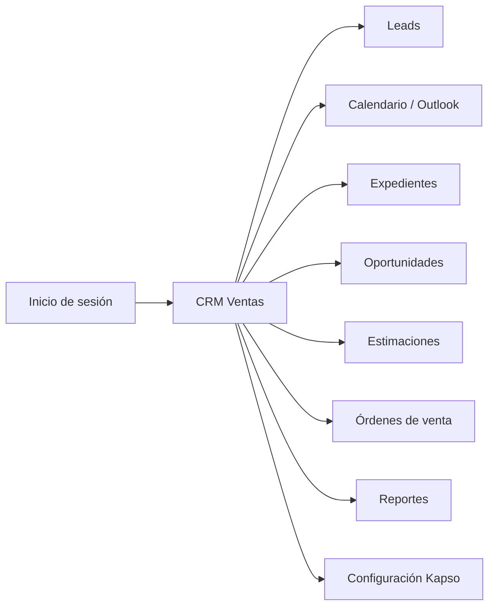
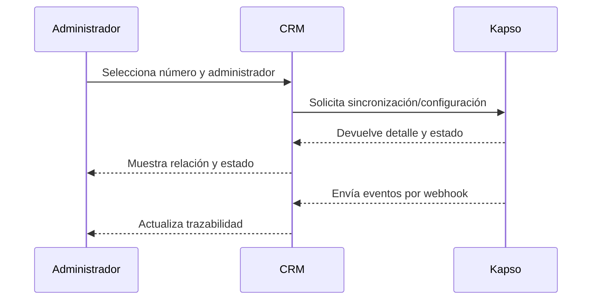

# Guía de uso del CRM

> **Avance de primera fase — última modificación: 2026-07-09**

## Acceso

1. Abrir la URL del CRM asignada por la organización.
2. Ingresar correo y contraseña.
3. Si la sesión es válida, el sistema dirige al módulo principal.
4. Si no puede ingresar, usar la opción de recuperación de contraseña o reportar el caso al administrador.

La aplicación utiliza una sesión autenticada y permisos por usuario. No compartir credenciales ni utilizar el usuario de otra persona para operar registros.

## Navegación principal

Los reportes y la configuración de Kapso están restringidos a usuarios administradores según la aplicación revisada.

## Leads

### Listas disponibles

En el menú de leads se observan accesos para:

- **Activos**: registros en trabajo.
- **Nuevos**: registros que requieren primera atención.
- **Atención**: registros con seguimiento pendiente.
- **Totales**: consulta general.

### Acciones disponibles

El perfil de lead contempla acciones para WhatsApp, WhatsApp con contacto, nota, evento, perdido, seguimiento, creación de oportunidad, consulta de oportunidades, llamada, perfil, regreso y edición.

Antes de guardar una modificación, revisar que el registro abierto sea el correcto. Después de guardar, actualizar la lista o volver a abrir el perfil para comprobar el resultado.

## Calendario y eventos

El CRM contiene vistas de calendario/eventos y una integración con Microsoft Outlook en el frontend. Para agendar:

1. Abrir el lead o la vista de calendario.
2. Crear el evento con fecha, hora, asunto y participantes solicitados.
3. Guardar.
4. Confirmar que el evento aparezca en la lista o calendario.

El backend tiene un proceso que envía invitaciones de citas nuevas o reprogramadas cada minuto. Si una invitación no aparece, consultar la sección de problemas y reportar el identificador del evento.

## Expedientes

El módulo de expedientes consulta información de unidades/proyectos utilizada en la venta. Antes de asociar un expediente a una estimación, confirmar proyecto, unidad, área, precio, disponibilidad y estado visibles.

Los campos comerciales finales deben validarse con el área responsable porque el modelo contiene información de precios, planos, entrega y estado.

## Oportunidades

Usar el módulo para revisar oportunidades creadas desde un lead y dar seguimiento a la negociación. Al crear una oportunidad, verificar al menos:

- lead o entidad relacionada;
- vendedor o empleado responsable;
- proyecto y subsidiaria;
- fecha estimada de cierre;
- probabilidad o estado comercial;
- monto proyectado, cuando aplique.

El sistema cuenta con una tarea automática diaria que revisa oportunidades expiradas con baja probabilidad. El criterio técnico actual debe ser validado por el negocio antes de convertirlo en regla de capacitación.

## Estimaciones

Usar **Estimaciones** para preparar o actualizar la propuesta relacionada con una oportunidad. Revisar monto total, vigencia, fecha de caducidad y relación con expediente antes de confirmar.

Si la operación devuelve error, no crear duplicados inmediatamente. Primero consultar la lista y confirmar si el ERP sí recibió la solicitud.

## Órdenes de venta

El módulo de órdenes de venta permite consultar, crear y actualizar órdenes, además de avanzar a reserva y cierre firmado según los permisos y reglas comerciales. Confirmar siempre los identificadores relacionados antes de realizar una acción irreversible.

## Reportes

Los reportes están disponibles para administradores. El backend tiene una consulta para reportes/saved searches de NetSuite. Antes de exportar o compartir información, verificar rango de fechas, subsidiaria, responsable y filtros aplicados.

## Configuración de Kapso — administradores

La vista de Kapso permite:

- buscar y filtrar por administrador, línea y estado;
- consultar números de teléfono disponibles;
- crear la relación administrador–número;
- editar la relación;
- activar o desactivar una relación;
- eliminar una relación;
- expandir el detalle.

El servicio Kapso sincroniza números remotos y webhooks en segundo plano. Si el número aparece pendiente, inactivo o con error, revisar el detalle antes de volver a ejecutar la operación.

## Buenas prácticas

- Registrar la actividad inmediatamente después del contacto.
- Mantener una sola oportunidad para la negociación correspondiente.
- Revisar antes de guardar que el proyecto y la subsidiaria sean correctos.
- No avanzar de etapa sin confirmar el resultado de la operación.
- No copiar información sensible en notas, capturas o reportes.
- No compartir tokens, contraseñas, llaves OAuth ni claves API.
