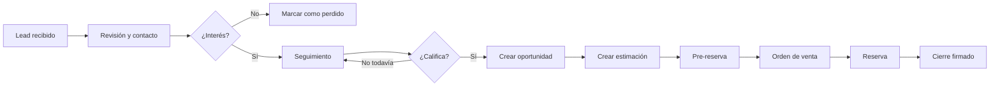
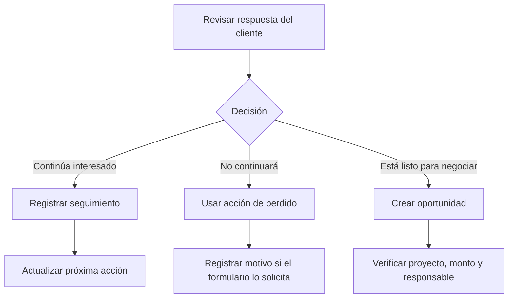
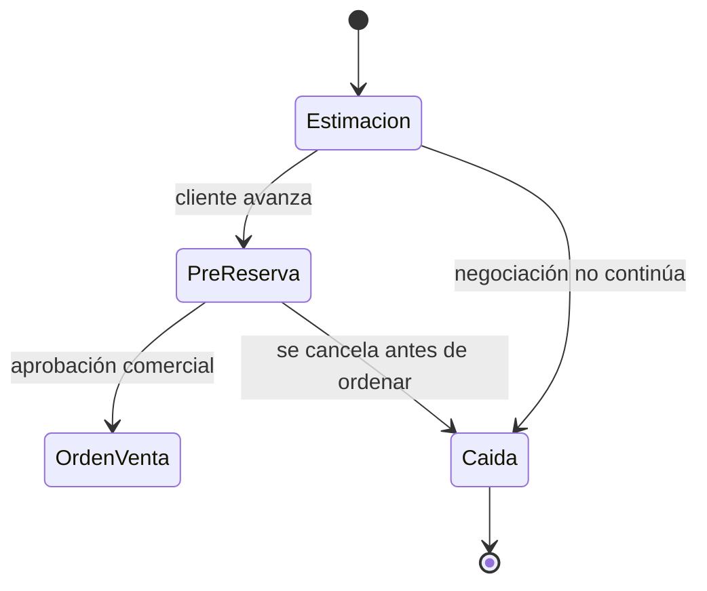

# Proceso de ventas

> **Avance de primera fase — última modificación: 2026-07-09**

## Vista general

El CRM organiza la atención comercial alrededor del lead y conserva el contexto necesario para llevarlo a una oportunidad, estimación, orden de venta y cierre.

## 1. Recibir y revisar un lead

1. Entrar a **Leads**.
2. Revisar las listas disponibles: activos, nuevos, atención y totales.
3. Abrir el perfil del lead y confirmar los datos visibles: nombre, contacto, proyecto, campaña, subsidiaria, responsable y estado.
4. Identificar la siguiente acción: contactar, solicitar información, agendar una cita o actualizar la información.

**Resultado esperado:** el lead queda asignado a una persona responsable y con una próxima acción clara.

## 2. Registrar el contacto

Desde el lead, utilizar la acción que corresponda:

| Acción | Uso recomendado | Resultado esperado |
|---|---|---|
| WhatsApp | Abrir una conversación de atención. | Se inicia o continúa el contacto. |
| WhatsApp + contacto | Contactar y dejar el dato asociado. | La interacción queda relacionada al lead. |
| Llamada | Registrar o realizar una llamada. | Se documenta el intento o resultado. |
| Nota | Guardar información relevante de la conversación. | El contexto queda disponible para el equipo. |
| Evento | Programar una actividad o cita. | Se crea un seguimiento con fecha y hora. |
| Seguimiento | Indicar que el lead continúa en atención. | El lead permanece en la cola de trabajo. |

La nomenclatura exacta de algunos botones y los campos obligatorios deben validarse con el equipo comercial antes de publicar la versión definitiva del manual.

## 3. Calificar o perder el lead

Después del contacto, decidir una de estas rutas:

No se debe marcar como perdido únicamente para retirar el registro de la lista. El motivo y la nota de contexto son importantes para reportes, recuperación futura y trazabilidad.

## 4. Crear la oportunidad

Cuando el lead califica:

1. Abrir la acción **Crear oportunidad**.
2. Confirmar entidad, vendedor o responsable, proyecto, subsidiaria y datos comerciales.
3. Guardar la oportunidad.
4. Revisar que aparezca en la lista de oportunidades.
5. Continuar el seguimiento desde la oportunidad según la regla comercial.

**Resultado esperado:** la oportunidad queda relacionada con el lead y disponible para avanzar a estimación.

## 5. Crear una estimación

1. Desde el flujo de oportunidad, abrir el módulo de **Estimaciones**.
2. Seleccionar la oportunidad, expediente o proyecto correspondiente.
3. Completar los valores comerciales solicitados.
4. Revisar fechas, vigencia, monto total y subsidiaria.
5. Guardar y confirmar el resultado de la operación.

El backend expone operaciones para crear, consultar y editar estimaciones en NetSuite; por eso debe verificarse que el resultado devuelto por el ERP coincida con el registro mostrado en el CRM.

## 6. Pre-reserva y caída

La estimación puede avanzar a una pre-reserva. Si la negociación no continúa, el flujo contempla una acción de caída.

Los criterios de aprobación, responsables y campos obligatorios de pre-reserva o caída quedan **pendientes de validación funcional**.

## 7. Orden de venta, reserva y cierre

1. Abrir **Órdenes de venta**.
2. Revisar que la estimación y la oportunidad relacionadas sean correctas.
3. Crear o actualizar la orden de venta.
4. Cuando corresponda, ejecutar la acción de **Reserva**.
5. Para finalizar el proceso, registrar el **Cierre firmado**.
6. Confirmar que los estados y fechas quedaron actualizados.

El backend implementa llamadas separadas para crear/editar la orden, reserva y cierre firmado en NetSuite. La pantalla debe mostrar un resultado exitoso antes de avanzar al siguiente paso.

## Checklist de cierre de etapa

- [ ] El registro tiene responsable.
- [ ] Los datos de contacto están completos.
- [ ] La actividad o próxima acción quedó registrada.
- [ ] La relación entre lead, oportunidad y estimación es correcta.
- [ ] Los montos, fechas, proyecto y subsidiaria fueron revisados.
- [ ] Se confirmó el resultado devuelto por el sistema.
- [ ] Cualquier pérdida, caída o cancelación tiene contexto.

## Qué hacer si el proceso no avanza

Consultar [Estados y solución de problemas](./estados-y-troubleshooting.md). Para problemas de integración o datos no actualizados, incluir en el reporte el identificador del registro, módulo, hora aproximada y mensaje visible; nunca enviar contraseñas, tokens ni llaves de integración.
