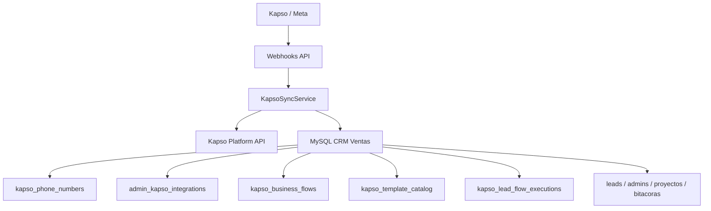
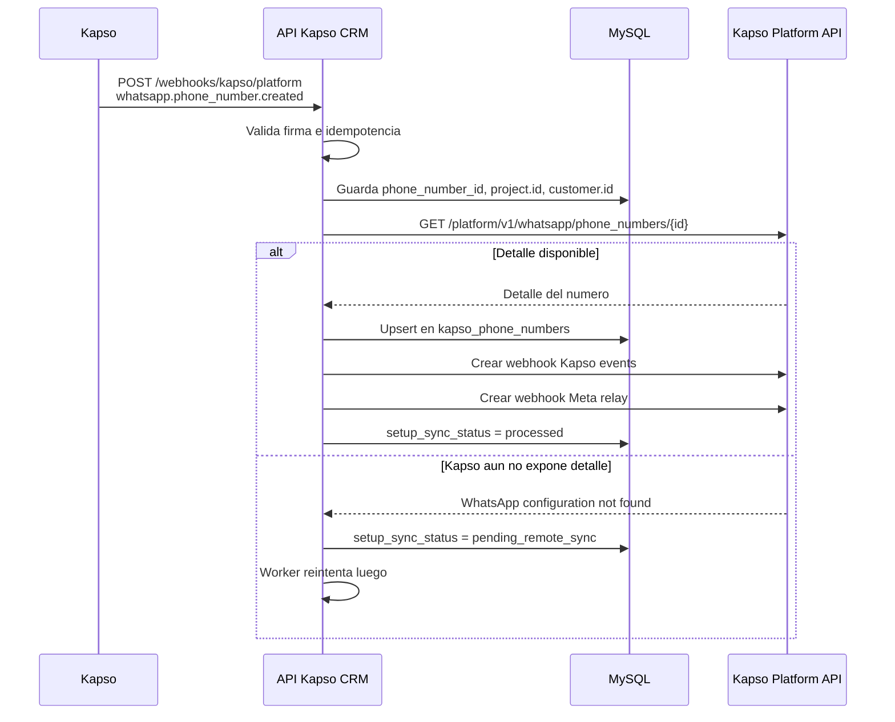
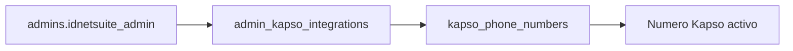
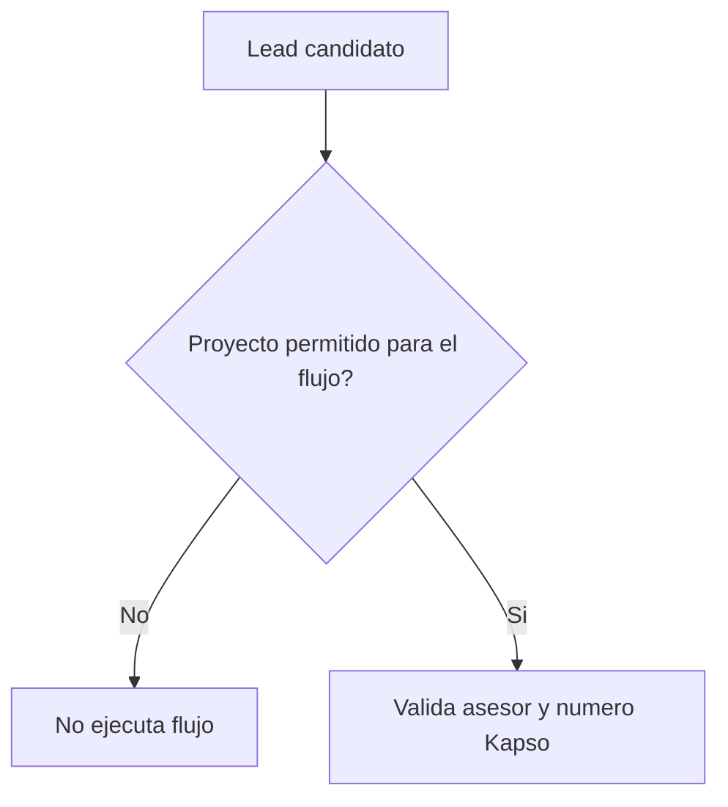
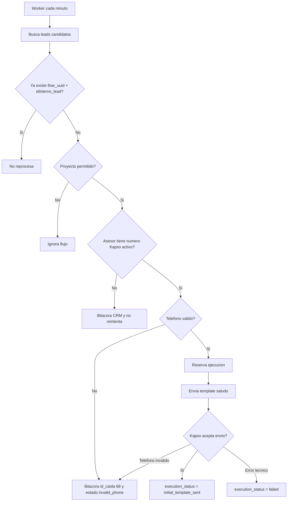
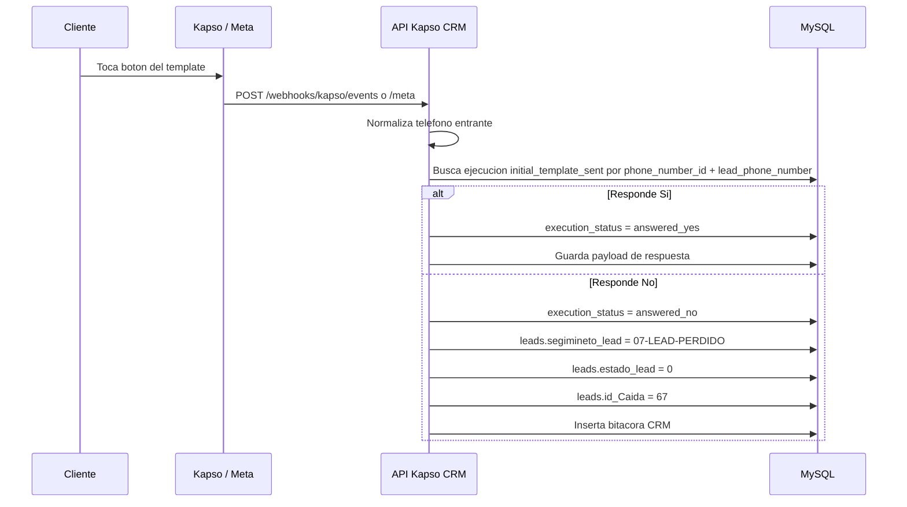
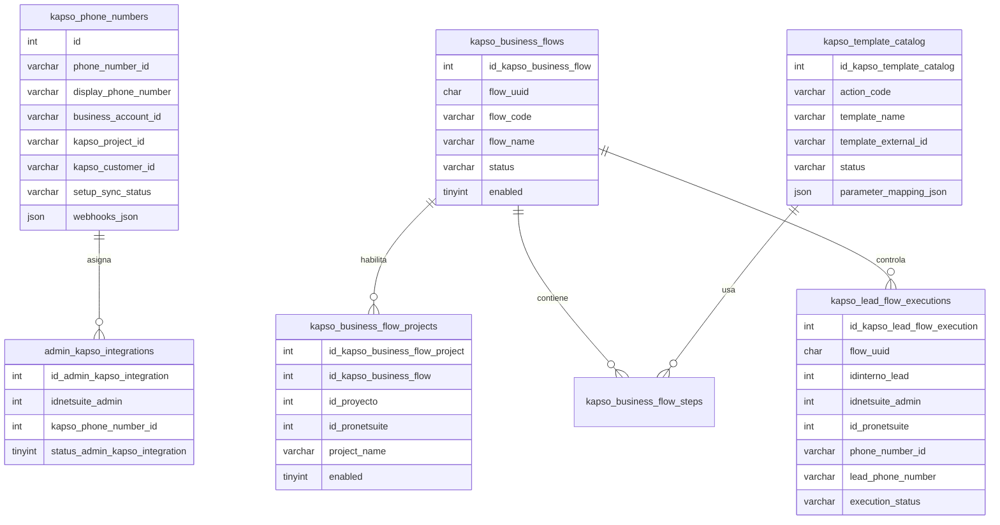

# API Kapso - CRM Ventas

API NestJS para integrar CRM Ventas con Kapso, administrar numeros de WhatsApp, asignar lineas Kapso a asesores y ejecutar flujos de templates por proyecto sin repetir leads.

## Resumen Ejecutivo

El objetivo del sistema es automatizar el primer contacto por WhatsApp usando templates aprobados en Kapso/Meta, pero manteniendo control operativo dentro del CRM.

El flujo actual permite:

- sincronizar numeros creados en Kapso;
- crear webhooks Kapso y Meta por numero;
- asignar un numero Kapso a cada asesor;
- habilitar flujos por proyecto;
- detectar leads nuevos candidatos;
- enviar el template inicial `saludo`;
- guardar el estado del lead dentro del flujo;
- procesar respuestas de botones;
- detener el flujo cuando corresponde;
- registrar bitacoras CRM cuando no se puede continuar.

## Tecnologia

- NestJS 11
- TypeScript
- TypeORM
- MySQL
- Kapso Platform API
- Webhooks Kapso y Meta
- Jest para pruebas unitarias y e2e
- `libphonenumber-js` para validar y normalizar telefonos

## Como Correr

```bash
npm install
npm run migration:run
npm run start:dev
```

La API queda disponible en:

```text
http://localhost:8002/api/v1
```

Comandos de verificacion:

```bash
npm run typecheck
npm run lint
npm test
npm run test:e2e
npm run build
```

## Variables Principales

| Variable                          | Uso                                                               |
| --------------------------------- | ----------------------------------------------------------------- |
| `PORT`                            | Puerto local, normalmente `8002`                                  |
| `GLOBAL_PREFIX`                   | Prefijo API, normalmente `api/v1`                                 |
| `KAPSO_API_KEY`                   | API key default del proyecto Kapso                                |
| `KAPSO_PROJECT_API_KEYS_JSON`     | Mapa `project.id -> apiKey` cuando existen varios proyectos Kapso |
| `KAPSO_PUBLIC_BASE_URL`           | URL publica usada para webhooks, por ejemplo ngrok                |
| `KAPSO_PLATFORM_WEBHOOK_SECRET`   | Secreto del webhook Platform                                      |
| `KAPSO_WHATSAPP_WEBHOOK_SECRET`   | Secreto del webhook WhatsApp/Kapso events                         |
| `KAPSO_PENDING_SYNC_INTERVAL_MS`  | Intervalo del worker de sincronizacion de numeros                 |
| `KAPSO_LEAD_TEMPLATE_INTERVAL_MS` | Intervalo del worker de leads candidatos                          |

## Arquitectura General



Responsabilidades:

| Capa         | Responsabilidad                                                            |
| ------------ | -------------------------------------------------------------------------- |
| Controllers  | Exponer REST, redirects de setup y webhooks                                |
| Services     | Orquestar sincronizacion, envio de templates y procesamiento de respuestas |
| Repositories | Consultar y persistir datos en MySQL                                       |
| Entities     | Representar tablas Kapso locales                                           |
| Common       | Constantes, tipos y helpers de dominio                                     |

## Flujo 1: Onboarding de Numeros Kapso

Cuando se crea o conecta un numero en Kapso, el sistema debe guardarlo localmente y asegurar que los webhooks por numero existan.



Punto importante confirmado por Kapso:

`GET /platform/v1/whatsapp/phone_numbers/{phone_number_id}` es project-scoped. Por eso el API guarda `project.id` y usa el API key del mismo proyecto que genero el setup link.

## Flujo 2: Configuracion Admin-Kapso

Esta vista define que numero puede usar cada asesor.

Regla:

- El lead trae `id_empleado_lead`.
- Ese valor se compara contra `admins.idnetsuite_admin`.
- El asesor debe tener una relacion activa en `admin_kapso_integrations`.
- Si no existe relacion activa, el lead no puede usar Kapso.



## Flujo 3: Flujos de Negocio por Proyecto

Un flujo representa una idea de negocio completa. No es solo una regla suelta.

Flujo actual:

| Campo           | Valor                                   |
| --------------- | --------------------------------------- |
| UUID            | `94d5c3b8-4b43-4c28-8c76-3d9eaf70ad01`  |
| Codigo          | `lead_initial_contact`                  |
| Nombre          | `Saludo inicial y seguimiento de leads` |
| Primer template | `saludo`                                |
| Estado esperado | `active` cuando este listo para operar  |

La tabla `kapso_business_flow_projects` define que proyectos pueden ejecutar cada flujo.

Relacion de proyecto:

```text
leads.idproyecto_lead -> proyectos.id_ProNetsuite
```

Si un proyecto no esta permitido, ningun lead de ese proyecto debe ejecutar el flujo.



## Template Inicial: saludo

Template creado y aprobado en Kapso/Meta.

| Campo                 | Valor                   |
| --------------------- | ----------------------- |
| Accion CRM            | `lead_initial_greeting` |
| Nombre Kapso          | `saludo`                |
| ID remoto             | `1004936342403599`      |
| Referencia Kapso      | `4108dccb`              |
| Idioma                | `es_ES`                 |
| Categoria             | `MARKETING`             |
| Estado local esperado | `approved`              |
| Parametros            | 3                       |

Texto:

```text
Hola {{1}}, soy {{2}}, asesor de {{3}}.

Vi que pediste informacion del proyecto.

Te parece bien si te comparto la informacion por este medio?
```

Mapeo de parametros:

| Parametro | Origen                |
| --------- | --------------------- |
| `{{1}}`   | `leads.nombre_lead`   |
| `{{2}}`   | `admins.name_admin`   |
| `{{3}}`   | `leads.proyecto_lead` |

Botones:

| Boton                    | Accion del sistema                                             |
| ------------------------ | -------------------------------------------------------------- |
| `Si, enviar informacion` | Marcar ejecucion como `answered_yes` y continuar el flujo      |
| `No, gracias`            | Marcar como `answered_no`, pasar lead a perdido y cerrar flujo |

## Condicion Actual para Lead Nuevo

El worker toma leads que cumplen:

```sql
leads.segimineto_lead = '01-LEAD-INTERESADO'
AND leads.whatsapp_template_contact_sent = 2
AND leads.estado_lead = 1
```

Adicionalmente:

- `id_empleado_lead` no puede venir vacio;
- el proyecto debe estar permitido para el flujo;
- el asesor debe tener numero Kapso activo;
- el template debe estar aprobado;
- el lead no debe tener una ejecucion previa para el mismo `flow_uuid`.

## Flujo 4: Envio del Template Inicial



## Normalizacion de Telefonos

El CRM tiene telefonos con multiples formatos. El sistema limpia y valida antes de enviar.

Ejemplos soportados:

| Valor CRM         | Resultado para Kapso |
| ----------------- | -------------------- |
| `87515938`        | `50687515938`        |
| `50687515938`     | `50687515938`        |
| `+506 8751 5938`  | `50687515938`        |
| `+1 720 353 5091` | `17203535091`        |
| `+57 311 5283868` | `573115283868`       |

Ejemplos rechazados:

| Valor CRM           | Motivo                     |
| ------------------- | -------------------------- |
| `88888888`          | Digitos repetidos          |
| `50600000000`       | Numero no valido           |
| `506982214`         | Longitud/formato no valido |
| Texto, vacio o nulo | No hay telefono usable     |

Cuando el telefono no es valido:

- no se llama a Kapso;
- no se modifica el lead;
- se registra bitacora con `id_caida = 68`;
- la ejecucion queda en `invalid_phone`;
- no vuelve a ejecutarse ese flujo para ese lead.

## Respuesta del Cliente

Las respuestas entran por webhooks Kapso o Meta.



Regla para `No, gracias`:

- el flujo se cierra para ese lead;
- el lead pasa a perdido;
- `id_Caida = 67`;
- se inserta bitacora indicando que el cliente no desea recibir informacion por WhatsApp.

Regla para telefono invalido:

- `id_Caida = 68`;
- se inserta bitacora de numero no valido;
- no se cambia el estado comercial del lead.

## Control Anti-Repeticion

La tabla `kapso_lead_flow_executions` evita ciclos infinitos.

Clave funcional:

```text
flow_uuid + idinterno_lead
```

Estados principales:

| Estado                  | Significado                                  |
| ----------------------- | -------------------------------------------- |
| `reserved`              | Lead reservado para envio, aun no confirmado |
| `initial_template_sent` | Template inicial enviado                     |
| `answered_yes`          | Cliente acepto recibir informacion           |
| `answered_no`           | Cliente rechazo informacion por WhatsApp     |
| `invalid_phone`         | Telefono no valido; no se reintenta          |
| `manual_intervention`   | Asesor intervino manualmente                 |
| `completed`             | Flujo terminado                              |
| `failed`                | Error tecnico terminal                       |

## Modelo de Datos Kapso



## Rutas Principales

| Ruta                                                   | Proposito                               |
| ------------------------------------------------------ | --------------------------------------- |
| `GET /api/v1/kapso/customers`                          | Lista clientes sincronizados localmente |
| `GET /api/v1/kapso/phone-numbers`                      | Lista numeros Kapso locales             |
| `GET /api/v1/kapso/templates/catalog`                  | Lista templates locales                 |
| `GET /api/v1/kapso/projects/options`                   | Lista proyectos CRM para configuracion  |
| `GET /api/v1/kapso/business-flows`                     | Lista flujos y proyectos permitidos     |
| `POST /api/v1/kapso/business-flows/:flowUuid/projects` | Habilita un proyecto para un flujo      |
| `POST /api/v1/kapso/bootstrap/sync`                    | Reconstruye estado local desde Kapso    |
| `POST /api/v1/kapso/phone-numbers/:phoneNumberId/sync` | Reintenta sync de un numero             |
| `GET /api/v1/kapso/setup/success`                      | Recibe redirect exitoso del setup link  |
| `GET /api/v1/kapso/setup/failure`                      | Recibe redirect fallido del setup link  |
| `POST /api/v1/webhooks/kapso/platform`                 | Webhook de altas/bajas de numeros       |
| `POST /api/v1/webhooks/kapso/events`                   | Webhook Kapso events                    |
| `POST /api/v1/webhooks/kapso/meta`                     | Webhook relay Meta                      |
| `GET /api/v1/kapso/admin-integrations`                 | Lista asignaciones admin-Kapso          |
| `POST /api/v1/kapso/admin-integrations`                | Crea asignacion admin-Kapso             |

## Checklist Operativo Antes de Enviar Templates

- [ ] El numero existe en `kapso_phone_numbers`.
- [ ] Los webhooks Kapso y Meta existen para ese numero.
- [ ] El asesor tiene asignacion activa en `admin_kapso_integrations`.
- [ ] El flujo esta activo.
- [ ] El proyecto del lead esta permitido para ese flujo.
- [ ] El template `saludo` esta `approved`.
- [ ] El mapeo de parametros esta configurado.
- [ ] El telefono del lead es valido.
- [ ] No existe ejecucion previa para `flow_uuid + idinterno_lead`.

## Que Sigue en el Flujo

El sistema ya tiene el primer paso funcional. Los siguientes hitos logicos son:

1. Definir que template se envia despues de `answered_yes`.
2. Configurar el mapeo de parametros del segundo template.
3. Definir cuando se detiene el flujo por respuesta, intervencion manual o fin comercial.
4. Agregar trazabilidad visible en CRM para que el asesor sepa en que etapa va cada lead.
5. Validar reglas de ventana de 24 horas de WhatsApp antes de mensajes libres.

## Estado Actual del Proyecto

Listo:

- sincronizacion de numeros Kapso;
- webhooks platform/events/meta;
- asignacion Admin-Kapso;
- flujo de negocio por proyecto;
- catalogo local del template `saludo`;
- envio inicial del template;
- procesamiento de respuesta `Si` / `No`;
- control anti-repeticion;
- normalizacion y validacion de telefonos;
- bitacora por asesor sin numero;
- bitacora por telefono invalido (`id_caida = 68`);
- perdida por respuesta negativa (`id_caida = 67`).

Pendiente funcional:

- definir el segundo template despues de respuesta afirmativa;
- confirmar como se detiene el flujo por intervencion manual del asesor;
- exponer en frontend la trazabilidad completa por lead;
- cerrar reglas de seguimiento final segun ventas.
