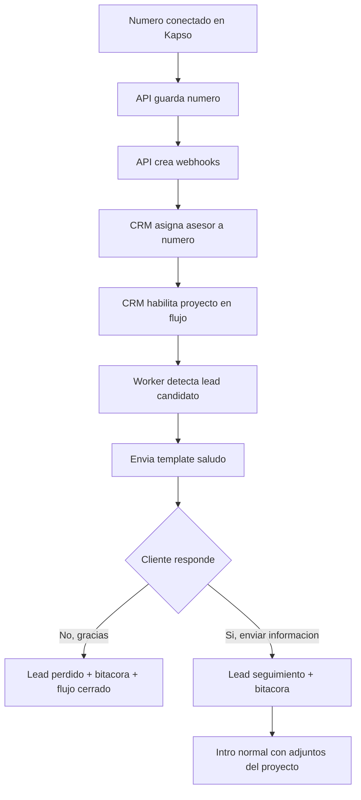
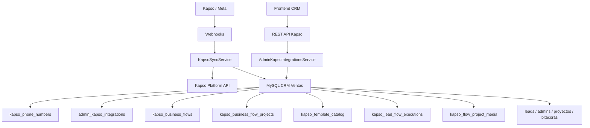
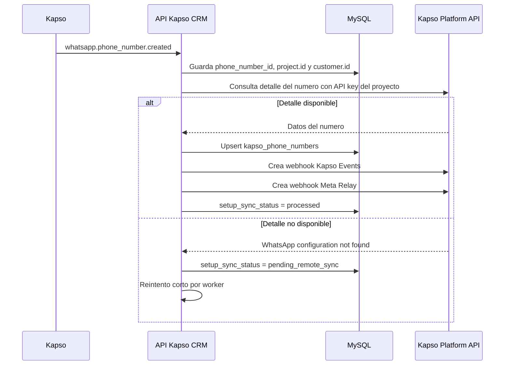
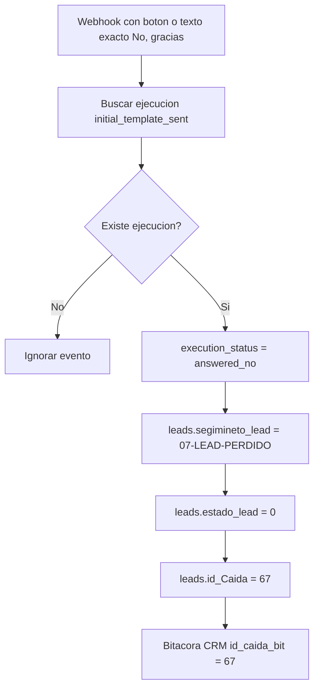
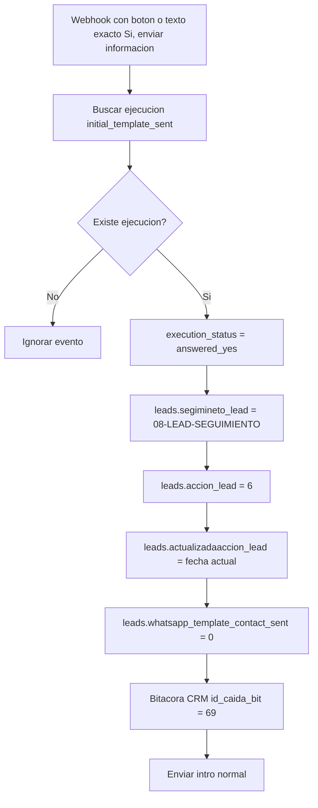
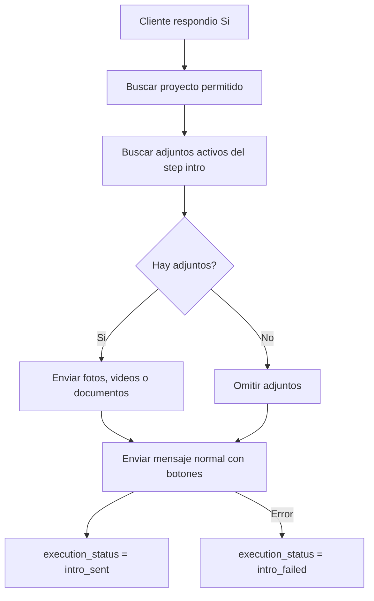
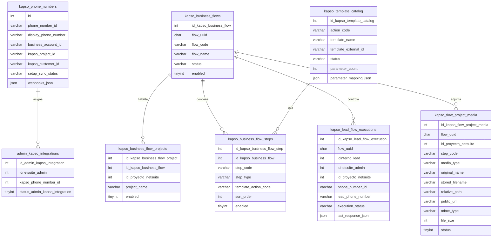

# API Kapso - CRM Ventas

API NestJS para conectar CRM Ventas con Kapso, administrar numeros WhatsApp por asesor, habilitar flujos por proyecto y ejecutar el primer contacto automatico con control anti-repeticion.

El objetivo no es solo enviar mensajes. El objetivo es tener un flujo comercial controlado, auditable y configurable por proyecto.

## Tabla de Contenido

1. [Resumen Ejecutivo](#resumen-ejecutivo)
2. [Estado Actual](#estado-actual)
3. [Tecnologia](#tecnologia)
4. [Como Correr](#como-correr)
5. [Variables de Entorno](#variables-de-entorno)
6. [Arquitectura General](#arquitectura-general)
7. [Configuracion del CRM](#configuracion-del-crm)
8. [Flujo Completo del Negocio](#flujo-completo-del-negocio)
9. [Reglas de Ejecucion](#reglas-de-ejecucion)
10. [Adjuntos por Proyecto](#adjuntos-por-proyecto)
11. [Modelo de Datos](#modelo-de-datos)
12. [Rutas Principales](#rutas-principales)
13. [Preguntas y Respuestas](#preguntas-y-respuestas)
14. [Checklist Operativo](#checklist-operativo)
15. [Pendientes Controlados](#pendientes-controlados)

## Resumen Ejecutivo

El sistema automatiza el primer contacto por WhatsApp para leads nuevos del CRM.

El flujo actual trabaja asi:

1. Kapso conecta un numero WhatsApp.
2. El API guarda ese numero en la base de datos.
3. El API crea los webhooks necesarios para recibir eventos.
4. En el CRM se asigna un asesor a una linea Kapso.
5. En el CRM se habilitan proyectos para un flujo de negocio.
6. El worker revisa leads nuevos cada minuto.
7. Si el lead cumple las reglas, se envia el template inicial `saludo`.
8. Si el cliente responde `No, gracias`, el lead pasa a perdido y se registra bitacora.
9. Si el cliente responde `Si, enviar informacion`, el lead pasa a seguimiento y se envia la intro normal con adjuntos del proyecto si existen.
10. El sistema guarda el avance por lead y flujo para evitar ciclos infinitos.



## Estado Actual

### Listo

- API NestJS organizada por modulos.
- Conexion a MySQL CRM Ventas.
- Sincronizacion de numeros Kapso.
- Webhook Platform para altas y bajas de numeros.
- Webhook Kapso Events para mensajes y conversaciones.
- Webhook Meta Relay para payloads crudos de Meta.
- Creacion automatica de webhooks Kapso y Meta por numero.
- Uso de API key por proyecto Kapso cuando aplica.
- Configuracion `Asesor -> Numero Kapso`.
- Configuracion `Flujo -> Proyecto permitido`.
- Catalogo local del template `saludo`.
- Template `saludo` aprobado en Kapso/Meta.
- Worker de leads candidatos.
- Validacion de telefono.
- Control anti-repeticion por `flow_uuid + idinterno_lead`.
- Respuesta `No, gracias`.
- Respuesta `Si, enviar informacion`.
- Bitacoras CRM para eventos importantes.
- Adjuntos por proyecto para la intro normal.
- Carga multiple de adjuntos desde el frontend.
- Guardado fisico de adjuntos por flujo y proyecto.
- Limpieza automatica de metadata activa cuando el archivo fisico ya no existe.

### En Proceso

- Definir los siguientes pasos despues de la intro normal.
- Definir que hacen los botones `Ver precios`, `Agendar visita` y `Hablar con asesor`.
- Definir como se detecta formalmente la intervencion manual del asesor.

### No Debe Hacerse Todavia

- Enviar templates posteriores sin aprobacion del texto.
- Marcar leads como perdidos por texto libre ambiguo.
- Crear un flujo nuevo sin validar primero proyecto, template, parametros y bitacoras.

## Tecnologia

| Tecnologia         | Uso                                     |
| ------------------ | --------------------------------------- |
| NestJS 11          | Framework API                           |
| TypeScript         | Lenguaje principal                      |
| TypeORM            | Acceso a MySQL                          |
| MySQL              | Base CRM Ventas                         |
| Kapso Platform API | Numeros, templates, webhooks y mensajes |
| Meta Webhooks      | Respuestas y eventos WhatsApp           |
| Jest               | Pruebas unitarias y e2e                 |
| libphonenumber-js  | Validacion y normalizacion de telefonos |
| Multer             | Carga de adjuntos                       |

## Como Correr

```bash
npm install
npm run migration:run
npm run start:dev
```

La API queda disponible en:

```text
http://localhost:8002/api/v1
```

Comandos de verificacion:

```bash
npm run format:check
npm run lint
npm run typecheck
npm test
npm run test:e2e
npm run build
```

## Variables de Entorno

| Variable                          | Uso                                                         |
| --------------------------------- | ----------------------------------------------------------- |
| `PORT`                            | Puerto local. Normalmente `8002`.                           |
| `GLOBAL_PREFIX`                   | Prefijo API. Normalmente `api/v1`.                          |
| `KAPSO_BASE_URL`                  | URL base de Kapso Platform API.                             |
| `KAPSO_API_KEY`                   | API key default del proyecto Kapso.                         |
| `KAPSO_PROJECT_API_KEYS_JSON`     | Mapa `project.id -> apiKey` para proyectos Kapso multiples. |
| `KAPSO_PUBLIC_BASE_URL`           | URL publica que Kapso puede consultar. Ejemplo: ngrok.      |
| `KAPSO_PLATFORM_WEBHOOK_SECRET`   | Secreto del webhook Platform.                               |
| `KAPSO_WHATSAPP_WEBHOOK_SECRET`   | Secreto del webhook WhatsApp/Kapso events.                  |
| `KAPSO_PENDING_SYNC_INTERVAL_MS`  | Intervalo del worker de sincronizacion de numeros.          |
| `KAPSO_LEAD_TEMPLATE_INTERVAL_MS` | Intervalo del worker de leads candidatos.                   |
| `MYSQL_*`                         | Credenciales y conexion hacia MySQL CRM Ventas.             |

Regla importante:

```text
GET /platform/v1/whatsapp/phone_numbers/{phone_number_id}
es project-scoped.
```

Kapso confirmo que el GET debe hacerse con el API key del mismo proyecto que creo el setup link. Por eso se guarda `project.id` y se consulta `KAPSO_PROJECT_API_KEYS_JSON` antes de llamar a Kapso.

## Arquitectura General



### Responsabilidades

| Capa         | Responsabilidad                                                   |
| ------------ | ----------------------------------------------------------------- |
| Controllers  | REST, redirects de setup y recepcion de webhooks.                 |
| Services     | Orquestacion, workers, envio de templates, respuestas y adjuntos. |
| Repositories | Consultas y persistencia en MySQL.                                |
| Entities     | Tablas locales de Kapso.                                          |
| Common       | Constantes, tipos y helpers de dominio.                           |

## Configuracion del CRM

La pantalla principal es:

```text
Configuracion Admin-Kapso
```

Esa pantalla tiene dos areas principales.

### 1. Asesores y Numeros

Permite asignar una linea Kapso a un asesor.

Relacion usada:

```text
leads.id_empleado_lead -> admins.idnetsuite_admin -> admin_kapso_integrations
```

Si un lead pertenece a un asesor sin numero Kapso activo, el sistema no envia mensaje y registra bitacora.

### 2. Flujos por Proyecto

Permite decir que proyectos pueden usar un flujo completo.

Relacion usada:

```text
leads.idproyecto_lead -> proyectos.id_ProNetsuite
```

Si el proyecto no esta permitido para el flujo, el lead no se procesa.

El flujo actual es:

| Campo           | Valor                                   |
| --------------- | --------------------------------------- |
| UUID            | `94d5c3b8-4b43-4c28-8c76-3d9eaf70ad01`  |
| Codigo          | `lead_initial_contact`                  |
| Nombre          | `Saludo inicial y seguimiento de leads` |
| Primer template | `saludo`                                |

### 3. Adjuntos por Proyecto

Cada proyecto permitido puede tener fotos, videos o documentos para la intro normal.

Los adjuntos se usan solo despues de que el cliente responde `Si, enviar informacion`.

## Flujo Completo del Negocio

### Paso 0: Numero Kapso Conectado



### Paso 1: Lead Candidato

Condicion base:

```sql
leads.segimineto_lead = '01-LEAD-INTERESADO'
AND leads.whatsapp_template_contact_sent = 2
AND leads.estado_lead = 1
```

Validaciones adicionales:

- `id_empleado_lead` no puede venir vacio.
- `idinterno_lead` debe existir.
- El proyecto debe estar permitido para el flujo.
- El asesor debe tener una asignacion Admin-Kapso activa.
- El telefono debe ser valido.
- No debe existir ejecucion previa para `flow_uuid + idinterno_lead`.

### Paso 2: Template Inicial `saludo`

Template aprobado en Kapso:

| Campo                 | Valor                   |
| --------------------- | ----------------------- |
| Accion CRM            | `lead_initial_greeting` |
| Nombre Kapso          | `saludo`                |
| ID remoto             | `1004936342403599`      |
| Referencia Kapso      | `4108dccb`              |
| Idioma                | `es_ES`                 |
| Categoria             | `MARKETING`             |
| Estado local esperado | `approved`              |
| Parametros            | 3                       |

Texto:

```text
Hola {{1}}, soy {{2}}, asesor de {{3}}.

Vi que pediste informacion del proyecto.

Te parece bien si te comparto la informacion por este medio?
```

Mapeo:

| Parametro | Origen                |
| --------- | --------------------- |
| `{{1}}`   | `leads.nombre_lead`   |
| `{{2}}`   | `admins.name_admin`   |
| `{{3}}`   | `leads.proyecto_lead` |

Botones:

| Boton                    | Resultado                         |
| ------------------------ | --------------------------------- |
| `Si, enviar informacion` | Continua flujo y envia intro.     |
| `No, gracias`            | Cierra flujo y pasa lead perdido. |

### Paso 3: Respuesta `No, gracias`

Solo se procesa cuando llega el boton exacto o el cliente escribe el texto exacto equivalente.
Los textos largos o ambiguos se ignoran para evitar pasar leads a perdido por error.



Campos de bitacora:

| Campo          | Valor                                                        |
| -------------- | ------------------------------------------------------------ |
| `id_lead_bit`  | `leads.idinterno_lead`                                       |
| `id_admin_bit` | `admins.idnetsuite_admin`                                    |
| `id_caida_bit` | `67`                                                         |
| `detalle_bit`  | Cliente indico que no desea recibir informacion por WhatsApp |
| `estado_bit`   | `No desea informacion`                                       |
| `estado_lead`  | `0`                                                          |

### Paso 4: Respuesta `Si, enviar informacion`

Solo se procesa cuando llega el boton exacto o el cliente escribe el texto exacto equivalente.
Los textos largos o ambiguos se ignoran para evitar activar el flujo por intencion ambigua.



Campos de bitacora:

| Campo          | Valor                                            |
| -------------- | ------------------------------------------------ |
| `id_lead_bit`  | `leads.idinterno_lead`                           |
| `id_admin_bit` | `admins.idnetsuite_admin`                        |
| `id_caida_bit` | `69`                                             |
| `detalle_bit`  | Cliente acepto recibir informacion por WhatsApp. |
| `estado_bit`   | `Acepto informacion WhatsApp`                    |
| `estado_lead`  | `1`                                              |

### Paso 5: Intro Normal con Adjuntos

La intro normal no es template.

Motivo:

- el cliente ya respondio;
- hay ventana de conversacion abierta;
- el contenido puede variar por proyecto;
- los adjuntos pueden cambiar sin crear templates nuevos;
- se evita crear un template diferente por cada proyecto.



Texto base cuando hay adjuntos:

```text
Perfecto {{nombre_lead}}, te comparto un video introductorio de {{proyecto_lead}} y algunas fotos.

Podrias contarme un poco sobre lo que estas buscando?
```

Si no hay adjuntos, el mensaje no promete fotos ni video.

Botones planeados:

| Boton               | Proxima decision pendiente      |
| ------------------- | ------------------------------- |
| `Ver precios`       | Definir template o mensaje.     |
| `Agendar visita`    | Definir integracion con agenda. |
| `Hablar con asesor` | Marcar intervencion manual.     |

## Reglas de Ejecucion

### Anti-Repeticion

La tabla `kapso_lead_flow_executions` evita ciclos infinitos.

Clave funcional:

```text
flow_uuid + idinterno_lead
```

Si ya existe una ejecucion para ese lead y ese flujo, el worker no lo vuelve a iniciar.

### Identificadores Principales

| Dato     | Campo                                               |
| -------- | --------------------------------------------------- |
| Lead     | `leads.idinterno_lead`                              |
| Asesor   | `admins.idnetsuite_admin`                           |
| Proyecto | `leads.idproyecto_lead -> proyectos.id_ProNetsuite` |
| Flujo    | `kapso_business_flows.flow_uuid`                    |
| Numero   | `kapso_phone_numbers.phone_number_id`               |

### Estados de Ejecucion

| Estado                  | Significado                               |
| ----------------------- | ----------------------------------------- |
| `reserved`              | Lead reservado para iniciar flujo.        |
| `initial_template_sent` | Template inicial enviado.                 |
| `answered_yes`          | Cliente acepto recibir informacion.       |
| `answered_no`           | Cliente rechazo informacion por WhatsApp. |
| `intro_sent`            | Intro normal enviada correctamente.       |
| `intro_failed`          | Intro normal no pudo enviarse.            |
| `invalid_phone`         | Telefono invalido; no se reintenta.       |
| `manual_intervention`   | Asesor tomo control manual.               |
| `completed`             | Flujo terminado.                          |
| `failed`                | Error tecnico terminal.                   |

### Telefonos Invalidos

Cuando el telefono no es valido:

- no se llama a Kapso;
- no se modifica el estado comercial del lead;
- se inserta bitacora con `id_caida_bit = 68`;
- la ejecucion queda como `invalid_phone`;
- el mismo flujo no vuelve a ejecutarse para ese lead.

Ejemplos:

| Valor CRM         | Resultado esperado |
| ----------------- | ------------------ |
| `87515938`        | `50687515938`      |
| `50687515938`     | `50687515938`      |
| `+506 8751 5938`  | `50687515938`      |
| `+1 720 353 5091` | `17203535091`      |
| `88888888`        | Invalido           |
| Texto o vacio     | Invalido           |

### Ventana de 24 Horas

El template `saludo` puede iniciar conversacion.

Cuando el cliente responde:

- se abre o renueva la ventana de conversacion;
- el sistema puede enviar mensajes normales permitidos por Meta/Kapso;
- el avance se registra en `kapso_lead_flow_executions`.

### Texto Libre

Por seguridad, el sistema solo interpreta texto cuando coincide exactamente con una respuesta aprobada:
`Si, enviar informacion` o `No, gracias`.

Todo texto largo o ambiguo queda como mensaje recibido para analisis o atencion manual.

Motivo:

- un cliente puede escribir mucho texto;
- una palabra como "no" puede aparecer dentro de otra idea;
- un falso positivo podria pasar un lead a perdido indebidamente;
- los botones dan una senal clara y auditable.

## Adjuntos por Proyecto

Los adjuntos pertenecen a un flujo, un proyecto y un paso.

Estructura fisica:

```text
archivos/
  {flow_uuid}/
    proyectos/
      {idProyectoNetsuite-nombre-proyecto}/
        {uuid}.{extension}
```

Ejemplo:

```text
archivos/
  94d5c3b8-4b43-4c28-8c76-3d9eaf70ad01/
    proyectos/
      43-amara/
        581bb5f35b49d581ee73dba3362e06fe.jpg
```

Reglas:

- El frontend puede seleccionar varios archivos.
- El API recibe un archivo por request para controlar errores parciales.
- Cada archivo se guarda con nombre UUID para evitar colisiones.
- En la interfaz no se muestra el nombre tecnico del archivo.
- Se muestra una etiqueta amigable como `Imagen JPG`, `Video MP4` o `Documento PDF`.
- Si el proyecto no tiene adjuntos, la intro sale solo con texto.
- Al quitar un adjunto desde el CRM, el API desactiva la metadata y borra el archivo fisico en `archivos/`.
- Si un archivo fisico fue borrado pero la metadata seguia activa, el API desactiva esa metadata automaticamente al listar o servir el archivo.

Ruta publica:

```text
GET /api/v1/kapso/media/:storedFilename
```

En desarrollo, si Kapso necesita consultar los archivos, `KAPSO_PUBLIC_BASE_URL` debe apuntar a una URL publica como ngrok.

## Modelo de Datos



### Tablas CRM Usadas

| Tabla       | Uso                                            |
| ----------- | ---------------------------------------------- |
| `leads`     | Fuente de leads y estado comercial.            |
| `admins`    | Datos del asesor y relacion con NetSuite.      |
| `proyectos` | Validacion de proyectos habilitados por flujo. |
| `bitacoras` | Trazabilidad operativa dentro del CRM.         |
| `caidas`    | Motivos comerciales de perdida o bloqueo.      |

### Caidas Usadas

| ID  | Uso                                         |
| --- | ------------------------------------------- |
| 67  | Cliente rechazo informacion por WhatsApp.   |
| 68  | Numero de telefono no valido.               |
| 69  | Cliente acepto recibir informacion WhatsApp |

## Rutas Principales

| Ruta                                                                 | Proposito                                |
| -------------------------------------------------------------------- | ---------------------------------------- |
| `GET /api/v1/kapso/customers`                                        | Lista clientes sincronizados localmente. |
| `GET /api/v1/kapso/phone-numbers`                                    | Lista numeros Kapso locales.             |
| `GET /api/v1/kapso/templates/catalog`                                | Lista templates locales.                 |
| `GET /api/v1/kapso/projects/options`                                 | Lista proyectos CRM para configuracion.  |
| `GET /api/v1/kapso/business-flows`                                   | Lista flujos y proyectos permitidos.     |
| `POST /api/v1/kapso/business-flows/:flowUuid/projects`               | Habilita un proyecto para un flujo.      |
| `DELETE /api/v1/kapso/business-flows/:flowUuid/projects/:idProyecto` | Deshabilita un proyecto del flujo.       |
| `GET /api/v1/kapso/flows/:flowUuid/projects/:id/media`               | Lista adjuntos del flujo por proyecto.   |
| `POST /api/v1/kapso/flows/:flowUuid/projects/:id/media`              | Sube un adjunto para una etapa.          |
| `DELETE /api/v1/kapso/flow-project-media/:id`                        | Desactiva metadata y borra el archivo.   |
| `GET /api/v1/kapso/media/:storedFilename`                            | Sirve adjuntos publicos para Kapso.      |
| `POST /api/v1/kapso/bootstrap/sync`                                  | Reconstruye estado local desde Kapso.    |
| `POST /api/v1/kapso/phone-numbers/:phoneNumberId/sync`               | Reintenta sync de un numero.             |
| `GET /api/v1/kapso/setup/success`                                    | Recibe redirect exitoso del setup link.  |
| `GET /api/v1/kapso/setup/failure`                                    | Recibe redirect fallido del setup link.  |
| `POST /api/v1/webhooks/kapso/platform`                               | Webhook de altas/bajas de numeros.       |
| `POST /api/v1/webhooks/kapso/events`                                 | Webhook Kapso events.                    |
| `POST /api/v1/webhooks/kapso/meta`                                   | Webhook relay Meta.                      |
| `GET /api/v1/kapso/admin-integrations`                               | Lista asignaciones admin-Kapso.          |
| `POST /api/v1/kapso/admin-integrations`                              | Crea asignacion admin-Kapso.             |

## Preguntas y Respuestas

### Por que el template `saludo` no se crea por cada numero?

Porque los templates de WhatsApp pertenecen al Business Account, no al numero individual. Si varios numeros estan bajo el mismo Business Account, pueden usar el mismo template aprobado.

### Por que la intro no es template?

Porque la intro se envia despues de que el cliente responde `Si, enviar informacion`. En ese momento existe ventana de conversacion y conviene usar mensaje normal para permitir adjuntos diferentes por proyecto sin crear un template por cada caso.

### Como sabe el sistema que numero Kapso debe usar?

El lead trae `id_empleado_lead`. Ese valor se cruza con `admins.idnetsuite_admin` y luego con `admin_kapso_integrations`. Si el asesor tiene una relacion activa, se toma ese `phone_number_id`.

### Como sabe el sistema si un proyecto puede usar el flujo?

El lead trae `idproyecto_lead`. Ese valor se compara contra `proyectos.id_ProNetsuite` y contra `kapso_business_flow_projects`. Si el proyecto no esta permitido, el lead no entra al flujo.

### Por que se usa `idinterno_lead`?

Porque es el identificador operativo mas usado en el CRM para bitacoras y seguimiento. La ejecucion del flujo y las bitacoras se amarran a ese valor.

### Que pasa si el asesor no tiene numero Kapso?

El sistema no envia WhatsApp. Debe registrar bitacora indicando que el asesor no tiene numero Kapso asignado y evita reintentos innecesarios segun la regla del flujo.

### Que pasa si el telefono del lead esta malo?

No se llama a Kapso. Se registra bitacora con `id_caida_bit = 68`, la ejecucion queda como `invalid_phone` y ese lead no se vuelve a procesar para el mismo flujo.

### Que pasa si el cliente responde texto en lugar de tocar boton?

Si escribe exactamente `Si, enviar informacion` o `No, gracias`, el sistema lo procesa igual que el boton.
Si escribe una respuesta larga o ambigua, no se interpreta automaticamente y queda para analisis o atencion manual.

### Que pasa si el cliente toca `No, gracias`?

El lead pasa a perdido:

```text
segimineto_lead = 07-LEAD-PERDIDO
estado_lead = 0
id_Caida = 67
```

Tambien se registra bitacora con `id_caida_bit = 67`.

### Que pasa si el cliente toca `Si, enviar informacion`?

El lead pasa a seguimiento:

```text
segimineto_lead = 08-LEAD-SEGUIMIENTO
accion_lead = 6
whatsapp_template_contact_sent = 0
```

Tambien se registra bitacora con `id_caida_bit = 69` y se intenta enviar la intro normal del proyecto.

### Que pasa si un proyecto no tiene adjuntos?

La intro se envia solo con texto. El sistema no debe prometer fotos ni video cuando no hay archivos activos.

### Donde se guardan los adjuntos?

En la carpeta:

```text
archivos/{flow_uuid}/proyectos/{idProyectoNetsuite-nombre-proyecto}/
```

Cada archivo se guarda con nombre UUID para poder eliminarlo y servirlo sin depender del nombre original.

### Que pasa si se borra un archivo de la carpeta pero queda en la base?

El API lo detecta al listar o servir media, desactiva la metadata y deja de devolverlo. Esto evita miniaturas rotas y errores `ENOENT`.

### Por que necesito ngrok en desarrollo?

Porque Kapso no puede acceder a `localhost`. Si Kapso necesita llamar webhooks o descargar media desde tu maquina local, se usa una URL publica de ngrok en `KAPSO_PUBLIC_BASE_URL`.

### Que pasa si Kapso no devuelve inmediatamente el detalle del numero?

Se guarda el numero con estado pendiente y el worker reintenta. Si el error es por API key de otro proyecto, debe corregirse `KAPSO_PROJECT_API_KEYS_JSON`.

### Ya esta completo todo el flujo del PDF?

No. Esta lista la base: numero, asesor, proyecto, saludo, respuesta Si/No, bitacoras, intro normal y adjuntos. Falta definir los pasos posteriores a la intro.

## Checklist Operativo

Antes de activar envio real:

- [ ] Numero conectado en Kapso.
- [ ] Numero existe en `kapso_phone_numbers`.
- [ ] Webhooks Kapso Events y Meta Relay creados por numero.
- [ ] API key del proyecto Kapso configurada.
- [ ] Asesor asignado a numero Kapso.
- [ ] Proyecto permitido para el flujo.
- [ ] Template `saludo` aprobado en Kapso.
- [ ] Template `saludo` sincronizado localmente como `approved`.
- [ ] Parametros configurados: cliente, asesor, proyecto.
- [ ] Adjuntos cargados para proyectos que los requieren.
- [ ] `KAPSO_PUBLIC_BASE_URL` publico cuando se envien adjuntos.
- [ ] Worker de leads activo.
- [ ] Pruebas de respuesta `Si` y `No` validadas con webhook.

## Pendientes Controlados

### Siguiente decision funcional

Definir que ocurre despues de la intro normal:

1. Que debe hacer `Ver precios`.
2. Que debe hacer `Agendar visita`.
3. Que debe hacer `Hablar con asesor`.
4. Que bitacora se registra para cada accion.
5. Que estado final debe quedar en `kapso_lead_flow_executions`.

### Riesgos conocidos

- Texto libre no se interpreta automaticamente todavia.
- Intervencion manual del asesor aun necesita una regla formal.
- Adjuntos deben estar disponibles por URL publica si Kapso los descarga fuera de la red local.
- Cada nuevo proyecto habilitado debe validar sus archivos antes de activar el envio real.
