# API Kapso - CRM Ventas

API NestJS para conectar CRM Ventas con Kapso, administrar numeros WhatsApp por asesor, habilitar flujos por proyecto y ejecutar el primer contacto automatico con control anti-repeticion.

El objetivo no es solo enviar mensajes. El objetivo es tener un flujo comercial controlado, auditable y configurable por proyecto.

## Tabla de Contenido

1. [Resumen Ejecutivo](#resumen-ejecutivo)
2. [Estado Actual](#estado-actual)
3. [Tecnologia](#tecnologia)
4. [Como Correr](#como-correr)
5. [Variables de Entorno](#variables-de-entorno)
6. [Arquitectura General](#arquitectura-general)
7. [Seguridad y Control de Acceso](#seguridad-y-control-de-acceso)
8. [Jobs Distribuidos e Idempotencia](#jobs-distribuidos-e-idempotencia)
9. [Configuracion del CRM](#configuracion-del-crm)
10. [Flujo Completo del Negocio](#flujo-completo-del-negocio)
11. [Reglas de Ejecucion](#reglas-de-ejecucion)
12. [Adjuntos por Proyecto](#adjuntos-por-proyecto)
13. [Modelo de Datos](#modelo-de-datos)
14. [Rutas Principales](#rutas-principales)
15. [Diagnostico y Logs](#diagnostico-y-logs)
16. [Preguntas y Respuestas](#preguntas-y-respuestas)
17. [Checklist Operativo](#checklist-operativo)
18. [Pendientes Controlados](#pendientes-controlados)
19. [Resultado de Auditoria y Correcciones](#resultado-de-auditoria-y-correcciones)

## Resumen Ejecutivo

El sistema automatiza el primer contacto por WhatsApp para leads nuevos del CRM.

El flujo actual trabaja asi:

1. Kapso conecta un numero WhatsApp.
2. El API guarda ese numero en la base de datos.
3. El API crea los webhooks necesarios para recibir eventos.
4. En el CRM se asigna un asesor a una linea Kapso.
5. En el CRM se habilitan proyectos para un flujo de negocio.
6. El flujo debe estar activo para que el worker pueda ejecutarlo.
7. El worker revisa leads nuevos cada minuto.
8. Si el lead cumple las reglas, se envia el template inicial `saludo`.
9. Si el cliente responde `No, gracias`, el lead pasa a perdido y se registra bitacora.
10. Si el cliente responde `Si, enviar informacion`, el lead pasa a seguimiento y se envia la intro normal con adjuntos del proyecto si existen.
11. El sistema guarda el avance por lead y flujo para evitar ciclos infinitos.

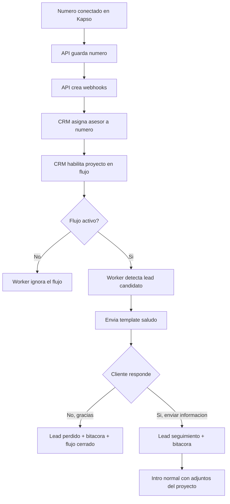

## Estado Actual

### Listo

- API NestJS organizada por modulos.
- Conexion a MySQL CRM Ventas.
- Sincronizacion de numeros Kapso.
- Webhook Platform para altas y bajas de numeros.
- Webhook Kapso Events para mensajes y conversaciones.
- Webhook Meta Relay para payloads crudos de Meta.
- Creacion automatica de webhooks Kapso y Meta por numero.
- Uso de API key por proyecto Kapso cuando aplica.
- Configuracion `Asesor -> Numero Kapso`.
- Configuracion `Flujo -> Proyecto permitido`.
- Catalogo local del template `saludo`.
- Template `saludo` aprobado en Kapso/Meta.
- Worker de leads candidatos.
- Validacion de telefono.
- Control anti-repeticion por `flow_uuid + idinterno_lead`.
- Respuesta `No, gracias`.
- Respuesta `Si, enviar informacion`.
- Bitacoras CRM para eventos importantes.
- Adjuntos por proyecto para la intro normal.
- Carga multiple de adjuntos desde el frontend.
- Guardado fisico de adjuntos por flujo y proyecto.
- Limpieza automatica de metadata activa cuando el archivo fisico ya no existe.
- Autenticacion global Microsoft Entra con politica deny-by-default.
- Autorizacion administrativa mediante `id_rol_admin = 1`.
- Firma HMAC obligatoria en webhooks Platform, Events y Meta Relay.
- Idempotencia durable de webhooks mediante `kapso_webhook_receipts`.
- Rate limiting global y limites especificos para uploads y sincronizaciones.
- Validacion de archivos por firma binaria, no solo por extension o MIME declarado.
- URLs temporales firmadas para descargar adjuntos.
- Jobs distribuidos BullMQ sobre Redis, sin timers locales por instancia.
- Liveness y readiness separados con validacion real de MySQL y Redis.
- Logs con redaccion de PII, tokens, API keys y secretos.
- Repositorios y servicios separados por responsabilidad.
- Suite de integracion MySQL con schema efimero y 16 pruebas verdes.
- Cobertura de repositorios medida en integracion: 50% de lineas.

### En Proceso

- Definir los siguientes pasos despues de la intro normal.
- Definir que hacen los botones `Ver precios`, `Agendar visita` y `Hablar con asesor`.
- Definir como se detecta formalmente la intervencion manual del asesor.
- Ejecutar la migracion de recibos de webhook en staging corporativo.
- Completar consentimiento Microsoft Entra en el tenant real.
- Migrar adjuntos a almacenamiento compartido antes de operar multiples replicas sin volumen comun.

### No Debe Hacerse Todavia

- Enviar templates posteriores sin aprobacion del texto.
- Marcar leads como perdidos por texto libre ambiguo.
- Crear un flujo nuevo sin validar primero proyecto, template, parametros y bitacoras.

## Tecnologia

| Tecnologia         | Uso                                     |
| ------------------ | --------------------------------------- |
| NestJS 11          | Framework API                           |
| TypeScript         | Lenguaje principal                      |
| TypeORM            | Acceso a MySQL                          |
| MySQL              | Base CRM Ventas                         |
| Kapso Platform API | Numeros, templates, webhooks y mensajes |
| Meta Webhooks      | Respuestas y eventos WhatsApp           |
| Jest               | Pruebas unitarias y e2e                 |
| libphonenumber-js  | Validacion y normalizacion de telefonos |
| Multer             | Carga de adjuntos                       |
| Microsoft Entra ID | Autenticacion y tokens OAuth 2.0        |
| BullMQ / Redis     | Jobs periodicos distribuidos            |

## Como Correr

```bash
npm install
npm run integration:up
npm run migration:run
npm run start:dev
```

Infra de pruebas locales (MySQL `:3307` + Redis `:6379`):

```bash
npm run integration:up
npm run test:integration:coverage
npm run integration:down
```

La API queda disponible en:

```text
http://localhost:8002/api/v1
```

Comandos de verificacion:

```bash
npm run format:check
npm run lint
npm run typecheck
npm test
npm run test:e2e
npm run build
```

## Variables de Entorno

| Variable                             | Uso                                                                |
| ------------------------------------ | ------------------------------------------------------------------ |
| `PORT`                               | Puerto local. Normalmente `8002`.                                  |
| `API_PREFIX`                         | Prefijo API. Normalmente `api/v1`.                                 |
| `CORS_ALLOWED_ORIGINS`               | Origenes frontend autorizados, separados por coma.                 |
| `TRUST_PROXY_HOPS`                   | Cantidad de proxies confiables antes de la API.                    |
| `INTERNAL_RATE_LIMIT_PER_MINUTE`     | Limite global de requests por minuto e IP.                         |
| `ENTRA_TENANT_ID`                    | Tenant unico autorizado para emitir tokens.                        |
| `ENTRA_API_AUDIENCE`                 | Client ID de la app registrada como API.                           |
| `ENTRA_REQUIRED_SCOPE`               | Scope delegado requerido. Normalmente `Kapso.Access`.              |
| `ENTRA_ALLOWED_CLIENT_IDS`           | Client IDs que pueden invocar la API.                              |
| `KAPSO_API_BASE_URL`                 | URL base de Kapso Platform API.                                    |
| `KAPSO_API_KEY`                      | API key por defecto del proyecto Kapso.                            |
| `KAPSO_PROJECT_API_KEYS_JSON`        | Mapa `project.id -> apiKey` para proyectos Kapso multiples.        |
| `KAPSO_PUBLIC_BASE_URL`              | URL publica que Kapso puede consultar. Ejemplo: ngrok.             |
| `KAPSO_PLATFORM_WEBHOOK_SECRET`      | Secreto del webhook Platform.                                      |
| `KAPSO_WHATSAPP_WEBHOOK_SECRET`      | Secreto compartido por webhooks WhatsApp y relay Meta.             |
| `KAPSO_MEDIA_STORAGE_PATH`           | Directorio fisico de adjuntos.                                     |
| `KAPSO_MEDIA_MAX_FILE_SIZE_MB`       | Tamano maximo permitido por archivo.                               |
| `KAPSO_MEDIA_SIGNING_SECRET`         | Secreto de al menos 32 caracteres para URLs temporales de media.   |
| `KAPSO_MEDIA_SIGNED_URL_TTL_SECONDS` | Vida util de cada URL temporal.                                    |
| `KAPSO_PENDING_SYNC_INTERVAL_MS`     | Periodicidad del job distribuido de sincronizacion.                |
| `KAPSO_LEAD_TEMPLATE_INTERVAL_MS`    | Periodicidad del job distribuido de leads candidatos.              |
| `MYSQL_*`                            | Credenciales y conexion hacia MySQL CRM Ventas.                    |
| `MYSQL_MIGRATIONS_RUN`               | Debe permanecer `false`; migraciones se ejecutan en el despliegue. |
| `REDIS_HOST`, `REDIS_PORT`           | Servidor usado por BullMQ y readiness.                             |
| `REDIS_PASSWORD`, `REDIS_DB`         | Autenticacion y base logica de Redis.                              |
| `REDIS_TLS`                          | Activa TLS en la conexion Redis.                                   |

### Configuracion Microsoft Entra

La API acepta access tokens destinados a ella; no acepta el access token de Microsoft Graph ni usa el ID token como credencial de API.

1. En la app registration de la API, usar **Expose an API** y crear el scope `Kapso.Access`.
2. Autorizar al client ID del frontend en **Authorized client applications**.
3. Configurar el frontend con `VITE_ENTRA_KAPSO_SCOPE=api://<api-client-id>/Kapso.Access`.
4. Configurar `ENTRA_API_AUDIENCE` con el client ID de la API y `ENTRA_ALLOWED_CLIENT_IDS` con el client ID del frontend.
5. El usuario autenticado tambien debe existir activo en `admins` y tener `id_rol_admin = 1`.

Los endpoints privados exigen `Authorization: Bearer <access-token>`. Solo redirects de setup, webhooks firmados, media con URL temporal y health checks son publicos.

Checklist Entra (tenant corporativo):

- [ ] Scope `Kapso.Access` creado y consentido.
- [ ] Frontend autorizado como client application.
- [ ] Variables `ENTRA_*` desplegadas en staging/produccion.
- [ ] `VITE_ENTRA_KAPSO_SCOPE` en el frontend.
- [ ] Prueba: usuario rol 1 → `200` en `GET /kapso/business-flows`.
- [ ] Prueba: sin token → `401`.
- [ ] Prueba: usuario activo sin rol 1 → `403`.

### Operacion y despliegue

- Ejecutar `npm run migration:run` como paso unico antes de desplegar nuevas instancias.
- Mantener `MYSQL_MIGRATIONS_RUN=false` para evitar carreras de schema.
- Redis es obligatorio para los jobs BullMQ.
- Intervalo `0` en `KAPSO_*_INTERVAL_MS` desactiva el scheduler (solo tests/mantenimiento).
- Liveness: `GET /api/v1/health/live`.
- Readiness MySQL + Redis: `GET /api/v1/health/ready`.

Promocion segura de migracion a staging:

```bash
# 1) Backup de la BD staging
# 2) Apuntar MYSQL_* a staging (nunca produccion por error)
# 3) Verificar MYSQL_MIGRATIONS_RUN=false
npm run migration:run
# 4) Confirmar tabla e indices
# SHOW TABLES LIKE 'kapso_webhook_receipts';
# SHOW INDEX FROM kapso_webhook_receipts;
# 5) Smoke: dos webhooks concurrentes con la misma idempotency key
# 6) health/ready debe responder ok
```

La migracion `CreateKapsoWebhookReceipts` ya se valida en schema efimero local (`api_kapso_it_*`). Staging sigue siendo el gate operativo antes de produccion.
Regla importante:

```text
GET /platform/v1/whatsapp/phone_numbers/{phone_number_id}
es project-scoped.
```

Kapso confirmo que el GET debe hacerse con el API key del mismo proyecto que creo el setup link. Por eso se guarda `project.id` y se consulta `KAPSO_PROJECT_API_KEYS_JSON` antes de llamar a Kapso.

## Arquitectura General

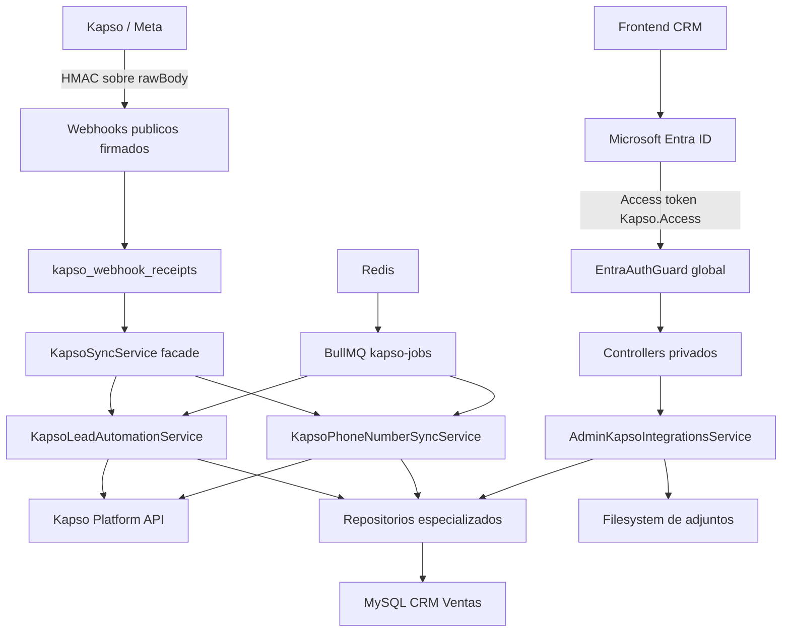

### Responsabilidades

| Componente                                    | Responsabilidad                                                |
| --------------------------------------------- | -------------------------------------------------------------- |
| `EntraAuthGuard`                              | Autentica access tokens y aplica roles CRM.                    |
| `KapsoWebhooksController`                     | Verifica HMAC, reserva idempotencia y recibe eventos.          |
| `KapsoSyncService`                            | Fachada compatible para sincronizacion y automatizacion.       |
| `KapsoPhoneNumberSyncService`                 | Numeros, bootstrap, webhooks remotos y reintentos pendientes.  |
| `KapsoLeadAutomationService`                  | Leads candidatos, respuestas Si/No, templates e intro normal.  |
| `AdminKapsoIntegrationsService`               | Asignaciones, flujos, proyectos y archivos.                    |
| `AdminKapsoIntegrationsRepository`            | Administradores, numeros disponibles y relaciones Admin-Kapso. |
| `KapsoFlowProjectMediaRepository`             | Flujos, proyectos permitidos y metadata de adjuntos.           |
| `KapsoLeadAutomationRepository`               | SQL y transacciones del ciclo comercial del lead.              |
| `KapsoRepository`                             | Numeros, auditoria, redirects e idempotencia de webhooks.      |
| `KapsoJobsSchedulerService` / `JobsProcessor` | Agenda y ejecuta jobs distribuidos mediante BullMQ.            |
| `KapsoMediaUrlSignerService`                  | Genera y valida URLs HMAC temporales para media.               |
| `KapsoPlatformApiService`                     | Cliente HTTP centralizado hacia Kapso.                         |
| `KapsoHealthController`                       | Liveness y readiness de MySQL/Redis.                           |

### Estructura Tecnica Actual

```text
src/
  common/auth/
    entra-auth.guard.ts
    entra-auth.service.ts
  modules/kapso/
    controllers/
    repositories/
      admin-kapso-integrations.repository.ts
      kapso-flow-project-media.repository.ts
      kapso-lead-automation.repository.ts
      kapso.repository.ts
    services/
      kapso-sync.service.ts
      kapso-phone-number-sync.service.ts
      kapso-lead-automation.service.ts
      kapso-jobs-scheduler.service.ts
      kapso-jobs.processor.ts
      kapso-media-url-signer.service.ts
      kapso-platform-api.service.ts
```

## Seguridad y Control de Acceso

La politica es **privado por defecto**. Una ruta solo queda sin access token cuando esta marcada explicitamente con `@Public()`.

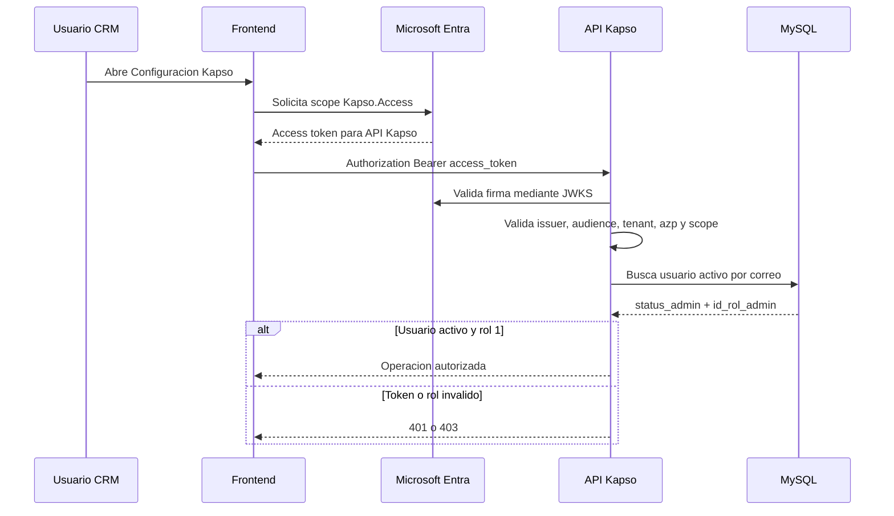

### Controles del Token

| Control            | Regla                                                                   |
| ------------------ | ----------------------------------------------------------------------- |
| Firma              | RSA `RS256` mediante JWKS oficial del tenant.                           |
| Tenant             | `tid` debe coincidir con `ENTRA_TENANT_ID`.                             |
| Emisor             | `iss` debe ser el issuer v2.0 exacto del tenant.                        |
| Audiencia          | `aud` debe coincidir con `ENTRA_API_AUDIENCE`.                          |
| Aplicacion cliente | `azp` o `appid` debe estar en `ENTRA_ALLOWED_CLIENT_IDS`.               |
| Permiso            | `scp` debe contener `ENTRA_REQUIRED_SCOPE`, normalmente `Kapso.Access`. |
| Usuario CRM        | El correo debe existir en `admins` con `status_admin = 1`.              |
| Rol                | Las rutas administrativas requieren `id_rol_admin = 1`.                 |

### Superficie Publica y Privada

| Tipo de ruta                           | Proteccion                                                  |
| -------------------------------------- | ----------------------------------------------------------- |
| CRUD, configuracion y sincronizaciones | Bearer Entra + usuario activo + rol CRM 1 + rate limit.     |
| Webhooks Kapso/Meta                    | Publicos para el proveedor, pero exigen HMAC sobre rawBody. |
| Redirects de setup                     | Publicos; salida HTML escapada para evitar inyeccion.       |
| Descarga de adjuntos                   | Publica solo con `expires` y `signature` HMAC validos.      |
| Liveness/readiness                     | Publicos y excluidos del rate limit para monitoreo.         |

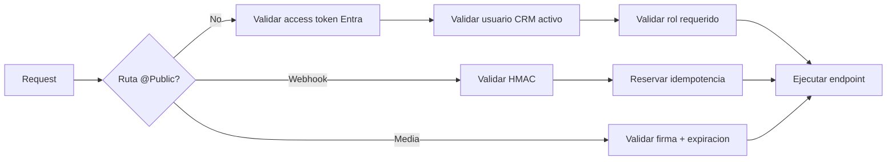

## Jobs Distribuidos e Idempotencia

Los procesos periodicos ya no usan `setInterval` dentro de cada instancia. BullMQ registra schedulers unicos en Redis y procesa una ejecucion por vez.

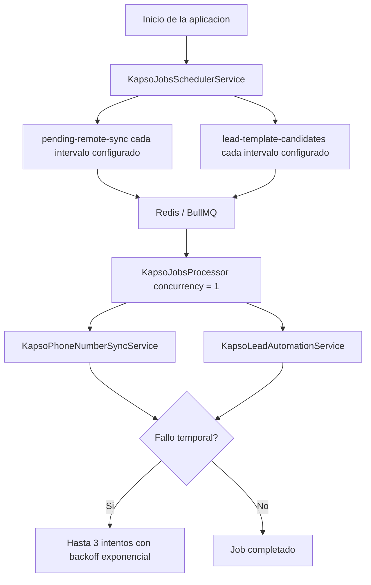

### Idempotencia de Webhooks

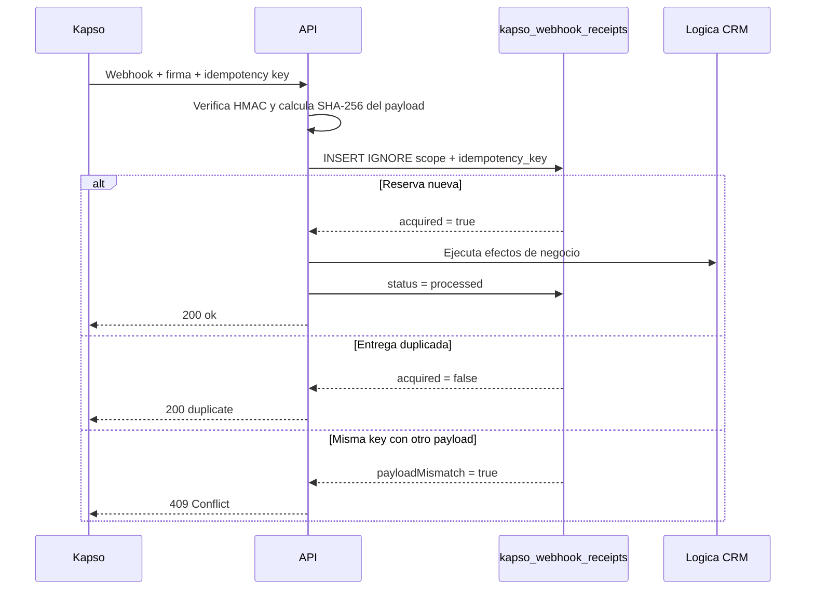

Reglas:

- La llave unica es `scope + idempotency_key`.
- Si el proveedor no envia llave, se deriva una desde el hash SHA-256 del raw body.
- Una reserva queda bloqueada cinco minutos.
- Un proceso fallido o un lease vencido puede adquirirse otra vez.
- La misma llave con contenido distinto se rechaza.

## Configuracion del CRM

La pantalla principal es:

```text
Configuracion Admin-Kapso
```

Esa pantalla tiene dos areas principales.

### 1. Asesores y Numeros

Permite asignar una linea Kapso a un asesor.

Relacion usada:

```text
leads.id_empleado_lead -> admins.idnetsuite_admin -> admin_kapso_integrations
```

Si un lead pertenece a un asesor sin numero Kapso activo, el sistema no envia mensaje y registra bitacora.

### 2. Flujos por Proyecto

Permite decir que proyectos pueden usar un flujo completo.

Relacion usada:

```text
leads.idproyecto_lead -> proyectos.id_ProNetsuite
```

Si el proyecto no esta permitido para el flujo, el lead no se procesa.

El flujo tambien tiene un interruptor principal:

| Estado del flujo | Comportamiento                                                                         |
| ---------------- | -------------------------------------------------------------------------------------- |
| `enabled = 1`    | El worker puede ejecutar el flujo si el lead cumple todas las reglas.                  |
| `enabled = 0`    | El worker ignora el flujo aunque existan proyectos, templates y adjuntos configurados. |

Inactivar un flujo no borra proyectos permitidos, adjuntos, ejecuciones ni bitacoras. Solo pausa nuevas ejecuciones para poder retomarlas despues sin reconstruir la configuracion.

El flujo actual es:

| Campo           | Valor                                   |
| --------------- | --------------------------------------- |
| UUID            | `94d5c3b8-4b43-4c28-8c76-3d9eaf70ad01`  |
| Codigo          | `lead_initial_contact`                  |
| Nombre          | `Saludo inicial y seguimiento de leads` |
| Primer template | `saludo`                                |

### 3. Adjuntos por Proyecto

Cada proyecto permitido puede tener fotos, videos o documentos para la intro normal.

Los adjuntos se usan solo despues de que el cliente responde `Si, enviar informacion`.

## Flujo Completo del Negocio

### Paso 0: Numero Kapso Conectado

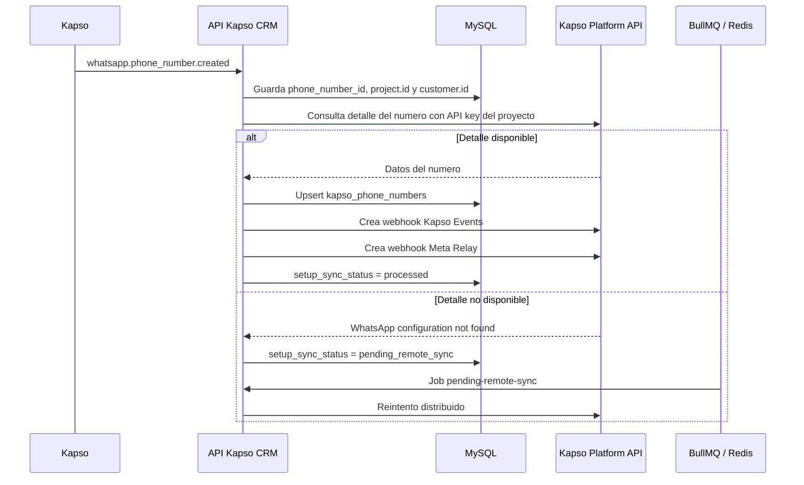

### Paso 1: Lead Candidato

Condicion base:

```sql
leads.segimineto_lead = '01-LEAD-INTERESADO'
AND leads.whatsapp_template_contact_sent = 2
AND leads.estado_lead = 1
```

Validaciones adicionales:

- `id_empleado_lead` no puede venir vacio.
- `idinterno_lead` debe existir.
- El flujo de negocio debe estar activo.
- El proyecto debe estar permitido para el flujo.
- El asesor debe tener una asignacion Admin-Kapso activa.
- El telefono debe ser valido.
- No debe existir ejecucion previa para `flow_uuid + idinterno_lead`.

### Paso 2: Template Inicial `saludo`

Template aprobado en Kapso:

| Campo                 | Valor                   |
| --------------------- | ----------------------- |
| Accion CRM            | `lead_initial_greeting` |
| Nombre Kapso          | `saludo`                |
| ID remoto             | `1004936342403599`      |
| Referencia Kapso      | `4108dccb`              |
| Idioma                | `es_ES`                 |
| Categoria             | `MARKETING`             |
| Estado local esperado | `approved`              |
| Parametros            | 3                       |

Texto:

```text
Hola {{1}}, soy {{2}}, asesor de {{3}}.

Vi que pediste informacion del proyecto.

Te parece bien si te comparto la informacion por este medio?
```

Mapeo:

| Parametro | Origen                |
| --------- | --------------------- |
| `{{1}}`   | `leads.nombre_lead`   |
| `{{2}}`   | `admins.name_admin`   |
| `{{3}}`   | `leads.proyecto_lead` |

Botones:

| Boton                    | Resultado                         |
| ------------------------ | --------------------------------- |
| `Si, enviar informacion` | Continua flujo y envia intro.     |
| `No, gracias`            | Cierra flujo y pasa lead perdido. |

### Paso 3: Respuesta `No, gracias`

Solo se procesa cuando llega el boton exacto o el cliente escribe el texto exacto equivalente.
Los textos largos o ambiguos se ignoran para evitar pasar leads a perdido por error.

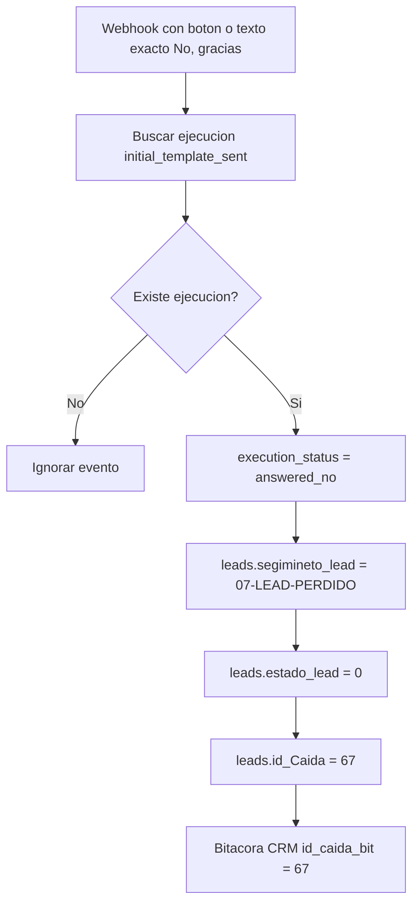

Campos de bitacora:

| Campo          | Valor                                                        |
| -------------- | ------------------------------------------------------------ |
| `id_lead_bit`  | `leads.idinterno_lead`                                       |
| `id_admin_bit` | `admins.idnetsuite_admin`                                    |
| `id_caida_bit` | `67`                                                         |
| `detalle_bit`  | Cliente indico que no desea recibir informacion por WhatsApp |
| `estado_bit`   | `No desea informacion`                                       |
| `estado_lead`  | `0`                                                          |

### Paso 4: Respuesta `Si, enviar informacion`

Solo se procesa cuando llega el boton exacto o el cliente escribe el texto exacto equivalente.
Los textos largos o ambiguos se ignoran para evitar activar el flujo por intencion ambigua.

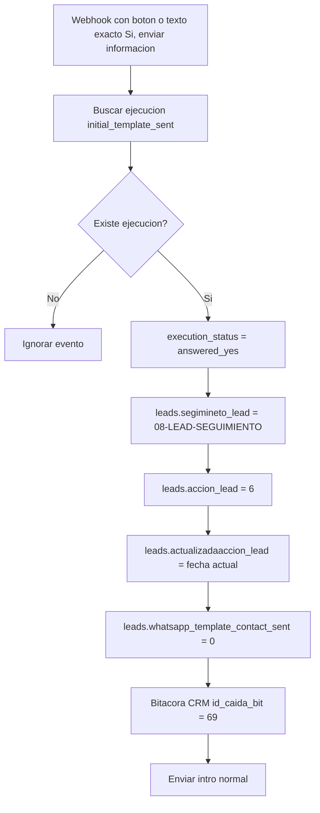

Campos de bitacora:

| Campo          | Valor                                            |
| -------------- | ------------------------------------------------ |
| `id_lead_bit`  | `leads.idinterno_lead`                           |
| `id_admin_bit` | `admins.idnetsuite_admin`                        |
| `id_caida_bit` | `69`                                             |
| `detalle_bit`  | Cliente acepto recibir informacion por WhatsApp. |
| `estado_bit`   | `Acepto informacion WhatsApp`                    |
| `estado_lead`  | `1`                                              |

### Paso 5: Intro Normal con Adjuntos

La intro normal no es template.

Motivo:

- el cliente ya respondio;
- hay ventana de conversacion abierta;
- el contenido puede variar por proyecto;
- los adjuntos pueden cambiar sin crear templates nuevos;
- se evita crear un template diferente por cada proyecto.

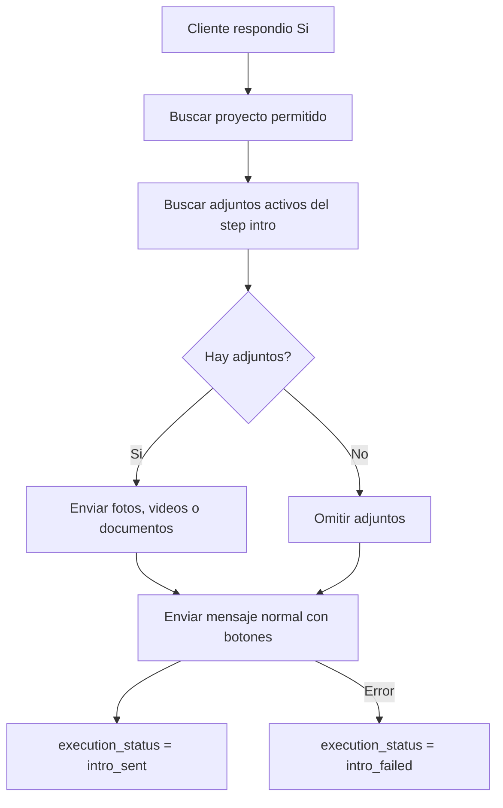

Texto base cuando hay adjuntos:

```text
Perfecto {{nombre_lead}}, te comparto un video introductorio de {{proyecto_lead}} y algunas fotos.

Podrias contarme un poco sobre lo que estas buscando?
```

Si no hay adjuntos, el mensaje no promete fotos ni video.

Botones planeados:

| Boton               | Proxima decision pendiente      |
| ------------------- | ------------------------------- |
| `Ver precios`       | Definir template o mensaje.     |
| `Agendar visita`    | Definir integracion con agenda. |
| `Hablar con asesor` | Marcar intervencion manual.     |

## Reglas de Ejecucion

### Anti-Repeticion

La tabla `kapso_lead_flow_executions` evita ciclos infinitos.

Clave funcional:

```text
flow_uuid + idinterno_lead
```

Si ya existe una ejecucion para ese lead y ese flujo, el worker no lo vuelve a iniciar.

### Identificadores Principales

| Dato     | Campo                                               |
| -------- | --------------------------------------------------- |
| Lead     | `leads.idinterno_lead`                              |
| Asesor   | `admins.idnetsuite_admin`                           |
| Proyecto | `leads.idproyecto_lead -> proyectos.id_ProNetsuite` |
| Flujo    | `kapso_business_flows.flow_uuid`                    |
| Numero   | `kapso_phone_numbers.phone_number_id`               |

### Estados de Ejecucion

| Estado                    | Significado                                              |
| ------------------------- | -------------------------------------------------------- |
| `reserved`                | Lead reservado para iniciar flujo.                       |
| `initial_template_sent`   | Template inicial enviado.                                |
| `initial_template_failed` | Template inicial fallo; no se reintenta automaticamente. |
| `answered_yes`            | Cliente acepto recibir informacion.                      |
| `answered_no`             | Cliente rechazo informacion por WhatsApp.                |
| `intro_sent`              | Intro normal enviada correctamente.                      |
| `intro_failed`            | Intro normal no pudo enviarse.                           |
| `invalid_phone`           | Telefono invalido; no se reintenta.                      |
| `manual_intervention`     | Asesor tomo control manual.                              |
| `completed`               | Flujo terminado.                                         |
| `failed`                  | Error tecnico terminal.                                  |

### Telefonos Invalidos

Cuando el telefono no es valido:

- no se llama a Kapso;
- no se modifica el estado comercial del lead;
- se inserta bitacora con `id_caida_bit = 68`;
- la ejecucion queda como `invalid_phone`;
- el mismo flujo no vuelve a ejecutarse para ese lead.

Ejemplos:

| Valor CRM         | Resultado esperado |
| ----------------- | ------------------ |
| `87515938`        | `50687515938`      |
| `50687515938`     | `50687515938`      |
| `+506 8751 5938`  | `50687515938`      |
| `+1 720 353 5091` | `17203535091`      |
| `88888888`        | Invalido           |
| Texto o vacio     | Invalido           |

### Ventana de 24 Horas

El template `saludo` puede iniciar conversacion.

Cuando el cliente responde:

- se abre o renueva la ventana de conversacion;
- el sistema puede enviar mensajes normales permitidos por Meta/Kapso;
- el avance se registra en `kapso_lead_flow_executions`.

### Texto Libre

Por seguridad, el sistema solo interpreta texto cuando coincide exactamente con una respuesta aprobada:
`Si, enviar informacion` o `No, gracias`.

Todo texto largo o ambiguo queda como mensaje recibido para analisis o atencion manual.

Motivo:

- un cliente puede escribir mucho texto;
- una palabra como "no" puede aparecer dentro de otra idea;
- un falso positivo podria pasar un lead a perdido indebidamente;
- los botones dan una senal clara y auditable.

## Adjuntos por Proyecto

Los adjuntos pertenecen a un flujo, un proyecto y un paso.

Estructura fisica:

```text
archivos/
  {flow_uuid}/
    proyectos/
      {idProyectoNetsuite-nombre-proyecto}/
        {uuid}.{extension}
```

Ejemplo:

```text
archivos/
  94d5c3b8-4b43-4c28-8c76-3d9eaf70ad01/
    proyectos/
      43-amara/
        581bb5f35b49d581ee73dba3362e06fe.jpg
```

Reglas:

- El frontend puede seleccionar varios archivos.
- El API recibe un archivo por request para controlar errores parciales.
- La ruta de upload exige access token Entra, rol CRM 1 y maximo 10 requests por minuto.
- Multer limita tamaño, cantidad de archivos, campos, partes y headers antes de crear el buffer completo.
- El contenido se valida por firma binaria para JPG, PNG, GIF, WEBP, PDF, MP4 y WEBM.
- La extension final se deriva del contenido detectado; no se confia en el nombre original.
- Cada archivo se guarda con nombre UUID para evitar colisiones.
- En la interfaz no se muestra el nombre tecnico del archivo.
- Se muestra una etiqueta amigable como `Imagen JPG`, `Video MP4` o `Documento PDF`.
- Si el proyecto no tiene adjuntos, la intro sale solo con texto.
- Al quitar un adjunto desde el CRM, el API desactiva la metadata y borra el archivo fisico en `archivos/`.
- Si un archivo fisico fue borrado pero la metadata seguia activa, el API desactiva esa metadata automaticamente al listar o servir el archivo.

Ruta de descarga temporal:

```text
GET /api/v1/kapso/media/:storedFilename?expires={unix}&signature={hmac}
```

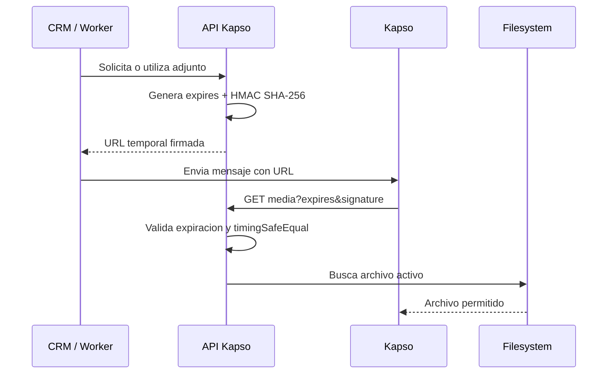

En desarrollo, si Kapso necesita consultar los archivos, `KAPSO_PUBLIC_BASE_URL` debe apuntar a una URL publica como ngrok. La firma no sustituye HTTPS.

## Modelo de Datos

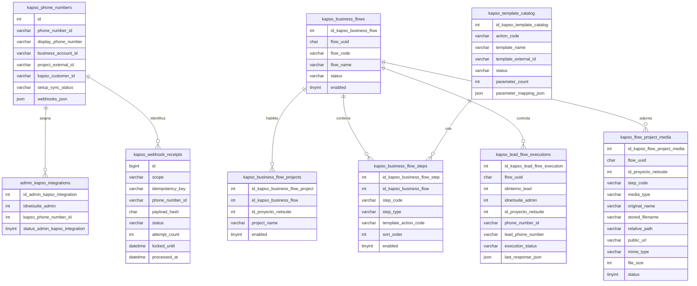

### Tabla de Idempotencia

| Campo             | Uso                                                         |
| ----------------- | ----------------------------------------------------------- |
| `scope`           | Separa eventos `platform`, `kapso` y `meta`.                |
| `idempotency_key` | Identificador único enviado o derivado del payload.         |
| `payload_hash`    | Detecta reutilización de la misma llave con otro contenido. |
| `status`          | `processing`, `processed` o `failed`.                       |
| `attempt_count`   | Cantidad de adquisiciones del recibo.                       |
| `locked_until`    | Lease para recuperar procesos interrumpidos.                |
| `processed_at`    | Fecha de finalización exitosa.                              |

### Tablas CRM Usadas

| Tabla       | Uso                                            |
| ----------- | ---------------------------------------------- |
| `leads`     | Fuente de leads y estado comercial.            |
| `admins`    | Datos del asesor y relacion con NetSuite.      |
| `proyectos` | Validacion de proyectos habilitados por flujo. |
| `bitacoras` | Trazabilidad operativa dentro del CRM.         |
| `caidas`    | Motivos comerciales de perdida o bloqueo.      |

### Caidas Usadas

| ID  | Uso                                         |
| --- | ------------------------------------------- |
| 67  | Cliente rechazo informacion por WhatsApp.   |
| 68  | Numero de telefono no valido.               |
| 69  | Cliente acepto recibir informacion WhatsApp |

## Rutas Principales

| Ruta                                                                 | Proposito                                |
| -------------------------------------------------------------------- | ---------------------------------------- |
| `GET /api/v1/kapso/customers`                                        | Lista clientes sincronizados localmente. |
| `GET /api/v1/kapso/phone-numbers`                                    | Lista numeros Kapso locales.             |
| `GET /api/v1/kapso/templates/catalog`                                | Lista templates locales.                 |
| `GET /api/v1/kapso/projects/options`                                 | Lista proyectos CRM para configuracion.  |
| `GET /api/v1/kapso/business-flows`                                   | Lista flujos y proyectos permitidos.     |
| `PATCH /api/v1/kapso/business-flows/:flowUuid/status`                | Activa o inactiva el flujo completo.     |
| `POST /api/v1/kapso/business-flows/:flowUuid/projects`               | Habilita un proyecto para un flujo.      |
| `DELETE /api/v1/kapso/business-flows/:flowUuid/projects/:idProyecto` | Deshabilita un proyecto del flujo.       |
| `GET /api/v1/kapso/flows/:flowUuid/projects/:id/media`               | Lista adjuntos del flujo por proyecto.   |
| `POST /api/v1/kapso/flows/:flowUuid/projects/:id/media`              | Sube un adjunto para una etapa.          |
| `DELETE /api/v1/kapso/flow-project-media/:id`                        | Desactiva metadata y borra el archivo.   |
| `GET /api/v1/kapso/media/:storedFilename?expires&signature`          | Sirve adjuntos con URL temporal firmada. |
| `POST /api/v1/kapso/bootstrap/sync`                                  | Reconstruye estado local desde Kapso.    |
| `POST /api/v1/kapso/phone-numbers/:phoneNumberId/sync`               | Reintenta sync de un numero.             |
| `GET /api/v1/kapso/setup/success`                                    | Recibe redirect exitoso del setup link.  |
| `GET /api/v1/kapso/setup/failure`                                    | Recibe redirect fallido del setup link.  |
| `POST /api/v1/webhooks/kapso/platform`                               | Webhook de altas/bajas de numeros.       |
| `POST /api/v1/webhooks/kapso/events`                                 | Webhook Kapso events.                    |
| `POST /api/v1/webhooks/kapso/meta`                                   | Webhook relay Meta.                      |
| `GET /api/v1/kapso/admin-integrations`                               | Lista asignaciones admin-Kapso.          |
| `POST /api/v1/kapso/admin-integrations`                              | Crea asignacion admin-Kapso.             |
| `GET /api/v1/health/live`                                            | Confirma que el proceso esta vivo.       |
| `GET /api/v1/health/ready`                                           | Valida MySQL y Redis.                    |

### Matriz de Proteccion

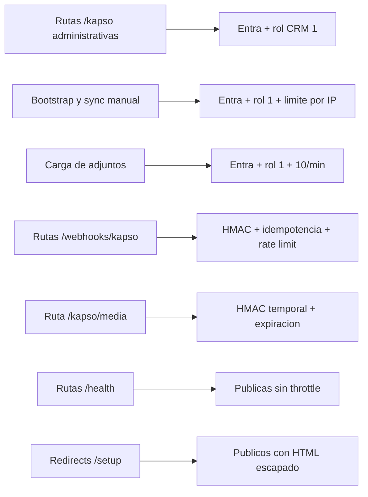

## Diagnostico y Logs

El API deja logs estructurados para seguir el flujo completo sin exponer informacion sensible. Permiten ver que operacion ocurrio, que respondio Kapso y que decision tomo el motor.

### Que se registra

| Momento                    | Que buscar en consola                                                                                     |
| -------------------------- | --------------------------------------------------------------------------------------------------------- |
| Request saliente a Kapso   | `Kapso API request METHOD /ruta project=... apiKeySource=... payload resumido`                            |
| Respuesta exitosa de Kapso | `Kapso API response METHOD /ruta status=... payload resumido`                                             |
| Error devuelto por Kapso   | `Kapso API error METHOD /ruta status=... project=...`                                                     |
| Alta o baja de numero      | `Platform webhook received event=whatsapp.phone_number.created/deleted`                                   |
| Webhook WhatsApp/Kapso     | `Kapso events webhook received` con `payload keys` y payload resumido.                                    |
| Webhook Meta Relay         | `Meta webhook received` con `object`, `entry`, `messageId`, `phoneNumberId` y payload resumido.           |
| Envio del template inicial | `Initial template send started`, `Initial template payload` y `Initial template Kapso response`.          |
| Respuesta del cliente      | `Inbound message candidate`, `answered_yes`, `answered_no` o `unsupported_or_ambiguous_reply`.            |
| Envio de intro normal      | `Intro send started`, `Intro media payload`, `Intro media Kapso response` e `Intro interactive response`. |
| Creacion de webhooks       | `webhook missing`, `webhook created` y `webhook creation response`.                                       |

### Como usar los logs durante una prueba

1. Levantar el API con `npm run start:dev`.
2. Activar el flujo y confirmar que el proyecto esta permitido.
3. Dejar un lead candidato con `segimineto_lead = 01-LEAD-INTERESADO`, `estado_lead = 1` y `whatsapp_template_contact_sent = 2`.
4. Buscar en consola por `Lead template candidate`, `executionId`, `phoneNumberId` o `idinterno_lead`.
5. Si Kapso falla, revisar la linea `Kapso API error` y el payload resumido.
6. Si el cliente responde, buscar `Inbound message candidate` y confirmar si el sistema lo clasifico como `Si`, `No` o ambiguo.

Los payloads se resumen con un limite interno para que la consola sea legible. No se imprime el valor de API keys ni secrets; solo se indica si se uso key `default`, `project` u `override`.

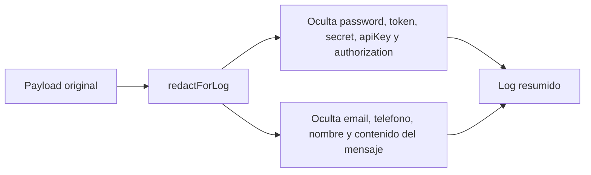

Para correlacion se prefieren identificadores tecnicos como `executionId`, `phoneNumberId`, `messageId`, `flowUuid` e `idinterno_lead`. Los telefonos, nombres, correos, contenido de mensajes y credenciales se redactan antes de escribir el log.

## Preguntas y Respuestas

### Por que el template `saludo` no se crea por cada numero?

Porque los templates de WhatsApp pertenecen al Business Account, no al numero individual. Si varios numeros estan bajo el mismo Business Account, pueden usar el mismo template aprobado.

### Por que la intro no es template?

Porque la intro se envia despues de que el cliente responde `Si, enviar informacion`. En ese momento existe ventana de conversacion y conviene usar mensaje normal para permitir adjuntos diferentes por proyecto sin crear un template por cada caso.

### Como sabe el sistema que numero Kapso debe usar?

El lead trae `id_empleado_lead`. Ese valor se cruza con `admins.idnetsuite_admin` y luego con `admin_kapso_integrations`. Si el asesor tiene una relacion activa, se toma ese `phone_number_id`.

### Como sabe el sistema si un proyecto puede usar el flujo?

El lead trae `idproyecto_lead`. Ese valor se compara contra `proyectos.id_ProNetsuite` y contra `kapso_business_flow_projects`. Si el proyecto no esta permitido, el lead no entra al flujo.

### Como se pausa un flujo sin borrar configuracion?

Desde `Configuracion Admin-Kapso > Flujos por proyecto` se usa el boton `Inactivar flujo`. Esto cambia `kapso_business_flows.enabled` a `0` y el worker deja de ejecutar ese flujo.

### Que pasa si el flujo esta inactivo y entra un lead candidato?

No se envia ningun template ni intro para ese flujo. El worker solo toma flujos con `enabled = 1`.

### Si reactivo el flujo, se pierde algo?

No. Se conservan proyectos permitidos, adjuntos, ejecuciones y bitacoras. Al volver a activarlo, el worker retoma la evaluacion normal de nuevos candidatos.

### Por que se usa `idinterno_lead`?

Porque es el identificador operativo mas usado en el CRM para bitacoras y seguimiento. La ejecucion del flujo y las bitacoras se amarran a ese valor.

### Que pasa si el asesor no tiene numero Kapso?

El sistema no envia WhatsApp. Debe registrar bitacora indicando que el asesor no tiene numero Kapso asignado y evita reintentos innecesarios segun la regla del flujo.

### Que pasa si el telefono del lead esta malo?

No se llama a Kapso. Se registra bitacora con `id_caida_bit = 68`, la ejecucion queda como `invalid_phone` y ese lead no se vuelve a procesar para el mismo flujo.

### Que pasa si el cliente responde texto en lugar de tocar boton?

Si escribe exactamente `Si, enviar informacion` o `No, gracias`, el sistema lo procesa igual que el boton.
Si escribe una respuesta larga o ambigua, no se interpreta automaticamente y queda para analisis o atencion manual.

### Que pasa si el cliente toca `No, gracias`?

El lead pasa a perdido:

```text
segimineto_lead = 07-LEAD-PERDIDO
estado_lead = 0
id_Caida = 67
```

Tambien se registra bitacora con `id_caida_bit = 67`.

### Que pasa si el cliente toca `Si, enviar informacion`?

El lead pasa a seguimiento:

```text
segimineto_lead = 08-LEAD-SEGUIMIENTO
accion_lead = 6
whatsapp_template_contact_sent = 0
```

Tambien se registra bitacora con `id_caida_bit = 69` y se intenta enviar la intro normal del proyecto.

### Que pasa si un proyecto no tiene adjuntos?

La intro se envia solo con texto. El sistema no debe prometer fotos ni video cuando no hay archivos activos.

### Donde se guardan los adjuntos?

En la carpeta:

```text
archivos/{flow_uuid}/proyectos/{idProyectoNetsuite-nombre-proyecto}/
```

Cada archivo se guarda con nombre UUID para poder eliminarlo y servirlo sin depender del nombre original.

### Que pasa si se borra un archivo de la carpeta pero queda en la base?

El API lo detecta al listar o servir media, desactiva la metadata y deja de devolverlo. Esto evita miniaturas rotas y errores `ENOENT`.

### Por que necesito ngrok en desarrollo?

Porque Kapso no puede acceder a `localhost`. Si Kapso necesita llamar webhooks o descargar media desde tu maquina local, se usa una URL publica de ngrok en `KAPSO_PUBLIC_BASE_URL`.

### Que pasa si Kapso no devuelve inmediatamente el detalle del numero?

Se guarda el numero con estado pendiente y el worker reintenta. Si el error es por API key de otro proyecto, debe corregirse `KAPSO_PROJECT_API_KEYS_JSON`.

### Ya esta completo todo el flujo del PDF?

No. Esta lista la base: numero, asesor, proyecto, saludo, respuesta Si/No, bitacoras, intro normal y adjuntos. Falta definir los pasos posteriores a la intro.

### Por que el frontend necesita un token distinto al de Microsoft Graph?

Cada access token tiene una audiencia. Microsoft Graph solo acepta tokens destinados a Graph; esta API solo acepta tokens destinados a `ENTRA_API_AUDIENCE` y con el scope `Kapso.Access`.

### Que pasa si el usuario inicio sesion en Microsoft pero no existe en el CRM?

La API devuelve `401`. La identidad de Entra prueba quien es la persona, pero el registro activo en `admins` determina si puede usar el CRM.

### Que pasa si un usuario CRM no tiene rol 1?

Puede estar correctamente autenticado, pero recibe `403` en las rutas administrativas de Kapso.

### Que pasa si Kapso entrega dos veces el mismo webhook?

La primera entrega reserva el recibo y procesa el evento. Las siguientes entregas con la misma llave y payload reciben `200 duplicate` sin repetir cambios en el CRM.

### Que pasa si reutilizan una llave de webhook con otro payload?

La API detecta que el hash no coincide y devuelve `409 Conflict`. Esto evita que una llave valida represente dos eventos diferentes.

### Por que Redis ahora es obligatorio?

Redis coordina los schedulers y workers BullMQ entre instancias. Sin Redis no existe ejecucion distribuida segura y el readiness queda en estado no saludable.

### Por que una URL de adjunto deja de funcionar?

Las URLs se firman con una fecha de expiracion. Una firma alterada, vencida o calculada con otro nombre de archivo devuelve `403`. El API genera una URL nueva cada vez que vuelve a utilizar el adjunto.

### Se puede desplegar mas de una instancia?

Los jobs y webhooks ya soportan coordinacion distribuida. Los adjuntos todavia requieren un volumen compartido entre replicas o migrarse a almacenamiento de objetos antes de escalar horizontalmente sin afinidad.

## Checklist Operativo

Para probar el envio real de `saludo`:

- [ ] Numero conectado en Kapso.
- [ ] Numero existe en `kapso_phone_numbers`.
- [ ] Webhooks Kapso Events y Meta Relay creados por numero.
- [ ] API key del proyecto Kapso configurada.
- [ ] Asesor asignado a numero Kapso.
- [ ] Proyecto permitido para el flujo.
- [ ] Template `saludo` aprobado en Kapso.
- [ ] Template `saludo` sincronizado localmente como `approved`.
- [x] Parametros configurados por codigo: cliente, asesor, proyecto.
- [ ] Adjuntos cargados para proyectos que los requieren.
- [ ] `KAPSO_PUBLIC_BASE_URL` publico cuando se envien adjuntos.
- [x] Worker de leads reserva y envia el template inicial.
- [x] Pruebas unitarias de respuesta `Si` y `No` validadas con webhook.

### Antes de Desplegar

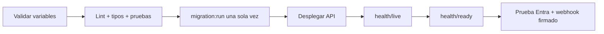

- [ ] Scope `Kapso.Access` creado y consentido en Microsoft Entra.
- [ ] `ENTRA_TENANT_ID`, audiencia, scope y client IDs configurados.
- [ ] `KAPSO_MEDIA_SIGNING_SECRET` aleatorio y de al menos 32 caracteres.
- [ ] Secretos de webhook configurados y diferentes de las API keys.
- [ ] Redis disponible desde todas las instancias.
- [ ] `MYSQL_MIGRATIONS_RUN=false`.
- [ ] `npm run migration:run` ejecutado una sola vez por release.
- [ ] Tabla `kapso_webhook_receipts` creada.
- [ ] `TRUST_PROXY_HOPS` coincide con la topologia del proxy real.
- [ ] `GET /api/v1/health/live` responde OK.
- [ ] `GET /api/v1/health/ready` confirma MySQL y Redis.
- [ ] Volumen de `archivos/` compartido si existe mas de una replica.

### Verificacion de Codigo

```bash
npm run format:check
npm run lint
npm run typecheck
npm test
npm run test:e2e
npm run test:coverage
npm run build
npm audit --omit=dev
```

## Pendientes Controlados

### Siguiente decision funcional

Definir que ocurre despues de la intro normal:

1. Que debe hacer `Ver precios`.
2. Que debe hacer `Agendar visita`.
3. Que debe hacer `Hablar con asesor`.
4. Que bitacora se registra para cada accion.
5. Que estado final debe quedar en `kapso_lead_flow_executions`.

### Riesgos conocidos

- Texto libre no se interpreta automaticamente todavia.
- Intervencion manual del asesor aun necesita una regla formal.
- Adjuntos deben estar disponibles por URL publica si Kapso los descarga fuera de la red local.
- Cada nuevo proyecto habilitado debe validar sus archivos antes de activar el envio real.
- El almacenamiento local de adjuntos necesita volumen compartido o almacenamiento de objetos para multiples replicas.
- La configuracion y consentimiento reales de Microsoft Entra dependen del tenant corporativo.
- Las pruebas de integracion MySQL ya validan schema efimero; falta promover esa misma evidencia a staging y cerrar Redis/CI.

## Resultado de Auditoria y Correcciones

La auditoria inicial encontro riesgos importantes en autenticacion, firmas de webhooks, workers locales, responsabilidades demasiado amplias y cobertura de escenarios de seguridad. Las correcciones se aplicaron por prioridad y sin cambiar las reglas comerciales aprobadas. La reauditoria del 22 jul 2026 incorpora la corrida de integracion MySQL.

### Evolucion Visual

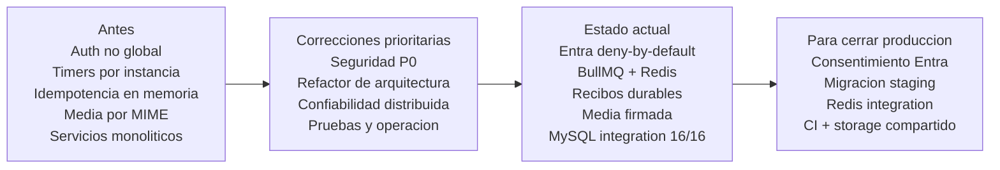

### Hecho vs Pendiente

| Area                     | Estado    | Evidencia                                                   |
| ------------------------ | --------- | ----------------------------------------------------------- |
| Auth Entra en codigo     | Hecho     | Guard global + roles CRM 1                                  |
| HMAC webhooks + inbox    | Hecho     | Firma rawBody + `kapso_webhook_receipts`                    |
| BullMQ / jobs            | Hecho     | Schedulers + processor concurrency 1                        |
| Media firmada            | Hecho     | HMAC temporal + firma binaria                               |
| Refactor servicios/repos | Hecho     | Fachada + repos especializados                              |
| Unitarias + e2e slice    | Hecho     | 81/81                                                       |
| Integracion MySQL        | Hecho     | 17/17 sobre schema efimero `api_kapso_it_*`                 |
| Integracion Redis        | Hecho     | 1/1 schedulers unicos + job real                            |
| Cobertura repositorios   | Hecho     | 70.06% lineas; `kapso.repository.ts` 84.07%                 |
| CI Quality workflow      | Hecho     | `.github/workflows/quality.yml` con MySQL+Redis             |
| Entra tenant real        | Pendiente | Scope/consentimiento corporativo                            |
| Migracion staging        | Pendiente | Validada en schema de test; falta promover staging          |
| Storage compartido       | Pendiente | Adjuntos en filesystem local                                |

### Correcciones Aplicadas

| Area          | Antes                                                  | Estado actual                                                        |
| ------------- | ------------------------------------------------------ | -------------------------------------------------------------------- |
| Autenticacion | No existia una politica global deny-by-default.        | Entra global, JWKS, tenant, audiencia, scope, cliente y usuario CRM. |
| Autorizacion  | Rutas administrativas sin rol centralizado.            | `@RequireCrmRoles(1)` en controllers administrativos.                |
| Webhooks      | Validacion desigual e idempotencia volatil.            | HMAC sobre raw body + recibos MySQL con lease y hash.                |
| Jobs          | Timers locales atados al ciclo de una instancia.       | Schedulers y workers BullMQ coordinados por Redis.                   |
| Media         | Confianza principal en MIME y URL permanente.          | Firma binaria, nombre UUID y URL HMAC temporal.                      |
| Arquitectura  | Servicios y repositorios con varias responsabilidades. | Fachada y componentes separados por sincronizacion, leads y media.   |
| Calidad       | Comentarios obvios y responsabilidades poco visibles.  | Comentarios de por que, tipos explicitos y formato automatizado.     |
| Logs          | Riesgo de imprimir PII o payload sensible.             | Redaccion recursiva de PII, tokens, secrets y contenido.             |
| Operacion     | Sin readiness real ni politica clara de migracion.     | Health MySQL/Redis, shutdown hooks y migracion previa al despliegue. |
| Pruebas       | Solo unitarias/e2e con mocks.                          | + integracion MySQL real, migraciones y cobertura de repositorios.   |

### Estado de Verificacion

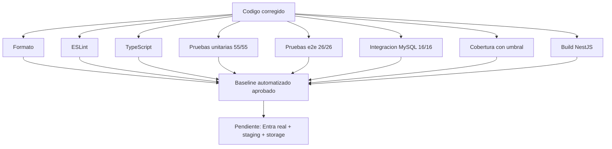

Ultima corrida de integracion (`npm run test:integration:coverage` contra Docker local):

| Indicador                      | Resultado                                      |
| ------------------------------ | ---------------------------------------------- |
| MySQL + Redis integration      | 18 passed                                      |
| Cobertura repositorios         | 70.06% lineas · 54.2% ramas · 69.11% funciones |
| `kapso.repository.ts`          | 84.07% lineas                                  |
| Cobertura migraciones          | 74.19% lineas                                  |
| Cobertura total de esa corrida | 71.95% lineas · 47% ramas · 72.8% funciones    |

Umbrales minimos bloqueantes de Jest (unitarias):

| Metrica    | Umbral global |
| ---------- | ------------- |
| Lineas     | 55%           |
| Statements | 55%           |
| Funciones  | 45%           |
| Branches   | 35%           |

### Criterio Final

| Dimension             | Antes | Ahora | Meta  |
| --------------------- | ----- | ----- | ----- |
| Nota global           | 4.5   | 8.5   | 10    |
| Seguridad             | 3.0   | 8.5   | 10    |
| Arquitectura          | 5.25  | 8.5   | 10    |
| Calidad interna       | 6.0   | 8.5   | 10    |
| Estrategia de pruebas | 4.5   | 8.5   | 10    |
| Pruebas ejecutadas    | 70/70 | 99/99 | 10/10 |

- Nota global = promedio simple: `(8.5 + 8.5 + 8.5 + 8.5) / 4 = 8.5`.
- Estrategia subio a 8.5 porque MySQL + Redis + AppModule real + CI quedan evidenciados.
- Para cerrar 10/10: consentimiento Entra real, migracion staging y storage compartido.

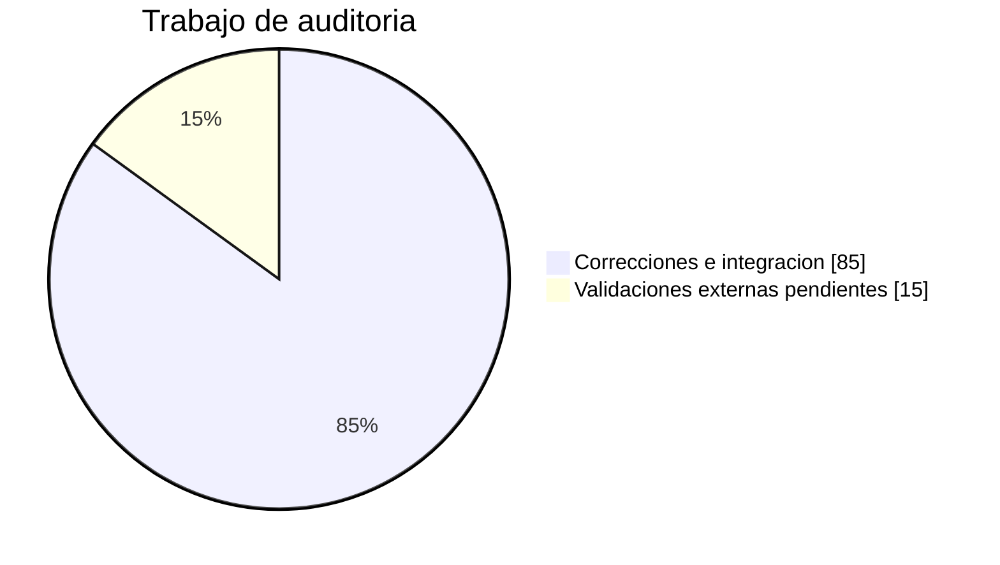
