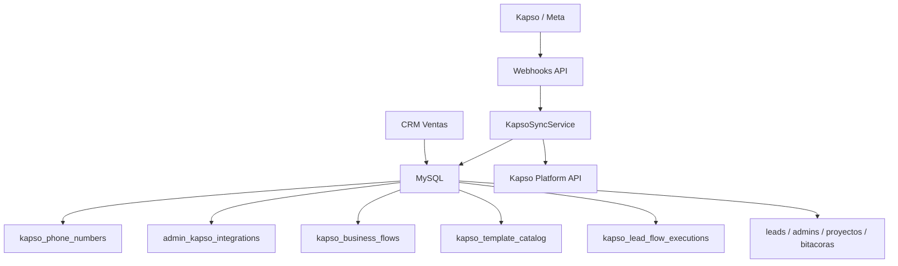
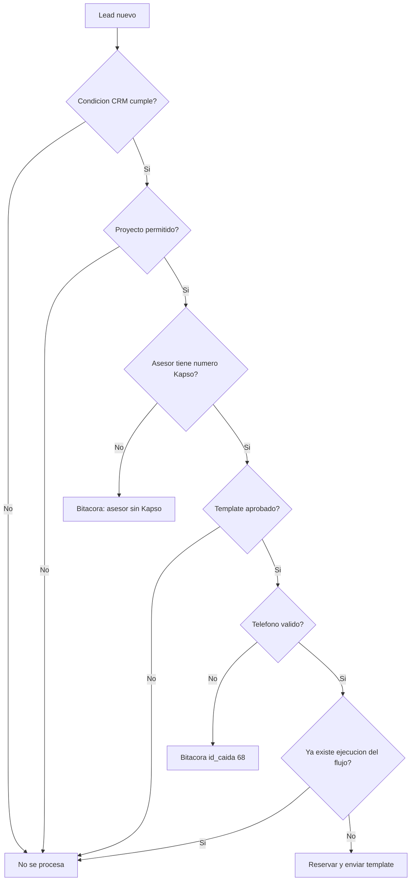
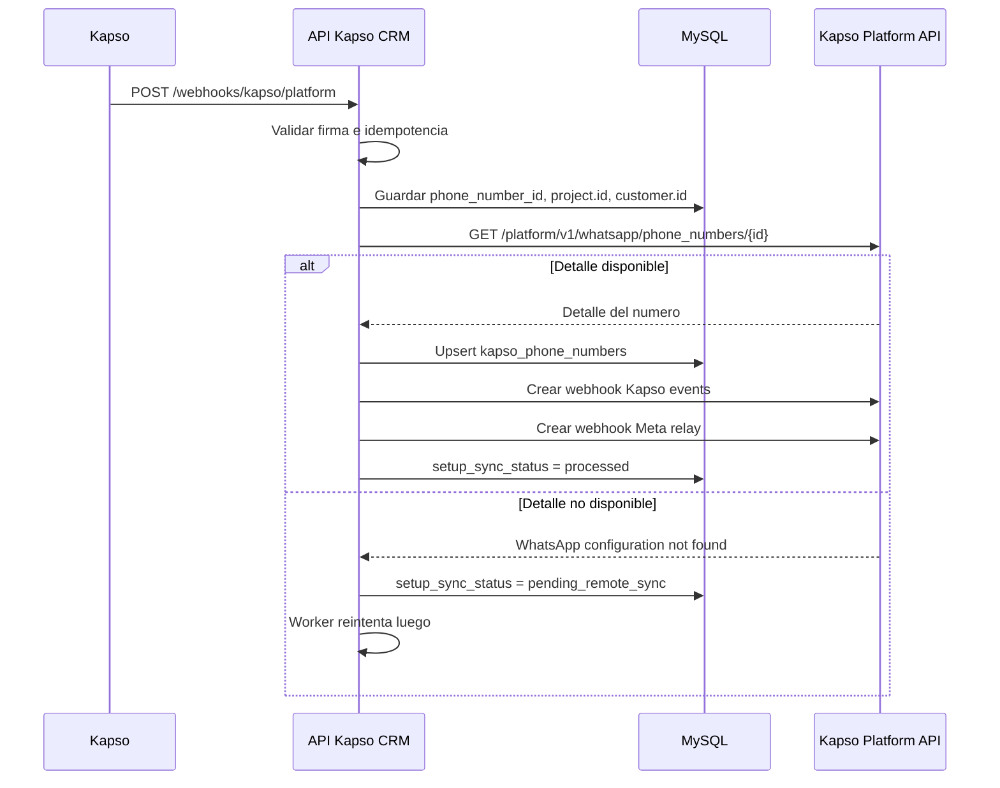
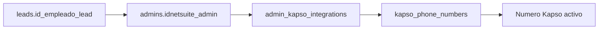
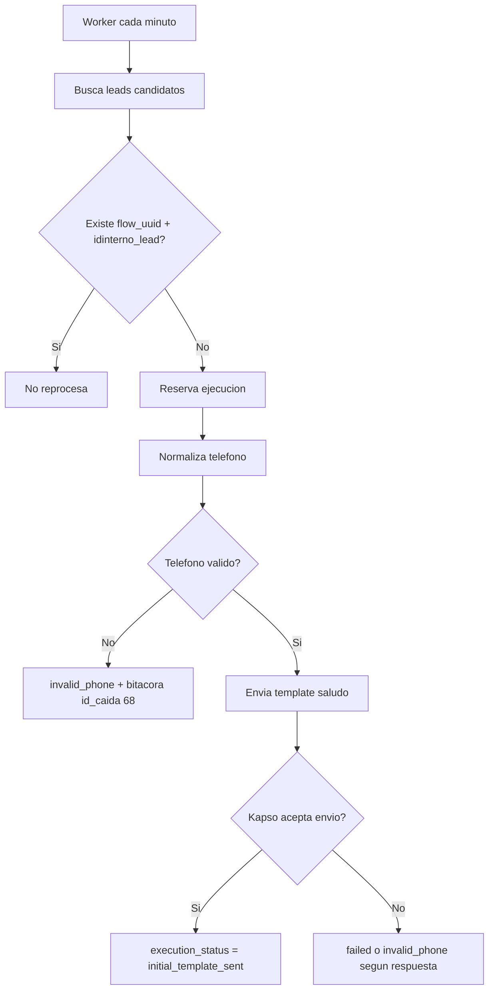
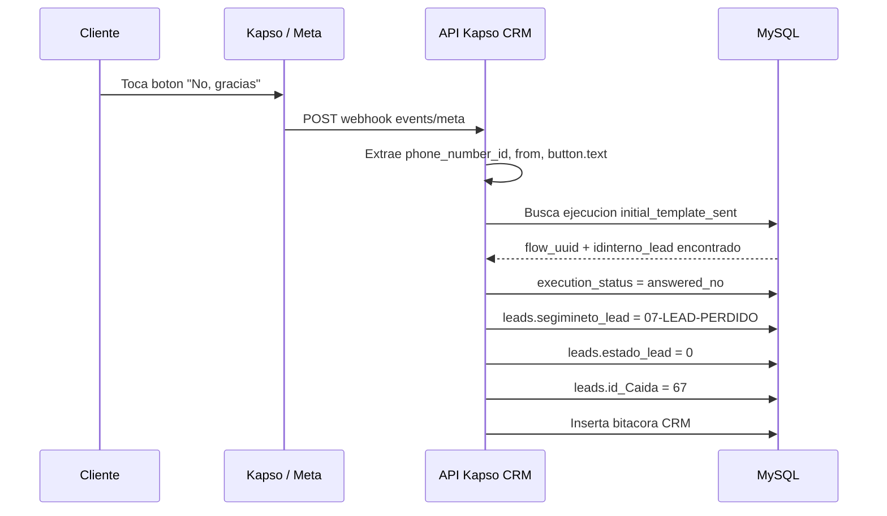
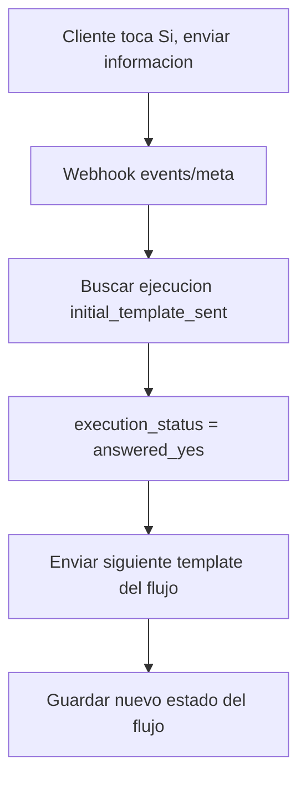
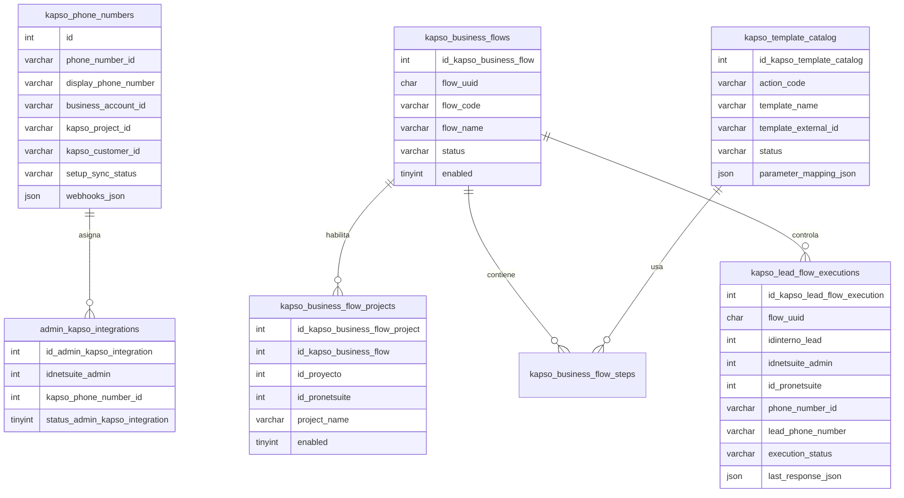

# API Kapso - CRM Ventas

API NestJS para conectar CRM Ventas con Kapso, sincronizar numeros de WhatsApp, asignar lineas Kapso a asesores y ejecutar flujos de templates por proyecto con control anti-repeticion.

## Tabla de Contenido

1. [Objetivo del Sistema](#objetivo-del-sistema)
2. [Estado Actual](#estado-actual)
3. [Tecnologia](#tecnologia)
4. [Como Correr](#como-correr)
5. [Variables de Entorno](#variables-de-entorno)
6. [Arquitectura General](#arquitectura-general)
7. [Modelo Operativo](#modelo-operativo)
8. [Flujos del Sistema](#flujos-del-sistema)
9. [Reglas de Negocio](#reglas-de-negocio)
10. [Modelo de Datos](#modelo-de-datos)
11. [Rutas Principales](#rutas-principales)
12. [Checklist Operativo](#checklist-operativo)
13. [Pendientes](#pendientes)

## Objetivo del Sistema

El sistema automatiza el primer contacto por WhatsApp para leads nuevos del CRM usando templates aprobados en Kapso/Meta.

La idea central es:

- tomar leads nuevos que cumplan la condicion definida por negocio;
- validar si el proyecto permite el flujo;
- validar si el asesor tiene una linea Kapso asignada;
- enviar el template inicial aprobado;
- registrar cada ejecucion para no repetir el mismo flujo sobre el mismo lead;
- procesar respuestas del cliente;
- registrar bitacoras CRM cuando el flujo no puede continuar o cuando el cliente responde negativamente.

## Estado Actual

### Listo

- Sincronizacion de numeros Kapso.
- Creacion y verificacion de webhooks Kapso events y Meta relay por numero.
- Webhook Platform para altas y bajas de numeros.
- Configuracion `Asesor -> Numero Kapso`.
- Catalogo local de templates Kapso.
- Flujo de negocio `Saludo inicial y seguimiento de leads`.
- Habilitacion de proyectos por flujo.
- Deteccion de leads candidatos.
- Control anti-repeticion con `flow_uuid + idinterno_lead`.
- Template inicial `saludo` registrado y aprobado.
- Mapeo del template `saludo`:
  - `{{1}} = leads.nombre_lead`
  - `{{2}} = admins.name_admin`
  - `{{3}} = leads.proyecto_lead`
- Procesamiento de boton `No, gracias`.
- Cambio del lead a perdido cuando responde `No, gracias`.
- Insercion de bitacora CRM para respuesta negativa.
- Validacion de telefono para evitar envios repetidos sobre numeros invalidos.

### En Proceso

- Envio real del siguiente template cuando el cliente responde `Si, enviar informacion`.
- Definicion de los siguientes templates del flujo segun el documento funcional.
- Regla final para detener el flujo por intervencion manual del asesor.

### No Implementado Todavia

- Vista detallada de trazabilidad por lead. Por ahora la trazabilidad queda en `bitacoras` y en `kapso_lead_flow_executions`.
- Automatizacion completa de todos los templates posteriores al saludo inicial.

## Tecnologia

| Tecnologia         | Uso                                     |
| ------------------ | --------------------------------------- |
| NestJS 11          | Framework API                           |
| TypeScript         | Lenguaje principal                      |
| TypeORM            | Acceso a MySQL                          |
| MySQL              | Base CRM Ventas                         |
| Kapso Platform API | Numeros, templates, webhooks y mensajes |
| Meta Webhooks      | Respuestas y eventos WhatsApp           |
| Jest               | Pruebas unitarias y e2e                 |
| libphonenumber-js  | Validacion y normalizacion de telefonos |
| BullMQ             | Base instalada para procesos asincronos |

## Como Correr

```bash
npm install
npm run migration:run
npm run start:dev
```

La API queda disponible en:

```text
http://localhost:8002/api/v1
```

### Comandos de Verificacion

```bash
npm run format:check
npm run lint
npm run typecheck
npm test
npm run test:e2e
npm run build
```

## Variables de Entorno

| Variable                          | Uso                                                         |
| --------------------------------- | ----------------------------------------------------------- |
| `PORT`                            | Puerto local. Normalmente `8002`.                           |
| `GLOBAL_PREFIX`                   | Prefijo API. Normalmente `api/v1`.                          |
| `KAPSO_BASE_URL`                  | URL base de Kapso Platform API.                             |
| `KAPSO_API_KEY`                   | API key default del proyecto Kapso.                         |
| `KAPSO_PROJECT_API_KEYS_JSON`     | Mapa `project.id -> apiKey` para proyectos Kapso multiples. |
| `KAPSO_PUBLIC_BASE_URL`           | URL publica usada por webhooks. Ejemplo: ngrok.             |
| `KAPSO_PLATFORM_WEBHOOK_SECRET`   | Secreto del webhook Platform.                               |
| `KAPSO_WHATSAPP_WEBHOOK_SECRET`   | Secreto del webhook WhatsApp/Kapso events.                  |
| `KAPSO_PENDING_SYNC_INTERVAL_MS`  | Intervalo del worker de sincronizacion de numeros.          |
| `KAPSO_LEAD_TEMPLATE_INTERVAL_MS` | Intervalo del worker de leads candidatos.                   |
| `MYSQL_*`                         | Credenciales y conexion hacia MySQL CRM Ventas.             |

## Arquitectura General



### Responsabilidades por Capa

| Capa         | Responsabilidad                                                          |
| ------------ | ------------------------------------------------------------------------ |
| Controllers  | REST, redirects de setup y recepcion de webhooks.                        |
| Services     | Orquestacion, workers, envio de templates y procesamiento de respuestas. |
| Repositories | Consultas y persistencia en MySQL.                                       |
| Entities     | Tablas locales de Kapso.                                                 |
| Common       | Constantes, tipos y helpers de dominio.                                  |

## Modelo Operativo

El API no debe enviar templates solo porque existe un lead. Debe pasar por estas validaciones:



## Flujos del Sistema

### Flujo 1: Onboarding de Numeros Kapso

Cuando Kapso crea o conecta un numero, el API lo guarda localmente y asegura los webhooks del numero.



Punto confirmado por Kapso:

```text
GET /platform/v1/whatsapp/phone_numbers/{phone_number_id}
es project-scoped.
```

Por eso se guarda `project.id` y se usa el API key del mismo proyecto que genero el setup link.

### Flujo 2: Configuracion Admin-Kapso

Define que numero Kapso puede usar cada asesor.



Reglas:

- Un asesor puede tener una o varias relaciones Admin-Kapso.
- El flujo solo usa relaciones activas.
- Si el asesor del lead no tiene numero Kapso activo, se registra bitacora y el flujo no continua.

### Flujo 3: Flujos de Negocio por Proyecto

Un flujo de negocio representa una idea completa, no una regla aislada.

Flujo actual:

| Campo           | Valor                                   |
| --------------- | --------------------------------------- |
| UUID            | `94d5c3b8-4b43-4c28-8c76-3d9eaf70ad01`  |
| Codigo          | `lead_initial_contact`                  |
| Nombre          | `Saludo inicial y seguimiento de leads` |
| Primer template | `saludo`                                |
| Estado esperado | `active` cuando opera                   |

Relacion de proyecto:

```text
leads.idproyecto_lead -> proyectos.id_ProNetsuite
```

Si un proyecto no esta habilitado en `kapso_business_flow_projects`, ningun lead de ese proyecto ejecuta el flujo.

### Flujo 4: Lead Candidato

Condicion actual:

```sql
leads.segimineto_lead = '01-LEAD-INTERESADO'
AND leads.whatsapp_template_contact_sent = 2
AND leads.estado_lead = 1
```

Adicionalmente:

- `id_empleado_lead` debe venir definido.
- `idinterno_lead` es el identificador operativo principal del lead.
- El lead no debe tener una ejecucion previa para el mismo `flow_uuid`.

### Flujo 5: Template Inicial `saludo`

Template creado y aprobado en Kapso/Meta.

| Campo                 | Valor                   |
| --------------------- | ----------------------- |
| Accion CRM            | `lead_initial_greeting` |
| Nombre Kapso          | `saludo`                |
| ID remoto             | `1004936342403599`      |
| Referencia Kapso      | `4108dccb`              |
| Idioma                | `es_ES`                 |
| Categoria             | `MARKETING`             |
| Estado local esperado | `approved`              |
| Parametros            | 3                       |

Texto:

```text
Hola {{1}}, soy {{2}}, asesor de {{3}}.

Vi que pediste informacion del proyecto.

Te parece bien si te comparto la informacion por este medio?
```

Mapeo:

| Parametro | Origen                |
| --------- | --------------------- |
| `{{1}}`   | `leads.nombre_lead`   |
| `{{2}}`   | `admins.name_admin`   |
| `{{3}}`   | `leads.proyecto_lead` |

Botones:

| Boton                    | Accion esperada                                    |
| ------------------------ | -------------------------------------------------- |
| `Si, enviar informacion` | Continuar al siguiente paso del flujo.             |
| `No, gracias`            | Pasar lead a perdido y cerrar flujo para ese lead. |

### Flujo 6: Envio Inicial



### Flujo 7: Respuesta `No, gracias`

Este flujo ya esta implementado para boton explicito.



Regla importante:

- Solo se procesa boton real `No, gracias`.
- Texto libre como `no`, `no gracias` o similares no marca perdido automaticamente.
- Esto evita falsos positivos cuando el cliente escribe texto ambiguo.

Actualizacion del lead:

| Campo             | Valor             |
| ----------------- | ----------------- |
| `segimineto_lead` | `07-LEAD-PERDIDO` |
| `estado_lead`     | `0`               |
| `id_Caida`        | `67`              |

Bitacora:

| Campo          | Valor                                                        |
| -------------- | ------------------------------------------------------------ |
| `id_lead_bit`  | `leads.idinterno_lead`                                       |
| `id_admin_bit` | `admins.idnetsuite_admin`                                    |
| `id_caida_bit` | `67`                                                         |
| `detalle_bit`  | Cliente indico que no desea recibir informacion por WhatsApp |
| `estado_bit`   | `No desea informacion`                                       |
| `estado_lead`  | `0`                                                          |

### Flujo 8: Respuesta `Si, enviar informacion`

Este es el siguiente bloque funcional pendiente.

La idea esperada:



Antes de implementarlo se debe definir:

- nombre del siguiente template;
- texto aprobado;
- parametros;
- reglas de cierre;
- si el asesor puede detener el flujo manualmente;
- que bitacora se debe crear por cada avance.

## Reglas de Negocio

### Identificadores Principales

| Dato      | Campo                                                     |
| --------- | --------------------------------------------------------- |
| Lead      | `leads.idinterno_lead`                                    |
| Asesor    | `admins.idnetsuite_admin`                                 |
| Proyecto  | `leads.idproyecto_lead -> proyectos.id_ProNetsuite`       |
| Flujo     | `kapso_business_flows.flow_uuid`                          |
| Numero    | `kapso_phone_numbers.phone_number_id`                     |
| Ejecucion | `kapso_lead_flow_executions.id_kapso_lead_flow_execution` |

### Anti-Repeticion

La tabla `kapso_lead_flow_executions` evita ciclos infinitos.

Clave funcional:

```text
flow_uuid + idinterno_lead
```

Si ya existe una ejecucion para ese lead y ese flujo, no se vuelve a iniciar.

### Estados de Ejecucion

| Estado                  | Significado                               |
| ----------------------- | ----------------------------------------- |
| `reserved`              | Lead reservado para envio.                |
| `initial_template_sent` | Template inicial enviado.                 |
| `answered_yes`          | Cliente acepto recibir informacion.       |
| `answered_no`           | Cliente rechazo informacion por WhatsApp. |
| `invalid_phone`         | Telefono invalido; no se reintenta.       |
| `manual_intervention`   | Asesor tomo control manual.               |
| `completed`             | Flujo terminado.                          |
| `failed`                | Error tecnico terminal.                   |

### Telefonos Invalidos

Cuando el telefono no es valido:

- no se llama a Kapso;
- no se modifica el estado comercial del lead;
- se inserta bitacora con `id_caida = 68`;
- la ejecucion queda como `invalid_phone`;
- no vuelve a ejecutarse el mismo flujo para ese lead.

Ejemplos:

| Valor CRM         | Resultado esperado |
| ----------------- | ------------------ |
| `87515938`        | `50687515938`      |
| `50687515938`     | `50687515938`      |
| `+506 8751 5938`  | `50687515938`      |
| `+1 720 353 5091` | `17203535091`      |
| `88888888`        | Invalido           |
| Texto o vacio     | Invalido           |

### Ventana de 24 Horas

Los templates aprobados pueden iniciar conversacion fuera de la ventana de 24 horas.

Una vez el cliente responde:

- se abre o renueva la ventana de conversacion;
- el sistema puede continuar con mensajes permitidos segun reglas de Meta/Kapso;
- se debe registrar el estado del flujo para no perder contexto.

## Modelo de Datos



### Tablas CRM Usadas

| Tabla       | Uso                                            |
| ----------- | ---------------------------------------------- |
| `leads`     | Fuente de leads y estado comercial.            |
| `admins`    | Datos del asesor y relacion con NetSuite.      |
| `proyectos` | Validacion de proyectos habilitados por flujo. |
| `bitacoras` | Trazabilidad operativa dentro del CRM.         |
| `caidas`    | Motivos comerciales de perdida o bloqueo.      |

## Rutas Principales

| Ruta                                                   | Proposito                                |
| ------------------------------------------------------ | ---------------------------------------- |
| `GET /api/v1/kapso/customers`                          | Lista clientes sincronizados localmente. |
| `GET /api/v1/kapso/phone-numbers`                      | Lista numeros Kapso locales.             |
| `GET /api/v1/kapso/templates/catalog`                  | Lista templates locales.                 |
| `GET /api/v1/kapso/projects/options`                   | Lista proyectos CRM para configuracion.  |
| `GET /api/v1/kapso/business-flows`                     | Lista flujos y proyectos permitidos.     |
| `POST /api/v1/kapso/business-flows/:flowUuid/projects` | Habilita un proyecto para un flujo.      |
| `POST /api/v1/kapso/bootstrap/sync`                    | Reconstruye estado local desde Kapso.    |
| `POST /api/v1/kapso/phone-numbers/:phoneNumberId/sync` | Reintenta sync de un numero.             |
| `GET /api/v1/kapso/setup/success`                      | Recibe redirect exitoso del setup link.  |
| `GET /api/v1/kapso/setup/failure`                      | Recibe redirect fallido del setup link.  |
| `POST /api/v1/webhooks/kapso/platform`                 | Webhook de altas/bajas de numeros.       |
| `POST /api/v1/webhooks/kapso/events`                   | Webhook Kapso events.                    |
| `POST /api/v1/webhooks/kapso/meta`                     | Webhook relay Meta.                      |
| `GET /api/v1/kapso/admin-integrations`                 | Lista asignaciones admin-Kapso.          |
| `POST /api/v1/kapso/admin-integrations`                | Crea asignacion admin-Kapso.             |

## Checklist Operativo

Antes de enviar templates, debe cumplirse:

- [ ] El numero existe en `kapso_phone_numbers`.
- [ ] Los webhooks Kapso y Meta existen para ese numero.
- [ ] El asesor tiene asignacion activa en `admin_kapso_integrations`.
- [ ] El flujo esta activo.
- [ ] El proyecto del lead esta permitido para ese flujo.
- [ ] El template `saludo` esta `approved`.
- [ ] El mapeo de parametros esta configurado.
- [ ] El telefono del lead es valido.
- [ ] No existe ejecucion previa para `flow_uuid + idinterno_lead`.

## Pendientes

### Siguiente Paso Recomendado

Implementar la continuacion cuando el cliente responde `Si, enviar informacion`.

Para hacerlo bien se necesita definir:

1. Template siguiente.
2. Texto aprobado por negocio.
3. Parametros del template.
4. Condicion para terminar el flujo.
5. Bitacora que debe quedar en CRM.
6. Regla de intervencion manual del asesor.

### Decisiones Pendientes de Negocio

- Que informacion exacta se envia despues del `Si`.
- En que punto se considera que el flujo termino.
- Que pasa si el cliente responde texto libre en vez de botones.
- Como se identificara que el asesor ya tomo control manual.
- Si el lead debe cambiar de estado por respuestas afirmativas o solo por respuestas negativas.
