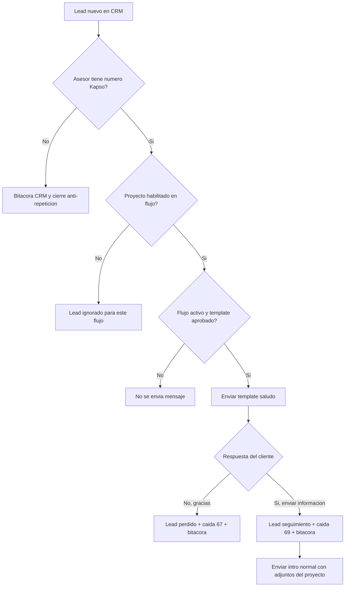
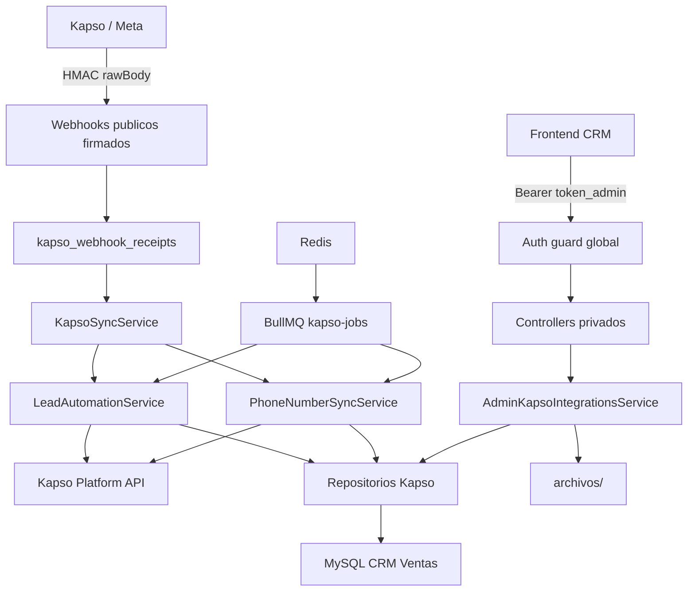
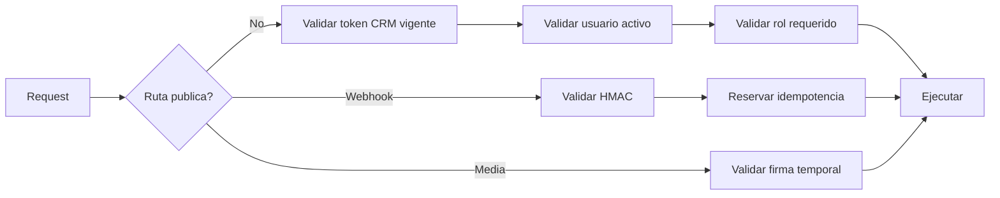
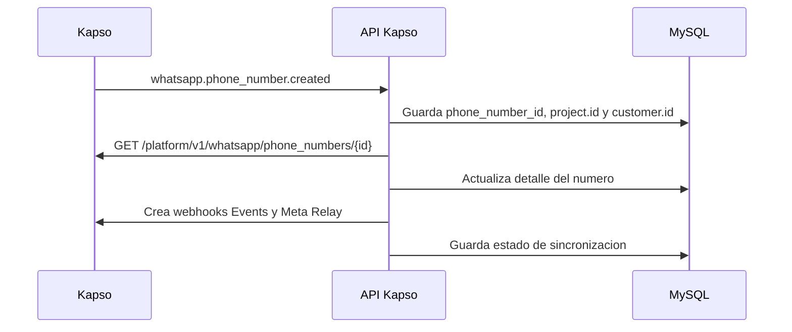
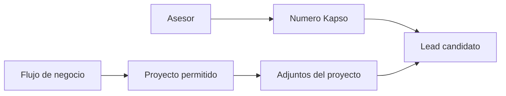
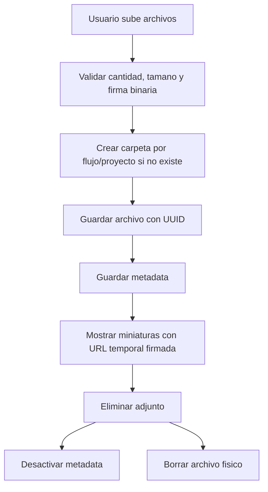
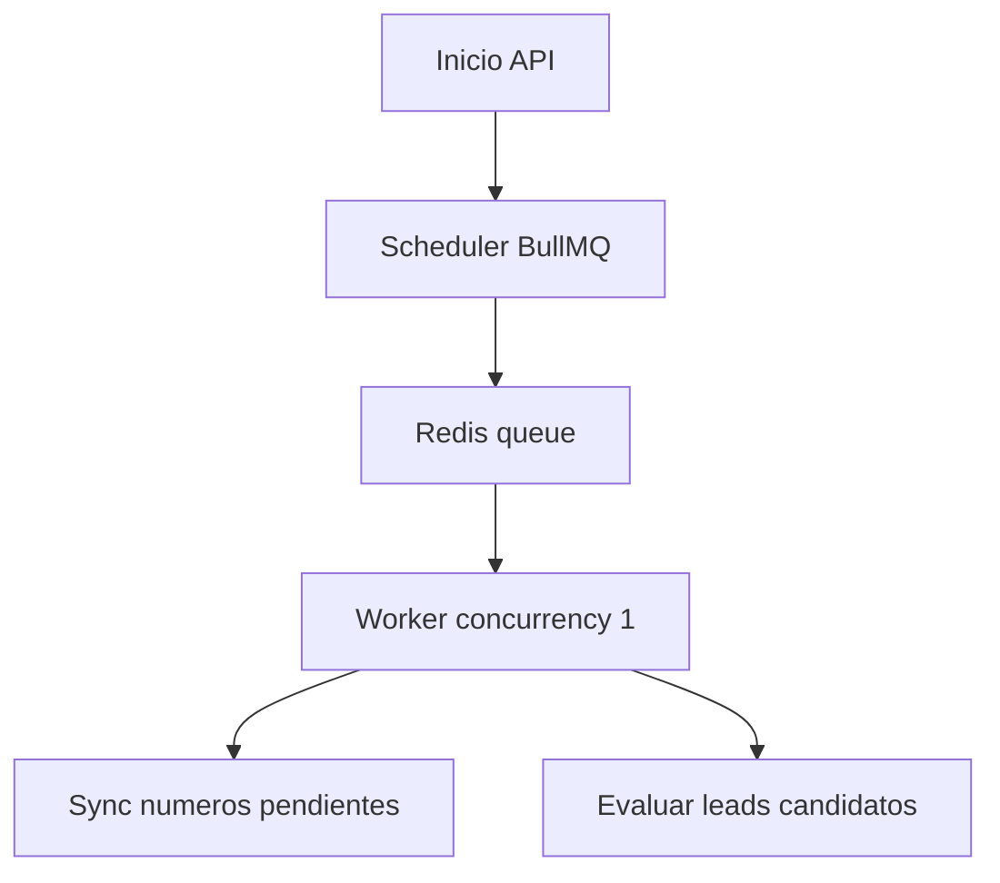
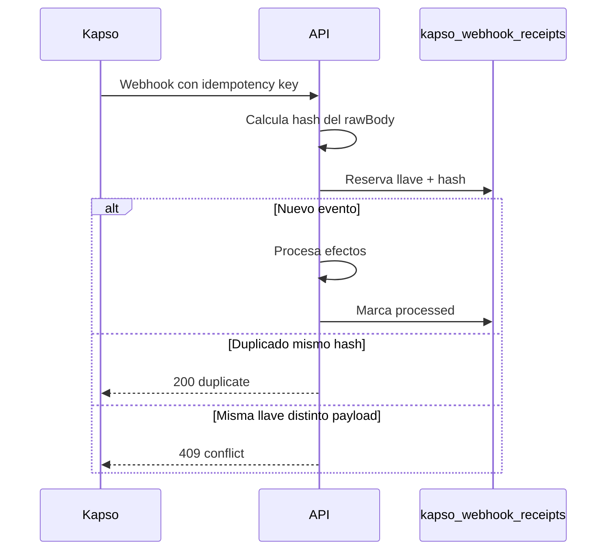
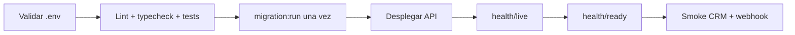

# API Kapso - CRM Ventas

API NestJS para integrar CRM Ventas con Kapso y automatizar el primer contacto por WhatsApp de leads nuevos.

El sistema no se limita a enviar mensajes. Administra numeros WhatsApp por asesor, habilita flujos por proyecto, controla respuestas del cliente, registra bitacoras CRM y evita reprocesar el mismo lead dentro del mismo flujo.

## Indice

1. [Resumen ejecutivo](#resumen-ejecutivo)
2. [Estado del proyecto](#estado-del-proyecto)
3. [Tecnologia](#tecnologia)
4. [Ejecucion local](#ejecucion-local)
5. [Arquitectura](#arquitectura)
6. [Seguridad](#seguridad)
7. [Flujo de negocio](#flujo-de-negocio)
8. [Configuracion CRM](#configuracion-crm)
9. [Adjuntos por proyecto](#adjuntos-por-proyecto)
10. [Modelo de datos](#modelo-de-datos)
11. [Jobs, idempotencia y concurrencia](#jobs-idempotencia-y-concurrencia)
12. [Operacion y despliegue](#operacion-y-despliegue)
13. [Endpoints principales](#endpoints-principales)
14. [Observabilidad](#observabilidad)
15. [Decisiones de arquitectura](#decisiones-de-arquitectura)
16. [Riesgos y deuda tecnica](#riesgos-y-deuda-tecnica)
17. [Preguntas frecuentes](#preguntas-frecuentes)
18. [Evidencia tecnica](#evidencia-tecnica)

## Resumen ejecutivo

El objetivo funcional es contactar automaticamente a un lead nuevo por WhatsApp, usando el numero Kapso asignado al asesor y respetando las reglas comerciales del proyecto.

Valor para ventas:

- Reduce el tiempo de primer contacto con leads nuevos.
- Evita depender de que el asesor escriba primero manualmente.
- Estandariza el mensaje inicial aprobado por Meta.
- Registra respuestas y decisiones en bitacora CRM.
- Permite activar el flujo solo por proyecto para una salida gradual.

Para que un lead pueda entrar al flujo debe cumplir:

- `leads.segimineto_lead = '01-LEAD-INTERESADO'`
- `leads.estado_lead = 1`
- `leads.whatsapp_template_contact_sent = 2`
- `leads.id_empleado_lead` debe existir y estar asignado a una linea Kapso activa.
- `leads.idproyecto_lead` debe estar habilitado para el flujo.
- El flujo debe estar activo.
- El template inicial `saludo` debe estar aprobado.

Resultado esperado:



## Estado del proyecto

### Implementado

- Sincronizacion de numeros Kapso por webhook Platform.
- Creacion automatica de webhooks por numero.
- Webhooks Kapso Events y Meta Relay con firma HMAC.
- Configuracion `Asesor -> Numero Kapso`.
- Configuracion `Flujo -> Proyecto permitido`.
- Activacion e inactivacion de flujos.
- Catalogo local del template `saludo`.
- Template `saludo` aprobado y sincronizable.
- Worker de leads candidatos.
- Envio del primer template `saludo`.
- Procesamiento de respuesta `No, gracias`.
- Procesamiento de respuesta `Si, enviar informacion`.
- Bitacoras CRM para respuestas y errores funcionales.
- Control anti-repeticion por `flow_uuid + idinterno_lead`.
- Validacion y normalizacion de telefonos.
- Adjuntos por proyecto para la intro normal.
- Carga multiple de imagenes/videos.
- Limpieza de adjuntos al eliminar archivo o retirar proyecto del flujo.
- URLs temporales firmadas para servir media.
- Jobs distribuidos con BullMQ y Redis.
- Health checks separados para liveness y readiness.
- Tests unitarios, e2e e integracion documentados.

### Pendiente funcional

- Definir el flujo posterior a la intro normal.
- Definir acciones para botones futuros como `Ver precios`, `Agendar visita` o `Hablar con asesor`.
- Formalizar como se detecta intervencion manual del asesor para detener la automatizacion.
- Validar en staging con datos reales antes de produccion completa.

### Pendiente operativo

- Ejecutar migraciones en staging.
- Confirmar variables finales de produccion.
- Definir storage compartido si habra mas de una replica.
- Ejecutar y guardar evidencia de rendimiento bajo carga real en staging.

## Tecnologia

| Tecnologia                | Uso                                          |
| ------------------------- | -------------------------------------------- |
| NestJS 11                 | API backend modular.                         |
| TypeScript                | Tipado y mantenibilidad.                     |
| TypeORM                   | Acceso a MySQL y migraciones.                |
| MySQL                     | Base CRM Ventas.                             |
| Kapso Platform API        | Numeros, templates, webhooks y mensajes.     |
| Meta/Kapso Webhooks       | Eventos de mensajes, respuestas y lifecycle. |
| BullMQ + Redis            | Jobs distribuidos y control de concurrencia. |
| Token CRM (`token_admin`) | Autenticacion oficial del frontend CRM.      |
| Multer                    | Carga de adjuntos.                           |
| libphonenumber-js         | Normalizacion de telefonos.                  |
| Jest                      | Unitarias, e2e e integracion.                |

## Ejecucion local

```bash
npm install
npm run start:dev
```

La API queda disponible en:

```text
http://localhost:8002/api/v1
```

Comandos principales:

```bash
npm run lint
npm run typecheck
npm test
npm run test:e2e
npm run build
```

Infra local de integracion:

```bash
npm run integration:up
npm run test:integration:coverage
npm run integration:down
```

Cuando Kapso debe llamar la maquina local se usa ngrok:

```bash
ngrok http 8002 --url nontransgressively-sequential-leif.ngrok-free.dev
```

## Arquitectura



### Responsabilidades principales

| Componente                        | Responsabilidad                                       |
| --------------------------------- | ----------------------------------------------------- |
| `KapsoWebhooksController`         | Recibe webhooks, valida firma y reserva idempotencia. |
| `KapsoSyncService`                | Fachada de sincronizacion y compatibilidad.           |
| `KapsoPhoneNumberSyncService`     | Sincroniza numeros, setup links y webhooks remotos.   |
| `KapsoLeadAutomationService`      | Evalua leads, envia mensajes y procesa respuestas.    |
| `AdminKapsoIntegrationsService`   | Administra asesores, flujos, proyectos y adjuntos.    |
| `KapsoLeadAutomationRepository`   | SQL transaccional del flujo comercial.                |
| `KapsoFlowProjectMediaRepository` | Flujos, proyectos permitidos y media.                 |
| `KapsoPlatformApiService`         | Cliente HTTP hacia Kapso.                             |
| `KapsoMediaUrlSignerService`      | URLs temporales firmadas para adjuntos.               |

### Estructura del modulo

```text
src/modules/kapso/
  common/
  controllers/
  dto/
  entities/
  repositories/
  services/
```

## Seguridad

La API es privada por defecto. Solo son publicos los endpoints que deben ser llamados por Kapso, Meta, health checks o redirecciones de setup.



| Superficie                | Control                                             |
| ------------------------- | --------------------------------------------------- |
| Configuracion Admin-Kapso | Bearer token + usuario activo + rol administrativo. |
| Webhooks Kapso/Meta       | Firma HMAC sobre `rawBody` + idempotencia durable.  |
| Media                     | URL temporal firmada con expiracion.                |
| Setup redirects           | Publicos, con salida HTML escapada.                 |
| Health checks             | Publicos para monitoreo.                            |

El frontend CRM actual reutiliza `token_admin`; esa es la autenticacion oficial vigente. Microsoft Entra queda soportado como alternativa futura solo si el tenant expone y consiente un scope dedicado para esta API.

## Flujo de negocio

### 1. Onboarding del numero



Punto clave confirmado por Kapso:

```text
GET /platform/v1/whatsapp/phone_numbers/{phone_number_id}
es project-scoped.
```

Por eso el API guarda `project.id` y usa la API key del mismo proyecto mediante `KAPSO_PROJECT_API_KEYS_JSON`.

### 2. Candidato de lead

El worker evalua leads nuevos cada minuto, coordinado por BullMQ para no duplicar procesamiento entre instancias.

```sql
segimineto_lead = '01-LEAD-INTERESADO'
estado_lead = 1
whatsapp_template_contact_sent = 2
```

Luego valida:

1. Telefono valido.
2. Asesor asignado a Kapso.
3. Proyecto habilitado en el flujo.
4. Flujo activo.
5. Template inicial aprobado.
6. Sin ejecucion previa terminal para ese `flow_uuid + idinterno_lead`.

### 3. Template inicial `saludo`

El template `saludo` usa parametros posicionales:

| Parametro | Valor CRM             |
| --------- | --------------------- |
| `{{1}}`   | `leads.nombre_lead`   |
| `{{2}}`   | `admins.name_admin`   |
| `{{3}}`   | `leads.proyecto_lead` |

Botones esperados:

- `Si, enviar informacion`
- `No, gracias`

### 4. Respuesta negativa

Si el cliente responde `No, gracias`, el flujo queda cerrado y el lead se actualiza:

```text
segimineto_lead = 07-LEAD-PERDIDO
estado_lead = 0
id_Caida = 67
```

Bitacora:

```text
id_lead_bit = idinterno_lead
id_admin_bit = idnetsuite_admin
id_caida_bit = 67
detalle_bit = Cliente rechazo informacion inicial por WhatsApp.
```

### 5. Respuesta positiva

Si el cliente responde `Si, enviar informacion`, el lead pasa a seguimiento:

```text
segimineto_lead = 08-LEAD-SEGUIMIENTO
accion_lead = 6
whatsapp_template_contact_sent = 0
```

Bitacora:

```text
id_lead_bit = idinterno_lead
id_admin_bit = idnetsuite_admin
id_caida_bit = 69
detalle_bit = Cliente acepto recibir informacion por WhatsApp.
```

Despues se envia la intro normal con texto y adjuntos del proyecto si existen.

## Configuracion CRM

La vista `Configuracion Admin-Kapso` tiene dos responsabilidades:

1. Asignar asesores a numeros Kapso.
2. Habilitar proyectos dentro de un flujo.



### Asesores y numeros

Relaciones principales:

```text
leads.id_empleado_lead -> admins.idnetsuite_admin
admins.idnetsuite_admin -> admin_kapso_integrations.idnetsuite_admin
admin_kapso_integrations.id_kapso_phone_number -> kapso_phone_numbers.id_kapso_phone_number
```

### Flujos por proyecto

El proyecto se valida por NetSuite:

```text
leads.idproyecto_lead -> proyectos.id_ProNetsuite
proyectos.id_ProNetsuite -> kapso_business_flow_projects.id_proyecto_netsuite
```

Si se quita un proyecto del flujo, el API limpia:

- relacion proyecto-flujo;
- metadata de adjuntos;
- carpeta fisica `archivos/{flow_uuid}/proyectos/{idProyectoNetsuite-*}`.

No borra leads, ejecuciones historicas ni bitacoras CRM.

## Adjuntos por proyecto

Los adjuntos pertenecen a un flujo y a un proyecto especifico.

```text
archivos/{flow_uuid}/proyectos/{idProyectoNetsuite-nombre-proyecto}/
```

Cada archivo se guarda con UUID para evitar colisiones y permitir borrado seguro:

```text
archivos/94d5c3b8-.../proyectos/38-andira/4b394e42-...jpg
```



Si un archivo fisico ya no existe, el API no debe romper la vista. Desactiva la metadata obsoleta y deja de devolver esa referencia.

## Modelo de datos

### Tablas Kapso principales

| Tabla                          | Uso                                                                |
| ------------------------------ | ------------------------------------------------------------------ |
| `kapso_phone_numbers`          | Numero Kapso conectado, WABA, config id, project id y customer id. |
| `admin_kapso_integrations`     | Relacion entre asesor CRM y numero Kapso.                          |
| `kapso_business_flows`         | Flujo de negocio configurable.                                     |
| `kapso_business_flow_projects` | Proyectos habilitados por flujo.                                   |
| `kapso_template_catalog`       | Catalogo local de templates aprobados/sincronizados.               |
| `kapso_flow_project_media`     | Metadata de adjuntos por flujo/proyecto.                           |
| `kapso_lead_flow_executions`   | Estado anti-repeticion por lead y flujo.                           |
| `kapso_webhook_receipts`       | Idempotencia durable de webhooks.                                  |

### Tablas CRM usadas

| Tabla       | Campos clave                                                                                                                                  |
| ----------- | --------------------------------------------------------------------------------------------------------------------------------------------- |
| `leads`     | `idinterno_lead`, `id_empleado_lead`, `idproyecto_lead`, `telefono_lead`, `segimineto_lead`, `estado_lead`, `whatsapp_template_contact_sent`. |
| `admins`    | `idnetsuite_admin`, `name_admin`, `email_admin`, `id_rol_admin`, `status_admin`, `token_admin`.                                               |
| `proyectos` | `id_ProNetsuite`, `Nombre_proyecto`, `estado_proyecto`.                                                                                       |
| `bitacoras` | Registro operacional visible en CRM.                                                                                                          |
| `caidas`    | Motivos comerciales usados para clasificar acciones.                                                                                          |

### Caidas usadas

| ID   | Uso                                               |
| ---- | ------------------------------------------------- |
| `67` | Cliente rechazo informacion inicial por WhatsApp. |
| `68` | Numero de telefono no valido.                     |
| `69` | Cliente acepto recibir informacion por WhatsApp.  |

## Jobs, idempotencia y concurrencia

BullMQ reemplaza timers locales para evitar ejecuciones duplicadas cuando existan varias instancias.
La concurrencia inicial es `1` de forma intencional: prioriza orden e idempotencia mientras se mide volumen real. Si el queue lag crece o la sincronizacion de numeros bloquea leads, el siguiente paso es separar colas por responsabilidad.



### Idempotencia de webhooks



## Operacion y despliegue

### Variables criticas

| Variable                        | Uso                                                              |
| ------------------------------- | ---------------------------------------------------------------- |
| `PORT`                          | Puerto de API. Normalmente `8002`.                               |
| `API_PREFIX`                    | Prefijo. Normalmente `api/v1`.                                   |
| `CRM_JWT_SECRET`                | Valida `token_admin` del CRM.                                    |
| `ENTRA_ALLOWED_CLIENT_IDS`      | Clientes Entra autorizados. Requerido si Entra esta configurado. |
| `KAPSO_API_BASE_URL`            | URL base de Kapso Platform API.                                  |
| `KAPSO_API_KEY`                 | API key por defecto.                                             |
| `KAPSO_PROJECT_API_KEYS_JSON`   | Mapa `project.id -> apiKey`.                                     |
| `KAPSO_PUBLIC_BASE_URL`         | URL publica para webhooks/media.                                 |
| `KAPSO_PLATFORM_WEBHOOK_SECRET` | Secreto HMAC Platform.                                           |
| `KAPSO_WHATSAPP_WEBHOOK_SECRET` | Secreto HMAC WhatsApp/Meta.                                      |
| `KAPSO_MEDIA_STORAGE_PATH`      | Ruta local de adjuntos.                                          |
| `KAPSO_MEDIA_SIGNING_SECRET`    | Firma URLs temporales.                                           |
| `MYSQL_*`                       | Conexion a CRM Ventas.                                           |
| `REDIS_*`                       | Conexion a Redis BullMQ.                                         |

### Checklist de despliegue



- `MYSQL_MIGRATIONS_RUN=false` en runtime.
- Ejecutar `npm run migration:run` como paso controlado del release.
- Redis disponible antes de levantar workers.
- `KAPSO_PUBLIC_BASE_URL` debe ser publico si Kapso descarga adjuntos.
- Si hay mas de una replica, `archivos/` debe ser volumen compartido o migrarse a storage de objetos.

### Verificacion

```bash
npm run format:check
npm run lint
npm run typecheck
npm test
npm run test:e2e
npm run test:integration:coverage
npm run build
npm audit --omit=dev
```

## Endpoints principales

| Metodo   | Ruta                                                                | Proposito                                      |
| -------- | ------------------------------------------------------------------- | ---------------------------------------------- |
| `GET`    | `/api/v1/kapso/admin-integrations/options`                          | Opciones para configurar asesores y numeros.   |
| `GET`    | `/api/v1/kapso/admin-integrations`                                  | Lista relaciones Admin-Kapso.                  |
| `POST`   | `/api/v1/kapso/admin-integrations`                                  | Crea o actualiza relacion Admin-Kapso.         |
| `GET`    | `/api/v1/kapso/business-flows`                                      | Lista flujos, proyectos permitidos y adjuntos. |
| `POST`   | `/api/v1/kapso/business-flows/:flowUuid/projects`                   | Habilita proyecto en flujo.                    |
| `DELETE` | `/api/v1/kapso/business-flows/:flowUuid/projects/:idProyecto`       | Retira proyecto, metadata y carpeta fisica.    |
| `PATCH`  | `/api/v1/kapso/business-flows/:flowUuid/status`                     | Activa o inactiva flujo.                       |
| `POST`   | `/api/v1/kapso/business-flows/:flowUuid/projects/:idProyecto/media` | Sube adjuntos.                                 |
| `DELETE` | `/api/v1/kapso/flow-project-media/:id`                              | Retira un adjunto.                             |
| `POST`   | `/api/v1/webhooks/kapso/platform`                                   | Webhook lifecycle de Kapso.                    |
| `POST`   | `/api/v1/webhooks/kapso/events`                                     | Webhook de mensajes/eventos WhatsApp.          |
| `POST`   | `/api/v1/webhooks/kapso/meta`                                       | Relay de payload Meta.                         |
| `GET`    | `/api/v1/health/live`                                               | Liveness.                                      |
| `GET`    | `/api/v1/health/ready`                                              | Readiness MySQL + Redis.                       |

## Observabilidad

Los logs buscan explicar decisiones del motor sin exponer PII.

| Evento            | Log esperado                                           |
| ----------------- | ------------------------------------------------------ |
| Lead candidato    | `Lead template candidate payload` con PII redactada.   |
| Lead omitido      | `reason=...` para explicar por que no se envio.        |
| Envio saludo      | Payload resumido y respuesta de Kapso.                 |
| Respuesta cliente | Clasificacion `answered_yes`, `answered_no` o ambigua. |
| Intro normal      | Envio de texto, media y respuesta Kapso.               |
| Webhook duplicado | Estado duplicate/idempotency.                          |
| Error Kapso       | Metodo, ruta, status y resumen seguro.                 |

No se imprimen API keys, tokens, secretos, telefonos completos, correos ni contenido sensible.

## Decisiones de arquitectura

El resumen esta aqui para lectura rapida. El detalle ADR esta en [docs/DECISIONES_ARQUITECTURA.md](docs/DECISIONES_ARQUITECTURA.md).

| Decision                            | Motivo                                                                       | Alternativa descartada                          |
| ----------------------------------- | ---------------------------------------------------------------------------- | ----------------------------------------------- |
| BullMQ + Redis                      | Coordina jobs entre instancias y evita timers duplicados.                    | `setInterval` por instancia.                    |
| MySQL como fuente CRM               | El CRM ya opera sobre MySQL y las bitacoras viven ahi.                       | Base paralela sin sincronizacion.               |
| Repository pattern                  | Aisla SQL complejo y facilita pruebas de servicios.                          | SQL directo en controllers/services.            |
| Template para saludo                | Permite iniciar conversacion fuera de ventana de 24 horas.                   | Mensaje normal, no permitido si no hay ventana. |
| Intro como mensaje normal           | Despues de respuesta positiva ya hay ventana; permite adjuntos por proyecto. | Un template por proyecto/adjunto.               |
| Filesystem local para primera etapa | Rapido para desarrollo y validacion de negocio.                              | S3/storage compartido inmediato.                |
| URLs HMAC temporales                | Evita exponer archivos permanentes.                                          | URLs publicas fijas.                            |
| Idempotencia en MySQL               | Persistente y auditable ante reintentos de webhook.                          | Memoria local.                                  |

## Riesgos y deuda tecnica

| Riesgo                              | Impacto                                                        | Mitigacion actual                    | Cierre recomendado                             |
| ----------------------------------- | -------------------------------------------------------------- | ------------------------------------ | ---------------------------------------------- |
| Storage local                       | Varias replicas pueden no ver los mismos adjuntos.             | Una instancia o volumen compartido.  | Migrar a S3, Azure Blob o storage compartido.  |
| Texto libre ambiguo                 | Puede interpretar mal intenciones del cliente.                 | Solo procesa botones o texto exacto. | Motor de clasificacion con revision humana.    |
| Intervencion manual no formalizada  | El bot podria continuar cuando el asesor ya intervino.         | Pendiente controlado.                | Definir evento/regla CRM para detener flujo.   |
| Consentimiento Entra incompleto     | Tokens Entra puros pueden fallar si el tenant no expone scope. | Reuso de `token_admin` CRM.          | Configurar scope y consentimiento si se migra. |
| Rendimiento no medido en carga real | No hay RPS/latencia productiva documentada.                    | Jobs con concurrencia controlada.    | Prueba de carga sobre staging.                 |

## Preguntas frecuentes

### Por que el template no se crea por numero?

Porque WhatsApp asocia los templates al Business Account. Si los numeros comparten Business Account, pueden reutilizar el mismo template aprobado.

### Por que no se envia nada si el flujo esta inactivo?

Porque `kapso_business_flows.enabled = 0` bloquea el worker. Es una forma segura de pausar la automatizacion sin borrar configuracion.

### Como se evita que un lead entre en ciclo infinito?

Con `kapso_lead_flow_executions`, usando `flow_uuid + idinterno_lead`. Cada lead conserva su estado dentro del flujo y no se reprocesa si ya llego a un estado terminal.

### Que pasa si el telefono no es valido?

No se llama a Kapso. Se registra bitacora con caida `68` y la ejecucion queda cerrada para ese flujo.

### Que pasa si el cliente responde texto largo?

No se interpreta automaticamente. Solo se procesan botones o textos exactos equivalentes a `Si, enviar informacion` y `No, gracias`.

### Que pasa si quito un proyecto del flujo?

Se elimina la relacion proyecto-flujo, la metadata de adjuntos y la carpeta fisica del proyecto dentro del flujo. No se borran leads, ejecuciones historicas ni bitacoras.

### Que falta para considerar el flujo completo del PDF cerrado?

Falta definir que ocurre despues de la intro normal: acciones, botones siguientes, bitacoras, estados terminales y regla formal de interrupcion manual del asesor.

## Evidencia registrada

La evidencia completa esta separada para no convertir el README en un informe infinito:

- [docs/EVIDENCIA_TECNICA.md](docs/EVIDENCIA_TECNICA.md): comandos, matriz codigo-comportamiento, KPI y criterio honesto de cierre.
- [docs/DECISIONES_ARQUITECTURA.md](docs/DECISIONES_ARQUITECTURA.md): decisiones ADR, alternativas descartadas y riesgos.
- [docs/PRUEBAS_RENDIMIENTO.md](docs/PRUEBAS_RENDIMIENTO.md): smoke test de performance, variables y escenarios de carga.
- [docs/RUNBOOK_OPERACION.md](docs/RUNBOOK_OPERACION.md): diagnostico operativo para fallos Kapso, Redis, MySQL, media y webhooks.

| Area              | Evidencia                                                                       |
| ----------------- | ------------------------------------------------------------------------------- |
| Unitarias y e2e   | Suite Jest documentada en `test/`.                                              |
| Integracion MySQL | Schema efimero para migraciones y repositorios.                                 |
| Redis/BullMQ      | Jobs distribuidos y readiness Redis.                                            |
| Seguridad         | HMAC webhooks, auth global, media firmada y rate limit.                         |
| Auditoria         | Correcciones aplicadas sobre auth, idempotencia, workers, media y repositorios. |
| Rendimiento       | Smoke local 2026-07-22: 50 requests, 0 fallos, 78.80 RPS y p95 184.33 ms.       |
| CI/integracion    | `test:integration:coverage`: 2 suites, 18 tests, 70.65% lineas en repos/migs.   |

### Ruta verificable para cerrar 10/10

| Frente            | Evidencia que debe existir                                                          | Estado esperado antes de produccion completa                      |
| ----------------- | ----------------------------------------------------------------------------------- | ----------------------------------------------------------------- |
| CI/CD             | Workflow verde en `api-kapso` con formato, lint, typecheck, unit, e2e, integracion. | Ningun PR o push relevante puede quedar con `verify` fallando.    |
| Staging           | Migraciones ejecutadas en base aislada, con respaldo y rollback probado.            | Evidencia guardada en release notes o ticket tecnico.             |
| E2E real          | Lead controlado recibe `saludo`, responde `Si`/`No`, crea bitacora y no reprocesa.  | Resultado validado contra CRM y Kapso reales.                     |
| Performance       | Smoke/load test con endpoints protegidos y lotes representativos.                   | p95, p99, RPS, errores, duracion worker y queue lag documentados. |
| Operacion         | Runbook para fallos Kapso, Redis, MySQL, media, tokens y webhooks duplicados.       | Otro desarrollador puede diagnosticar sin depender del autor.     |
| Liderazgo tecnico | ADRs, checklist de handoff y criterios de revision claros para nuevos cambios.      | El modulo puede ser mantenido y extendido por el equipo.          |

Ultima meta documentada:

```text
Calidad objetivo: 10/10
Estado verificable actual: alto, pero dependiente de staging, prueba de carga real y storage compartido para cierre total. Entra no bloquea el flujo actual porque el contrato oficial vigente es `token_admin`.
```

Nota operativa: no se ejecuto migracion en staging porque no existe una configuracion `STAGING_*` aislada validada. La base actual no debe usarse como staging para demostrar cierre productivo.
