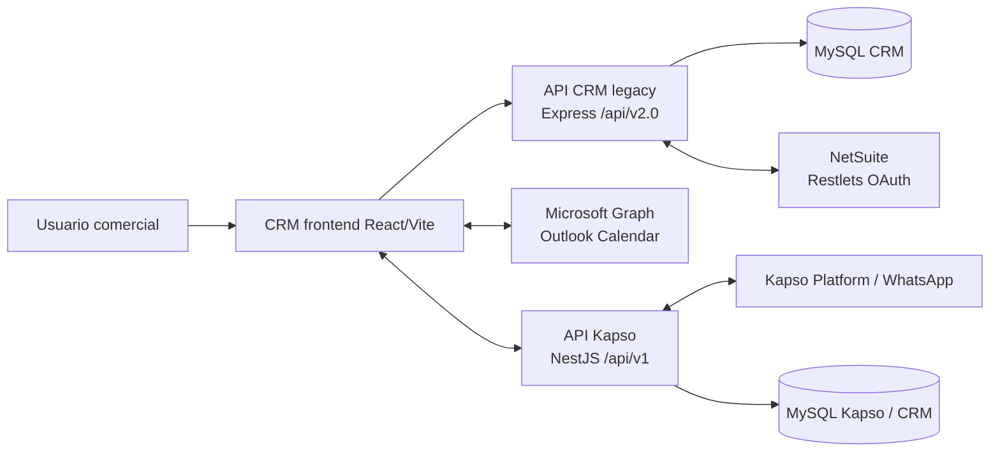

# CRM Ventas — documentación de primera fase

> **Estado:** avance de primera fase; el contenido se actualizará conforme se validen producción, NetSuite y las reglas operativas con las personas responsables.
>
> **Última modificación:** 2026-07-09 (jueves)
>
> **Repositorio:** [roccacr/CRM_VENTAS — rama Documentacion](https://github.com/roccacr/CRM_VENTAS/tree/Documentacion)

## Objetivo de esta entrega

Esta primera fase ordena lo que hoy puede comprobarse directamente en el código del CRM Ventas, su API legacy, el frontend de producción y la API de Kapso. El objetivo es que cualquier lector pueda entender:

- qué hace el CRM y cuáles son sus módulos;
- cómo se conecta con NetSuite, MySQL, Outlook/Microsoft Graph y Kapso;
- qué registros consulta, crea o actualiza cada integración;
- qué información se conserva en el CRM y qué información permanece en el ERP;
- cómo seguir el proceso comercial desde un lead hasta una orden de venta;
- cómo operar los módulos principales y diagnosticar los problemas más comunes.

## Índice navegable

| Sección | Contenido | Estado |
|---|---|---|
| [Alcance y pendientes](./00-alcance-y-pendientes.md) | Criterios de la primera fase, fuentes revisadas, supuestos y próximos pasos. | En avance |
| [01 — NetSuite](./01-netsuite/README.md) | Integración, Restlets, registros, frecuencias y matriz CRM vs. ERP. | En avance |
| [02 — API CRM](./02-api-crm/README.md) | Arquitectura de la API legacy, seguridad, contrato común, endpoints y tareas programadas. | En avance |
| [03 — CRM frontend y Kapso](./03-crm-frontend-kapso/README.md) | Arquitectura del frontend, navegación, Redux, API Kapso y sincronización WhatsApp. | En avance |
| [04 — Manual de usuario](./04-manual-usuario/README.md) | Manual operativo, proceso de ventas, estados, acciones y solución de problemas. | En avance |

## Mapa rápido del sistema

## Cómo leer los niveles de certeza

| Marca | Significado |
|---|---|
| **Comprobado en código** | Está explícito en rutas, modelos, entidades, migraciones, configuraciones o componentes revisados. |
| **Inferido** | Se deduce de nombres, IDs, payloads y joins, pero debe confirmarse con el Restlet, búsqueda guardada o configuración de NetSuite correspondiente. |
| **Pendiente de validar** | Requiere prueba controlada en producción, revisión con el dueño del proceso o acceso a la configuración externa. |

## Fuentes revisadas

La documentación se construyó a partir de estas copias locales, sin copiar secretos ni datos de clientes:

- `CRM_VENTAS BACKEND`: `src/AppCrmVentas.js`, `src/routes/idpRoutes.js`, modelos de leads, oportunidades, estimaciones, expedientes, órdenes de venta, calendarios, autenticación y conexión a MySQL.
- `produccion`: `src/api`, `src/app`, `src/store`, `src/auth`, `src/routers` y `package.json`.
- `API_Kapso`: controladores, servicios, repositorios, entidades, DTOs, configuración, migraciones y pruebas.
- `respaldo bd.sql`: únicamente la definición estructural de tablas utilizada para completar la matriz de datos; no se documentan los registros contenidos en el respaldo.

## Lectura ejecutiva

1. El CRM mantiene el contexto comercial y operativo en MySQL: leads, bitácora, oportunidades, expedientes, estimaciones, órdenes de venta, eventos y datos auxiliares.
2. NetSuite es el sistema externo de transacciones y maestros comerciales; la API CRM lo consulta o actualiza principalmente bajo demanda desde acciones del usuario.
3. No se encontró un cron general que descargue periódicamente todos los registros de NetSuite. Los cron observados trabajan sobre MySQL, estados comerciales, correos y calendarios.
4. Kapso tiene una API NestJS dedicada. Su sincronización se dispara por bootstrap manual, setup, webhooks de plataforma y un worker que reintenta filas pendientes.
5. Hay campos e IDs comunes entre CRM y NetSuite, pero el mapeo 1:1 de todos los campos necesita validarse contra los Restlets y búsquedas guardadas de NetSuite; esa limitación queda señalada en la sección de pendientes.

## Enlaces publicados

Después del push, la carpeta se podrá revisar directamente desde la rama [Documentacion](https://github.com/roccacr/CRM_VENTAS/tree/Documentacion). El índice de arriba mantiene enlaces relativos para lectura local y en GitHub.

## Regla de mantenimiento

Cada actualización debe conservar:

- la fecha de última modificación;
- la fuente del dato y su nivel de certeza;
- los cambios en rutas, modelos, tablas, payloads o frecuencias;
- una lista de pendientes cerrados y pendientes nuevos;
- ejemplos sin tokens, contraseñas, API keys, JWT, teléfonos o datos personales reales.
