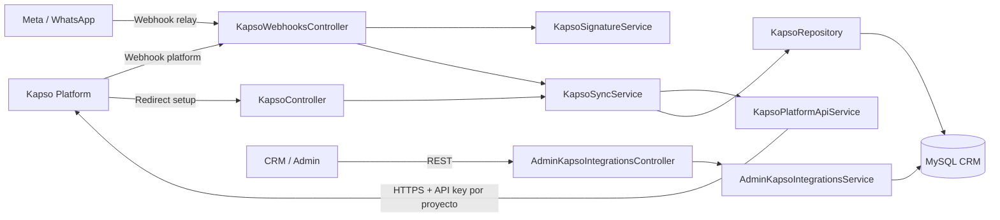
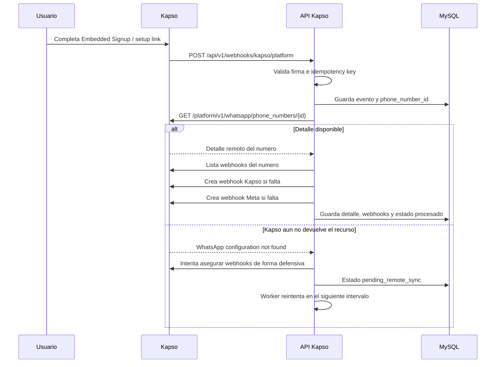
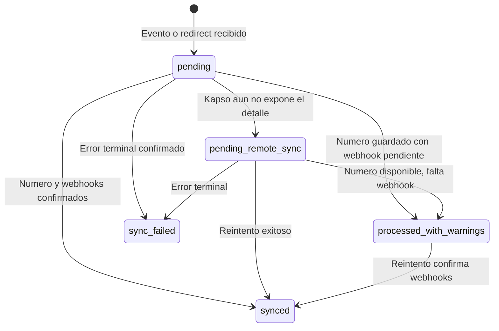
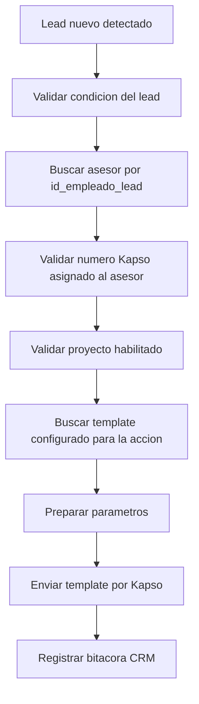
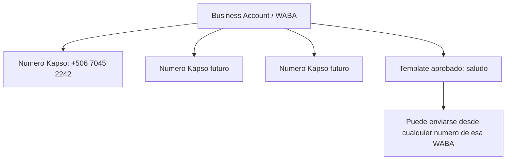
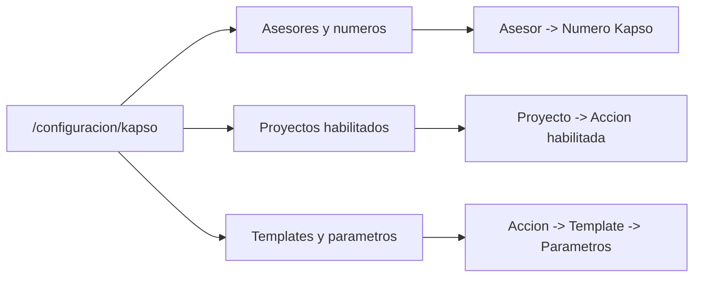
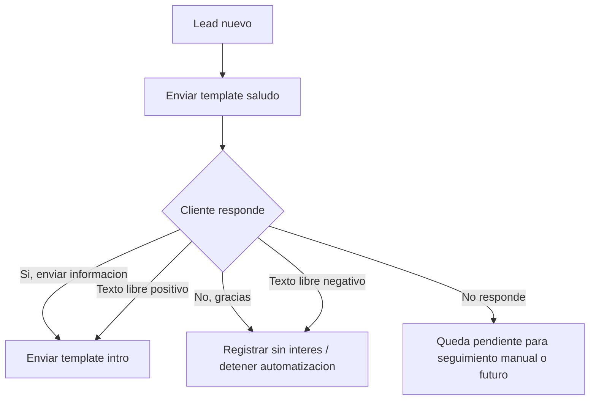
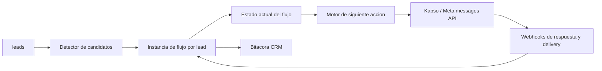
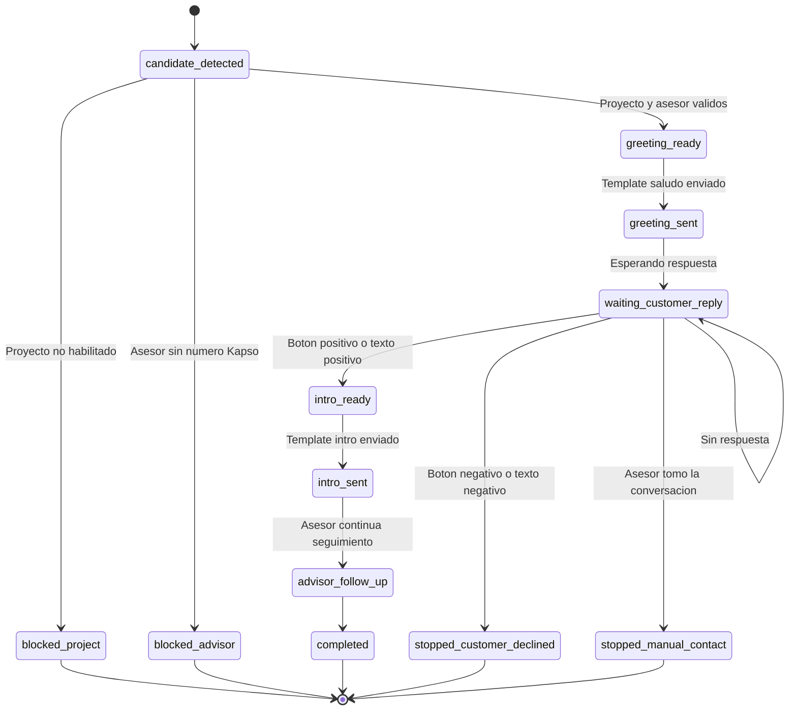
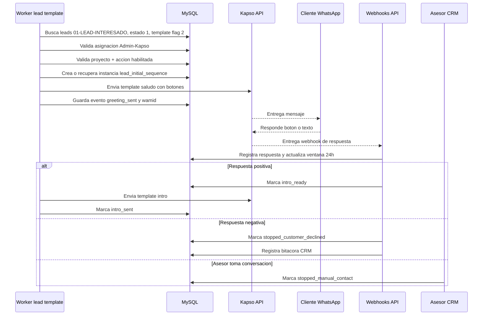

# API Kapso - CRM Ventas

API NestJS que conecta CRM Ventas con Kapso Platform para registrar numeros de WhatsApp, sincronizar su informacion, crear webhooks y conservar el estado operativo de cada integracion.

> Esta rama contiene solamente el proyecto de la API Kapso. El frontend del CRM se mantiene en las ramas correspondientes del repositorio.

## Que hace

- Recibe el evento de Kapso cuando se crea o elimina un numero.
- Guarda la identidad del numero, proyecto y customer en MySQL.
- Resuelve la API key correcta usando el `project.id` recibido por Kapso.
- Consulta el detalle remoto del numero con `phone_number_id`.
- Crea o confirma los webhooks Kapso y Meta asociados al numero.
- Reintenta sincronizaciones pendientes sin ejecutar dos corridas al mismo tiempo.
- Valida firmas HMAC e idempotencia de los webhooks.
- Registra estados, errores, payloads y snapshots de webhooks para diagnostico.
- Expone endpoints para consultar y sincronizar manualmente los numeros.
- Ejecuta un diagnostico periodico de candidatos de leads sin enviar templates todavia.

## Arquitectura



### Componentes principales

| Componente                        | Responsabilidad                                                 |
| --------------------------------- | --------------------------------------------------------------- |
| `src/main.ts`                     | Arranque, prefijo global, CORS, Helmet y `rawBody` para firmas. |
| `src/config/`                     | Configuracion, variables de entorno y validacion Joi.           |
| `src/database/`                   | TypeORM, datasource y migraciones.                              |
| `src/modules/kapso/controllers/`  | Endpoints REST, redirects y webhooks.                           |
| `src/modules/kapso/services/`     | Cliente Kapso, sincronizacion, firmas y relaciones Admin-Kapso. |
| `src/modules/kapso/repositories/` | Consultas y persistencia MySQL.                                 |
| `src/modules/kapso/entities/`     | Modelo TypeORM de numeros y relaciones.                         |
| `test/`                           | Pruebas unitarias, integracion y E2E.                           |

## Flujo de un numero nuevo



### Regla de contexto por proyecto

El endpoint de detalle de Kapso es `project-scoped`. Por eso el API guarda juntos:

1. `phone_number_id` como identificador principal.
2. `project.id` recibido en el webhook.
3. `customer.id` recibido en el webhook.

Para cada consulta posterior, la API utiliza la API key del proyecto recibido. Si no existe una clave especifica, usa `KAPSO_API_KEY` como valor predeterminado.

## Estados de sincronizacion



`pending_remote_sync` no significa que el onboarding fallo. Indica que Kapso acepto el numero, pero el detalle remoto o alguno de los webhooks aun no esta confirmado.

## Webhooks expuestos

Configura estas URLs en Kapso usando la base publica de ngrok o el dominio del entorno:

| URL                               | Origen         | Uso                                |
| --------------------------------- | -------------- | ---------------------------------- |
| `/api/v1/webhooks/kapso/platform` | Kapso Platform | Creacion y eliminacion de numeros. |
| `/api/v1/webhooks/kapso/events`   | Kapso events   | Mensajes y eventos de WhatsApp.    |
| `/api/v1/webhooks/kapso/meta`     | Meta relay     | Payload crudo reenviado por Kapso. |

Ejemplo local publicado por ngrok:

```text
https://TU-DOMINIO-NGROK.ngrok-free.dev/api/v1/webhooks/kapso/platform
https://TU-DOMINIO-NGROK.ngrok-free.dev/api/v1/webhooks/kapso/events
https://TU-DOMINIO-NGROK.ngrok-free.dev/api/v1/webhooks/kapso/meta
```

### Seguridad de webhooks

- `platform` valida `x-webhook-signature` con `KAPSO_PLATFORM_WEBHOOK_SECRET`.
- `events` valida `x-webhook-signature` con `KAPSO_WHATSAPP_WEBHOOK_SECRET`.
- `meta` conserva el payload para diagnostico y usa la idempotencia enviada por Kapso.
- `x-idempotency-key` evita procesar dos veces la misma entrega.
- El cuerpo original se conserva mediante `rawBody: true` para verificar HMAC correctamente.

## Endpoints de la API

### Consulta y sincronizacion

| Metodo | Ruta                                              | Descripcion                                         |
| ------ | ------------------------------------------------- | --------------------------------------------------- |
| `GET`  | `/api/v1/kapso/customers`                         | Lista customers derivados de numeros sincronizados. |
| `GET`  | `/api/v1/kapso/phone-numbers`                     | Lista numeros guardados localmente.                 |
| `POST` | `/api/v1/kapso/bootstrap/sync`                    | Reconstruye el estado local desde Kapso.            |
| `POST` | `/api/v1/kapso/phone-numbers/:phoneNumberId/sync` | Reintenta un numero especifico.                     |
| `GET`  | `/api/v1/kapso/setup/success`                     | Recibe el redirect exitoso del setup link.          |
| `GET`  | `/api/v1/kapso/setup/failure`                     | Recibe el redirect fallido del setup link.          |

### Relaciones Admin-Kapso

| Metodo   | Ruta                                          | Descripcion                           |
| -------- | --------------------------------------------- | ------------------------------------- |
| `GET`    | `/api/v1/kapso/admins/options`                | Lista administradores seleccionables. |
| `GET`    | `/api/v1/kapso/phone-numbers/options`         | Lista numeros seleccionables.         |
| `POST`   | `/api/v1/kapso/admin-integrations`            | Crea una asignacion Admin-Kapso.      |
| `GET`    | `/api/v1/kapso/admin-integrations`            | Lista asignaciones con filtros.       |
| `GET`    | `/api/v1/kapso/admin-integrations/:id`        | Consulta una asignacion.              |
| `PATCH`  | `/api/v1/kapso/admin-integrations/:id`        | Actualiza una asignacion.             |
| `PATCH`  | `/api/v1/kapso/admin-integrations/:id/status` | Activa o desactiva una asignacion.    |
| `DELETE` | `/api/v1/kapso/admin-integrations/:id`        | Elimina una asignacion.               |

## Persistencia

La tabla principal por numero es `kapso_phone_numbers`. El modelo consolidado guarda la informacion propia del numero y su trazabilidad:

- IDs de Kapso, proyecto, customer, WABA y configuracion WhatsApp.
- Numero visible, nombre verificado, estado y calidad.
- Estado del setup y de sincronizacion.
- Snapshot remoto de webhooks en `webhooks_json`.
- Ultimo evento, firma, idempotency key y payload recibido.
- Ultimo error y fecha de sincronizacion.

La tabla `admin_kapso_integrations` relaciona un administrador del CRM con un numero Kapso. Las migraciones se ejecutan en orden con TypeORM y mantienen las restricciones de unicidad e indices necesarios.

## Workers internos

La API usa intervalos internos, no Docker ni un cron externo:

1. **Sincronizacion pendiente:** revisa `pending_remote_sync` y reintenta en lotes.
2. **Diagnostico de leads:** busca candidatos configurados y registra los que no tienen asignacion Admin-Kapso. Este worker no envia templates aun.

Cada worker tiene un indicador de ejecucion para no iniciar una nueva corrida mientras el lote anterior sigue activo.

Variables relacionadas:

```env
KAPSO_PENDING_SYNC_INTERVAL_MS=30000
KAPSO_PENDING_SYNC_BATCH_SIZE=10
KAPSO_LEAD_TEMPLATE_INTERVAL_MS=60000
KAPSO_LEAD_TEMPLATE_BATCH_SIZE=100
```

## Flujo de leads y templates

El envio de templates debe salir desde la API Kapso, no desde el frontend. El API toma el lead, valida el asesor, valida el proyecto habilitado y luego envia el template usando el numero Kapso asignado.



### Condicion inicial del lead

Para la primera etapa, el worker solo considera leads que cumplan:

| Campo                            | Valor esperado                |
| -------------------------------- | ----------------------------- |
| `segimineto_lead`                | `01-LEAD-INTERESADO`          |
| `whatsapp_template_contact_sent` | `2`                           |
| `estado_lead`                    | `1`                           |
| `id_empleado_lead`               | Debe existir y no venir vacio |

Mientras el envio real no este activo, el worker puede detectar el mismo lead en cada intervalo. Ese comportamiento es normal para monitoreo porque aun no se modifica el lead ni se registra un intento final de envio.

### Validacion por asesor

El asesor se identifica con `leads.id_empleado_lead` y se compara contra la configuracion Admin-Kapso. Si el asesor no tiene un numero Kapso activo asignado, el lead no puede avanzar al envio.

La configuracion Admin-Kapso solo responde esta pregunta:

```text
Que numero Kapso usa cada asesor?
```

### Validacion por proyecto

El proyecto se valida con `leads.idproyecto_lead` contra una configuracion futura de proyectos habilitados. Esta configuracion debe responder:

```text
Que proyectos pueden usar cada accion o template?
```

Ejemplo conceptual:

| Proyecto | Accion                  | Template | Estado |
| -------- | ----------------------- | -------- | ------ |
| Andira   | `lead_initial_greeting` | `saludo` | Activo |

Esta validacion permite habilitar templates por proyecto sin activar la automatizacion para todo el CRM.

### Configuracion recomendada

La pantalla `/configuracion/kapso` debe funcionar como entrada al modulo Kapso y separar las configuraciones:

| Seccion                | Proposito                                                          |
| ---------------------- | ------------------------------------------------------------------ |
| Asesores y numeros     | Asignar que numero Kapso usa cada asesor.                          |
| Proyectos habilitados  | Activar que proyectos pueden usar automatizaciones Kapso.          |
| Templates y parametros | Definir que template usa cada accion y de donde salen sus valores. |

Con esta separacion, el sistema puede crecer de forma ordenada: primero se habilita el asesor, luego el proyecto, luego el template y finalmente los parametros.

### Primer template esperado

Segun el documento de templates, el primer flujo automatico es `saludo`. Su objetivo es abrir la conversacion con un lead nuevo antes de enviar informacion del proyecto.

Parametros iniciales:

| Parametro           | Origen sugerido       |
| ------------------- | --------------------- |
| `nombre_cliente`    | `leads.nombre_lead`   |
| `nombre_asesor`     | `admins.name_admin`   |
| `nombre_condominio` | `leads.proyecto_lead` |

El envio real debe usar:

```http
POST https://api.kapso.ai/meta/whatsapp/v24.0/{phone_number_id}/messages
```

Donde `{phone_number_id}` es el numero Kapso asignado al asesor.

### Propiedad del template

Los templates se asocian al WhatsApp Business Account, no a cada numero individual. Por eso no se debe duplicar el mismo template para cada numero si todos pertenecen a la misma WABA.



La relacion operativa queda asi:

```text
Proyecto CRM -> Accion -> Business Account / Template
```

Y al momento de enviar:

```text
Numero Kapso del asesor + Template aprobado en la WABA de ese numero
```

### Hub de configuracion Kapso

La ruta `/configuracion/kapso` debe ser la entrada visual del modulo. Cada configuracion debe vivir separada para evitar una pantalla gigante y para permitir que el sistema crezca por etapas.



### Flujo con botones del template saludo

El template inicial puede incluir botones para que la respuesta del cliente sea clara y el siguiente paso no dependa solo de interpretar texto libre.



Decision recomendada para la primera version:

1. Enviar `saludo` automaticamente solo a leads nuevos habilitados.
2. Avanzar a `intro` solo si el cliente presiona el boton positivo o responde claramente de forma positiva.
3. Detener la automatizacion si el cliente presiona el boton negativo o responde de forma negativa.
4. Mantener los siguientes templates del PDF como fases posteriores o acciones manuales hasta validar el flujo base.

## Arquitectura del flujo conversacional

El flujo del PDF no debe resolverse con mas columnas sueltas en `leads`. La tabla `leads` sirve para detectar candidatos, pero el estado real de la automatizacion debe vivir en tablas propias de Kapso. Asi el sistema puede saber donde quedo cada lead, cuando debe avanzar, cuando debe detenerse y por que no debe repetir un template.

### Principio de diseno

El CRM detecta el lead. Kapso API administra la conversacion automatizada.



### Tablas recomendadas

Para mantenerlo simple y escalable, el nucleo necesita estas tablas:

| Tabla                            | Proposito                                                                   |
| -------------------------------- | --------------------------------------------------------------------------- |
| `kapso_template_catalog`         | Catalogo local de templates aprobados por WABA, idioma, categoria y accion. |
| `kapso_project_template_configs` | Habilita que proyecto puede usar que accion/template.                       |
| `kapso_lead_flow_instances`      | Guarda en que paso del flujo esta cada lead.                                |
| `kapso_lead_flow_events`         | Audita mensajes enviados, respuestas, botones, errores y decisiones.        |

La tabla `bitacoras` del CRM debe seguir usandose para dejar trazabilidad visible al equipo comercial, pero no debe ser la fuente principal del estado del motor.

### Identidad del lead y del cliente

La identidad estable del proceso debe ser:

| Dato                                  | Uso                                                                                       |
| ------------------------------------- | ----------------------------------------------------------------------------------------- |
| `leads.idinterno_lead`                | Identificador principal del lead para el CRM.                                             |
| `leads.id_lead`                       | Identificador interno local cuando se necesite compatibilidad.                            |
| `leads.telefono_lead`                 | Telefono destino normalizado.                                                             |
| `kapso_phone_numbers.phone_number_id` | Numero remitente de WhatsApp usado por el asesor.                                         |
| `waba_id`                             | Cuenta WhatsApp Business donde vive el template.                                          |
| `wamid`                               | ID de cada mensaje enviado o recibido, solo para auditoria.                               |
| `wa_id` / `contact_id`                | ID recibido por webhook, guardado como dato historico, no como llave principal del flujo. |

No se debe depender de un ID temporal de conversacion, thread o contacto como llave principal. Si Meta o Kapso entregan un identificador nuevo para el mismo cliente, el flujo debe seguir encontrandose por lead + telefono normalizado + numero Kapso remitente.

### Estado de una instancia de flujo

Cada lead debe tener una sola instancia activa por accion principal, por ejemplo `lead_initial_sequence`. Esa instancia evita que el worker envie dos veces el mismo paso.



Estados minimos para la primera version:

| Estado                      | Significado                                                  |
| --------------------------- | ------------------------------------------------------------ |
| `candidate_detected`        | El lead cumple la condicion inicial.                         |
| `blocked_project`           | El proyecto aun no esta habilitado para esta accion.         |
| `blocked_advisor`           | El asesor no tiene numero Kapso activo asignado.             |
| `greeting_sent`             | Se envio el template `saludo`.                               |
| `waiting_customer_reply`    | El sistema espera boton o respuesta del cliente.             |
| `intro_sent`                | Se envio el template `intro` despues de respuesta positiva.  |
| `stopped_customer_declined` | El cliente no quiere informacion.                            |
| `stopped_manual_contact`    | El asesor interrumpio la automatizacion por contacto manual. |
| `completed`                 | El flujo automatico termino correctamente.                   |

### Reglas para detener el flujo

El sistema debe detener una instancia cuando ocurra cualquiera de estas condiciones:

1. El cliente presiona `No, gracias`.
2. El cliente responde con texto claramente negativo.
3. El asesor marca contacto manual o toma la conversacion.
4. El flujo llega al ultimo paso automatico permitido.
5. El lead deja de estar activo en CRM.
6. El proyecto o template se deshabilita.
7. El telefono destino es invalido o Kapso/Meta devuelve error terminal.

Cuando el flujo se detiene, no se debe borrar la instancia. Debe quedar cerrada con `stopped_reason` y eventos historicos.

### Ventana de 24 horas de Meta

La ventana de 24 horas aplica para mensajes no-template. Segun Meta, para contactar fuera de la ventana de servicio se deben usar templates aprobados. Cuando el cliente responde, se abre una ventana de atencion donde el asesor o el sistema pueden enviar mensajes de servicio.

Regla practica para este sistema:

| Situacion                           | Accion recomendada                                         |
| ----------------------------------- | ---------------------------------------------------------- |
| Lead nuevo sin conversacion abierta | Enviar template aprobado `saludo`.                         |
| Cliente responde al template        | Registrar `last_inbound_at` y `service_window_expires_at`. |
| Siguiente paso automatico aprobado  | Enviar template configurado, por ejemplo `intro`.          |
| Mensaje libre dentro de ventana     | Permitido solo si se decide usar mensajes no-template.     |
| Fuera de ventana                    | Usar solo templates aprobados.                             |

### Secuencia completa esperada



### Camino de implementacion

Checklist recomendado para construirlo sin perder control:

1. Crear catalogo local de templates (`kapso_template_catalog`) y registrar `saludo`.
2. Crear configuracion por proyecto y accion (`kapso_project_template_configs`).
3. Crear instancia de flujo por lead (`kapso_lead_flow_instances`).
4. Crear auditoria de eventos (`kapso_lead_flow_events`).
5. Cambiar el worker de diagnostico para crear/consultar instancia sin enviar aun.
6. Agregar envio real de `saludo` con botones.
7. Procesar webhooks de botones y texto del cliente.
8. Enviar `intro` solo si la respuesta es positiva.
9. Agregar boton o endpoint para que el asesor detenga la automatizacion por contacto manual.
10. Activar reglas de cierre para evitar ciclos infinitos.

### Lo que debe configurar el usuario

Antes de activar el envio real:

1. Crear y aprobar el template `saludo` en Kapso/Meta con parametros `{{1}}`, `{{2}}`, `{{3}}`.
2. Confirmar si `saludo` tendra botones: `Si, enviar informacion` y `No, gracias`.
3. Crear y aprobar el template `intro`.
4. Definir para que proyecto inicia la automatizacion, por ejemplo `Andira`.
5. Confirmar que asesores participantes tengan numero Kapso asignado.
6. Confirmar si el asesor tendra un control manual para detener el flujo desde CRM.

## Tecnologia

- Node.js 22+
- NestJS 11
- TypeScript 5
- TypeORM 0.3 + MySQL 8
- Axios para Kapso Platform API
- Jest + Supertest para pruebas
- Helmet, CORS y validacion Joi
- Redis/BullMQ disponibles para evolucionar procesos en segundo plano; el flujo actual de sincronizacion usa workers internos con intervalos.

## Instalacion

Requisitos: Node.js, npm, MySQL y acceso a Kapso Platform API.

```powershell
npm install
Copy-Item .env.example .env
```

Completa `.env` con los valores del entorno. No subas `.env` al repositorio: contiene secretos.

## Configuracion minima

```env
NODE_ENV=development
PORT=8002
API_PREFIX=api/v1

MYSQL_HOST=127.0.0.1
MYSQL_PORT=3306
MYSQL_USER=crm_user
MYSQL_PASSWORD=change_me
MYSQL_DATABASE=crmdatabase-api

KAPSO_API_KEY=tu_api_key
KAPSO_PROJECT_API_KEYS_JSON={"project-id":"api-key-del-proyecto"}
KAPSO_PUBLIC_BASE_URL=https://tu-dominio-publico.ngrok-free.dev
KAPSO_SETUP_REDIRECT_BASE_URL=http://localhost:8002
KAPSO_PLATFORM_WEBHOOK_SECRET=secret-plataforma
KAPSO_WHATSAPP_WEBHOOK_SECRET=secret-events
```

## Ejecucion

```powershell
# Desarrollo con recarga automatica
npm run start:dev

# Desarrollo sin watch
npm run start

# Produccion local despues de compilar
npm run build
node dist/main.js
```

La API queda disponible por defecto en `http://localhost:8002/api/v1`.

### Exponer la API con ngrok

```powershell
ngrok http 8002
```

Usa la URL HTTPS mostrada por ngrok para configurar los webhooks y redirects de Kapso. Si la URL cambia, actualiza `KAPSO_PUBLIC_BASE_URL` y la configuracion remota en Kapso.

## Migraciones

```powershell
npm run migration:run
npm run migration:revert
```

No uses `synchronize: true` en ambientes compartidos. Las migraciones son la fuente controlada de cambios de base de datos.

## Pruebas y calidad

```powershell
npm run lint
npm run typecheck
npm test -- --runInBand
npm run test:e2e -- --runInBand
npm run build
```

Las pruebas cubren el cliente Kapso, la sincronizacion, las relaciones Admin-Kapso, los redirects de setup y los webhooks con estados exitosos, pendientes, duplicados y fallos.

## Diagnostico rapido

### El puerto 8002 ya esta ocupado

```powershell
Get-NetTCPConnection -LocalPort 8002 | Select-Object OwningProcess
Stop-Process -Id ID_DEL_PROCESO -Force
```

### Kapso devuelve `WhatsApp configuration not found`

Verifica que el webhook incluya `project.id` y que `KAPSO_PROJECT_API_KEYS_JSON` tenga la API key del mismo proyecto. El recurso es project-scoped; no se debe cambiar `phone_number_id` por `whatsapp_config_id` para esa consulta.

### El numero aparece pendiente

Revisa los logs del worker y consulta manualmente:

```powershell
Invoke-RestMethod -Method Post -Uri http://localhost:8002/api/v1/kapso/phone-numbers/PHONE_NUMBER_ID/sync
```

El estado pendiente es esperado cuando falta confirmar el detalle remoto o alguno de los webhooks. La API lo reintenta y conserva el error para soporte.

## Checkpoint de una integracion completa

Una integracion se considera completa cuando:

1. Existe una fila para el `phone_number_id`.
2. El `project.id` y `customer.id` estan persistidos.
3. El detalle remoto fue consultado con la API key del proyecto correcto.
4. El webhook Kapso y el webhook Meta aparecen en `webhooks_json`.
5. El estado termina en `processed` o `synced` sin warnings pendientes.
6. La asignacion Admin-Kapso puede usar ese numero desde sus endpoints.
