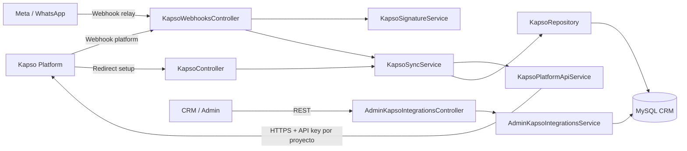
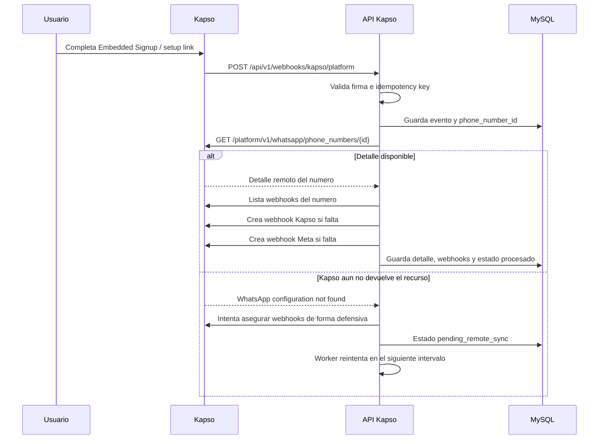
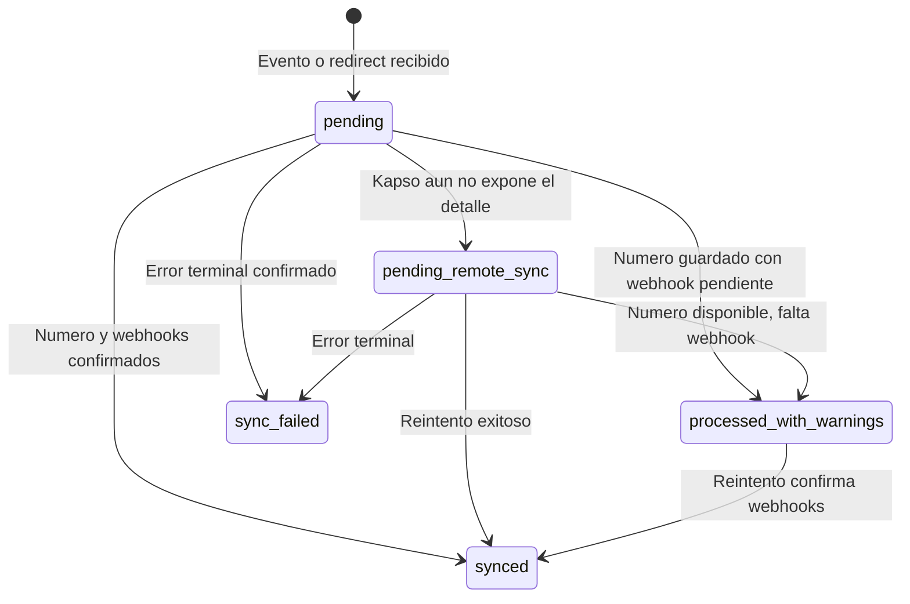

# API Kapso - CRM Ventas

API NestJS que conecta CRM Ventas con Kapso Platform para registrar numeros de WhatsApp, sincronizar su informacion, crear webhooks y conservar el estado operativo de cada integracion.

> Esta rama contiene solamente el proyecto de la API Kapso. El frontend del CRM se mantiene en las ramas correspondientes del repositorio.

## Que hace

- Recibe el evento de Kapso cuando se crea o elimina un numero.
- Guarda la identidad del numero, proyecto y customer en MySQL.
- Resuelve la API key correcta usando el `project.id` recibido por Kapso.
- Consulta el detalle remoto del numero con `phone_number_id`.
- Crea o confirma los webhooks Kapso y Meta asociados al numero.
- Reintenta sincronizaciones pendientes sin ejecutar dos corridas al mismo tiempo.
- Valida firmas HMAC e idempotencia de los webhooks.
- Registra estados, errores, payloads y snapshots de webhooks para diagnostico.
- Expone endpoints para consultar y sincronizar manualmente los numeros.
- Ejecuta un diagnostico periodico de candidatos de leads sin enviar templates todavia.

## Arquitectura



### Componentes principales

| Componente | Responsabilidad |
| --- | --- |
| `src/main.ts` | Arranque, prefijo global, CORS, Helmet y `rawBody` para firmas. |
| `src/config/` | Configuracion, variables de entorno y validacion Joi. |
| `src/database/` | TypeORM, datasource y migraciones. |
| `src/modules/kapso/controllers/` | Endpoints REST, redirects y webhooks. |
| `src/modules/kapso/services/` | Cliente Kapso, sincronizacion, firmas y relaciones Admin-Kapso. |
| `src/modules/kapso/repositories/` | Consultas y persistencia MySQL. |
| `src/modules/kapso/entities/` | Modelo TypeORM de numeros y relaciones. |
| `test/` | Pruebas unitarias, integracion y E2E. |

## Flujo de un numero nuevo



### Regla de contexto por proyecto

El endpoint de detalle de Kapso es `project-scoped`. Por eso el API guarda juntos:

1. `phone_number_id` como identificador principal.
2. `project.id` recibido en el webhook.
3. `customer.id` recibido en el webhook.

Para cada consulta posterior, la API utiliza la API key del proyecto recibido. Si no existe una clave especifica, usa `KAPSO_API_KEY` como valor predeterminado.

## Estados de sincronizacion



`pending_remote_sync` no significa que el onboarding fallo. Indica que Kapso acepto el numero, pero el detalle remoto o alguno de los webhooks aun no esta confirmado.

## Webhooks expuestos

Configura estas URLs en Kapso usando la base publica de ngrok o el dominio del entorno:

| URL | Origen | Uso |
| --- | --- | --- |
| `/api/v1/webhooks/kapso/platform` | Kapso Platform | Creacion y eliminacion de numeros. |
| `/api/v1/webhooks/kapso/events` | Kapso events | Mensajes y eventos de WhatsApp. |
| `/api/v1/webhooks/kapso/meta` | Meta relay | Payload crudo reenviado por Kapso. |

Ejemplo local publicado por ngrok:

```text
https://TU-DOMINIO-NGROK.ngrok-free.dev/api/v1/webhooks/kapso/platform
https://TU-DOMINIO-NGROK.ngrok-free.dev/api/v1/webhooks/kapso/events
https://TU-DOMINIO-NGROK.ngrok-free.dev/api/v1/webhooks/kapso/meta
```

### Seguridad de webhooks

- `platform` valida `x-webhook-signature` con `KAPSO_PLATFORM_WEBHOOK_SECRET`.
- `events` valida `x-webhook-signature` con `KAPSO_WHATSAPP_WEBHOOK_SECRET`.
- `meta` conserva el payload para diagnostico y usa la idempotencia enviada por Kapso.
- `x-idempotency-key` evita procesar dos veces la misma entrega.
- El cuerpo original se conserva mediante `rawBody: true` para verificar HMAC correctamente.

## Endpoints de la API

### Consulta y sincronizacion

| Metodo | Ruta | Descripcion |
| --- | --- | --- |
| `GET` | `/api/v1/kapso/customers` | Lista customers derivados de numeros sincronizados. |
| `GET` | `/api/v1/kapso/phone-numbers` | Lista numeros guardados localmente. |
| `POST` | `/api/v1/kapso/bootstrap/sync` | Reconstruye el estado local desde Kapso. |
| `POST` | `/api/v1/kapso/phone-numbers/:phoneNumberId/sync` | Reintenta un numero especifico. |
| `GET` | `/api/v1/kapso/setup/success` | Recibe el redirect exitoso del setup link. |
| `GET` | `/api/v1/kapso/setup/failure` | Recibe el redirect fallido del setup link. |

### Relaciones Admin-Kapso

| Metodo | Ruta | Descripcion |
| --- | --- | --- |
| `GET` | `/api/v1/kapso/admins/options` | Lista administradores seleccionables. |
| `GET` | `/api/v1/kapso/phone-numbers/options` | Lista numeros seleccionables. |
| `POST` | `/api/v1/kapso/admin-integrations` | Crea una asignacion Admin-Kapso. |
| `GET` | `/api/v1/kapso/admin-integrations` | Lista asignaciones con filtros. |
| `GET` | `/api/v1/kapso/admin-integrations/:id` | Consulta una asignacion. |
| `PATCH` | `/api/v1/kapso/admin-integrations/:id` | Actualiza una asignacion. |
| `PATCH` | `/api/v1/kapso/admin-integrations/:id/status` | Activa o desactiva una asignacion. |
| `DELETE` | `/api/v1/kapso/admin-integrations/:id` | Elimina una asignacion. |

## Persistencia

La tabla principal por numero es `kapso_phone_numbers`. El modelo consolidado guarda la informacion propia del numero y su trazabilidad:

- IDs de Kapso, proyecto, customer, WABA y configuracion WhatsApp.
- Numero visible, nombre verificado, estado y calidad.
- Estado del setup y de sincronizacion.
- Snapshot remoto de webhooks en `webhooks_json`.
- Ultimo evento, firma, idempotency key y payload recibido.
- Ultimo error y fecha de sincronizacion.

La tabla `admin_kapso_integrations` relaciona un administrador del CRM con un numero Kapso. Las migraciones se ejecutan en orden con TypeORM y mantienen las restricciones de unicidad e indices necesarios.

## Workers internos

La API usa intervalos internos, no Docker ni un cron externo:

1. **Sincronizacion pendiente:** revisa `pending_remote_sync` y reintenta en lotes.
2. **Diagnostico de leads:** busca candidatos configurados y registra los que no tienen asignacion Admin-Kapso. Este worker no envia templates aun.

Cada worker tiene un indicador de ejecucion para no iniciar una nueva corrida mientras el lote anterior sigue activo.

Variables relacionadas:

```env
KAPSO_PENDING_SYNC_INTERVAL_MS=30000
KAPSO_PENDING_SYNC_BATCH_SIZE=10
KAPSO_LEAD_TEMPLATE_INTERVAL_MS=60000
KAPSO_LEAD_TEMPLATE_BATCH_SIZE=100
```

## Tecnologia

- Node.js 22+
- NestJS 11
- TypeScript 5
- TypeORM 0.3 + MySQL 8
- Axios para Kapso Platform API
- Jest + Supertest para pruebas
- Helmet, CORS y validacion Joi
- Redis/BullMQ disponibles para evolucionar procesos en segundo plano; el flujo actual de sincronizacion usa workers internos con intervalos.

## Instalacion

Requisitos: Node.js, npm, MySQL y acceso a Kapso Platform API.

```powershell
npm install
Copy-Item .env.example .env
```

Completa `.env` con los valores del entorno. No subas `.env` al repositorio: contiene secretos.

## Configuracion minima

```env
NODE_ENV=development
PORT=8002
API_PREFIX=api/v1

MYSQL_HOST=127.0.0.1
MYSQL_PORT=3306
MYSQL_USER=crm_user
MYSQL_PASSWORD=change_me
MYSQL_DATABASE=crmdatabase-api

KAPSO_API_KEY=tu_api_key
KAPSO_PROJECT_API_KEYS_JSON={"project-id":"api-key-del-proyecto"}
KAPSO_PUBLIC_BASE_URL=https://tu-dominio-publico.ngrok-free.dev
KAPSO_SETUP_REDIRECT_BASE_URL=http://localhost:8002
KAPSO_PLATFORM_WEBHOOK_SECRET=secret-plataforma
KAPSO_WHATSAPP_WEBHOOK_SECRET=secret-events
```

## Ejecucion

```powershell
# Desarrollo con recarga automatica
npm run start:dev

# Desarrollo sin watch
npm run start

# Produccion local despues de compilar
npm run build
node dist/main.js
```

La API queda disponible por defecto en `http://localhost:8002/api/v1`.

### Exponer la API con ngrok

```powershell
ngrok http 8002
```

Usa la URL HTTPS mostrada por ngrok para configurar los webhooks y redirects de Kapso. Si la URL cambia, actualiza `KAPSO_PUBLIC_BASE_URL` y la configuracion remota en Kapso.

## Migraciones

```powershell
npm run migration:run
npm run migration:revert
```

No uses `synchronize: true` en ambientes compartidos. Las migraciones son la fuente controlada de cambios de base de datos.

## Pruebas y calidad

```powershell
npm run lint
npm run typecheck
npm test -- --runInBand
npm run test:e2e -- --runInBand
npm run build
```

Las pruebas cubren el cliente Kapso, la sincronizacion, las relaciones Admin-Kapso, los redirects de setup y los webhooks con estados exitosos, pendientes, duplicados y fallos.

## Diagnostico rapido

### El puerto 8002 ya esta ocupado

```powershell
Get-NetTCPConnection -LocalPort 8002 | Select-Object OwningProcess
Stop-Process -Id ID_DEL_PROCESO -Force
```

### Kapso devuelve `WhatsApp configuration not found`

Verifica que el webhook incluya `project.id` y que `KAPSO_PROJECT_API_KEYS_JSON` tenga la API key del mismo proyecto. El recurso es project-scoped; no se debe cambiar `phone_number_id` por `whatsapp_config_id` para esa consulta.

### El numero aparece pendiente

Revisa los logs del worker y consulta manualmente:

```powershell
Invoke-RestMethod -Method Post -Uri http://localhost:8002/api/v1/kapso/phone-numbers/PHONE_NUMBER_ID/sync
```

El estado pendiente es esperado cuando falta confirmar el detalle remoto o alguno de los webhooks. La API lo reintenta y conserva el error para soporte.

## Checkpoint de una integracion completa

Una integracion se considera completa cuando:

1. Existe una fila para el `phone_number_id`.
2. El `project.id` y `customer.id` estan persistidos.
3. El detalle remoto fue consultado con la API key del proyecto correcto.
4. El webhook Kapso y el webhook Meta aparecen en `webhooks_json`.
5. El estado termina en `processed` o `synced` sin warnings pendientes.
6. La asignacion Admin-Kapso puede usar ese numero desde sus endpoints.

