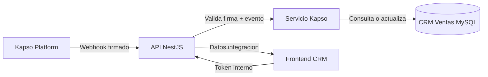
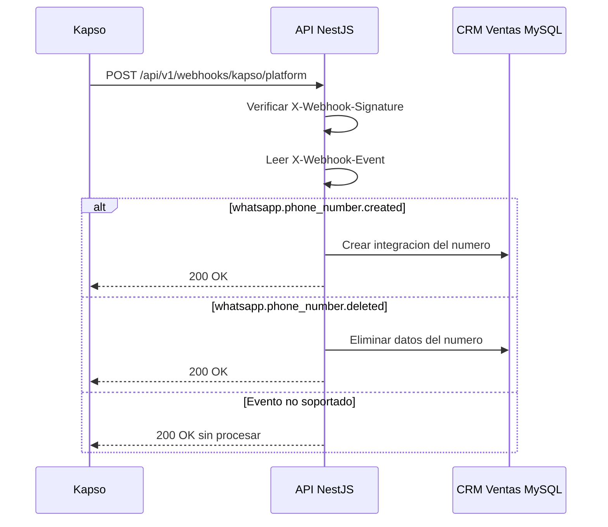
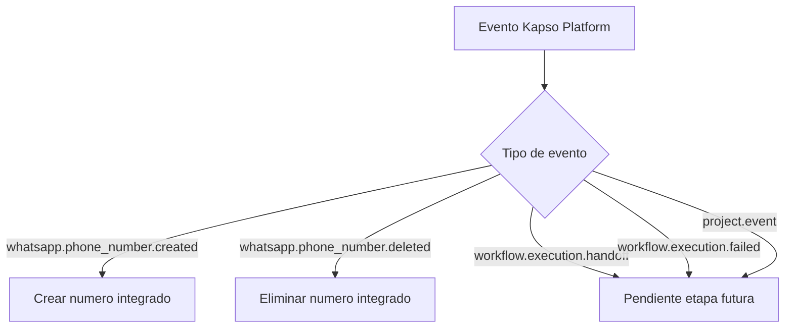
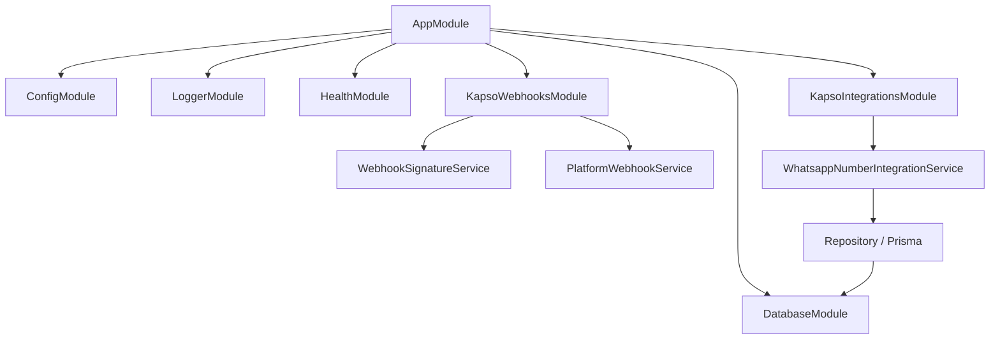
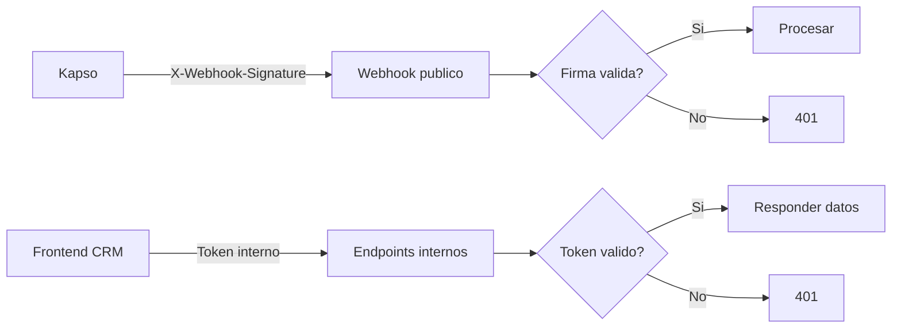
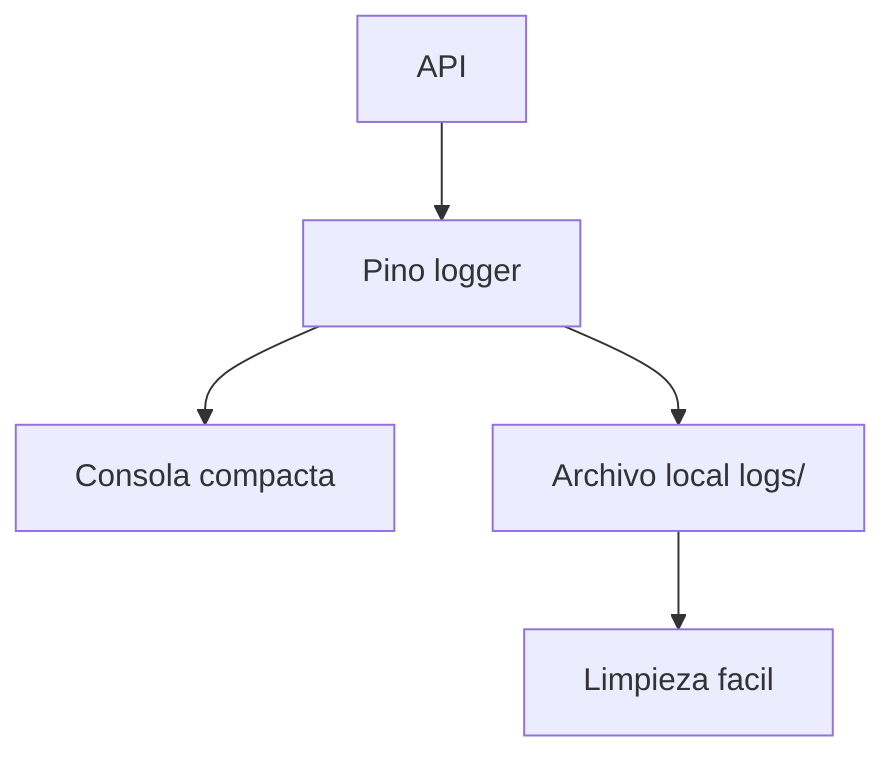
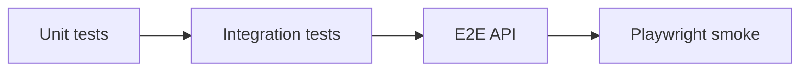
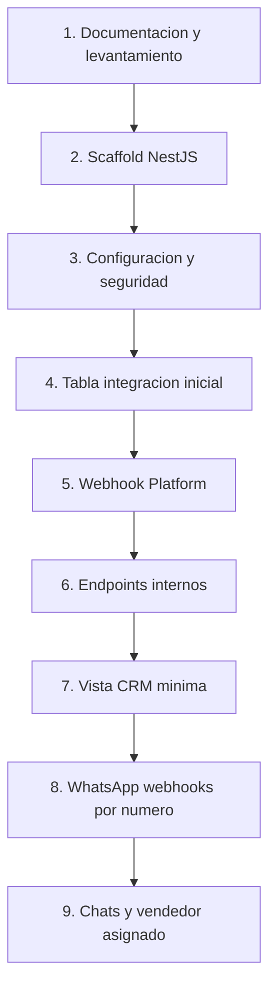

# API Kapso GIT

API NestJS para conectar Kapso con la base de datos CRM Ventas y, luego, con la vista Kapso del frontend CRM.

## Objetivo

Registrar y administrar la integracion inicial de numeros WhatsApp conectados en Kapso.

Bitacora de construccion y avances: [docs/construccion.md](docs/construccion.md).

Primera etapa:

- Recibir webhooks de Kapso Platform.
- Validar firma del webhook.
- Crear registro cuando Kapso conecte un numero.
- Eliminar por completo el registro cuando Kapso elimine un numero.
- Exponer endpoints internos para el frontend CRM.
- Documentar todo con Swagger/OpenAPI.
- Probar cada flujo con casos de exito, fallo y error.

## Flujo General



## Primera Integracion



## Eventos Kapso V1



No se encontro evento oficial de actualizacion de numero en la documentacion revisada. Si Kapso no lo ofrece, se manejara con sincronizacion manual/API en una etapa posterior.

## Arquitectura Backend



## Tabla Inicial

Nombre propuesto:

`kapso_integracion_numero_whatsapp`

Uso:

- Guardar la integracion inicial entre Kapso, API y CRM.
- Permitir futura asignacion de vendedor.
- Preparar futura lectura de chats/conversaciones por numero.

Campos propuestos:

| Campo                       | Uso                                                    |
| --------------------------- | ------------------------------------------------------ |
| `id`                        | ID interno                                             |
| `kapso_phone_number_id`     | ID principal enviado por Kapso                         |
| `kapso_project_id`          | Proyecto Kapso                                         |
| `kapso_customer_id`         | Customer Kapso, si existe                              |
| `display_phone_number`      | Numero visible, si Kapso lo entrega o se sincroniza    |
| `phone_number`              | Numero normalizado, nullable                           |
| `business_account_id`       | WABA/Business account, nullable                        |
| `business_name`             | Nombre negocio, nullable                               |
| `status`                    | Estado reportado por Kapso                             |
| `is_active`                 | Activo/inactivo desde CRM                              |
| `idnetsuite_admin_asignado` | Futuro vendedor asignado por `admins.idnetsuite_admin` |
| `ultimo_payload_kapso`      | Ultimo payload relevante de Kapso, nullable            |
| `last_sync_at`              | Ultima sincronizacion con Kapso                        |
| `connected_at`              | Fecha de conexion                                      |
| `created_at`                | Creacion CRM                                           |
| `updated_at`                | Ultima actualizacion CRM                               |

Regla actual: si Kapso manda `whatsapp.phone_number.deleted`, se elimina por completo la integracion del numero.

Detalle verificado de la tabla: [docs/database.md](docs/database.md).

## Seguridad



Variables de entorno esperadas:

```env
KAPSO_API_KEY=
KAPSO_PLATFORM_WEBHOOK_SECRET=
CRM_API_INTERNAL_TOKEN=
PORT=8002
DATABASE_URL=
```

No subir `.env` al repo.

## Logs



Politica:

- Consola compacta en desarrollo.
- No imprimir secretos.
- No imprimir payloads enormes en consola normal.
- Guardar logs locales en `logs/` para monitoreo y limpieza simple.
- Usar `event`, `idempotencyKey`, `phoneNumberId` y `requestId` para rastrear.

## Endpoints Esperados

| Metodo  | Ruta                                            | Uso                             |
| ------- | ----------------------------------------------- | ------------------------------- |
| `GET`   | `/api/v1/health`                                | Verificar API                   |
| `POST`  | `/api/v1/webhooks/kapso/platform`               | Recibir Kapso Platform webhooks |
| `GET`   | `/api/v1/kapso/whatsapp-numbers`                | Listar integraciones            |
| `PATCH` | `/api/v1/kapso/whatsapp-numbers/:id/activate`   | Activar integracion             |
| `PATCH` | `/api/v1/kapso/whatsapp-numbers/:id/deactivate` | Inactivar integracion           |
| `POST`  | `/api/v1/kapso/whatsapp-numbers/sync`           | Sincronizacion futura           |

Endpoints internos CRM:

- Usan `Authorization: Bearer <CRM_API_INTERNAL_TOKEN>`.
- Tambien aceptan `X-CRM-API-Token` para herramientas internas.
- Si `CRM_API_INTERNAL_TOKEN` no existe, fallan cerrado con error de configuracion.
- Playwright solo prueba escrituras bloqueadas sin token para no modificar produccion.

## Frontend CRM

Primera accion futura:

- Buscar la vista Kapso existente en `produccion/src`.
- Limpiar lo relacionado a Kapso.
- Dejar solo un `h1` con: `Kapso integracion`.

Despues:

- Consumir endpoints internos de esta API.
- Usar token interno.
- Mostrar integraciones.
- Activar/inactivar una integracion.

## Desarrollo Local

```powershell
npm install
npm run start:dev
ngrok http 8002
```

El endpoint en Kapso debe apuntar a:

```text
https://<ngrok-url>/api/v1/webhooks/kapso/platform
```

## Pruebas



Regla:

- Toda funcion importante que haga una accion, consulte datos, modifique estado, valide seguridad o devuelva una respuesta debe tener pruebas.
- Cada funcion/flujo importante debe tener minimo 3 escenarios y preferiblemente 4 cuando aplique.
- Escenarios base:
  - exito;
  - fallo esperado o validacion;
  - error externo/controlado;
  - caso borde o dato incompleto.
- Si una funcion nueva no tiene pruebas, no se considera terminada.
- Cada etapa debe actualizar `docs/construccion.md` y `tasks/todo.md` con lo probado.

Playwright valida lo observable del sistema actual:

- health API;
- rutas inexistentes;
- Swagger UI;
- OpenAPI JSON;
- webhook Kapso Platform firmado sin tocar BD;
- rechazo de firma invalida;
- rechazo de header de evento faltante;
- API interna listar integraciones con token;
- API interna rechazos sin token/token invalido;
- bloqueo de activacion sin token;
- lectura segura de la tabla Kapso.

Comandos esperados:

```powershell
npm run verify
```

El comando anterior ejecuta toda la revision del proyecto:

```powershell
npm run lint
npm run format:check
npm run typecheck
npm run test
npm run test:e2e
npm run test:playwright
npm run build
npm audit --omit=dev
npm run db:check
npm run verify:start:dev
```

## Etapas



## Fuentes Kapso Revisadas

- https://docs.kapso.ai/docs/introduction
- https://docs.kapso.ai/docs/platform/webhooks/overview
- https://docs.kapso.ai/docs/platform/webhooks/project-webhooks
