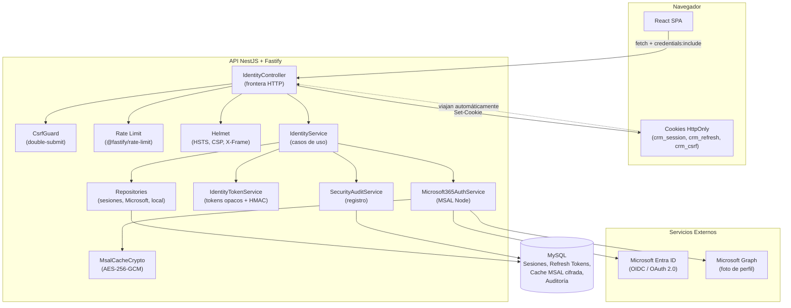
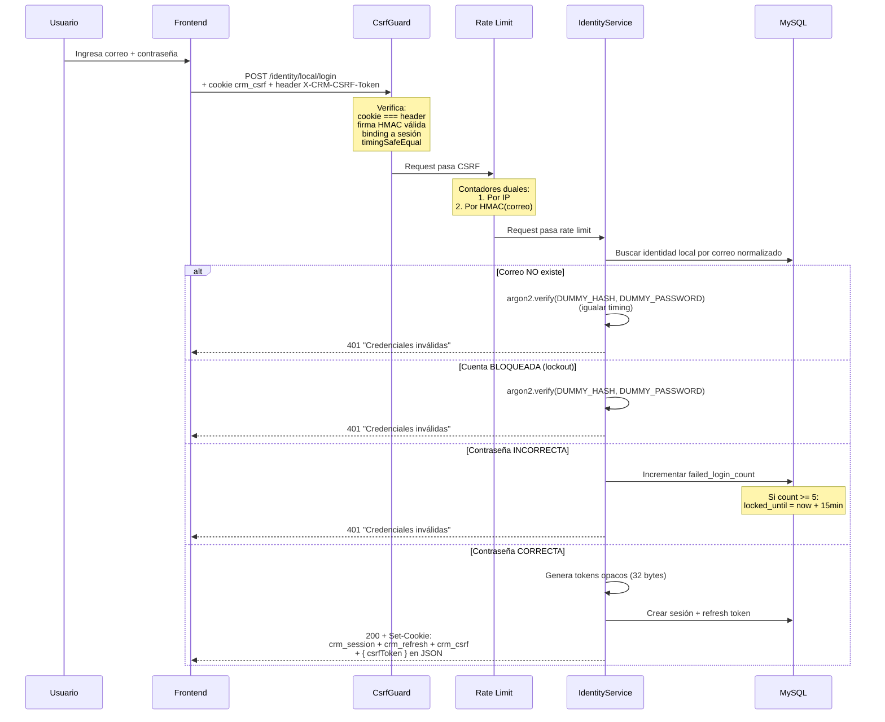
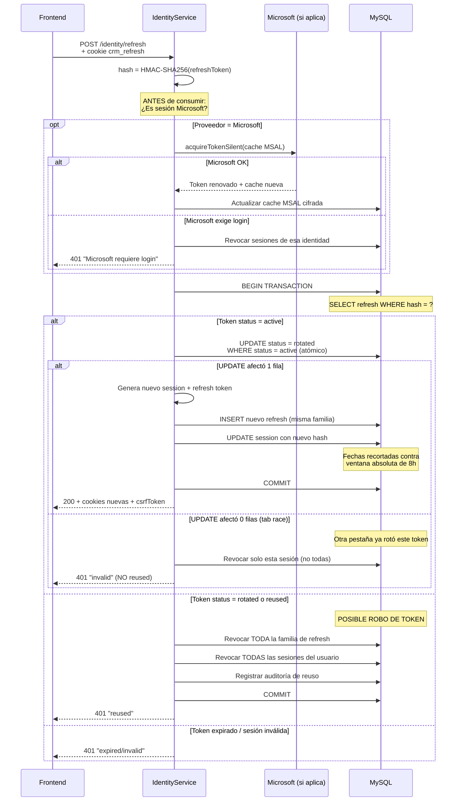
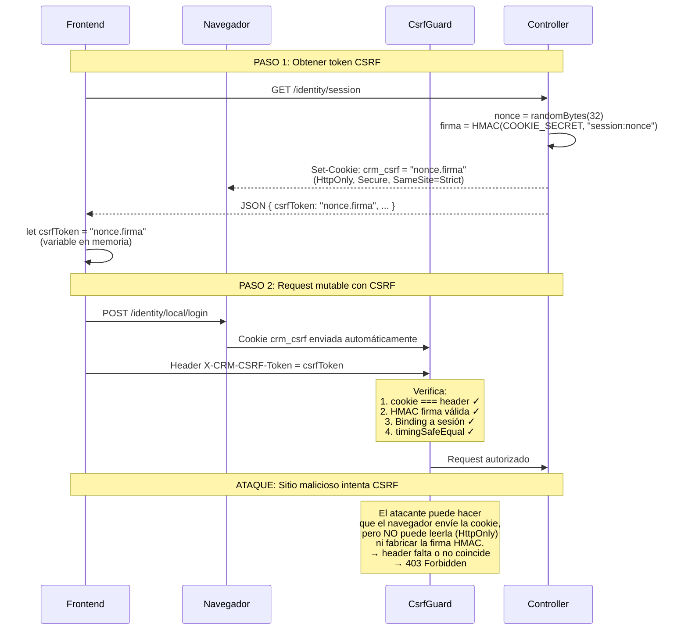
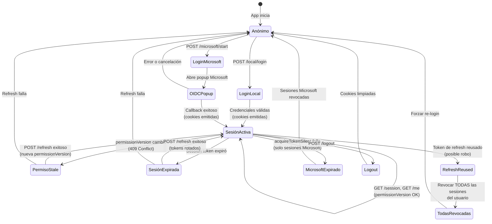
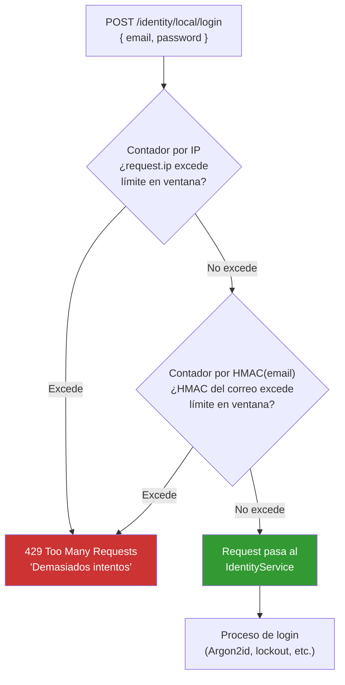
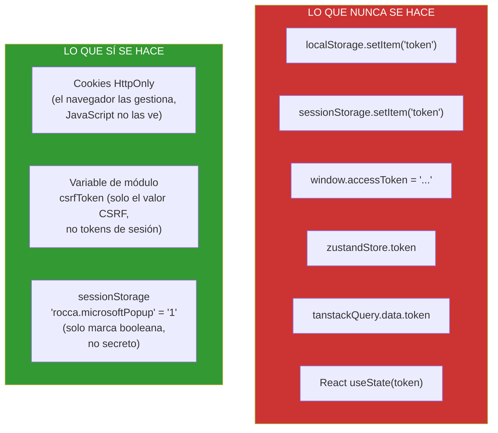

# Guía Técnica Completa: Sistema de Autenticación CRM TINK

**Stack:** NestJS (Fastify) + React SPA + MySQL
**Patrón arquitectónico:** BFF (Backend For Frontend)
**Nota de seguridad auditada:** 9.5 / 10

---

## Tabla de Contenido

1. [Patrón BFF](#1-patrón-arquitectónico--bff)
2. [Tecnologías y Librerías](#2-tecnologías-y-librerías-usadas)
3. [Login con Microsoft (OIDC)](#3-protocolo-oidc-con-microsoft)
4. [Login Local](#4-login-local-correo--contraseña)
5. [Sistema de Sesiones BFF](#5-sistema-de-sesiones-bff)
6. [Refresh Token Rotation](#6-refresh-token-rotation)
7. [Protección CSRF](#7-protección-csrf)
8. [Rate Limiting](#8-rate-limiting)
9. [Criptografía](#9-criptografía-usada)
10. [Cabeceras HTTP de Seguridad](#10-cabeceras-http-de-seguridad)
11. [CORS](#11-cors)
12. [Validación de Entrada](#12-validación-de-entrada-dtos)
13. [Trust Proxy](#13-trust-proxy)
14. [Auditoría](#14-sistema-de-auditoría)
15. [Gestión de Identidad Microsoft](#15-gestión-de-identidad-microsoft)
16. [Permission Version](#16-permission-version)
17. [Flujo del Frontend](#17-flujo-completo-del-frontend)
18. [Diagramas de Flujo](#18-diagramas-de-flujo)
19. [Estándares Cumplidos](#19-estándares-cumplidos)
20. [Secretos del Sistema](#20-secretos-del-sistema)
21. [Arquitectura de Archivos](#21-arquitectura-de-archivos)

---

## 1. Patrón Arquitectónico — BFF

**Qué es:** El backend actúa como proxy de seguridad entre el frontend y los proveedores de identidad. El navegador **nunca** toca tokens de acceso, refresh tokens ni secretos de Microsoft. Solo recibe cookies opacas que el backend emite y controla.

**Por qué se usa:** Elimina la superficie de ataque más grande de las SPA: tener tokens en JavaScript accesible. Un XSS no puede robar lo que JavaScript no puede leer.

**Cómo funciona aquí:**

- El frontend hace `fetch()` con `credentials: "include"` — el navegador manda las cookies automáticamente.
- El backend lee las cookies, valida, y responde datos.
- El frontend **nunca** almacena tokens en `localStorage`, `sessionStorage`, variables globales, Zustand, TanStack Query ni React state.

---

## 2. Tecnologías y Librerías Usadas

### Backend (API)

| Tecnología | Para qué sirve |
|---|---|
| **NestJS** | Framework de Node.js con inyección de dependencias, guards, pipes, módulos. Organiza el código en capas limpias |
| **Fastify** (adaptador) | Servidor HTTP de alto rendimiento que reemplaza Express. Más rápido y con soporte nativo de hooks, cookies y rate limit |
| **Kysely** | Query builder tipado para TypeScript. Construye SQL seguro contra MySQL sin ORM pesado |
| **MySQL** | Base de datos relacional. Guarda usuarios, identidades, sesiones, refresh tokens, auditoría y cache Microsoft |
| **@azure/msal-node** | Librería oficial de Microsoft para OAuth 2.0 / OIDC. Maneja authorization codes, PKCE, token cache, silent renewal |
| **@fastify/cookie** | Plugin para leer y escribir cookies HTTP en Fastify |
| **@fastify/helmet** | Cabeceras HTTP de seguridad (HSTS, CSP, X-Frame-Options, etc.) |
| **@fastify/rate-limit** | Rate limiting por IP y por actor a nivel de Fastify |
| **argon2** (binding nativo) | Hashing de contraseñas con Argon2id — el ganador de la Password Hashing Competition |
| **nestjs-pino** | Logger estructurado que no filtra PII en los logs |
| **ulid** | IDs ordenables para `sessionPublicId` y `refreshFamilyId` |
| **Zod** | Validación de variables de entorno al arrancar. Si falta una variable, el servidor no levanta |
| **class-validator / class-transformer** | Validación y transformación de DTOs HTTP en NestJS |
| **Swagger / OpenAPI** | Documenta el contrato HTTP de identidad, controlable por flag |

### Frontend

| Tecnología | Para qué sirve |
|---|---|
| **React** (SPA) | UI declarativa. No maneja ni conoce tokens |
| **fetch API** (nativa) | Todas las llamadas al BFF. Sin Axios ni librerías extra |
| **Vite** | Bundler del frontend |

---

## 3. Protocolo OIDC con Microsoft

**Qué es OIDC:** Capa de identidad sobre OAuth 2.0. Microsoft verifica quién es la persona y le dice al CRM su nombre, correo, tenant y un `oid` (identificador estable).

### Flujo completo paso a paso

```
 1. Usuario hace clic en "Iniciar sesión con Microsoft"
 2. Frontend → POST /identity/microsoft/start
 3. Backend genera:
    - PKCE: code_verifier (secreto) + code_challenge (hash público)
    - state: UUID aleatorio anti-CSRF
    - nonce: UUID aleatorio anti-replay
 4. Backend firma todo con HMAC-SHA256 usando COOKIE_SECRET
 5. Backend guarda la firma como cookie crm_ms_oidc
    (HttpOnly, Secure, SameSite=Lax, path restringido al callback)
 6. Backend devuelve authorizationUrl (URL de login de Microsoft)
 7. Frontend abre popup con esa URL → Microsoft muestra login
 8. Usuario se autentica en Microsoft
 9. Microsoft redirige al callback del CRM con ?code=xxx&state=yyy
10. Backend recibe GET /identity/microsoft/callback
11. Backend verifica:
    - ¿Cookie crm_ms_oidc existe? ¿Firma HMAC válida?
    - ¿state coincide? ¿No expiró?
12. Backend envía code + code_verifier a Microsoft (PKCE completa el ciclo)
13. MSAL devuelve access_token + account info (id_token validado internamente)
14. Backend verifica:
    - ¿tenantId coincide con MICROSOFT_TENANT_ID?
    - ¿La cuenta NO es invitado (#EXT#)?
    - ¿Tiene homeAccountId, localAccountId, username?
15. Backend busca identidad Microsoft activa por `provider_subject` (oid/subject estable)
16. Si no existe identidad Microsoft, busca usuario CRM por correo verificado y normalizado
17. Si existe usuario CRM activo → crea/vincula la identidad Microsoft; si no existe o no esta activo → rechaza
18. Backend lee foto de perfil desde Microsoft Graph
    (con timeout, MIME whitelist)
19. Backend cifra la cache MSAL con AES-256-GCM y la guarda en MySQL
20. Backend crea sesión CRM: cookies crm_session + crm_refresh + crm_csrf
21. Backend redirige al frontend con 303
```

### Términos clave del flujo

| Término | Qué es |
|---|---|
| **PKCE** (Proof Key for Code Exchange) | Protege el authorization code. El backend genera un `code_verifier` secreto y envía su hash (`code_challenge`) a Microsoft. Solo quien tiene el verifier puede canjear el code. Previene interceptación del code |
| **state** | UUID que el backend firma en la cookie. Si Microsoft devuelve un state diferente, el callback se rechaza. Previene CSRF en el flujo OIDC |
| **nonce** | UUID que MSAL valida dentro del `id_token`. Previene replay de tokens viejos |
| **Authorization Code** | Código temporal (~10 min) que Microsoft da al callback. Solo sirve una vez y solo con el code_verifier correcto |
| **ConfidentialClientApplication** | Tipo de app MSAL que tiene `client_secret` en el servidor. A diferencia de PublicClientApplication (SPA), puede usar flujos más seguros |
| **acquireTokenSilent** | Renueva tokens Microsoft sin que el usuario vuelva a hacer login. Usa la cache MSAL cifrada |
| **InteractionRequiredAuthError** | Microsoft dice "ya no puedo renovar en silencio, el usuario debe volver a autenticarse" |

---

## 4. Login Local (Correo + Contraseña)

### Flujo

```
1. Usuario envía correo + contraseña → POST /identity/local/login
2. Guard CSRF valida cookie + header (double-submit)
3. Rate limit valida por IP y por HMAC del correo
4. Backend normaliza el correo (lowercase + trim)
5. Backend busca identidad local activa en MySQL
6. Si NO existe:
   - Ejecuta Argon2id contra un hash dummy (timing constante)
   - Registra auditoría
   - Responde "Credenciales inválidas" (mismo mensaje siempre)
7. Si existe pero está BLOQUEADA (lockout):
   - Ejecuta Argon2id dummy (timing constante)
   - Responde "Credenciales inválidas"
8. Si existe y activa:
   - Verifica contraseña contra hash Argon2id almacenado
   - Si falla: incrementa contador de fallos en MySQL
   - Si llega a 5 fallos: bloquea 15 minutos (lockout persistente)
   - Si pasa: crea sesión con tokens opacos
```

### Conceptos clave

| Concepto | Explicación |
|---|---|
| **Argon2id** | Algoritmo de hashing de passwords recomendado por OWASP. Usa mucha memoria (19 MB) y tiempo de CPU para que ataques de GPU/ASIC sean impracticables. "id" combina las variantes Argon2i (anti side-channel) y Argon2d (anti GPU) |
| **Dummy verification** | Cuando el correo no existe, igualmente se ejecuta `argon2.verify()` contra un hash falso. Esto iguala el tiempo de respuesta para que un atacante no pueda distinguir "correo no existe" de "contraseña incorrecta" |
| **Account lockout** | 5 intentos fallidos = bloqueo de 15 minutos. El contador vive en MySQL, no en memoria, así que reiniciar el servidor no lo borra |
| **Contraseñas prohibidas** | Lista local de passwords comunes (`password123`, `qwerty123`, `admin123456`, etc.) que se rechazan antes de gastar Argon2id |

---

## 5. Sistema de Sesiones BFF

### Cookies del sistema

| Cookie | HttpOnly | Secure | SameSite | Path | Contenido | Vida |
|---|---|---|---|---|---|---|
| `crm_session` | Sí | Sí | Strict | `/` | Token opaco 32 bytes random (base64url) | 8h máximo absoluto |
| `crm_refresh` | Sí | Sí | Strict | `/identity/refresh` | Token opaco 32 bytes random (base64url) | 8h máximo absoluto |
| `crm_csrf` | Sí | Sí | Strict | `/` | `nonce.firma` HMAC-SHA256 | Mientras dure la sesión |
| `crm_ms_oidc` | Sí | Sí | Lax | `/identity/microsoft/callback` | Challenge PKCE firmado (temporal ~5 min) | Solo durante flujo OIDC |

**¿Por qué HttpOnly?** JavaScript no puede leer la cookie. Un XSS no puede robar el token de sesión.

**¿Por qué Secure?** Solo viaja por HTTPS. Un atacante en la red no puede interceptarla.

**¿Por qué SameSite=Strict?** El navegador no envía la cookie desde otro sitio. Un sitio malicioso no puede hacer requests autenticados. Excepción: `crm_ms_oidc` usa `Lax` porque Microsoft redirige cross-site al callback.

**¿Por qué path restringido en refresh?** `crm_refresh` solo se envía a `/identity/refresh`. Si existe un XSS que puede hacer fetch, no puede usar el refresh token para nada más.

### Tokens opacos vs JWT

Este sistema **no usa JWT**. Los tokens son 32 bytes aleatorios (`crypto.randomBytes`) convertidos a base64url. En la base de datos se guarda su HMAC-SHA256 (nunca el token plano). Ventaja: si alguien roba la base de datos, no puede fabricar cookies válidas.

---

## 6. Refresh Token Rotation

**Qué es:** Cada vez que el frontend renueva la sesión, el backend consume el refresh token viejo y emite uno nuevo. El viejo queda marcado como `rotated` y ya no sirve.

### Flujo

```
1. Frontend recibe 401 (sesión expirada)
2. Frontend hace POST /identity/refresh (automático, una sola vez)
3. Backend lee cookie crm_refresh
4. Backend hashea el token con HMAC-SHA256
5. Antes de consumir: valida proveedor
   (si es Microsoft → acquireTokenSilent)
6. Dentro de transacción MySQL:
   a. Busca el refresh token por hash
   b. Si status=active → UPDATE a rotated
      (atómico con WHERE status=active)
   c. Si el UPDATE no afectó filas (carrera de pestañas)
      → invalid (no reused)
   d. Emite nuevo refresh token + nuevo session token
   e. Recorta las fechas contra la ventana absoluta de 8 horas
7. Backend escribe cookies nuevas
```

### Detección de robo (reuse detection)

```
Si un token ya rotado (status=rotated) o marcado como reusado
(status=reused) se presenta otra vez:
  → Se revocan TODAS las sesiones activas del usuario
  → Se revoca toda la familia de refresh tokens
  → Se registra auditoría de posible robo
```

**¿Por qué?** Si el token ya fue rotado pero alguien lo usa de nuevo, significa que un atacante copió el token antes de la rotación. La única defensa segura es invalidar todo.

### Carrera de pestañas (tab race condition)

Si dos pestañas mandan el mismo refresh token al mismo tiempo:

- La primera gana el `UPDATE WHERE status=active`
- La segunda ve que el UPDATE no afectó filas → responde `invalid` (no `reused`)
- Solo se cierra esa sesión individual, **no todas las sesiones del usuario**

Esto evita que usar dos pestañas del CRM accidentalmente cierre todas tus sesiones.

---

## 7. Protección CSRF (Cross-Site Request Forgery)

**Patrón:** Double-Submit Cookie con firma HMAC y binding a sesión.

### Cómo funciona

```
1. GET /identity/session → Backend crea token CSRF:
   - Genera 32 bytes random (nonce)
   - Firma: HMAC-SHA256(COOKIE_SECRET, "sessionToken:nonce")
   - Resultado: "nonce.firma"
2. Lo guarda en cookie crm_csrf (HttpOnly, Strict)
3. Lo devuelve en JSON: { csrfToken: "nonce.firma", ... }
4. Frontend guarda el valor en variable de módulo (NO en storage)
5. En cada POST/PUT/PATCH/DELETE:
   - Navegador envía cookie automáticamente
   - Frontend envía el mismo valor en header X-CRM-CSRF-Token
6. Guard CSRF del backend verifica:
   - ¿cookie == header? (double-submit)
   - ¿La firma HMAC es válida con el COOKIE_SECRET del servidor?
   - ¿Está ligada al session token actual?
   - Comparación con timingSafeEqual (anti timing attack)
```

**¿Por qué no basta con SameSite?** SameSite protege contra CSRF clásico, pero no contra subdominios comprometidos ni navegadores viejos. El double-submit firmado es defensa en profundidad.

**¿Por qué binding a sesión?** Un CSRF token anónimo no sirve después del login. Si alguien roba un CSRF de una sesión anónima, no puede usarlo en una sesión autenticada.

---

## 8. Rate Limiting

**Librería:** `@fastify/rate-limit`

### Estrategia dual

Cada endpoint sensible tiene **dos contadores independientes**:

| Contador | Protege contra |
|---|---|
| **Por IP** | Un atacante que lanza muchos requests desde la misma IP |
| **Por HMAC de actor** (correo/token) | Un ataque distribuido (muchas IPs) contra una sola cuenta |

### Endpoints protegidos

| Endpoint | Rate limit |
|---|---|
| `POST /identity/local/login` | Por IP + por HMAC del correo |
| `POST /identity/refresh` | Por IP + por HMAC del refresh token |
| `POST /identity/local/request-reset` | Por IP + por HMAC del correo |
| `POST /identity/local/complete-reset` | Por IP + por HMAC del reset token |
| `POST /identity/microsoft/start` | Solo por IP |

**Detalle de seguridad:** Las llaves de rate limit nunca guardan el correo o token en texto plano. Usan HMAC-SHA256 con `AUDIT_HASH_SECRET`. Si alguien lee la memoria del proceso, no ve correos reales.

**Respuestas neutrales:** El endpoint de reset (`request-reset`) responde `202 Accepted` incluso cuando excede el rate limit. Esto evita que un atacante sepa si el correo existe al observar diferencias entre 429 y 202.

---

## 9. Criptografía Usada

| Primitiva | Dónde se usa | Para qué |
|---|---|---|
| **HMAC-SHA256** | Tokens sesión/refresh, CSRF, challenge OIDC, rate limit, auditoría | Firmar y verificar integridad. Nunca se guarda un token plano en MySQL |
| **AES-256-GCM** | Cache MSAL de Microsoft | Cifrar la cache de tokens Microsoft. GCM proporciona autenticación: si alguien modifica el ciphertext, el descifrado falla |
| **Argon2id** | Contraseñas locales | Hash de contraseñas resistente a GPU/ASIC. Config: 19 MB memoria, 2 iteraciones, 1 paralelismo |
| **SHA-256** | Fotos de perfil | Hash para deduplicación de imágenes |
| **crypto.randomBytes(32)** | Tokens opacos | 32 bytes = 256 bits de entropía. Imposible de adivinar |
| **crypto.timingSafeEqual** | Firmas CSRF, challenge OIDC | Comparación en tiempo constante. Impide deducir el valor correcto midiendo cuánto tarda |
| **CryptoProvider (MSAL)** | PKCE codes, state, nonce | Genera valores criptográficamente seguros para el flujo OIDC |

---

## 10. Cabeceras HTTP de Seguridad

Configuradas con **Helmet** (`@fastify/helmet`):

| Cabecera | Valor | Protege contra |
|---|---|---|
| **Strict-Transport-Security** | `max-age=15552000; includeSubDomains` (180 días) | Downgrade HTTP. El navegador recuerda que solo debe usar HTTPS |
| **Content-Security-Policy** | `default-src 'self'; frame-ancestors 'none'; object-src 'none'; base-uri 'self'` | XSS, clickjacking, inyección de recursos externos |
| **X-Frame-Options** | `DENY` | Clickjacking (refuerzo para navegadores viejos) |
| **Cache-Control** | `no-store` (en todo `/identity/*`) | Que un proxy/CDN/navegador cachee datos de sesión, correos o permisos |
| **Cross-Origin-Opener-Policy** | `unsafe-none` (solo en callback Microsoft) | Permite que el popup Microsoft se comunique con la ventana padre |
| **Cross-Origin-Resource-Policy** | `same-site` (en foto de perfil) | Que otro sitio embeba la foto del usuario |

---

## 11. CORS

```typescript
app.enableCors({
    origin: FRONTEND_ORIGIN,   // Solo el frontend autorizado
    credentials: true,          // Obligatorio para cookies cross-origin
    methods: ["GET", "POST", "OPTIONS"],
    allowedHeaders: ["Content-Type", "X-CRM-CSRF-Token"],
});
```

**¿Por qué no `origin: "*"`?** Cuando usas cookies (`credentials: true`), los navegadores prohíben wildcard. Además, cualquier origen podría hacer requests autenticados.

---

## 12. Validación de Entrada (DTOs)

```typescript
app.useGlobalPipes(new ValidationPipe({
    whitelist: true,              // Elimina propiedades no declaradas
    forbidNonWhitelisted: true,   // Lanza 400 si envían propiedades extra
    transform: true,              // Convierte tipos automáticamente
}));
```

**Protege contra:** Prototype pollution, mass assignment, inyección de campos inesperados. Si mandas `{ "email": "x", "isAdmin": true }`, el DTO rechaza `isAdmin` con un 400.

---

## 13. Trust Proxy

```typescript
new FastifyAdapter({
    trustProxy: parseTrustedProxyIps(process.env.TRUSTED_PROXY_IPS),
});
```

**Nunca `trustProxy: true`.** Eso confiaría en `X-Forwarded-For` de cualquier cliente. Solo se aceptan las IPs/CIDRs de los balanceadores conocidos. Si no hay proxies configurados, `request.ip` es la IP directa del cliente.

---

## 14. Sistema de Auditoría

Cada acción de seguridad se registra en MySQL con:

- Tipo de evento (`login_succeeded`, `login_failed`, `refresh_rotated`, `refresh_reused`, `logout_requested`, `session_revoked`, `identity_locked`, `microsoft_interaction_required`, etc.)
- Actor (userId)
- IP y User-Agent
- Timestamp
- Metadata sin PII (los correos se hashean con HMAC antes de loguearse)
- Razón de revocación

La auditoría corre **dentro de la misma transacción** que la acción. Si la transacción falla, la auditoría tampoco se guarda — no quedan registros fantasma.

---

## 15. Gestión de Identidad Microsoft

### Vinculación por subject estable y correo verificado

```
Búsqueda de identidad:
1. Buscar por provider_subject (oid de Microsoft) → si existe → usar
2. Si no existe → buscar usuario CRM por correo normalizado
3. Si usuario CRM existe y está activo → crear identidad Microsoft
4. Si usuario CRM no existe → rechazar ("cuenta no asignada")
5. Si usuario CRM existe pero inactivo → rechazar ("no autorizado")
```

**¿Por qué no crear usuarios desde Microsoft?** Microsoft demuestra la identidad, pero el CRM decide autorización. El `oid`/subject estable evita depender de un correo que puede cambiar; el correo verificado solo se usa para el primer vínculo con un usuario CRM que ya existe y está activo.

### Validaciones anti-intruso

| Validación | Qué previene |
|---|---|
| `tenantId === MICROSOFT_TENANT_ID` | Que alguien de otro tenant de Entra ID se autentique |
| `username.includes("#ext#")` | Que un invitado del tenant use el CRM |
| `hasRequiredAccountFields()` | Que MSAL devuelva una cuenta incompleta |
| Foto con MIME whitelist | Que Graph devuelva `text/html` (inyección) |
| Foto con timeout 5s | Que Graph caído bloquee el login |

### Cache MSAL cifrada

MSAL Node guarda tokens en memoria. Este CRM persiste esa cache en MySQL cifrada con AES-256-GCM para que `acquireTokenSilent` funcione después de reiniciar el servidor. Cada blob cifrado tiene:

- `ciphertext` (cache cifrada)
- `iv` (vector de inicialización único por cifrado)
- `tag` (authentication tag de GCM — detecta manipulación)
- `keyVersion` (para rotación futura de llaves)

---

## 16. Permission Version

```
Cada usuario tiene un campo permission_version_user (número).
Cada sesión guarda permission_version_auth_session al crearse.

Cuando un admin cambia permisos → incrementa permission_version_user.

En cada request:
- Si session.permissionVersion !== user.permissionVersion → 409 Conflict
- Frontend recibe 409 → intenta refresh → si falla → login de nuevo
```

**¿Por qué?** Sin esto, un usuario al que le quitaron permisos seguiría operando hasta que su sesión expire (hasta 8 horas). Con permission version, el cambio es efectivo en el siguiente request.

---

## 17. Flujo Completo del Frontend

```
1. App inicia → GET /identity/session → recibe { authenticated, csrfToken }
2. Guarda csrfToken en variable de módulo (let csrfToken = null)
3. En cada POST/PUT/PATCH/DELETE:
   - Si no hay csrfToken → hace GET /identity/session primero
   - Agrega X-CRM-CSRF-Token al header
4. Si recibe 401 o 409:
   - Hace POST /identity/refresh (single-flight dentro de la misma pestaña)
   - Reintenta el request original con retryOnUnauthorized: false
   - Si refresh también falla → envía al login
5. En logout:
   - POST /identity/logout
   - Limpia csrfToken de memoria
```

**Single-flight refresh:** Si 5 llamadas de la misma pestaña reciben 401 al mismo tiempo, solo una hace refresh. Las otras 4 esperan la misma promesa. Entre pestañas, la protección principal vive en el backend: una carrera normal responde como inválida/expirada sin revocar todas las sesiones.

---

## 18. Diagramas de Flujo

### 18.1. Arquitectura General BFF



### 18.2. Login con Microsoft (OIDC + PKCE)

```mermaid
sequenceDiagram
    participant U as Usuario
    participant FE as Frontend React
    participant API as API NestJS
    participant MS as Microsoft Entra ID
    participant GR as Microsoft Graph

    U->>FE: Clic "Iniciar sesión con Microsoft"
    FE->>API: POST /identity/microsoft/start

    Note over API: Genera PKCE:<br/>code_verifier + code_challenge<br/>+ state + nonce

    API->>API: Firma challenge con HMAC-SHA256
    API-->>FE: { authorizationUrl }<br/>+ Set-Cookie: crm_ms_oidc (HttpOnly, Lax)

    FE->>FE: Abre popup con authorizationUrl
    FE->>MS: Redirect al login de Microsoft
    U->>MS: Ingresa credenciales Microsoft
    MS-->>API: GET /callback?code=xxx&state=yyy

    Note over API: Verifica cookie crm_ms_oidc:<br/>1. ¿Firma HMAC válida?<br/>2. ¿state coincide?<br/>3. ¿No expiró?

    API->>MS: Intercambia code + code_verifier
    MS-->>API: access_token + id_token + account

    Note over API: Valida cuenta:<br/>1. ¿tenantId correcto?<br/>2. ¿No es #EXT# (invitado)?<br/>3. ¿Campos requeridos presentes?

    API->>GR: GET /me/photo (con timeout 5s)
    GR-->>API: Imagen (MIME validado contra whitelist)

    API->>API: Cifra cache MSAL con AES-256-GCM
    API->>API: Busca por oid/subject estable;<br/>si no existe, vincula por correo verificado<br/>solo contra usuario CRM activo
    API->>API: Genera tokens opacos (32 bytes random)
    API->>API: Guarda HMAC de tokens en MySQL

    API-->>FE: 303 Redirect + Set-Cookie:<br/>crm_session + crm_refresh + crm_csrf
    FE->>FE: Popup se cierra, ventana principal detecta sesión
```

### 18.3. Login Local (Correo + Contraseña)



### 18.4. Refresh Token Rotation



### 18.5. Protección CSRF (Double-Submit Cookie)



### 18.6. Ciclo de Vida Completo de una Sesión



### 18.7. Rate Limiting Dual



### 18.8. Capas de Defensa (Defense in Depth)

```mermaid
flowchart LR
    ATAQUE["Request<br/>malicioso"]

    ATAQUE --> L1["Capa 1<br/>CORS<br/>(origen autorizado)"]
    L1 --> L2["Capa 2<br/>Helmet<br/>(HSTS, CSP, X-Frame)"]
    L2 --> L3["Capa 3<br/>Rate Limit<br/>(IP + HMAC actor)"]
    L3 --> L4["Capa 4<br/>CSRF Guard<br/>(double-submit firmado)"]
    L4 --> L5["Capa 5<br/>ValidationPipe<br/>(whitelist, forbid)"]
    L5 --> L6["Capa 6<br/>Autenticación<br/>(token opaco + HMAC)"]
    L6 --> L7["Capa 7<br/>Autorización<br/>(permissionVersion)"]
    L7 --> L8["Capa 8<br/>Auditoría<br/>(registro transaccional)"]
    L8 --> OK["Acción<br/>autorizada"]

    style ATAQUE fill:#cc3333,color:#fff
    style OK fill:#339933,color:#fff
```



### 18.9. Almacenamiento de Tokens (Qué NO se guarda en el navegador)



### 18.10. Tabla de Relaciones en MySQL (Modelo de Datos de Seguridad)

```mermaid
erDiagram
    sec_user ||--o{ sec_auth_identity : "tiene identidades"
    sec_user ||--o| sec_user_profile_image : "tiene foto"
    sec_auth_identity ||--o{ sec_auth_session : "abre sesiones"
    sec_auth_identity ||--o| sec_microsoft_account : "cuenta Microsoft"
    sec_auth_session ||--o{ sec_refresh_token : "tiene refresh tokens"
    sec_auth_session ||--o{ sec_security_audit_log : "genera auditoría"

    sec_user {
        int id_user PK
        string email_user
        string normalized_email_user
        string status_user
        int permission_version_user
        datetime deleted_at_user
    }

    sec_auth_identity {
        int id_auth_identity PK
        int user_id FK
        string provider_code "local | microsoft"
        string provider_subject "oid de Microsoft"
        string email
        string password_hash "Argon2id (solo local)"
        int failed_login_count
        datetime locked_until
        string status
    }

    sec_auth_session {
        int id_auth_session PK
        int auth_identity_id FK
        int user_id FK
        string token_hash "HMAC del token opaco"
        string public_id "ULID para auditoría"
        string provider_code
        int permission_version
        string status "active|revoked"
        datetime expires_at
        string ip_address
        string user_agent
    }

    sec_refresh_token {
        int id_refresh_token PK
        int auth_session_id FK
        string token_hash "HMAC del token opaco"
        string token_family_id "ULID de la familia"
        string status "active|rotated|reused|revoked|expired"
        string revoked_reason
        datetime expires_at
        datetime rotated_at
    }

    sec_microsoft_account {
        int auth_identity_id PK_FK
        string subject
        string oid
        string tenant_id
        string home_account_id
        blob cache_ciphertext "AES-256-GCM"
        string cache_iv
        string cache_tag
        int cache_key_version
        string status
        datetime interaction_required_at
    }

    sec_user_profile_image {
        int user_id PK_FK
        blob image_bytes
        string mime_type
        string image_sha256
        string provider_code
        string status
    }

    sec_security_audit_log {
        int id PK
        string event_type
        int actor_user_id FK
        int target_user_id
        string ip_address
        string user_agent
        string summary
        string reason
        json metadata
        datetime created_at
    }
```

---

## 19. Estándares Cumplidos

| Estándar | Estado |
|---|---|
| **OWASP Session Management** | Sesión opaca, HttpOnly, Secure, SameSite, rotación, detección de robo, ventana absoluta 8h |
| **OWASP CSRF Prevention** | Double-submit cookie firmada con binding a sesión |
| **OWASP Password Storage** | Argon2id, lockout, rate limit, enumeración mitigada |
| **OWASP HTTP Headers** | HSTS, CSP, frame-ancestors, no-cache |
| **OAuth 2.1 / OIDC** | PKCE obligatorio, state, nonce, challenge firmado |
| **RFC 6819** (OAuth Threat Model) | Authorization code con PKCE, redirect URI fija, confidential client |

---

## 20. Secretos del Sistema

| Variable | Para qué |
|---|---|
| `COOKIE_SECRET` | Firmar cookies, CSRF tokens y challenge OIDC |
| `AUTH_TOKEN_HASH_SECRET` | HMAC de tokens de sesión/refresh antes de guardar en MySQL |
| `AUDIT_HASH_SECRET` | HMAC de correos/tokens en rate limit y auditoría (anti PII) |
| `MICROSOFT_MSAL_CACHE_ENCRYPTION_KEY` | Cifrar cache MSAL con AES-256-GCM (32 bytes en base64) |
| `MICROSOFT_CLIENT_SECRET` | Secreto de la app en Entra ID |
| `MICROSOFT_TENANT_ID` | Tenant autorizado |
| `MICROSOFT_CLIENT_ID` | ID de la app registrada |
| `MICROSOFT_REDIRECT_URI` | URL del callback |
| `MICROSOFT_SCOPES` | Permisos solicitados a Microsoft |
| `FRONTEND_ORIGIN` | Origen autorizado para CORS |
| `TRUSTED_PROXY_IPS` | IPs de proxies confiables |

---

## 21. Arquitectura de Archivos

| Archivo | Responsabilidad |
|---|---|
| `identity.controller.ts` | Frontera HTTP: lee cookies, delega a service, escribe cookies. No tiene lógica de negocio |
| `identity.service.ts` | Casos de uso: login, refresh, logout, Microsoft callback. Orquesta repository + tokens + audit |
| `identity-session.repository.ts` | Persistencia de sesiones: creación, rotación, revocación, detección de robo |
| `identity-microsoft.repository.ts` | Persistencia Microsoft: identidades, cache MSAL, fotos |
| `identity-microsoft-session.service.ts` | Challenge PKCE firmado, verificación, renewal silencioso |
| `identity-token.service.ts` | Generación de tokens opacos e HMAC. No conoce HTTP ni MySQL |
| `identity-rate-limit.ts` | Rate limiting dual (IP + actor) para endpoints públicos |
| `microsoft365-auth.service.ts` | Adapter MSAL: startLogin, completeCallback, acquireTokenSilent, readProfilePhoto |
| `csrf.guard.ts` | Guard global NestJS: double-submit cookie en métodos mutables |
| `csrf-token.ts` | Creación y validación de tokens CSRF firmados con HMAC |
| `http-security.constants.ts` | Nombres de cookies, headers, CORS, HSTS — todo centralizado |
| `microsoft-msal-cache-crypto.service.ts` | Cifrado AES-256-GCM de la cache MSAL |
| `configure-http-app.ts` | Bootstrap HTTP: cookies, Helmet, CORS, rate limit, validation, OpenAPI |
| `main.ts` | Arranque: Fastify con trustProxy explícito |
| `api-client.ts` (frontend) | Fetch wrapper: CSRF automático, single-flight refresh, retry on 401/409 |

---

## Vectores de Ataque Probados (Resultado de Auditoría)

| # | Ataque | Resultado |
|---|--------|-----------|
| 1 | CSRF clásico | Bloqueado — HttpOnly + SameSite + double-submit firmado |
| 2 | Login CSRF (meter víctima en cuenta ajena) | Bloqueado — challenge firmado por navegador |
| 3 | Robo de authorization code | Bloqueado — PKCE ata code a verifier |
| 4 | Session fixation | Bloqueado — tokens nuevos en cada login |
| 5 | Timing oracle en login | Bloqueado — Argon2id dummy iguala timing |
| 6 | Enumeración de correos | Bloqueado — mismo 401, rate limit dual, lockout |
| 7 | Brute force de password | Bloqueado — rate limit + lockout 15min + Argon2id |
| 8 | Invitado de tenant Microsoft | Bloqueado — validación #EXT# y tenantId |
| 9 | Token replay tras logout | Bloqueado — token revocado, no dispara "reuso" |
| 10 | Tab race condition (2 pestañas) | Corregido — responde invalid, no reused |
| 11 | Token refresh robado de verdad | Detectado — revoca todas las sesiones |
| 12 | Microsoft silent falla en refresh | Bloqueado — valida ANTES de consumir refresh |
| 13 | MIME injection en foto Graph | Bloqueado — whitelist de MIME types |
| 14 | Open redirect en callback | Bloqueado — URL construida con origen fijo |
| 15 | Prototype pollution en DTOs | Bloqueado — whitelist + forbidNonWhitelisted |
| 16 | Cache de respuestas de identidad | Bloqueado — no-store en todo /identity/* |
| 17 | Clickjacking | Bloqueado — frame-ancestors: none |
| 18 | Tokens en frontend storage | Limpio — solo marca booleana en sessionStorage |
