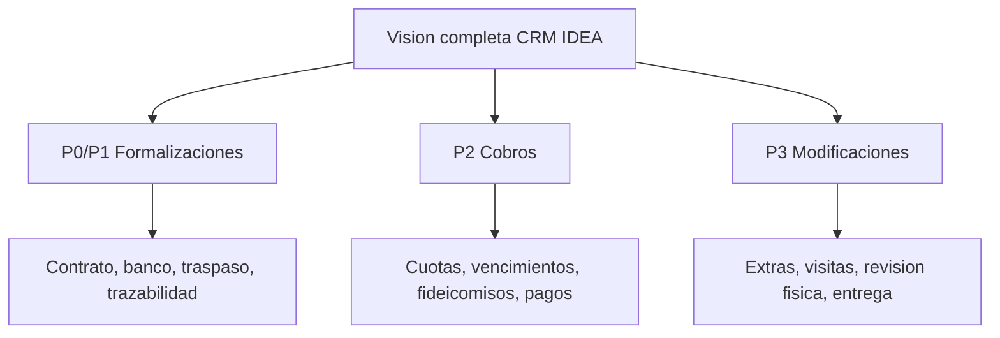

# 00 - Indice de Arquitectura API

## Proposito

Este indice permite navegar la documentacion tecnica del API del CRM.

La documentacion debe servir para ingenieros, analistas y usuarios de negocio. Cada documento debe explicar el objetivo en lenguaje claro y luego bajar al detalle tecnico cuando aplique.

## Lectura cero

Antes de leer cualquier otro documento, abrir:

```txt
00-Producto-CRM-TINK-y-P0.md
```

Si `00-Producto-CRM-TINK-y-P0.md` contradice a este indice, `AGENTS.md`, un modelo de datos, una skill o cualquier documento futuro, gana `00-Producto-CRM-TINK-y-P0.md` hasta que el dueno del producto apruebe una nueva version.

Regla documental: no crear documentos nuevos para resolver dudas de alcance sin retirar, fusionar o degradar otro documento. La ley `00-Producto-CRM-TINK-y-P0.md` manda.

## Regla de uso

Antes de crear codigo, tablas, migraciones, endpoints o integraciones, leer primero `00-Producto-CRM-TINK-y-P0.md`, despues este indice y luego los documentos relacionados.

## Lectura obligatoria P0-S1A por orden

0. `00-Producto-CRM-TINK-y-P0.md`
1. `27-Identidad-Usuarios-Roles-P0-S1.md`
2. `28-Matriz-Roles-Permisos-Areas-P0-S1.md`
3. `31-Contrato-Identidad-y-Permisos-P0-S1.md`
4. `33-Contrato-API-Identidad-P0-S1.md`

Si hay pelea entre estos documentos, gana `00-Producto-CRM-TINK-y-P0.md`.

## Consulta tecnica P0-S1A

Estos documentos se consultan solo cuando se revise MySQL, seguridad o bootstrap. No agregan alcance nuevo:

1. `24-Seguridad-Autenticacion-BFF-OIDC-Local.md`
2. `29-Modelo-Fisico-MySQL-Identidad-P0-S1.md`
3. `30-Identidad-Canonica-y-Referencias-Externas.md`
4. `32-Seeds-Identidad-P0-S1.md`
5. `Diccionario-Datos/01-Identidad-y-Permisos.md`
6. `SQL/001_identity_schema_p0_s1.sql`
7. `SQL/002_identity_seed_p0_s1.sql`
8. `21-P0-Direccion-Tecnica-Construccion-Pausada.md`
9. `22-Mapa-de-Implementacion-API.md`

## Lectura futura, fuera de P0-S1

Estos documentos existen para conservar vision, no para autorizar implementacion en P0-S1:

1. `16-Alcance-PDFs-y-Modularizacion-Dominios.md`
2. `17-Calendarios-por-Dominio-y-Supervision.md`
3. `18-Notas-Adhesivas-y-Anotaciones.md`
4. `23-Alcance-P0-Vertical-Leads.md`

Solo se leen cuando `00-Producto-CRM-TINK-y-P0.md` o una decision aprobada por el dueno del producto habilite ese alcance.

## Documentos

| Archivo | Para que sirve |
| --- | --- |
| `00-Producto-CRM-TINK-y-P0.md` | Ley superior de producto: que somos, que no somos, P0-S1 y prohibiciones actuales. |
| `01-Resumen-API.md` | Resume la decision tecnica principal del backend. |
| `02-Arquitectura-Backend.md` | Explica estructura NestJS, capas, modulos e integraciones. |
| `03-Base-Datos-y-Migracion.md` | Define MySQL, Kysely, migracion legacy y reglas de datos. |
| `04-Integraciones-ERP.md` | Explica como aislar ERP, Kapso, Microsoft 365, legacy CRM y otras integraciones externas por adapters. |
| `05-Seguridad-Auditoria-Observabilidad.md` | Define autenticacion, permisos, auditoria y trazabilidad. |
| `06-ADRs-API.md` | Guarda decisiones arquitectonicas aprobadas. |
| `07-Skills-Codex-Instaladas.md` | Lista skills locales y su uso esperado. |
| `08-Revision-Blueprint-y-Siguiente-Paso.md` | Resume revision del blueprint, pausa de runtime y prioridades antes de implementar. |
| `09-Decisiones-P0-Permisos-y-Preguntas.md` | Guarda decisiones P0 y preguntas abiertas/cerradas. |
| `10-Analisis-CRM-Actual-Roles-Leads.md` | Evidencia del CRM actual revisada en base/codigo. |
| `11-Contrato-Canonico-y-Normalizacion.md` | Regla de JSON canonico y nombres neutrales. |
| `12-Modelo-Datos-P0-MySQL-Kysely.md` | Modelo inicial normalizado de base de datos. |
| `13-Bitacora-Acciones-y-Timeline-Lead.md` | Reglas de bitacora, timeline, motivos y auditoria del lead. |
| `14-Diccionario-de-Datos-y-Modulos.md` | Diccionario inicial de tablas, modulos y acciones. |
| `15-Flujo-Comercial-Lead-a-Contrato.md` | Flujo oficial Lead -> Oportunidad -> Estimacion -> Orden de Venta -> Contrato. |
| `16-Alcance-PDFs-y-Modularizacion-Dominios.md` | Analiza los PDFs base y define separacion por dominios: ventas, formalizaciones, cobros, modificaciones y jefatura. |
| `17-Calendarios-por-Dominio-y-Supervision.md` | Define calendarios separados por dominio y vista consolidada de jefatura por permisos. |
| `18-Notas-Adhesivas-y-Anotaciones.md` | Define notas adhesivas/anotaciones como modulo transversal con permisos, auditoria, entidades relacionadas e integraciones. |
| `19-Reglas-Operativas-Leads-SLA-y-Perdida.md` | Define leads nuevos, requiere atencion, pausa/reactivacion, perdida, SLA y explicacion gerencial de indicadores. |
| `20-Pendientes-Decisiones-y-Preguntas-P0.md` | Lista decisiones cerradas, preguntas abiertas y pendientes criticos antes de codificar P0. |
| `21-P0-Direccion-Tecnica-Construccion-Pausada.md` | Documento corto de referencia P0 tecnica; no autoriza runtime hasta cerrar producto/modelo/contrato. |
| `22-Mapa-de-Implementacion-API.md` | Mapa practico de carpetas futuras, responsabilidades, dependencias permitidas y primer vertical slice del API. |
| `23-Alcance-P0-Vertical-Leads.md` | Alcance comercial futuro de leads: crear/listar/detalle con timeline y auditoria despues de cerrar identidad. |
| `24-Seguridad-Autenticacion-BFF-OIDC-Local.md` | Regla obligatoria de autenticacion BFF, cookies, Microsoft OIDC, login local, CORS, CSRF, headers, validacion y errores. |
| `25-Contrato-Canonico-Minimo-Lead-P0-S1.md` | Contrato minimo vivo de lead/contacto antes de convertirlo en modelo MySQL o DTOs. |
| `26-Estandar-Nombres-Base-Datos.md` | Regla oficial para nombres de base: prefijos por dominio, columnas con sufijo de entidad y cero nombres de proveedores externos. |
| `27-Identidad-Usuarios-Roles-P0-S1.md` | Primera compuerta P0-S1: usuarios, autenticacion, roles, permisos minimos y auditoria de acceso antes de modelar leads. |
| `28-Matriz-Roles-Permisos-Areas-P0-S1.md` | Matriz operable de roles, permisos, areas, alcances y overrides personales para que jefatura gestione acceso sin crear roles infinitos. |
| `29-Modelo-Fisico-MySQL-Identidad-P0-S1.md` | Modelo fisico MySQL de identidad: usuarios, login, roles, permisos, areas, ids externos y auditoria de seguridad. |
| `30-Identidad-Canonica-y-Referencias-Externas.md` | Regla transversal: relaciones internas por IDs propios del CRM y proveedores externos solo como referencias `int_`. |
| `31-Contrato-Identidad-y-Permisos-P0-S1.md` | Contrato aprobado de identidad P0-S1A: roles, areas, permisos efectivos, overrides directos, denegaciones y revocacion. Delegacion temporal queda fuera. |
| `32-Seeds-Identidad-P0-S1.md` | Datos iniciales aprobables para roles, permisos, areas, sistemas externos y usuario owner. Los seeds no se ejecutan en la validacion schema-only. |
| `33-Contrato-API-Identidad-P0-S1.md` | Contrato conceptual de sesion, usuario actual, roles, areas y permisos efectivos. No es OpenAPI ejecutable. |
| `Diccionario-Datos/01-Identidad-y-Permisos.md` | Diccionario de datos de identidad y permisos en lenguaje claro para ingenieria y negocio. |
| `SQL/001_identity_schema_p0_s1.sql` | Artefacto SQL controlado del esquema MySQL P0-S1 de identidad. Puede validarse mediante el runner schema-only autorizado por la ley vigente. |
| `SQL/002_identity_seed_p0_s1.sql` | Artefacto SQL controlado de seeds P0-S1 de identidad. No crea usuarios reales hasta confirmar owner. |

## Documentacion futura por carpeta

Cuando el proyecto avance, crear carpetas internas:

```txt
Diccionario-Datos/
Acciones/
Flujos/
Diagramas/
```

Regla: cada modulo grande debe tener su propio archivo. No mezclar leads, oportunidades, estimaciones, ordenes de venta y contratos en un unico documento gigante.

## Mapa rapido de implementacion

Antes de crear o modificar codigo del API, abrir:

```txt
00-Producto-CRM-TINK-y-P0.md
27-Identidad-Usuarios-Roles-P0-S1.md
28-Matriz-Roles-Permisos-Areas-P0-S1.md
31-Contrato-Identidad-y-Permisos-P0-S1.md
33-Contrato-API-Identidad-P0-S1.md
```

Esa lectura define:

- que se permite en identidad P0-S1A;
- que queda fuera;
- que contrato API conceptual debe respetarse;
- por que solo el runtime minimo de identidad esta autorizado y el runtime comercial sigue prohibido.

El siguiente slice aprobado en papel es identidad P0-S1A. El documento `23-Alcance-P0-Vertical-Leads.md` se consulta despues de aprobar avanzar mas alla de identidad.

## Flujo comercial oficial


Resumen para negocio:

Todo nace desde un lead. Si el cliente avanza, el lead pasa por oportunidad, luego estimacion, luego orden de venta y finalmente contrato firmado.

Resumen tecnico:

El API debe conservar historico y timeline de cada avance. Ningun estado o accion debe sobrescribir informacion sin dejar bitacora.

## Alcance por fases


