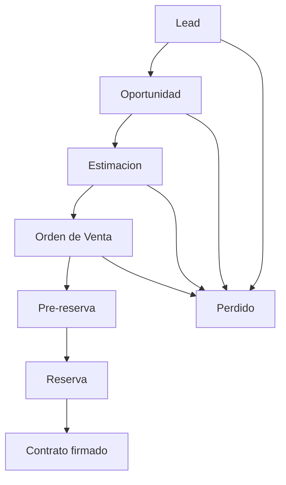
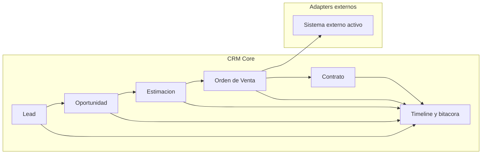
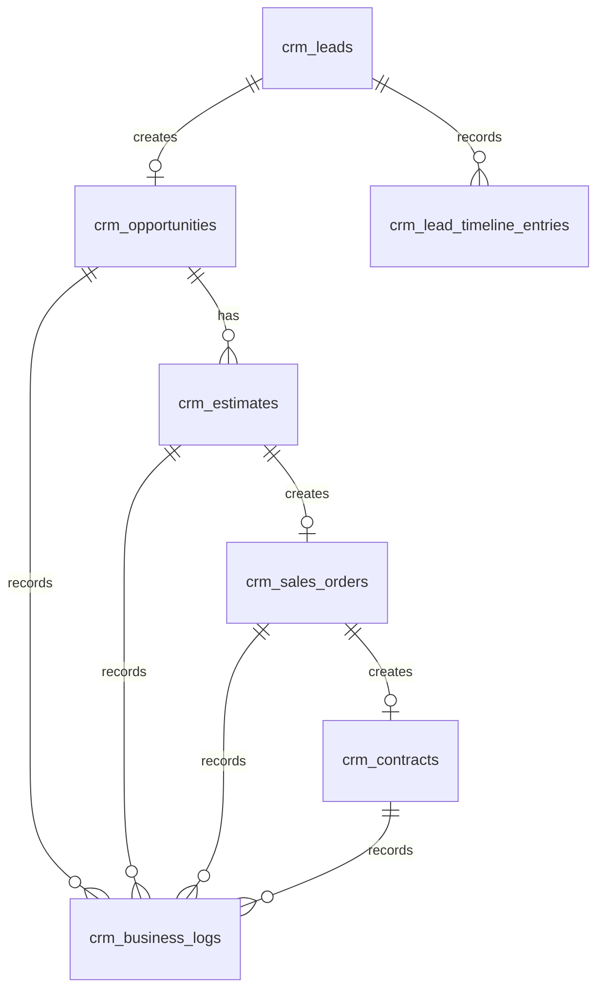

# 15 - Flujo Comercial: Lead a Contrato

## Veredicto

El flujo comercial oficial del CRM es lineal:

```txt
Lead -> Oportunidad -> Estimacion -> Orden de Venta -> Contrato firmado
```

Todo nace desde el lead.

No se debe crear una estimacion, orden de venta o contrato como entidad aislada sin relacion con el lead origen.

## Explicacion para negocio

Un cliente entra como lead.

Si muestra interes real, se trabaja como oportunidad.

Luego se le prepara una estimacion.

Si avanza, se crea una orden de venta.

Dentro de la orden de venta se puede marcar pre-reserva, reserva u otros hitos comerciales. Esos hitos tambien mueven el estado visible del lead para que los vendedores, supervisores y gerentes sepan en que punto esta el cliente.

Cuando el proceso termina correctamente, el lead llega a contrato firmado.

## Diagrama simple



## Diagrama con responsabilidades



## Reglas de dominio

1. Todo nace desde un lead.
2. La oportunidad nace desde un lead.
3. La estimacion nace desde una oportunidad.
4. La orden de venta nace desde una estimacion.
5. El contrato firmado nace desde una orden de venta.
6. Pre-reserva y reserva son hitos/estados dentro del avance de la orden de venta y del lead.
7. Reserva no es una entidad independiente en P0; es un estado/marca operacional de la orden de venta.
8. El lead debe reflejar el estado comercial actual para filtros y vistas.
9. Cada avance genera timeline.
10. Cada retroceso, caida o cambio manual genera timeline y audit cuando aplique.
11. Las aprobaciones dependen de permisos efectivos, no de una regla fija por rol.
12. El perfil del lead no tiene campos obligatorios globales para avanzar en P0, salvo reglas puntuales que el negocio defina despues.
13. El corredor puede cambiar despues de reserva o contrato, pero cada cambio debe quedar registrado.

## Estados del lead relacionados con el flujo

```txt
interesado
seguimiento
oportunidad
pre_reserva
reserva
contrato
perdido
```

Estos estados son visibles para operacion y reporteria. No sustituyen las entidades comerciales.

Ejemplo:

- Un lead puede tener estado `reserva`.
- La reserva vive como hito dentro de la orden de venta.
- La orden de venta conserva los campos propios del proceso comercial.
- El timeline explica cuando y quien marco la reserva.

## Entidades principales

### Lead

Entidad origen del proceso comercial.

Responsabilidades:

- guardar contacto principal;
- propietario/vendedor;
- estado actual;
- proyecto;
- campana;
- origen;
- relacion con oportunidad cuando avance.

### Oportunidad

Representa que el lead ya tiene potencial comercial real.

Responsabilidades:

- agrupar el trabajo comercial posterior;
- permitir estimaciones;
- medir avance del vendedor;
- mantener relacion con lead origen.

### Estimacion

Representa propuesta o cotizacion comercial.

Responsabilidades:

- nacer desde oportunidad;
- tener estado propio;
- poder enviarse, actualizarse, caerse o avanzar;
- generar timeline.

Estados iniciales sugeridos:

```txt
draft
sent
accepted
rejected
expired
cancelled
```

### Orden de Venta

Representa la preparacion formal de la venta.

Responsabilidades:

- nacer desde una estimacion;
- contener campos de reserva/pre-reserva cuando aplique;
- sincronizarse con el sistema externo activo por adapter;
- tener estado propio;
- mover estado visible del lead cuando aplique.

Estados iniciales sugeridos:

```txt
draft
pre_reserved
reserved
sent_to_external_system
confirmed
cancelled
fallen
```

### Contrato

Representa firma/cierre del proceso.

Responsabilidades:

- nacer desde orden de venta;
- guardar datos del cierre;
- asociar documentos cuando existan;
- mover el lead a estado contrato;
- generar timeline.

Estados iniciales sugeridos:

```txt
pending_signature
signed
voided
cancelled
```

## Relacion entre entidades



## Tablas esperadas

```txt
crm_leads
crm_opportunities
crm_estimates
crm_sales_orders
crm_contracts
crm_lead_status_history
crm_lead_timeline_entries
crm_lead_field_changes
crm_business_logs
crm_audit_logs
int_outbox_event
int_external_reference
```

## Timeline obligatorio por avance

| Cambio | Timeline requerido |
| --- | --- |
| Lead creado | `lead_created` |
| Lead pasa a oportunidad | `opportunity_created` + `status_changed` |
| Estimacion creada | `estimate_created` |
| Estimacion enviada | `estimate_sent` |
| Estimacion aceptada | `estimate_accepted` |
| Orden de venta creada | `sales_order_created` |
| Pre-reserva marcada | `sales_order_pre_reserved` + `status_changed` |
| Reserva marcada | `sales_order_reserved` + `status_changed` |
| Orden enviada a sistema externo | `sales_order_synced` |
| Contrato firmado | `contract_signed` + `status_changed` |
| Lead perdido | `lead_lost` + `status_changed` |

## Permisos

Las aprobaciones no dependen de un rol fijo.

Regla:

```txt
roles + permisos directos - denegaciones = permisos efectivos
```

Permisos iniciales sugeridos:

```txt
opportunity.create
estimate.create
estimate.update
estimate.approve
estimate.cancel
sales_order.create
sales_order.update
sales_order.reserve
sales_order.cancel
contract.create
contract.sign
contract.void
```

## Perfil del lead

En P0 no hay campos globalmente obligatorios del perfil para avanzar de estado.

Si un modulo futuro requiere datos especificos, esa regla debe documentarse en el archivo del modulo y validarse por el API.

Ejemplo:

```txt
Para crear estimacion se podria requerir moneda o proyecto.
Para contrato se podria requerir identificacion.
```

Pero no se debe inventar esa obligacion hasta que negocio la confirme.

## Corredor

El corredor puede cambiar despues de reserva o contrato.

Reglas:

- asignar corredor genera timeline;
- cambiar corredor genera timeline con anterior/nuevo;
- retirar corredor genera timeline;
- si el cambio afecta comision o reporte, debe generar business log;
- no bloquear cambio por estado salvo regla futura documentada.

## Integracion externa

Cuando la orden de venta se marca como reserva o se envia a sistema externo:

- el frontend sigue usando contrato canonico;
- el API guarda primero los datos propios;
- el API registra timeline;
- el API crea outbox event;
- el adapter externo traduce el payload canonico;
- errores externos quedan registrados sin borrar la operacion interna.

## Preguntas cerradas

| Pregunta | Decision |
| --- | --- |
| Donde nace todo? | Todo nace desde lead. |
| Orden comercial oficial? | Lead -> Oportunidad -> Estimacion -> Orden de Venta -> Contrato. |
| Reserva es una entidad separada? | No en P0. Es estado/marca dentro de orden de venta y estado visible del lead. |
| Pre-reserva/reserva/contrato tienen diferencia estructural? | Son hitos de avance; la diferencia principal es el estado/marca registrada. |
| Quien aprueba o cae estimaciones? | Depende de permisos efectivos por rol, permiso directo o denegacion. Delegacion temporal queda para fase posterior. |
| Hay campos obligatorios globales del perfil para avanzar? | No en P0. |
| Puede cambiar corredor despues de reserva/contrato? | Si, con timeline y auditoria. |

## Preguntas pendientes para detalle futuro

Estas no bloquean la arquitectura base:

1. Campos exactos de una estimacion.
2. Campos exactos de una orden de venta.
3. Documentos requeridos para contrato.
4. Reglas de comision por corredor.
5. Estados finales exactos para estimacion caida/anulada/vencida.
6. Reportes gerenciales esperados por oportunidad, estimacion y orden de venta.
