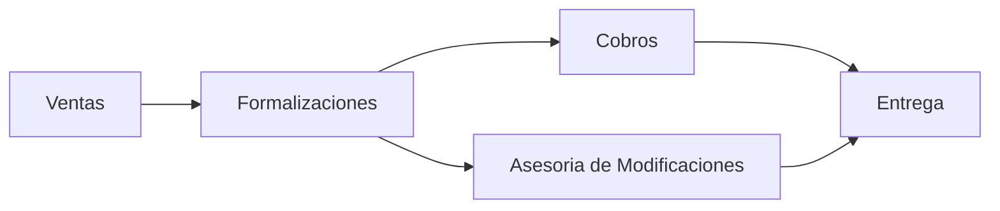
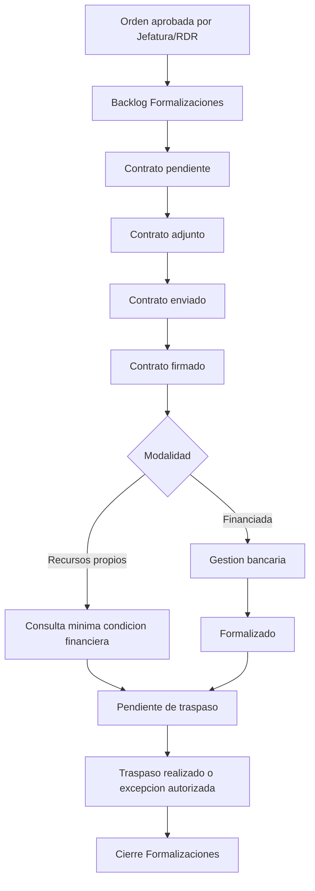

# 16 - Alcance de PDFs y Modularizacion por Dominios

## Veredicto

La arquitectura debe estar preparada para el Customer Journey completo descrito en `CRM IDEA.pdf`, pero la implementacion inicial debe respetar el alcance reducido del `RESUMEN_EJECUTIVO_CRM_TINK AJUSTADO (1).pdf`.

Decision:

- P0/P1 inicial: Formalizaciones.
- Futuro: Cobros y Asesoria de Modificaciones.
- La arquitectura se disena desde el inicio con modulos separados para no mezclar ventas, formalizaciones, cobros, modificaciones, jefatura, documentos, calendario e integraciones.
- No se debe crear una tabla gigante ni un modulo unico que contenga todo.
- Lo compartido se ubica en modulos comunes solo cuando realmente lo usan varios dominios.

## Fuentes internas revisadas

### CRM IDEA.pdf

Documento funcional inicial. Define una vision amplia:

- Ventas llega hasta orden de venta, cierre firmado y aprobaciones.
- Formalizaciones gestiona contrato, banco, cancelacion, traspaso y entrega.
- Cobros gestiona prereservas, reservas, cuotas, vencimientos, fideicomisos, extras e integracion financiera.
- Asesoria de Modificaciones gestiona bienvenida, reunion de extras, versionamiento, visitas de obra, revision fisica y entrega de llaves.
- Orden de Venta debe evolucionar a expediente vivo de la compra.
- Accion ejecutada en CRM debe generar estado, fecha, hora y responsable.
- Todo cambio relevante debe conservar usuario, fecha/hora, estado anterior/nuevo y documento de respaldo cuando aplique.

### RESUMEN_EJECUTIVO_CRM_TINK AJUSTADO (1).pdf

Documento ajustado de alcance. Reduce la primera entrega:

- Formalizaciones es la unica fase inicial.
- Cobros queda fuera de la primera etapa.
- Modificaciones queda fuera de la primera etapa.
- NetSuite sigue como sistema operativo de cobros.
- Contrato se adjunta/envia desde el CRM; no es prioridad generarlo automaticamente.
- KPIs se trabajan al final de Formalizaciones.
- Estimacion inicial: 352 horas.

Conclusion tecnica:

La arquitectura debe incluir boundaries para Cobros y Modificaciones desde el diseno, pero no debe implementar sus flujos como P0 si el alcance aprobado es Formalizaciones.

## Principio rector

El CRM trabaja sobre un expediente comercial vivo.

Ese expediente nace en ventas y se extiende a postventa:



La Orden de Venta es el punto de union operativo cuando existe.

## Bounded contexts del API

```txt
src/modules/crm/
+-- sales/
+-- formalizations/
+-- collections/
+-- modifications/
+-- management/
+-- documents/
+-- calendar/
+-- communications/
+-- customer-journey/
+-- reporting/
+-- identity/
+-- permissions/
+-- audit/
+-- configuration/
```

### sales

Responsabilidad:

- lead;
- oportunidad;
- estimacion;
- orden de venta;
- contrato/cierre comercial;
- aprobaciones de ventas;
- traspaso al flujo de Formalizaciones.

No debe manejar:

- estados internos de formalizacion bancaria;
- pagos y cuotas;
- extras y visitas de obra;
- reglas de entrega de llaves.

### formalizations

Responsabilidad P0:

- backlog de ordenes aprobadas;
- contrato adjunto;
- envio de contrato;
- contrato firmado;
- modalidad de compra;
- banco;
- asesor bancario;
- estado de credito;
- consulta minima a integracion financiera;
- traspaso;
- cierre de Formalizaciones;
- excepciones como traspaso pendiente autorizado.

No debe manejar:

- cobro operativo de cuotas;
- modificacion de extras;
- revision fisica de unidades;
- entrega de llaves si pertenece a fase posterior.

### collections

Responsabilidad futura:

- prereservas;
- reservas financieras;
- obligaciones;
- cuotas proximas a vencer;
- pagos vencidos;
- fideicomisos;
- extras pendientes de cobro;
- intereses por mora;
- condicion 100% cancelada;
- seguimiento financiero visible en CRM sin duplicar el ERP.

Regla:

NetSuite u otro ERP sigue siendo fuente financiera oficial hasta decision contraria.

### modifications

Responsabilidad futura:

- bienvenida;
- reunion de extras;
- catalogo de extras por proyecto;
- extras no estandar;
- versionamiento de boletas;
- aprobacion de extras;
- visitas contractuales y adicionales;
- revision fisica;
- unidad aceptada;
- coordinacion de entrega de llaves cuando aplique.

### management

Responsabilidad:

- vistas de jefatura;
- aprobaciones;
- excepciones;
- supervision transversal;
- reasignaciones;
- permiso temporal/delegado;
- indicadores gerenciales.

No debe ser una copia de todos los modulos. Debe orquestar decisiones y lectura agregada.

### documents

Responsabilidad:

- referencias a OneDrive;
- adjuntos del expediente;
- contrato adjunto;
- respaldo de aprobaciones;
- comprobantes;
- documentos de extras;
- metadata y validaciones de documentos obligatorios.

Regla:

El CRM guarda referencias/metadata. No duplicar archivos pesados salvo decision tecnica explicita.

### calendar

Responsabilidad:

- eventos vinculados a cliente, lead, oportunidad u orden;
- calendarios separados por dominio operativo;
- calendario de ventas para eventos de leads y gestion comercial;
- calendario de Formalizaciones para contrato, firma, banco y traspaso;
- calendarios futuros de Cobros y Modificaciones;
- vista consolidada de Jefatura/Gerencia segun permisos efectivos;
- firma de credito bancaria;
- reunion de extras;
- visitas de obra;
- entrega de llaves;
- reprogramaciones;
- historial de cambios de fecha.

Regla:

No mezclar fisica ni funcionalmente el calendario de vendedores con calendarios de otros departamentos. Jefatura ve una vista agregada filtrada por permisos, no un calendario unico mezclado.

### communications

Responsabilidad:

- plantillas de correo;
- registro de envio;
- WhatsApp;
- recordatorios;
- trazabilidad de comunicacion.

Regla:

Automatizar solo cuando la regla sea inequivoca. Si hay riesgo operativo compartido, dejar comunicacion manual.

### customer-journey

Responsabilidad:

- vista integral de donde esta la compra;
- quien tiene la siguiente accion;
- que condicion bloquea el avance;
- eventos transversales entre modulos.

No debe contener logica profunda de cada modulo. Debe consultar y componer.

### reporting

Responsabilidad:

- tiempos de ciclo;
- antiguedad de backlogs;
- entregas por periodo/proyecto;
- cuellos de botella por area;
- KPIs de formalizaciones;
- indicadores gerenciales.

### identity, permissions, audit, configuration

Modulos transversales.

Responsabilidad:

- usuarios;
- roles;
- permisos efectivos;
- delegaciones;
- denegaciones;
- auditoria;
- catalogos;
- reglas configurables;
- parametros por proyecto.

## Regla de carpetas

Cada modulo debe tener su propia estructura interna:

```txt
module-name/
+-- domain/
+-- application/
+-- infrastructure/
+-- presentation/
+-- docs/
+-- tests/
```

Ejemplo:

```txt
formalizations/
+-- domain/
+-- application/
+-- infrastructure/
+-- presentation/
+-- docs/
+-- tests/
```

## Regla de no mezclar responsabilidades

Prohibido:

- guardar campos de Formalizaciones dentro de una tabla generica gigante de leads;
- poner reglas de Cobros dentro de ventas;
- poner extras o visitas dentro de formalizaciones;
- meter toda la logica en `sales-orders`;
- usar `customer-journey` como modulo para escribir en todo;
- crear helpers globales para reglas que pertenecen a un dominio.

Permitido:

- compartir permisos, auditoria, documentos, eventos, calendario y configuracion;
- usar puertos/interfaces para consultar otro dominio;
- publicar eventos de dominio para que otro modulo reaccione;
- componer vistas agregadas desde `customer-journey`.

## Eventos transversales

Los modulos se comunican por eventos internos, no por acceso directo a tablas ajenas.

Eventos base:

```txt
sales_order_approved
contract_attached
contract_sent
contract_signed
bank_process_started
bank_process_formalized
transfer_completed
total_balance_paid
unit_physically_accepted
keys_delivered
extras_approved
trust_process_started
trust_opened
```

Cada evento debe generar:

- timeline cuando afecte expediente/lead/orden;
- audit log si es sensible;
- outbox si requiere integracion externa;
- notificacion si otro modulo debe actuar.

## Flujo P0 de Formalizaciones



## Dashboards/banners P0 de Formalizaciones

Los banners deben estar separados del flujo de ventas:

```txt
contratos_pendientes
contratos_enviados_pendientes_firma
formalizacion_bancaria_sin_iniciar
formalizacion_bancaria_en_proceso
pendientes_de_traspaso
traspaso_pendiente_autorizado
cerrados_formalizaciones
```

## Modulos preparados pero fuera de P0

### Cobros

Debe quedar como boundary, no como desarrollo inicial.

Estados/temas futuros:

- prereserva sin orden;
- vinculacion posterior a orden;
- proximos a vencer;
- pagos vencidos;
- fideicomisos pendientes;
- extras pendientes de cobro;
- intereses;
- 100% cancelado.

### Modificaciones

Debe quedar como boundary, no como desarrollo inicial.

Estados/temas futuros:

- bienvenida;
- reunion de extras;
- boletas versionadas;
- extras aprobadas;
- visitas contractuales;
- visita adicional con pago/respaldo;
- revision fisica;
- unidad aceptada;
- entrega de llaves.

## Comparacion con CRMs/ERPs maduros

La decision de separar por dominios coincide con patrones de productos maduros:

- Dynamics 365 maneja lead, oportunidad, cotizacion, orden e invoice como entidades del proceso comercial, no como una sola tabla.
- Odoo separa CRM, Sales, documentos, facturacion y actividades, pero conserva continuidad entre oportunidad, cotizacion y orden.
- Salesforce permite crear contratos desde oportunidad, orden o quote mediante mapeos, manteniendo objetos especializados.
- NetSuite distingue oportunidad, estimate y sales order, y usa esos registros para forecast y operacion comercial.

Conclusion:

El CRM TINK debe conservar continuidad del expediente, pero con ownership separado por modulo.

## Reglas para decisiones futuras

Antes de implementar Cobros o Modificaciones:

1. Crear documento funcional del modulo.
2. Crear diccionario de tablas del modulo.
3. Definir permisos y roles.
4. Definir eventos que recibe y emite.
5. Definir que datos vienen del ERP.
6. Definir que datos son fuente oficial del CRM.
7. Definir timeline y audit obligatorio.
8. Definir reportes y filtros.
9. Definir que queda fuera de alcance.

## Preguntas que siguen abiertas

Estas preguntas no bloquean P0 de Formalizaciones:

1. Que datos exactos de saldo/condicion financiera se consultaran al ERP en P0?
2. La aprobacion de RDR existe como estado propio, permiso o evento externo?
3. Que documento minimo es obligatorio para poder enviar contrato?
4. Como se valida que un correo fue realmente enviado y no solo abierto?
5. Que campos exactos componen la modalidad de compra?
6. Que excepciones de traspaso puede aprobar Jefatura?
7. Que KPI de Formalizaciones se considera obligatorio para salida inicial?
