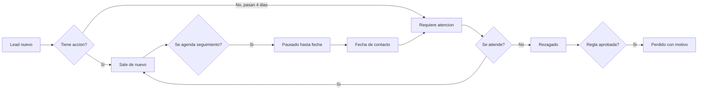

# 19 - Reglas Operativas de Leads, SLA y Perdida

## Veredicto ejecutivo

El jefe debe poder responder rapidamente:

```txt
Cuantos leads nuevos hay?
Cuantos requieren atencion?
Por que se perdieron?
Quien los mando a perdido?
Cuando se hizo la ultima accion?
Que leads estan pausados y cuando se reactivan?
Que vendedor tiene acumulacion de leads sin atender?
```

Para lograrlo, el CRM nuevo no debe depender de numeros ambiguos como `accion_lead = 6` o `estado_lead = 1`.

Debe usar reglas canonicas, estados legibles, fechas reales, bitacora completa y reportes por vendedor, supervisor, proyecto, motivo y fecha.

## Evidencia del CRM actual

Revision read-only de produccion actual:

```txt
32_OBTENER_TODOS_LOS_LEADS_NUEVOS
34_CONSULTAR_LEADS_PENDIENTES_ATENCION
35_OBTENER_LEADS_REZAGADOS
autoLoseUncontactedLeads.js
```

Hallazgos:

- Leads nuevos se consultan por `accion_lead IN (0, 2)`, `estado_lead = 1` y `segimineto_lead = '01-LEAD-INTERESADO'`.
- Leads que requieren atencion se consultan con `accion_lead = 6`, `estado_lead = 1`, `seguimiento_calendar = 0`, mas de 4 dias desde `actualizadaaccion_lead` y sin evento pendiente.
- Leads rezagados se consultan con `accion_lead = 7`.
- Existe un proceso automatico que pasa algunos leads nuevos a perdido despues de mas de 7 dias sin seguimiento en `01-LEAD-INTERESADO`.
- La tabla `leads` mezcla estado, accion, seguimiento, calendario, motivo y fechas como texto.

Decision:

El CRM nuevo debe conservar la intencion del negocio, pero no copiar la forma legacy.

## Estados operativos canonicos

### Estado comercial del lead

Representa donde esta el lead en el flujo comercial.

```txt
interested
follow_up
opportunity
pre_reservation
reservation
contract
lost
```

Equivalencias legacy iniciales:

| Legacy | Nuevo |
| --- | --- |
| `01-LEAD-INTERESADO` | `interested` |
| `08-LEAD-SEGUIMIENTO` | `follow_up` |
| `02-LEAD-OPORTUNIDAD` | `opportunity` |
| `03-LEAD-PRE-RESERVA` | `pre_reservation` |
| `04-LEAD-RESERVA` | `reservation` |
| `05-LEAD-CONTRATO` | `contract` |
| `07-LEAD-PERDIDO` | `lost` |

### Estado operativo del lead

Representa si el lead debe mostrarse o trabajarse.

```txt
active
new
needs_attention
paused
reactivation_due
stale
closed
lost
```

Regla:

El estado comercial y el estado operativo son diferentes.

Ejemplo:

```txt
Lead comercial: follow_up
Lead operativo: paused
Fecha de reactivacion: 2026-10-05
```

## Regla de lead nuevo

Un lead es nuevo cuando:

- acaba de entrar al CRM;
- esta activo;
- no tiene ninguna accion comercial significativa registrada;
- no tiene una oportunidad, estimacion, orden o contrato;
- no esta perdido;
- no esta pausado.

El lead deja de ser nuevo cuando ocurre cualquier accion comercial significativa:

```txt
nota de contacto
llamada registrada
WhatsApp enviado o recibido
correo enviado
evento creado
cita creada
cambio de estado
asignacion manual relevante
creacion de oportunidad
marcado como perdido
pausa de seguimiento
```

La accion debe generar timeline.

## Regla de requiere atencion

Un lead requiere atencion cuando:

- esta activo;
- no esta perdido;
- no esta pausado;
- no tiene evento pendiente futuro que cubra el seguimiento;
- no tiene accion comercial significativa en los ultimos 4 dias;
- no esta en oportunidad, pre-reserva, reserva o contrato, salvo regla especifica futura.

Regla temporal P0:

```txt
4 dias naturales desde la ultima accion comercial significativa.
Zona horaria: America/Costa_Rica.
```

Decision P0:

```txt
Los 4 dias son naturales en P0.
Si negocio cambia a dias habiles, se debe registrar un ADR y ajustar SLA/politicas.
```

## Regla de pausa o inactivacion temporal

Un lead puede pausarse cuando sigue vivo, pero no debe aparecer como requiere atencion hasta una fecha futura.

Nombre recomendado:

```txt
paused_until
```

Reglas:

- pausar no es perder el lead;
- pausar requiere motivo;
- pausar requiere fecha de reactivacion;
- pausar genera timeline;
- al llegar la fecha, el lead pasa a `reactivation_due`;
- si al reactivarse no se atiende, entra a `needs_attention` segun SLA;
- una jefatura debe poder ver leads pausados por vendedor, fecha y motivo.

Motivos iniciales:

```txt
customer_requested_future_contact
waiting_for_customer_response
waiting_for_documents
waiting_for_project_information
customer_out_of_country
customer_needs_time
other
```

## Regla de perdida

Todo lead enviado a perdido debe tener:

- motivo obligatorio;
- detalle obligatorio si el motivo es `other`;
- actor;
- rol efectivo;
- fecha/hora Costa Rica;
- seccion desde donde se ejecuto;
- estado anterior;
- estado nuevo;
- si fue manual, automatico o por integracion;
- si habia eventos pendientes;
- si tenia oportunidad, estimacion u orden relacionada;
- si debe notificarse a supervisor o jefatura.

No se permite mandar un lead a perdido sin dejar explicacion entendible para jefatura.

Motivos canonicos iniciales:

```txt
budget
location
not_what_customer_wanted
rent_only
duplicate
invalid_phone
no_whatsapp
better_offer
labor_reason
personal_reason
financial_reason
not_credit_subject
no_response
follow_up_failure
customer_rejected_information
test_or_mistake
other
```

## Perdida automatica

Regla P0 aprobada:

- no mandar a perdido automaticamente en P0;
- P0 solo alerta, lista y deja evidencia para jefatura;
- antes de perdida automatica, el lead debe pasar por `needs_attention`;
- si existe perdida automatica, debe tener configuracion auditable por proyecto/equipo;
- toda perdida automatica debe aparecer en reporte gerencial.

Estado recomendado de job:

```txt
active -> needs_attention -> stale -> lost
```

El tiempo para pasar de `stale` a `lost` queda fuera de P0 y requiere aprobacion posterior de jefatura.

## Modelo de datos propuesto

### crm_lead_operational_state

Estado operativo actual del lead.

```sql
CREATE TABLE crm_lead_operational_state (
  id BIGINT UNSIGNED NOT NULL AUTO_INCREMENT,
  lead_id BIGINT UNSIGNED NOT NULL,
  operational_status VARCHAR(80) NOT NULL,
  last_meaningful_action_at DATETIME(3) NULL,
  last_meaningful_action_type VARCHAR(100) NULL,
  needs_attention_since DATETIME(3) NULL,
  paused_until DATETIME(3) NULL,
  pause_reason_code VARCHAR(100) NULL,
  reactivation_due_at DATETIME(3) NULL,
  stale_since DATETIME(3) NULL,
  updated_at DATETIME(3) NOT NULL DEFAULT CURRENT_TIMESTAMP(3) ON UPDATE CURRENT_TIMESTAMP(3),
  PRIMARY KEY (id),
  UNIQUE KEY uq_crm_lead_operational_state_lead (lead_id),
  KEY ix_crm_lead_operational_status_updated (operational_status, updated_at),
  KEY ix_crm_lead_operational_attention (operational_status, needs_attention_since),
  KEY ix_crm_lead_operational_reactivation (operational_status, reactivation_due_at),
  CONSTRAINT fk_crm_lead_operational_state_lead FOREIGN KEY (lead_id) REFERENCES crm_leads(id)
) ENGINE=InnoDB DEFAULT CHARSET=utf8mb4 COLLATE=utf8mb4_0900_ai_ci;
```

### crm_lead_loss_records

Explicacion formal de cada perdida.

```sql
CREATE TABLE crm_lead_loss_records (
  id BIGINT UNSIGNED NOT NULL AUTO_INCREMENT,
  lead_id BIGINT UNSIGNED NOT NULL,
  loss_reason_code VARCHAR(100) NOT NULL,
  loss_detail TEXT NULL,
  lost_by_user_id BIGINT UNSIGNED NULL,
  lost_with_role_code_snapshot VARCHAR(80) NULL,
  source_type VARCHAR(80) NOT NULL,
  source_section VARCHAR(120) NULL,
  previous_status_code VARCHAR(80) NULL,
  lost_at DATETIME(3) NOT NULL,
  created_at DATETIME(3) NOT NULL DEFAULT CURRENT_TIMESTAMP(3),
  PRIMARY KEY (id),
  KEY ix_crm_lead_loss_records_lead_lost_at (lead_id, lost_at),
  KEY ix_crm_lead_loss_records_reason_lost_at (loss_reason_code, lost_at),
  KEY ix_crm_lead_loss_records_user_lost_at (lost_by_user_id, lost_at),
  CONSTRAINT fk_crm_lead_loss_records_lead FOREIGN KEY (lead_id) REFERENCES crm_leads(id),
  CONSTRAINT fk_crm_lead_loss_records_user FOREIGN KEY (lost_by_user_id) REFERENCES sec_user(id)
) ENGINE=InnoDB DEFAULT CHARSET=utf8mb4 COLLATE=utf8mb4_0900_ai_ci;
```

### crm_lead_sla_policies

Configuracion de tiempos por proyecto/equipo.

```sql
CREATE TABLE crm_lead_sla_policies (
  id BIGINT UNSIGNED NOT NULL AUTO_INCREMENT,
  code VARCHAR(100) NOT NULL,
  name VARCHAR(160) NOT NULL,
  domain_code VARCHAR(80) NOT NULL DEFAULT 'sales',
  project_id BIGINT UNSIGNED NULL,
  team_id BIGINT UNSIGNED NULL,
  attention_after_days INT NOT NULL DEFAULT 4,
  stale_after_days INT NULL,
  auto_loss_after_days INT NULL,
  is_active TINYINT(1) NOT NULL DEFAULT 1,
  created_at DATETIME(3) NOT NULL DEFAULT CURRENT_TIMESTAMP(3),
  updated_at DATETIME(3) NOT NULL DEFAULT CURRENT_TIMESTAMP(3) ON UPDATE CURRENT_TIMESTAMP(3),
  PRIMARY KEY (id),
  UNIQUE KEY uq_crm_lead_sla_policies_code (code),
  KEY ix_crm_lead_sla_policies_scope (domain_code, project_id, team_id, is_active)
) ENGINE=InnoDB DEFAULT CHARSET=utf8mb4 COLLATE=utf8mb4_0900_ai_ci;
```

## Flujo principal



## Dashboard ejecutivo

Tarjetas minimas:

| Tarjeta | Regla |
| --- | --- |
| Leads nuevos | Leads sin accion significativa. |
| Leads requieren atencion | Leads activos sin accion en 4 dias y sin evento pendiente. |
| Leads pausados | Leads con fecha futura de reactivacion. |
| Leads reactivados hoy | Leads que vuelven a bandeja hoy. |
| Leads perdidos | Leads con perdida registrada y motivo. |
| Perdidas por motivo | Ranking de razones para jefatura. |
| Perdidas por vendedor | Control por equipo y vendedor. |

## Decisiones y ajustes pendientes

| Pregunta | Recomendacion |
| --- | --- |
| Los 4 dias son naturales o habiles? | Cerrado: naturales en P0. |
| Quien puede pausar leads? | Cerrado: persona asignada; supervisor/gerente por permiso. |
| Quien puede mandar a perdido? | Cerrado: persona asignada; supervisor/gerente por permiso. |
| Perdida automatica queda activa desde P0? | Cerrado: no se activa en P0. |
| Un lead pausado puede tener eventos? | Si, pero no debe aparecer como requiere atencion hasta la fecha pactada. |
| Debe notificarse al supervisor cuando se pierde un lead? | Pendiente: definir motivos criticos y canal de notificacion. |
| Cual es la pausa maxima sin aprobacion? | Pendiente: definir limite por permiso. |

## Regla final

Todo numero del dashboard debe poder abrirse y explicar su origen.

Si el jefe ve "288 leads requieren atencion", debe poder entrar y ver:

- cuales son;
- desde cuando requieren atencion;
- vendedor responsable;
- ultima accion;
- si tienen evento pendiente;
- si estuvieron pausados;
- que debe hacerse despues.
