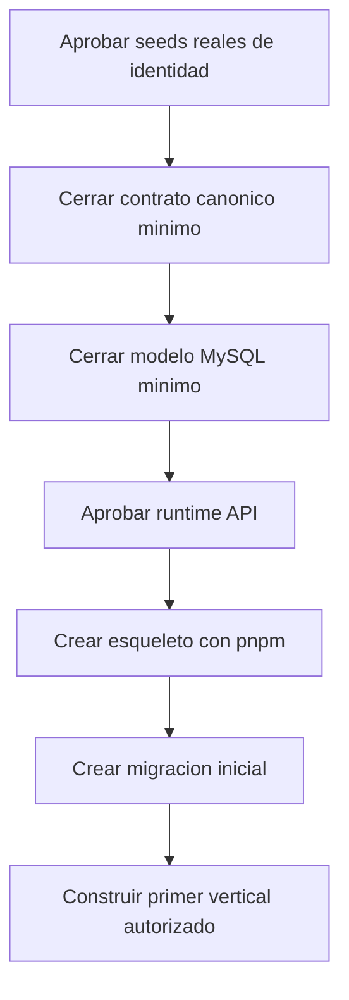

# 20 - Pendientes, Decisiones y Preguntas P0

## Veredicto ejecutivo

La arquitectura base ya tiene direccion clara:

```txt
NestJS + MySQL + Kysely + React
CRM core propio
NetSuite/Odoo/Kapso/Microsoft 365 por adapters
base normalizada
bitacora total
permisos fuertes
dashboard explicable
```

Lo que falta no es elegir tecnologia principal. Varias reglas P0 ya quedaron cerradas como direccion, pero no autorizan runtime todavia.

La compuerta de identidad ya tiene contrato, modelo fisico y seeds propuestos.

La decision de identidad queda cerrada a nivel de arquitectura. El unico bloqueo antes de crear usuarios reales es tener datos reales, no inventados:

- primer `owner`;
- `jefe_general`;
- procedimiento seguro para activar login local.

## Pendientes criticos antes de codificar runtime

| Area | Falta definir | Riesgo si no se define |
| --- | --- | --- |
| Identidad | Aprobar `32-Seeds-Identidad-P0-S1.md` y confirmar usuario owner/jefe general reales. | La migracion podria inventar usuarios, correos o permisos iniciales. |
| Pausa de lead | Dias maximos permitidos antes de requerir aprobacion. | Vendedores podrian ocultar leads indefinidamente. |
| Reasignacion | Que pasa con pausas/eventos si cambia el vendedor. | Seguimientos perdidos o duplicados. |
| Motivos | Catalogo final de motivos por accion y por perdida. | Bitacora desordenada como el CRM actual. |
| Dashboard | Filtros exactos de jefatura para primera version. | Pantalla bonita pero poco util. |
| Permisos | Matriz final por rol, permiso directo y denegacion. | Usuarios viendo o ejecutando acciones incorrectas. |
| Integraciones | Que flujos van a NetSuite, Kapso y Microsoft 365 desde P0. | Acoplamiento o retrabajo. |
| Migracion | Que datos historicos se migran y que se consulta desde legacy. | Doble fuente confusa. |

## Decisiones ya cerradas

| Decision | Estado |
| --- | --- |
| Base nueva MySQL `CRM_THINK_V2`. | Cerrada. |
| Acceso SQL con Kysely + mysql2. | Cerrada. |
| Sin Docker. | Cerrada. |
| Frontend en espanol para Costa Rica. | Cerrada. |
| Microsoft como login principal, correo/clave como alternativa. | Cerrada. |
| Login local desde P0-S1. | Cerrada como alternativa controlada; no se permiten contrasenas reales en migracion. |
| JSON canonico sin nombres NetSuite/Odoo/Kapso en frontend. | Cerrada. |
| Integraciones por adapters. | Cerrada. |
| NetSuite sistema externo inicial. | `active`. |
| Odoo sistema externo previsto desde P0-S1. | `pending`, preparado pero no operativo. |
| CRM actual/viejo como sistema externo de migracion/consulta. | `legacy_crm` nace `active` para lectura o migracion controlada. |
| DB normalizada por defecto. | Cerrada. |
| Bitacora obligatoria para todo lead. | Cerrada. |
| Calendarios separados por dominio. | Cerrada. |
| Notas adhesivas como modulo transversal auditable. | Cerrada. |
| La persona asignada al lead ejecuta acciones normales del lead. | Cerrada. |
| 4 dias para requiere atencion se toman como dias naturales en P0. | Cerrada. |
| Lead nuevo sale de nuevo con cualquier accion significativa. | Cerrada. |
| Vendedor/persona asignada puede pausar, reactivar y mandar a perdido sus leads. | Cerrada. |
| Perdida requiere motivo y explicacion obligatoria. | Cerrada. |
| Reversion de perdido requiere permiso superior. | Cerrada. |
| Perdida automatica queda apagada en P0; solo se alerta y reporta. | Cerrada. |
| Todo dashboard debe tener detalle filtrado. | Cerrada. |
| Contrato de identidad y permisos P0-S1. | Cerrada en `31-Contrato-Identidad-y-Permisos-P0-S1.md`. |
| Seeds propuestos de identidad P0-S1. | Propuestos en `32-Seeds-Identidad-P0-S1.md`; pendientes de aprobacion final. |
| `owner` y `jefe_general`. | Deben ser responsabilidades separadas. No se inventan usuarios reales. |
| Login local inicial. | Se activa por invitacion/reset seguro; no se seedearan passwords ni hashes manuales. |

## Pendientes de datos reales antes de bootstrap de usuarios

1. Cual es el correo oficial del primer `owner`?
2. Cual es el nombre visible del primer `owner`?
3. Cual es el correo oficial del primer `jefe_general`?
4. Cual es el nombre visible del primer `jefe_general`?

Regla:

```txt
Si no existen esos datos reales, no se crea usuario seed.
```

## Preguntas pendientes para afinar con negocio

### Leads y SLA

1. Cual es la pausa maxima sin aprobacion de supervisor?
2. Si un lead tiene evento futuro muy lejano, queda fuera de requiere atencion siempre o solo hasta cierto rango?
3. Cuando un lead pausado se reactiva, entra directo a requiere atencion o primero a bandeja de reactivados hoy?

### Perdida

1. Debe notificarse al supervisor cada vez que un lead se pierda?
2. Que motivos de perdida deben aparecer primero en la vista de vendedor?
3. Que reportes de perdida necesita jefatura en la primera pantalla?

### Dashboard de jefatura

1. El jefe quiere ver todo por empresa o por equipo/proyecto?
2. Que filtros son obligatorios: vendedor, proyecto, campana, fuente, fecha?
3. Que grafico importa mas: perdidos por motivo, por vendedor o por proyecto?
4. Que numero debe ser alerta roja?
5. Quiere resumen diario por correo/WhatsApp?

### Integraciones

1. Que acciones de lead deben crear mensaje por Kapso desde P0?
2. Que eventos de calendario se sincronizan a Microsoft 365 desde P0?
3. Que datos deben mandarse a NetSuite al crear lead desde CRM nuevo?
4. Si NetSuite falla, el lead queda creado en CRM y pendiente de sync?
5. Que webhooks entrantes deben crear timeline automatico?

### Migracion y convivencia

1. Se migran historicos de bitacora o solo se consultan desde legacy?
2. Desde que fecha se considera dato nuevo oficial en `CRM_THINK_V2`?
3. Que pantallas necesitan dual-read contra legacy en P0?
4. Que tabla legacy queda como referencia solo lectura?
5. Cual sera el criterio para apagar el CRM viejo?

## Orden recomendado para cerrar decisiones



## Proxima accion recomendada

Responder las preguntas de `32-Seeds-Identidad-P0-S1.md` para poder crear la primera migracion SQL de identidad sin inventar datos.

Luego crear una matriz corta con jefatura:

```txt
Regla
Decision
Responsable
Permiso requerido
Pantalla afectada
Reporte afectado
```

No se debe avanzar con esqueleto, migracion inicial ni OpenAPI todavia. Antes de runtime se debe cerrar:

```txt
seeds reales de identidad
contrato canonico minimo
modelo MySQL minimo
aprobacion explicita para runtime
```
