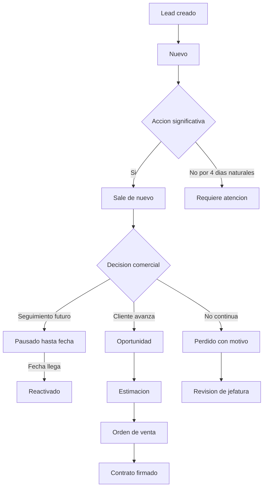

# 21 - P0 direccion tecnica, construccion controlada

## Veredicto

P0 queda aprobado como direccion tecnica del CRM nuevo. Desde la ley `0.3.14`, la unica construccion de runtime autorizada es el runtime minimo de identidad del API. El runtime comercial sigue prohibido hasta aprobacion explicita posterior.

Este P0 no intenta copiar el CRM viejo tabla por tabla. La regla es construir el CRM nuevo con modelo canonico, base MySQL normalizada, API estable, frontend en espanol y adaptadores externos separados.

La fuente de verdad de orden es `00-Producto-CRM-TINK-y-P0.md`. La primera compuerta es `27-Identidad-Usuarios-Roles-P0-S1.md`. El documento `23-Alcance-P0-Vertical-Leads.md` aplica solo despues de cerrar identidad, usuarios, roles, permisos minimos, contrato canonico y modelo MySQL minimo.

## Decisiones cerradas

| Tema | Decision P0 |
| --- | --- |
| Base nueva | MySQL, base `CRM_THINK_V2`. |
| Acceso a datos | Kysely + mysql2. |
| Package manager | pnpm local por proyecto cuando exista runtime. No debe existir workspace Node en la raiz. |
| Docker | No se usa Docker. |
| Arquitectura API | NestJS modular monolith con arquitectura limpia/hexagonal. |
| Arquitectura frontend | React + Vite + TypeScript, primera pantalla operativa de CRM. |
| ERP/integraciones | El core no conoce proveedores. NetSuite, Odoo, Kapso, Microsoft 365 y legacy CRM viven en adapters separados. |
| JSON frontend/API | Canonico y estable. Sin palabras de proveedores externos. |
| Base de datos core | Normalizada, legible y sin columnas con nombres de proveedores externos. |
| Usuario responsable | La persona asignada al lead ejecuta las acciones normales del lead. |
| Supervisor/jefatura | Puede ver o actuar solo por permisos efectivos. |
| Permisos | P0-S1A inicia por identidad: RBAC + ABAC basico, areas, permisos efectivos, overrides directos y denegaciones directas. Delegacion temporal queda prevista para despues. |
| Leads nuevos | Un lead es nuevo hasta que reciba una accion significativa. |
| Requiere atencion | Despues de 4 dias naturales sin accion significativa, sin evento pendiente, sin pausa y sin perdida. |
| Pausa | La persona asignada puede pausar con motivo y fecha futura de contacto. |
| Reactivacion | El lead pausado se reactiva cuando llega la fecha de contacto. |
| Perdida | La persona asignada puede marcar perdido con motivo obligatorio. Jefatura puede auditar y revertir por permiso. |
| Perdida automatica | No se activa en P0. P0 solo alerta, lista y deja evidencia. |
| Dashboard | Todo numero debe abrir detalle filtrado o explicar el conteo. |

## Decision como jefatura de ventas

La regla P0 para proteger ventas es esta:

1. El vendedor asignado o persona asignada puede mover, pausar, reactivar y mandar a perdido sus leads.
2. Cada accion sensible exige motivo, comentario y bitacora.
3. Jefatura no necesita bloquear al vendedor para operar, pero si necesita ver por que paso cada cosa.
4. La perdida automatica queda apagada hasta tener reportes confiables y aprobacion de negocio.
5. Si un permiso puntual se agrega o se quita a una persona, debe quedar motivo, quien lo cambio y auditoria.

## Alcance P0

P0 se construye por slices. El slice vigente antes de leads es identidad.

Entra ahora en el runtime minimo de identidad:

- contrato de sesion/usuario actual;
- autenticacion BFF con Microsoft como login principal;
- login local por invitacion/reset seguro;
- usuario actual sin exponer tokens al frontend;
- permisos efectivos basicos;
- auditoria de seguridad;
- SQL de identidad validado y catalogos S1A ejecutados en `CRM_THINK_V2`;
- esqueleto real de API NestJS solo para identidad;
- configuracion base de TypeScript;
- Kysely + mysql2 como capa de datos;
- OpenAPI minimo de identidad.

Entra despues:

- modulos separados por dominio, solo cuando el slice los necesite;
- contrato canonico de leads;
- bitacora/timeline comercial como requisito obligatorio para mutaciones de leads;
- vertical comercial definido en `23-Alcance-P0-Vertical-Leads.md`, solo despues de cerrar identidad.

## Fuera de P0

No entra todavia:

- Migracion historica completa desde el CRM viejo.
- Sincronizacion completa con ERP.
- Flujos completos de formalizaciones, cobros y modificaciones.
- Perdida automatica en produccion.
- Reporteria ejecutiva avanzada.
- Automatizaciones masivas sin reglas finales de jefatura.
- Calendarios por dominio.
- Notas adhesivas.
- Delegaciones avanzadas de permisos.
- Exigir cache externo o broker de mensajes para operar el primer corte.

## Corte interno de P0

P0 se construye en slices:

| Slice | Entra | No entra |
| --- | --- | --- |
| P0-S1A | Identidad, usuarios, autenticacion, roles y permisos minimos. | Leads, migraciones comerciales, OpenAPI comercial, ERP real. |
| P0-S1B | Crear lead, contacto, estado operativo inicial, timeline, auditoria, listar y detalle, solo despues de cerrar P0-S1A. | Pausa, perdida, dashboard ejecutivo, ERP real. |
| P0-S2 | Pausa, reactivacion, perdida con motivos, dashboard de leads nuevos/requieren atencion. | Formalizaciones, calendarios, notas, migracion historica. |
| P0-S3 | Outbox visible, retry basico o no-op de integracion segun necesidad. | Worker ERP completo si negocio no lo aprueba. |

## Flujo comercial futuro de lead

Este flujo no autoriza construir leads antes de cerrar identidad.

## Checklist antes de construir funcionalidad real

| Item | Estado |
| --- | --- |
| Documento P0 tecnico | Aprobado como direccion, no como permiso de runtime inmediato. |
| Documento de producto en 2 paginas | Aprobado como ley superior en `00-Producto-CRM-TINK-y-P0.md`. |
| Jerarquia de documentacion | Definida por `00-Producto-CRM-TINK-y-P0.md`, `00-Indice.md` y `AGENTS.md`. |
| Modelo fisico de identidad | Cerrado como diseno en `29-Modelo-Fisico-MySQL-Identidad-P0-S1.md`. |
| SQL identidad P0-S1 | Aplicado/validado en `CRM_THINK_V2`; catalogos S1A ejecutados sin usuarios ni datos de negocio. |
| Modelo canonico minimo de lead | Pendiente; viene despues de identidad. |
| OpenAPI identidad | Autorizado solo como contrato minimo de identidad. |
| Esqueleto API | Autorizado solo para runtime minimo de identidad. |
| Esqueleto frontend | Existe fuera de este documento; no autoriza construir API todavia. |
| Credenciales MySQL en `.env` | Pendiente de configurar localmente. |
| Ejecutar migracion en MySQL | Ya validado para identidad bajo excepciones documentadas; no autoriza datos reales ni `crmdatabase-api`. |
| Instalar dependencias API | Permitido solo para identidad. |
| Typecheck/build API | Obligatorio para cada cambio de runtime de identidad. |
| Primer vertical slice real | Identidad; runtime minimo autorizado por `00-Producto-CRM-TINK-y-P0.md` version `0.3.14`. |
