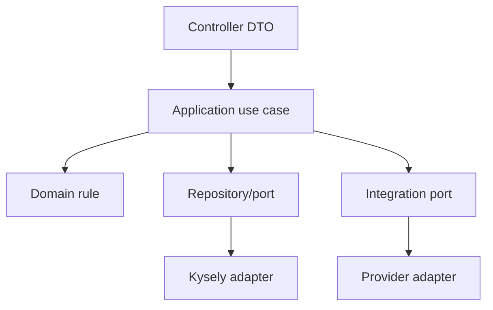

# 22 - Mapa de Implementacion API

## Proposito

Este documento responde una pregunta practica:

```txt
Si voy a construir algo en el API, en que carpeta va y que reglas debo leer?
```

Debe usarse antes de crear modulos, endpoints, repositorios, migraciones, integraciones, jobs o reglas de negocio.

Estado actual: este documento describe donde va el codigo aprobado. Desde la ley `0.3.14`, solo se autoriza construir el runtime minimo de identidad; no existe autorizacion para modulos comerciales ni integraciones operativas.

Para el primer corte ejecutable, identidad manda. `23-Alcance-P0-Vertical-Leads.md` aplica despues de cerrar identidad, usuarios, roles, permisos, contrato canonico y modelo MySQL minimo.

## Regla principal

El API es la fuente de verdad de:

- reglas de negocio;
- permisos efectivos;
- auditoria;
- bitacora;
- integraciones externas;
- normalizacion de datos;
- contratos publicos para frontend.

El frontend nunca decide permisos finales, estados finales, integraciones ni transformaciones de proveedores externos.

## Mapa de carpetas

| Carpeta | Que va aqui | Que no va aqui | Leer antes |
| --- | --- | --- | --- |
| `src/modules/crm/sales/leads` | Casos de uso, dominio, DTOs HTTP y repositorios de leads de ventas. | Integraciones directas, payloads externos, reglas de frontend. | `11`, `12`, `13`, `19`, `21`. |
| `src/modules/crm/sales/opportunities` | Oportunidades creadas desde lead. | Estimaciones u ordenes de venta. | `15`. |
| `src/modules/crm/sales/estimates` | Estimaciones despues de oportunidad. | Ordenes de venta o formalizaciones. | `15`. |
| `src/modules/crm/sales/sales-orders` | Ordenes de venta, pre-reserva, reserva y avance a contrato. | Formalizacion operativa completa. | `15`, `16`. |
| `src/modules/crm/formalizations` | Flujo posterior de formalizacion cuando el alcance lo apruebe. | Reglas de leads iniciales. | `16`. |
| `src/modules/crm/calendar` | Eventos CRM, tipos de calendario, reglas de citas, participantes y sync status. | Llamadas directas a Microsoft Graph. | `17`. |
| `src/modules/crm/notes` | Notas persistidas, sticky notes, anotaciones y permisos de notas. | Envio directo por Kapso/correo/Microsoft. | `18`. |
| `src/modules/crm/permissions` | Calculo de permisos efectivos, grants y denials. Delegacion temporal queda fuera de S1A. | Permisos calculados en frontend. | `05`, `09`, `21`. |
| `src/modules/crm/audit` | Auditoria tecnica y eventos sensibles. | Timeline comercial de usuario si pertenece al modulo de lead. | `05`, `13`. |
| `src/integrations/common/ports` | Interfaces estables para proveedores externos. | Implementaciones concretas. | `04`, `11`. |
| `src/integrations/netsuite` | Cliente, DTOs, mappers y errores especificos de NetSuite. | Reglas core del CRM. | `04`. |
| `src/integrations/odoo` | Cliente, DTOs, mappers y errores especificos de Odoo. | Reglas core del CRM. | `04`. |
| `src/integrations/kapso` | Mensajeria, templates, webhooks y mappers de Kapso. | UI o reglas de lead core. | `04`, `13`. |
| `src/integrations/microsoft365` | Microsoft Graph, calendario externo y Entra ID. | Reglas CRM de calendario. | `04`, `17`. |
| `src/integrations/legacy-crm` | Lectura temporal del CRM viejo y mapeo a contrato canonico. | Nuevas reglas de negocio. | `10`, `11`. |
| `src/database` | Conexion Kysely, tipos DB y utilidades de persistencia para `CRM_THINK_V2`. | SQL de negocio en controllers, lectura del CRM viejo o payloads de proveedores. | `12`. |
| `database/migrations` | Migraciones SQL versionadas y revisables. | Datos sensibles o credenciales. | `03`, `12`, `21`. |
| `openapi` | Contratos OpenAPI publicados. | Reglas no implementadas sin marcar como futuras. | `11`, `13`, `21`. |

## Flujo de dependencia permitido



Regla:

```txt
CRM core -> ports -> adapters
```

Regla de independencia:

```txt
CRM_THINK_V2 != CRM viejo != NetSuite != Odoo != Kapso.
```

Cada fuente/proveedor se implementa y se desconecta por su carpeta. El CRM viejo solo puede vivir en `src/integrations/legacy-crm`; NetSuite solo en `src/integrations/netsuite`; Odoo solo en `src/integrations/odoo`; Kapso solo en `src/integrations/kapso`. Lo global se limita a configuracion, seguridad, conexion a la base nueva y puertos compartidos.

Conexion legacy aprobada:

```txt
src/database -> DB_NAME -> CRM_THINK_V2
src/integrations/legacy-crm -> LEGACY_CRM_DB_NAME -> base vieja
```

El adapter legacy puede reutilizar `DB_HOST`, `DB_PORT`, `DB_SSL` y `DB_SSL_CA` si ambas bases estan en el mismo servidor MySQL. Debe usar `LEGACY_CRM_DB_USER` y `LEGACY_CRM_DB_PASSWORD` de solo lectura. No se permite cambiar `DB_NAME` para apuntar al CRM viejo.

Nunca:

```txt
CRM core -> provider concreto
Controller -> Kysely
Frontend -> proveedor externo
CRM nuevo -> query directa al CRM viejo
```

## Primer vertical slice aprobado ahora

El desarrollo real aprobado por la ley `0.3.14` debe ser identidad:

1. Leer `33-Contrato-API-Identidad-P0-S1.md`.
2. Crear bootstrap NestJS minimo solo para identidad.
3. Configurar Kysely/MySQL solo contra `CRM_THINK_V2`.
4. Preparar contrato de sesion/usuario actual.
5. Preparar autenticacion BFF con Microsoft como login principal.
6. Preparar login local por invitacion/reset seguro.
7. Exponer usuario actual sin tokens en frontend.
8. Exponer permisos efectivos basicos.
9. Registrar auditoria de seguridad.
10. Respetar `permission_version_user` para revocacion de permisos.

No entra todavia:

- leads;
- sincronizacion completa con ERP;
- migracion historica completa;
- perdida automatica;
- formalizacion completa;
- pausa/perdida/dashboard hasta P0-S2;
- calendarios, notas y permisos delegados.
- usuarios inventados, credenciales seed o datos reales de clientes.

## Vertical comercial futuro

Despues de cerrar identidad, el siguiente corte comercial sera:

1. Crear lead canonico.
2. Crear contacto si aplica.
3. Crear estado operativo del lead.
4. Crear timeline `lead_created`.
5. Registrar auditoria basica.
6. Devolver JSON canonico.
7. Listar leads con paginacion.
8. Obtener detalle de lead.

## Checklist para cualquier cambio API

Antes de tocar codigo:

1. Confirmar modulo correcto.
2. Leer documentos de arquitectura relacionados.
3. Verificar si existe contrato OpenAPI.
4. Verificar si requiere migracion.
5. Verificar si requiere timeline.
6. Verificar si requiere auditoria.
7. Verificar permisos efectivos.
8. Verificar si debe generar outbox.
9. Confirmar que el producto, modelo y contrato P0 ya fueron aprobados.
10. Solo entonces recrear runtime e implementar con pnpm.
11. Cuando exista runtime, ejecutar `pnpm run typecheck` y `pnpm run build`.

## Estado actual

| Elemento | Estado |
| --- | --- |
| Esqueleto NestJS | Autorizado solo como runtime minimo de identidad por ley `0.3.14`; no autoriza modulos comerciales. |
| Kysely/mysql2 | Autorizado para runner schema-only y runtime minimo de identidad contra `CRM_THINK_V2`. |
| SQL identidad P0-S1 | Esquema validado y seed de catalogos S1A ejecutado en `CRM_THINK_V2`; usuarios, credenciales y datos de negocio siguen fuera. |
| Contrato API identidad | Creado como documento conceptual; no es OpenAPI ejecutable. |
| OpenAPI identidad | Permitido solo si se limita al contrato minimo de identidad; OpenAPI comercial sigue prohibido. |
| Primer vertical slice real | Identidad; aprobado como runtime minimo por ley `0.3.14`. |
| MySQL `.env` local | Pendiente de configurar para ejecutar el runner; no guardar credenciales en disco sin control. |
| Runner schema-only | Creado con pnpm/Kysely/mysql2; pasa typecheck; pendiente de prueba end-to-end con `.env` seguro. |
| Migracion aplicada en DB | `SQL/001` aplicado manualmente via MCP en `CRM_THINK_V2`; `SQL/002` ejecutado solo como catalogos S1A; `conf_schema_migration` registra `001` por marca manual equivalente. |
