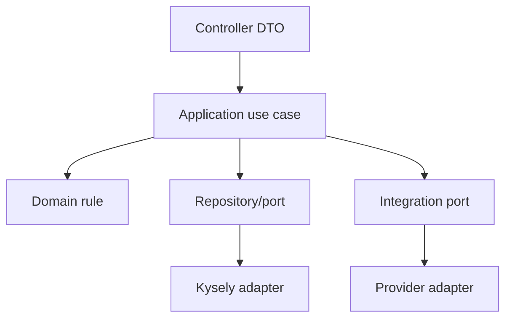

# 22 - Mapa de Implementacion API

## Inventario vigente - 2026-11-02

La lectura de `AppModule`, módulos/controladores y contratos confirma los
dominios registrados de la tabla inferior. Se incluyen aquí las ampliaciones
faltantes en el corte29. Los comandos/checks de esta revisión se reportan en el
informe consolidado; no se convierten logs históricos en pruebas actuales.

| Ruta adicional | Registro y contrato | Autorización/límite |
| --- | --- | --- |
| `GET /calendar/lookup` | `CalendarController`, `CalendarLookupService` | `calendar.read` efectivo del módulo y permiso individual de note/lead/order; `kind=notes\|users\|leads\|orders`, búsquedas comerciales de al menos dos caracteres |
| `GET /notes/related-record-options` | `NoteRelatedRecordsController` y resolvedor federado | sesión, lectura y crear/editar propias; recursos reautorizados, páginas de25 y `partial` explícito |
| `GET /note-collaboration/notes/:id/related-records` | mismo controlador/servicio | ACL de conversación independiente del recurso; etiquetas/IDs restringidos se ocultan |
| `PUT /note-collaboration/notes/:id/related-records` | mismo controlador/servicio | autor con permiso y nota pendiente, CSRF/operationId/versión; principal inmutable, auditoría e invalidación realtime |
| `POST /integrations/netsuite/local/order-events` | `NetsuiteLocalEventsController` en `NetsuiteModule` | prueba de máquina DEV, cuenta Sandbox fija, esquema estricto; `received:true,persisted:false`, ninguna escritura comercial |

Calendario tiene **cinco rutas** registradas, no las cuatro del inventario28/29:
lookup complementa calendarios/listado/crear/editar. Participantes internos,
correos externos, preferencia Teams y vínculos source-qualified se documentan
en [68 calendario](68-Calendario-Participantes-y-Vinculos.md); no implican Graph,
envíos ni RSVP. Notas mantiene sus contratos antiguos y agrega `relatedRecords`
opcional al crear y resúmenes autorizados a lecturas ([68 notas](68-Plan-Notas-Vinculos-Clientes-y-Ordenes.md)).

Mercadeo conserva exactamente los periodos API del inventario inferior; la
capacidad opcional `mercadeo.reports.read_all` sustituye solo el filtro ordinario
de vendedores, además del permiso de cada vista ([69](69-Mercadeo-Lectura-Global.md)).
No concede acceso individual a un lead por consultar agregados.

### Inventario completo de controladores HTTP

Conteo estático del checkout: **31 controladores y 119 declaraciones HTTP**. No incluye Swagger opcional, handshake Socket.IO ni middleware como si fueran handlers Nest. Un prefijo `/` significa que el método ya contiene su ruta completa. Las rutas relativas se concatenan al prefijo; DTO, `RouteSecurity`, `RequirePermission` y servicio conservan su autoridad, no esta tabla. Las constantes de Identidad se resolvieron contra `identity-route.constants.ts`.

| Controlador/fuente | Prefijo | N.º | Métodos relativos |
| --- | --- | --- | --- |
| [HealthController](../src/common/health/health.controller.ts) | `/health` | 2 | `GET /live`; `GET /ready` |
| [NetsuiteLocalEventsController](../src/integrations/netsuite/netsuite-local-events.controller.ts) | `/integrations/netsuite/local` | 1 | `POST /order-events` |
| [NetsuiteSalesOrderController](../src/integrations/netsuite/netsuite.module.ts) | `/formalization/orders` | 3 | `GET /:source/:id/database`; `GET /:source/:id/history`; `GET /:source/:id/netsuite` |
| [AuditReadController](../src/modules/crm/audit/audit-read.controller.ts) | `/audit` | 4 | `GET /options`; `GET /records/:recordId/timeline`; `GET /:publicId`; `GET /` |
| [BrokersController](../src/modules/crm/brokers/brokers.controller.ts) | `/catalogs/brokers` | 4 | `GET /items`; `POST /items`; `PATCH /items/:itemPublicId`; `PATCH /items/:itemPublicId/status` |
| [CalendarController](../src/modules/crm/calendar/calendar.module.ts) | `/calendar` | 5 | `GET /calendars`; `GET /events`; `GET /lookup`; `POST /events`; `PATCH /events/:id` |
| [CampaignsController](../src/modules/crm/campaigns/campaigns.controller.ts) | `/catalogs/campaigns` | 4 | `GET /items`; `POST /items`; `PATCH /items/:itemPublicId`; `PATCH /items/:itemPublicId/status` |
| [CatalogsController](../src/modules/crm/catalogs/catalogs.controller.ts) | `/catalogs` | 4 | `GET /:catalogCode/items`; `POST /:catalogCode/items`; `PATCH /:catalogCode/items/:itemPublicId`; `PATCH /:catalogCode/items/:itemPublicId/status` |
| [ClassesController](../src/modules/crm/classes/classes.controller.ts) | `/catalogs/classes` | 4 | `GET /items`; `POST /items`; `PATCH /items/:itemPublicId`; `PATCH /items/:itemPublicId/status` |
| [IdentityAccessManagementController](../src/modules/crm/identity/identity-access-management.controller.ts) | `/identity` | 7 | `GET /roles/security-catalog`; `PATCH /roles/:roleCode`; `GET /roles/:roleCode/permissions`; `PUT /roles/:roleCode/permissions`; `GET /users/:userPublicId/access`; `PUT /users/:userPublicId/access`; `DELETE /roles/:roleCode` |
| [IdentityController](../src/modules/crm/identity/identity.controller.ts) | `/identity` | 17 | `GET /session`; `GET /me`; `GET /users`; `POST /users`; `PATCH /users/:userPublicId`; `PATCH /users/:userPublicId/status`; `GET /users/:userPublicId`; `GET /me/photo`; `GET /sessions`; `POST /sessions/:sessionPublicId/revoke`; `POST /logout`; `POST /refresh`; `POST /microsoft/start`; `GET /microsoft/callback`; `POST /local/login`; `POST /local/request-reset`; `POST /local/complete-reset` |
| [LocationsController](../src/modules/crm/locations/locations.controller.ts) | `/catalogs/locations` | 4 | `GET /items`; `POST /items`; `PATCH /items/:itemPublicId`; `PATCH /items/:itemPublicId/status` |
| [MarketingHomeController](../src/modules/crm/marketing/marketing-home.module.ts) | `/marketing/home` | 1 | `GET /summary` |
| [MarketingLeadsReportController](../src/modules/crm/marketing/marketing-leads-report.controller.ts) | `/marketing/leads` | 1 | `GET /report` |
| [NoteCollaborationController](../src/modules/crm/notes/note-collaboration.controller.ts) | `/note-collaboration` | 14 | `GET /inbox`; `GET /inbox/authors`; `GET /notes/:id/activity`; `GET /notes/:id/locations`; `PUT /notes/:id/locations`; `GET /eligible-users`; `GET /notes/:id`; `GET /notes/:id/eligible-users`; `PUT /notes/:id/participants`; `PUT /notes/:id/mentions`; `POST /notes/:id/replies`; `PATCH /notes/:id/replies/:replyId`; `POST /notes/:id/replies/:replyId/withdraw`; `PUT /notes/:id/my-following` |
| [NoteNotificationsController](../src/modules/crm/notes/note-notifications.controller.ts) | `/notifications` | 4 | `GET /`; `GET /unread-count`; `PUT /read-all`; `PUT /:id/read` |
| [NoteRelatedRecordsController](../src/modules/crm/notes/note-related-records.controller.ts) | `/` | 3 | `GET /notes/related-record-options`; `GET /note-collaboration/notes/:id/related-records`; `PUT /note-collaboration/notes/:id/related-records` |
| [NoteWorkflowController](../src/modules/crm/notes/note-workflow.controller.ts) | `/note-workflow` | 4 | `GET /notes/:id`; `PUT /notes/:id/task`; `PUT /notes/:id/reminder`; `GET /overview` |
| [NotesController](../src/modules/crm/notes/notes.controller.ts) | `/notes` | 9 | `GET /`; `GET /:id/history`; `GET /:id`; `POST /`; `PATCH /:id`; `POST /:id/complete`; `POST /:id/reopen`; `POST /:id/archive`; `PUT /:id/my-placement` |
| [ProjectsController](../src/modules/crm/projects/projects.controller.ts) | `/catalogs/projects` | 4 | `GET /items`; `POST /items`; `PATCH /items/:itemPublicId`; `PATCH /items/:itemPublicId/status` |
| [ApprovalSummaryController](../src/modules/crm/sales/sales-orders/approval-summary.module.ts) | `/formalization/approvals` | 1 | `GET /summary` |
| [ContractSummaryController](../src/modules/crm/sales/sales-orders/contract-summary.module.ts) | `/formalization/contracts` | 1 | `GET /summary` |
| [ContractTransitionController](../src/modules/crm/sales/sales-orders/contract-transition.controller.ts) | `/formalization/contracts` | 2 | `POST /send`; `POST /revert` |
| [FormalizationStageController](../src/modules/crm/sales/sales-orders/contract-transition.controller.ts) | `/formalization/orders` | 1 | `POST /stage` |
| [FormalizationApprovalController](../src/modules/crm/sales/sales-orders/formalization-approval.ts) | `/formalization/orders` | 1 | `POST /approve` |
| [HomeSummaryController](../src/modules/crm/sales/sales-orders/home-summary.module.ts) | `/formalization/home` | 2 | `GET /recent-activity`; `GET /summary` |
| [FollowUpController](../src/modules/crm/sales/sales-orders/home-summary.module.ts) | `/formalization/home` | 1 | `GET /follow-up` |
| [FormalizationOrderRecordController](../src/modules/crm/sales/sales-orders/home-summary.module.ts) | `/formalization/orders` | 1 | `GET /:source/:id/record` |
| [OrderTimingController](../src/modules/crm/sales/sales-orders/order-timing.controller.ts) | `/formalization/orders` | 1 | `GET /:source/:id/timing` |
| [SubsidiariesController](../src/modules/crm/subsidiaries/subsidiaries.controller.ts) | `/catalogs/subsidiaries` | 4 | `GET /items`; `POST /items`; `PATCH /items/:itemPublicId`; `PATCH /items/:itemPublicId/status` |
| [UnitFilesController](../src/modules/crm/unit-files/unit-files.controller.ts) | `/unit-files` | 5 | `GET /projects`; `GET /options`; `GET /facets`; `GET /`; `GET /:id` |

### Cobertura de dominios y herramientas

| Dominio/carpeta real | Estado registrado y documentación de referencia |
| --- | --- |
| `common/health`, `common/security`, `config`, `database` | liveness/readiness, sesión/CSRF, clasificación de rutas y permisos, logging redactado y pools;05/24/CI-MySQL |
| `crm/identity`, `crm/permissions` | BFF/login local/Microsoft, usuarios/roles/permisos, herencia/deny y jefaturas;27–34/41/42 |
| `crm/catalogs`, `projects`, `campaigns`, `classes`, `locations`, `subsidiaries`, `brokers` | configuración genérica y seis CRUD dedicados, con identidad de proveedor separada;35 |
| `crm/unit-files` | séptimo catálogo, consulta/paginación y preparación de solo lectura;35/56 expediente |
| `crm/audit`, `crm/leads` | auditoría central, timeline nativo y tablas/historia internas; sin CRUD HTTP general de leads;37/43/44 |
| `crm/marketing` | Inicio y Captación agregados, native-first/legacy opcional, citas atribuidas al lead;46/48/53/69 |
| `crm/sales/sales-orders` | resúmenes, seguimiento/ficha, tiempos, envío/reversión, etapas y aprobación protegidos;38/39/40/52/63–65 |
| `crm/calendar` | eventos, superposición, lookup y participantes/vínculos nativos;17/47/64/68 calendario |
| `crm/notes` | personales, colaboración, workflow, avisos y sockets;18/57/60/62/66/68 notas |
| `integrations/legacy-crm` | lecturas y escritores acotados autorizados, no importador comercial general;03/04/44/52 |
| `integrations/microsoft365` | identidad corporativa/perfil; no calendario Outlook/Teams operativo;24/33 |
| `integrations/netsuite` | inspección, aprobación limitada y receptor DEV no durable;04/63 y plan70 pendiente |
| `scripts`, `migrations/schema-only` | 55 migraciones registradas y herramientas clasificadas de esquema, datos, QA y empaquetado; inventario completo en03 |

La ampliación057, el CLI de indicadores y los tipos de tabla de órdenes son
cambios locales sin commit en esta revisión. No se modifica ningún grafo de
runtime ni esquema al documentarlos; el plan70 no registra un nuevo writer.

## Inventario registrado y contratos - revisión 2026-10-29

Fuentes: `src/app.module.ts`, metadatos de controladores/modulos y contratos
referenciados. La tabla describe wiring contrastado por lectura de código. La
verificación ejecutada del 29 se conserva por separado en
[67 - QA y resultados](67-Plan-QA-Regresiones-20261029.md); esta actualización
solo modifica documentación, no ejecuta nuevas operaciones de negocio.

`AppModule` registra `NotesModule` y `CalendarModule`, además de Identidad,
catálogos, Mercadeo, seguimiento y comandos acotados de Formalización. Los cortes
que los describen como pendientes o solo esquema son históricos. Notas y
calendario no activan por inferencia correo, Outlook o copia de notas legacy.

| Ruta | Registro y contrato | Autorizacion/limite |
| --- | --- | --- |
| `GET /marketing/home/summary` | `MarketingHomeModule`, `marketing-home.contract.ts` | `mercadeo.home.read`; period day/week/month/year; lectura agregada |
| `GET /marketing/leads/report` | mismo modulo, `MarketingLeadsReportController`, `marketing-leads-report.contract.ts` | `mercadeo.leads.read`; period day/week/month/all; fuentes y calidad, sin filas PII |
| `GET /formalization/approvals/summary` | `ApprovalSummaryModule` | rol efectivo Formalizacion + `formalizacion.home.approvals.read` |
| `GET /formalization/contracts/summary` | `ContractSummaryModule` | rol efectivo Formalizacion + `formalizacion.home.contracts.read` |
| `GET /formalization/home/summary` | `HomeSummaryModule` | permisos por banner; contadores no autorizados en cero; ver [63](63-Formalizacion-Lectura-Por-Banner.md) |
| `GET /formalization/home/follow-up` | `FollowUpController`, `follow-up.contract.ts` | permisos por banner y rol efectivo; búsqueda/proyecto/bandeja, pageSize máximo100 |
| `GET /formalization/home/recent-activity` | `HomeSummaryController`, `HomeSummaryService` | `formalizacion.orders.read`; actividad acotada del actor, no sustituible por permiso de banner |
| `GET /formalization/orders/:source/:id/record` | `FormalizationOrderRecordController`, proyección `FollowUpItem` | `formalizacion.orders.read` independiente de banners; un solo registro, sin contadores ni catálogo de proyectos |
| `GET /formalization/orders/:source/:id/timing` | `OrderTimingController`, `order-timing.contract.ts` | `formalizacion.orders.read`; no inserta historia al consultar |
| `POST /formalization/contracts/send` | `ContractTransitionModule`, `ContractTransitionDto` | `formalizacion.contracts.send`; registra evidencia CRM, no envia correo |
| `POST /formalization/contracts/revert` | mismo modulo/DTO | `formalizacion.contracts.revert`; motivo obligatorio |
| `POST /formalization/orders/stage` | `FormalizationStageController`, mismo servicio/DTO | `formalizacion.orders.stage.update`; aprobaciones, firma y retrocesos validados |
| `GET /formalization/orders/:source/:id/database` | `NetsuiteSalesOrderController`, proyección de fuente | `formalizacion.orders.read`; datos de la orden autorizada, sin crear registros |
| `GET /formalization/orders/:source/:id/history` | mismo controlador, lector de historia | `formalizacion.orders.read`; historial de la orden autorizada |
| `GET /formalization/orders/:source/:id/netsuite` | `NetsuiteModule` y adaptador dedicado | `formalizacion.orders.read` y autorización de orden; GET externo, sin persistencia |
| `POST /formalization/orders/approve` | `FormalizationApprovalController`, `ContractTransitionModule` | permiso independiente `formalizacion.orders.approve`, versión y auditoría; integración acotada de [63](63-Aprobacion-Formalizacion-NetSuite.md) |
| `GET /calendar/calendars` | `CalendarModule`, `CalendarController` | módulos activos con `*.calendar.read`; tipos y capacidades permitidas |
| `GET /calendar/events` | mismo módulo, `CalendarService` | contexto y módulos autorizados, intervalo máximo93 días y límite500; fuente nativa y legacy con contexto explícito |
| `POST /calendar/events` | mismo módulo/repositorio | módulo activo, lectura y `*.calendar.create`; evento nativo, CSRF, operación y bitácora atómica; HTTP200 |
| `PATCH /calendar/events/:id` | mismo módulo/repositorio | lectura y `*.calendar.update`, versión y alcance efectivo; no editar evento de otro origen desde la superposición |
| `/notes` y `/notes/:id/*` | `NotesController`, `NotesService` | lectura/crear/editar propias/completar/reabrir/archivar y posición personal; permisos, ACL, versiones e idempotencia |
| `/note-collaboration/*` | `NoteCollaborationController` | bandejas/autores, invitados, respuestas propias, menciones, seguimiento, ubicaciones e historial; sesión y ACL vigentes en servicio |
| `/notifications` y `/notifications/*` | `NoteNotificationsController` | avisos del lector, contador y marcar lectura; no concede acceso al registro |
| `GET /note-workflow/notes/:id` y `GET /note-workflow/overview` | `NoteWorkflowController` | responsable/vencimiento, recordatorio propio y resumen autorizado de asignadas |
| `PUT /note-workflow/notes/:id/task` y `PUT /note-workflow/notes/:id/reminder` | mismo controlador/servicio | tarea solo por autor con permiso; cada lector administra su recordatorio, UTC/versiones/operationId |

Los comandos comparten validacion estricta, CSRF, version e idempotencia; el API
resuelve actor y autoridad de fuente. Las tablas nativas y referencias son
independientes del proveedor. Inspeccion NetSuite devuelve payload externo solo
en su endpoint dedicado; no modifica el contrato comercial.

Identidad, auditoría, catálogos genéricos y seis catálogos dedicados conservan
sus controladores existentes. Expedientes registra consulta, no CRUD. Calendario
sí dispone de las cinco rutas del inventario vigente; no existe CRUD HTTP comercial
general de Leads, oportunidades o estimaciones.
`GET /formalization/contracts/orders` tampoco esta registrado. El detalle actual
se construye desde el seguimiento, sin inventar un endpoint `GET orders/:id`.
Las rutas publicas/privadas exactas y sus clasificadores se contrastan en
`test/identity/app-module-security.spec.ts`; el codigo, no el conteo historico de
handlers citado por cortes anteriores, gobierna nuevas ampliaciones.

Notas reutiliza auditoría central, recibos, colas duraderas y gateway Socket.IO;
la entrega no depende de temporizadores del navegador. El modo single está
probado localmente; Redis entre procesos no queda certificado sin su aceptación.
Responsable/vencimiento compartidos, recordatorio privado, ubicaciones y
búsqueda/historial: [66](66-Notas-Enterprise-Seguimiento.md). Una invitación no
concede acceso al registro; el vínculo por tipo/origen/ID no depende de URL.

La migracion 038 retira Eventos y citas y su permiso; no afecta los lectores de
metricas ni `mercadeo.calendar.read`. Ver [53](53-Captacion-Leads-Reporte-Federado.md).

Actualizacion autorizada 20/10/2026: el usuario habilito el esquema de ordenes
de venta y su persistencia interna de estados/aprobaciones. Ver documento 38.
Desde el corte 2026-10-22 existe tambien el endpoint de lectura del contador;
ese corte inicial no incluia mutaciones; la ampliacion 2026-10-26 registra los comandos acotados descritos en el inventario siguiente.

## Snapshot histórico del inventario - 2026-10-23

`src/app.module.ts` registra `ApprovalSummaryModule`, `ContractSummaryModule`, `HomeSummaryModule` y `MarketingHomeModule`: resumenes de lectura. El corte posterior registra ContractTransitionModule para send/revert/set-stage y el seguimiento federado; no registra el listado contractual independiente. `src/modules/crm/marketing` contiene el resumen de leads/citas; `src/modules/crm/leads` contiene tablas e historia; `src/modules/crm/calendar` contiene tipos de tablas, sin modulo/controlador de agenda. `AuditReadController` registra el timeline nativo. El adapter legacy aporta lectores de Mercadeo, no importacion. Detalle de cobertura: [49](49-Estado-Actual-y-Cierre-Documental.md).

### Inventario del corte 2026-10-22

Fuentes ejecutables: `src/common/security` (autenticacion/cuotas), `src/common/health`, `src/common/filters`, `src/modules/crm/identity`, modulos de catalogos/expedientes y `src/modules/crm/sales/sales-orders` (persistencia y summary). Las migraciones incrementales viven en `migrations/schema-only`, no en la carpeta ilustrativa del blueprint. Swagger opcional se genera desde controladores registrados; no es contrato estatico exclusivo de identidad.

Ver [registro de entrega](36-Registro-Entrega-Administracion.md) y [remediacion](Reauditoria-54-Plan-y-Resultados.md). Las estructuras futuras y el primer slice descritos debajo son planificacion historica; no prueban existencia de carpetas, usuarios dedicados ni migraciones aplicadas actualmente.

## Proposito

Este documento responde una pregunta practica:

```txt
Si voy a construir algo en el API, en que carpeta va y que reglas debo leer?
```

Debe usarse antes de crear modulos, endpoints, repositorios, migraciones, integraciones, jobs o reglas de negocio.

Antecedente de la ley `0.3.19`: el primer runtime se limito a identidad. Para alcance vigente usar las ampliaciones fechadas de la ley y el inventario anterior; no inferir autorizacion para verticales futuras.

Para el primer corte ejecutable, identidad manda. `23-Alcance-P0-Vertical-Leads.md` aplica despues de cerrar identidad, usuarios, roles, permisos, contrato canonico y modelo MySQL minimo.

## Regla principal

El API es la fuente de verdad de:

- reglas de negocio;
- permisos efectivos;
- auditoria;
- bitacora;
- integraciones externas;
- normalizacion de datos;
- contratos publicos para frontend.

El frontend nunca decide permisos finales, estados finales, integraciones ni transformaciones de proveedores externos.

## Mapa de carpetas

| Carpeta | Que va aqui | Que no va aqui | Leer antes |
| --- | --- | --- | --- |
| `src/modules/crm/leads` (actual); `sales/leads` (blueprint) | Tablas/historia actuales; CRUD de ventas futuro. | Integraciones directas, payloads externos, reglas de frontend. | `11`, `12`, `13`, `19`, `21`, `43`, `44`. |
| `src/modules/crm/sales/opportunities` | Oportunidades creadas desde lead. | Estimaciones u ordenes de venta. | `15`. |
| `src/modules/crm/sales/estimates` | Estimaciones despues de oportunidad. | Ordenes de venta o formalizaciones. | `15`. |
| `src/modules/crm/sales/sales-orders` | Ordenes de venta, pre-reserva, reserva y avance a contrato. | Formalizacion operativa completa. | `15`, `16`. |
| `src/modules/crm/formalizations` | Flujo posterior de formalizacion cuando el alcance lo apruebe. | Reglas de leads iniciales. | `16`. |
| `src/modules/crm/calendar` | Calendario compartido registrado: contratos, permisos, controlador, servicio y repositorio de eventos nativos; lectura legacy por adaptador. | Graph/Outlook, RSVP o importar eventos por la sola existencia del esquema. | `17`, `47`, `64-Calendario-Global-API-y-Contexto`. |
| `src/modules/crm/notes` | Notas, colaboración, avisos, sockets, workflow/recordatorios, ubicaciones e historial; autoría y ACL. | Copia legacy, adjuntos o envío directo por Kapso/correo/Microsoft. | `18`, `56`, `57`, `60`, `66`, `67`. |
| `src/modules/crm/permissions` | Calculo de permisos efectivos, grants y denials. Delegacion temporal queda fuera de S1A. | Permisos calculados en frontend. | `05`, `09`, `21`. |
| `src/modules/crm/audit` | Auditoria tecnica, eventos sensibles y fachada HTTP actual del timeline nativo de Leads. El lector/contrato de historia vive en `crm/leads`. | Importar historia legacy o exponer comandos comerciales sin autorizacion. | `05`, `13`, `37`, `44`. |
| `src/modules/crm/identity/ports` | Interfaces estables para proveedores externos usados por identidad. | Implementaciones concretas. | `04`, `11`. |
| `src/integrations/netsuite` | Cliente, DTOs, mappers y errores especificos de NetSuite. | Reglas core del CRM. | `04`. |
| `src/integrations/odoo` | Cliente, DTOs, mappers y errores especificos de Odoo. | Reglas core del CRM. | `04`. |
| `src/integrations/kapso` | Mensajeria, templates, webhooks y mappers de Kapso. | UI o reglas de lead core. | `04`, `13`. |
| `src/integrations/microsoft365` | Entra ID OIDC, MSAL Node, Graph photo con timeout y adapters tecnicos Microsoft. | Reglas CRM de calendario, permisos o negocio. | `04`, `17`, `24`, `33`. |
| `src/integrations/legacy-crm` | Lectura temporal del CRM viejo y mapeo a contrato canonico. | Nuevas reglas de negocio. | `10`, `11`. |
| `src/database` | Conexion Kysely, tipos DB y utilidades de persistencia para `CRM_THINK_V2`. | SQL de negocio en controllers, lectura del CRM viejo o payloads de proveedores. | `12`. |
| `migrations/schema-only` | Migraciones versionadas reales; `SQL/034` es fuente estatica del calendario. | Datos sensibles o credenciales; no usar `database/migrations` del blueprint como ruta actual. | `03`, `12`, `21`. |
| `openapi` | Contratos OpenAPI publicados. | Reglas no implementadas sin marcar como futuras. | `11`, `13`, `21`. |

## Flujo de dependencia permitido


```mermaid
flowchart TD
  Controller[Controller DTO] --> UseCase[Application use case]
  UseCase --> Domain[Domain rule]
  UseCase --> RepositoryPort[Repository/port]
  RepositoryPort --> KyselyAdapter[Kysely adapter]
  UseCase --> IntegrationPort[Integration port]
  IntegrationPort --> ProviderAdapter[Provider adapter]
```

Regla:

```txt
CRM core -> ports -> adapters
```

Regla de independencia:

```txt
CRM_THINK_V2 != CRM viejo != NetSuite != Odoo != Kapso.
```

Cada fuente/proveedor se implementa y se desconecta por su carpeta. El CRM viejo solo puede vivir en `src/integrations/legacy-crm`; NetSuite solo en `src/integrations/netsuite`; Odoo solo en `src/integrations/odoo`; Kapso solo en `src/integrations/kapso`. Lo global se limita a configuracion, seguridad, conexion a la base nueva y puertos compartidos.

Conexion legacy aprobada:

```txt
src/database -> DB_NAME -> CRM_THINK_V2
src/integrations/legacy-crm -> LEGACY_CRM_DB_NAME -> base vieja
```

El adapter actual reutiliza `DB_HOST`, `DB_PORT`, `DB_USER`, `DB_PASSWORD`, `DB_SSL` y `DB_SSL_CA`, con nombre legacy separado. No existen variables implementadas `LEGACY_CRM_DB_USER`/`LEGACY_CRM_DB_PASSWORD`. Separar cuentas y privilegios es pendiente DBA; la transaccion de lectura no limita por si sola las credenciales. Los seis escritores de catalogos requieren ambos flags, produccion y destino exacto. El escritor contractual preparado usa una compuerta distinta (ambos flags y destino exacto, sin exigir produccion), y sus comandos HTTP acotados ya estan registrados; no confundir ambas politicas ni activarlos desde esta guia. No cambiar `DB_NAME` al CRM viejo.

Nunca:

```txt
CRM core -> provider concreto
Controller -> Kysely
Frontend -> proveedor externo
CRM nuevo -> query directa al CRM viejo
```

## Primer vertical slice historico

El desarrollo real aprobado por la ley `0.3.19` debe ser identidad:

1. Leer `33-Contrato-API-Identidad-P0-S1.md`.
2. Crear bootstrap NestJS minimo solo para identidad.
3. Configurar Kysely/MySQL solo contra `CRM_THINK_V2`.
4. Preparar contrato de sesion/usuario actual.
5. Preparar autenticacion BFF con Microsoft como login principal.
6. Preparar login local por invitacion/reset seguro.
7. Exponer usuario actual sin tokens en frontend.
8. Exponer permisos efectivos basicos.
9. Registrar auditoria de seguridad.
10. Respetar `permission_version_user` para revocacion de permisos.

No entra todavia:

- leads;
- sincronizacion completa con ERP;
- migracion historica completa;
- perdida automatica;
- formalizacion completa;
- pausa/perdida/dashboard hasta P0-S2;
- calendarios, notas y permisos delegados.
- usuarios inventados, credenciales seed o datos reales de clientes.

## Vertical comercial futuro

Despues de cerrar identidad, el siguiente corte comercial sera:

1. Crear lead canonico.
2. Crear contacto si aplica.
3. Crear estado operativo del lead.
4. Crear timeline `lead_created`.
5. Registrar auditoria basica.
6. Devolver JSON canonico.
7. Listar leads con paginacion.
8. Obtener detalle de lead.

## Checklist para cualquier cambio API

Antes de tocar codigo:

1. Confirmar modulo correcto.
2. Leer documentos de arquitectura relacionados.
3. Verificar si existe contrato OpenAPI.
4. Verificar si requiere migracion.
5. Verificar si requiere timeline.
6. Verificar si requiere auditoria.
7. Verificar permisos efectivos.
8. Verificar si debe generar outbox.
9. Confirmar que el producto, modelo y contrato P0 ya fueron aprobados.
10. Solo entonces recrear runtime e implementar con pnpm.
11. Cuando exista runtime, ejecutar `pnpm run typecheck` y `pnpm run build`.

## Estado del corte inicial de identidad (historico)

| Elemento | Estado |
| --- | --- |
| Esqueleto NestJS | Autorizado solo como runtime minimo de identidad por ley vigente `0.3.28`; no autoriza modulos comerciales. |
| Kysely/mysql2 | Autorizado para runner schema-only y runtime minimo de identidad contra `CRM_THINK_V2`. |
| SQL identidad P0-S1 | Esquema validado y seed de catalogos S1A ejecutado en `CRM_THINK_V2`; usuarios, credenciales y datos de negocio siguen fuera. |
| Contrato API identidad | Creado como documento conceptual; no es OpenAPI ejecutable. |
| OpenAPI identidad | Permitido solo si se limita al contrato minimo de identidad; OpenAPI comercial sigue prohibido. |
| Primer vertical slice real | Identidad; aprobado como runtime minimo por ley `0.3.28`. |
| MySQL `.env` local | Existe para runtime minimo con usuario dedicado; no debe contener usuario master compartido ni usarse para DDL. |
| Runner schema-only | Creado con pnpm/Kysely/mysql2; `SQL/003` aplicado por runner idempotente con usuario dedicado de migracion schema-only. |
| Migracion aplicada en DB | `SQL/001` registrado por marca manual equivalente; `SQL/002` ejecutado solo como catalogos S1A; `SQL/003` aplicado y registrado como `202609250003_identity_login_readiness`. `SQL/004` queda creado y registrado en runner como `202609280004_identity_microsoft_session`; para produccion debe verificarse su aplicacion en el ambiente objetivo antes de activar Microsoft. |
