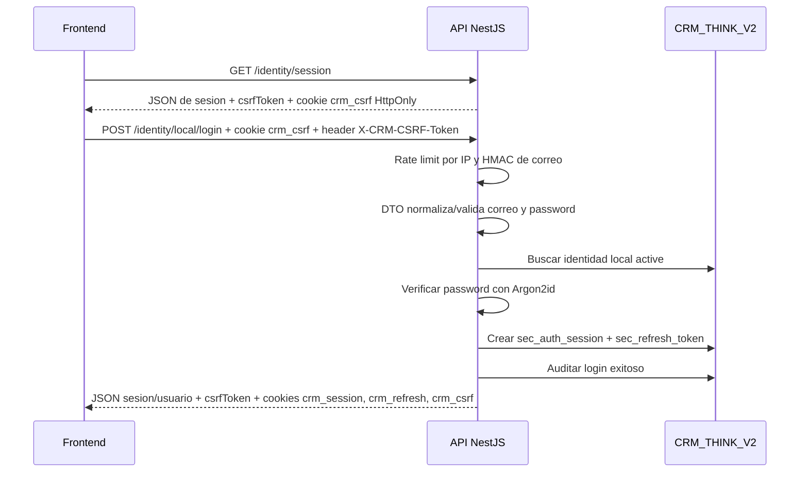
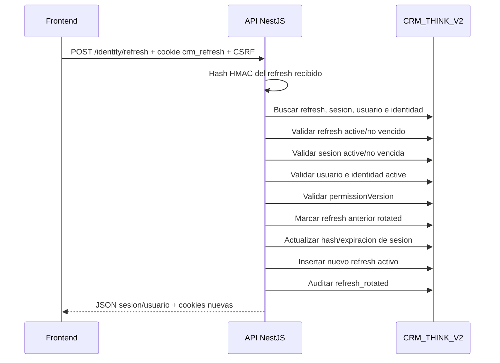
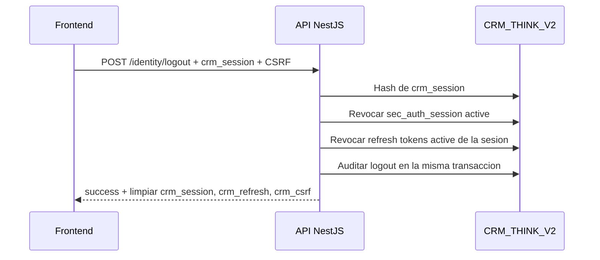

# 24 - Seguridad de Autenticacion BFF, OIDC y Login Local

## Regla superior de autenticacion

El CRM debe usar un patron BFF. El frontend no administra tokens. El backend NestJS es responsable de recibir, custodiar, rotar, validar y revocar tokens.

Esta regla aplica a Microsoft 365 OIDC, correo/clave local y cualquier proveedor futuro de autenticacion.

## Frontera entre Microsoft y sesion CRM

Microsoft 365 / Entra ID no es la sesion interna del CRM. Es un proveedor para probar identidad durante su flujo OIDC.

Regla:

```txt
El API valida Microsoft solo durante el login Microsoft. Despues emite sesion BFF propia del CRM. El login local no depende de Microsoft.
```

Implicaciones:

- el flujo Microsoft valida `state`, PKCE, issuer, audience, expiracion y claims antes de crear sesion CRM;
- la identidad Microsoft debe vincularse con un identificador estable del proveedor, por ejemplo `sub`/`oid`, no solo por correo;
- una vez creada la sesion CRM, los requests normales validan cookies opacas, CSRF, estado de usuario, `permissionVersion` y permisos efectivos;
- `/identity/refresh` rota refresh tokens propios del CRM, no tokens Microsoft;
- el login local valida Argon2id, lockout, rate limit y estado de identidad local, sin llamar a Microsoft;
- si manana entra otro proveedor de autenticacion, se agrega su adapter y se mantiene el mismo contrato BFF del CRM.

## Continuidad Microsoft ante refresh del navegador

El problema a evitar es que una recarga del navegador pierda la relacion con Microsoft.

Regla:

```txt
La recarga del navegador conserva sesion por cookies CRM. Microsoft se renueva o revalida desde el backend usando cache MSAL cifrado, no desde React.
```

Diseno requerido para Microsoft real:

1. El login Microsoft usa authorization code flow con PKCE, `state`, `nonce` y scopes minimos `openid profile email offline_access`.
2. El callback valida issuer, audience, expiracion, `nonce`, tenant y claims antes de crear o vincular `sec_auth_identity`.
3. La identidad Microsoft se vincula con identificador estable del proveedor (`oid`/`sub` + tenant o `homeAccountId`), no solo con correo.
4. El API crea sesion CRM propia (`crm_session`, `crm_refresh`, `crm_csrf`) igual que en login local.
5. El API persiste el cache MSAL cifrado en servidor, particionado por la cuenta Microsoft estable y asociado a la identidad CRM.
6. El frontend nunca recibe access token, refresh token, ID token ni cache de Microsoft.
7. Al refrescar la pagina, el frontend llama `/identity/session`; si la cookie CRM sigue valida, no hace login Microsoft otra vez.
8. Cuando `/identity/refresh` renueva una sesion creada por Microsoft, el backend intenta renovacion silenciosa con MSAL (`acquireTokenSilent`) usando el cache persistido.
9. Si Microsoft responde que requiere interaccion, revocacion o error no recuperable, el API revoca la sesion CRM creada por Microsoft y obliga a reiniciar `/identity/microsoft/start`.
10. El login local no ejecuta este flujo y no depende de Microsoft.
11. Aunque MSAL pueda renovar tokens del proveedor, la sesion CRM no supera 8 horas absolutas; despues de ese limite se obliga login nuevo para regenerar sesion, refresh, CSRF y revalidar Microsoft o clave local.

Persistencia permitida:

| Dato | Donde vive | Regla |
| --- | --- | --- |
| Identificador estable Microsoft | `sec_auth_identity.provider_subject_auth_identity` + `sec_microsoft_account` de `SQL/004`. | No debe depender solo del correo. |
| Cache MSAL serializado | `sec_microsoft_account.cache_ciphertext_microsoft_account` de `SQL/004`. | Siempre cifrado en servidor; nunca texto plano. |
| Access token / refresh token Microsoft | Dentro del cache MSAL cifrado. | No se guarda separado, no se loguea y no se envia al frontend. |
| Foto/imagen Microsoft | Adapter Graph + `sec_user_profile_image` de `SQL/004`. | Puede venir de Graph `/me/photo/$value`, pero el frontend solo debe recibir una URL/referencia interna controlada por el API; no tokens ni URLs temporales del proveedor. |
| Sesion CRM | `sec_auth_session` + `sec_refresh_token`. | Autoridad principal del CRM despues del login. |

La documentacion de Microsoft indica que MSAL Node no expone refresh tokens por seguridad y que, para aplicaciones web confidenciales, el cache en memoria no escala ni sobrevive reinicios; por eso este CRM debe persistir el cache con cifrado antes de activar Microsoft real.

## Sesiones y tokens

Queda prohibido guardar en el frontend:

- access token;
- refresh token;
- ID token;
- tokens de Microsoft;
- tokens internos del CRM;
- secretos de sesion.

Prohibido usar:

- `localStorage`;
- `sessionStorage`;
- variables globales de JavaScript;
- Zustand, TanStack Query, React state o memoria del navegador como almacen de tokens.

La sesion del navegador se maneja con cookies emitidas por el backend.

Decision vigente del API:

```txt
CRM TINK usa BFF con cookies opacas. No usa access token JWT entregado al frontend en este corte.
```

Esto es intencional. El frontend no recibe access token, refresh token, ID token ni token Microsoft. El frontend solo recibe JSON de sesion/usuario/permisos y deja que el navegador transporte cookies seguras hacia el backend.

Si en el futuro se decide usar access token JWT en memoria del frontend, esa decision debe cambiar esta ley y el contrato de identidad antes de implementarse. Mientras la ley vigente sea BFF opaco, cualquier propuesta de guardar o administrar JWT desde React queda rechazada.

## Comparacion con flujos JWT de tutoriales

Muchos ejemplos de NestJS y React ensenan este flujo:

```txt
login -> AuthController -> AuthService -> DB -> firmar JWT -> frontend guarda/manda JWT -> guard valida Bearer token
```

Ese flujo es valido como ejemplo general, pero no es la decision vigente de CRM TINK.

Decision para este CRM:

- React no recibe access token, refresh token ni ID token;
- React no guarda JWT en memoria, `localStorage`, `sessionStorage`, Zustand ni TanStack Query;
- el API emite cookies opacas y seguras;
- el API guarda solo HMAC de tokens en base de datos;
- el API recalcula identidad/permisos efectivos desde datos canonicos;
- el API puede revocar sesiones y refresh tokens desde el backend.

Motivo:

```txt
Para una SPA React interna conectada a un backend propio, BFF con cookies opacas reduce superficie de robo de tokens en el navegador y mantiene la autoridad de sesion/permisos en el API.
```

No se debe instalar `@nestjs/jwt`, `passport-jwt` ni crear guards Bearer solo porque un tutorial lo use. Esas piezas solo aplican si el dueno aprueba cambiar el contrato hacia access tokens JWT, y eso exige actualizar primero la ley y el contrato `33`.

En cambio, el stack vigente usa:

| Necesidad | Decision CRM TINK |
| --- | --- |
| Cookies seguras | `@fastify/cookie`. |
| Headers HTTP | `@fastify/helmet`. |
| Rate limit de identidad | `@fastify/rate-limit` con llaves por IP y actor HMAC. |
| Password local | `argon2` con Argon2id. |
| Configuracion | `@nestjs/config` + Zod fail-fast. |
| DTOs HTTP | `class-validator` / `class-transformer`. |
| Auditoria/logs | `nestjs-pino` / Pino con redaccion. |
| Autorizacion futura | Permiso efectivo propio y CASL solo si reduce complejidad al abrir recursos comerciales. |

Las tablas base de sesion y rotacion quedan definidas en:

```txt
sec_auth_session
sec_refresh_token
```

Ver `29-Modelo-Fisico-MySQL-Identidad-P0-S1.md` y `31-Contrato-Identidad-y-Permisos-P0-S1.md`.

## Autorizacion durante la sesion

La sesion abierta no congela permisos.

Regla:

```txt
El usuario puede seguir autenticado, pero cada accion protegida debe validar permiso efectivo actual.
```

El backend no debe autorizar acciones sensibles solo porque la sesion fue creada cuando el usuario tenia permiso.

Cuando un permiso, rol, denegacion, area o estado de usuario cambie:

- se debe invalidar o refrescar la autorizacion efectiva del usuario;
- se debe incrementar la version de permisos del usuario;
- se debe registrar auditoria;
- el siguiente request sensible debe usar permisos actuales.

No guardar permisos como verdad permanente dentro de tokens largos.

Para acciones criticas, el guard de autorizacion debe revalidar contra la version de permisos actual antes de ejecutar la accion.

Decision P0-S1A:

- bloquear o inactivar una identidad de autenticacion local/Microsoft no se anuncia como proveedor disponible;
- la revocacion retroactiva de sesiones ya abiertas por bloqueo de identidad es parte obligatoria del runtime, junto con token opaco hasheado, rotacion de refresh y validacion de version de permisos;
- mientras tanto, el corte autorizado sigue revalidando usuario activo y permisos efectivos en cada request protegido.

## Cookies obligatorias

Toda cookie de sesion o token debe usar:

| Directiva | Regla |
| --- | --- |
| `HttpOnly` | Obligatoria. JavaScript no puede leer el token. |
| `Secure` | Obligatoria. Solo HTTPS. |
| `SameSite=Strict` | Regla por defecto. |
| `SameSite=Lax` | Solo si existe flujo cross-domain controlado y documentado; aplica al challenge temporal `crm_ms_oidc` porque Microsoft vuelve al API desde otro sitio. |
| `Path` | Debe ser el minimo necesario para cada cookie. |

La cookie de refresh token debe tener ruta restringida, por ejemplo:

```txt
/auth/refresh
```

## Vida util y rotacion

| Elemento | Regla |
| --- | --- |
| Sesion `crm_session` | Maximo 8 horas absolutas desde el login. |
| Access token JWT | No aplica en la decision vigente; si se aprueba en fase futura, maximo 15 minutos y solo en memoria. |
| Refresh token | Rotacion obligatoria dentro de la misma ventana absoluta de 8 horas; no extiende la sesion. |
| Reuso de refresh token | Se trata como posible robo: invalida la familia asociada y revoca todas las sesiones activas del usuario. |
| Logout | Revoca la sesion activa y limpia cookies. |

## Cookies actuales del BFF

| Cookie | Quien la emite | HttpOnly | Path | Contenido | Uso |
| --- | --- | --- | --- | --- | --- |
| `crm_session` | API | Si | `/` | Token opaco aleatorio. | Identifica la sesion corta del usuario. |
| `crm_refresh` | API | Si | `/identity/refresh` | Token opaco aleatorio. | Permite rotar sesion sin pedir login otra vez. |
| `crm_csrf` | API | Si | `/` | `nonce.firma` base64url. | El BFF la compara contra el header CSRF; el mismo valor vigente tambien viaja en JSON como `csrfToken`. |
| `crm_ms_oidc` | API | Si | `/identity/microsoft/callback` | Challenge OIDC firmado. | Solo vive durante el redirect Microsoft; usa `SameSite=Lax`. |

Reglas:

- `crm_session` nunca guarda `publicId` plano, correo, rol ni permisos;
- `crm_session` se guarda en base solo como HMAC en `sec_auth_session.token_hash_auth_session`;
- `crm_refresh` se guarda en base solo como HMAC en `sec_refresh_token.token_hash_refresh_token`;
- `crm_refresh` tiene path restringido a `/identity/refresh`;
- `crm_csrf` es `HttpOnly`; el frontend no la lee con `document.cookie`, usa el `csrfToken` devuelto por `/identity/session`, login o refresh;
- `crm_session`, `crm_refresh` y `crm_csrf` usan `Secure` y `SameSite=Strict`; `crm_ms_oidc` usa `Secure` y `SameSite=Lax` por el redirect OIDC cross-site controlado;
- logout limpia `crm_session`, `crm_refresh` y `crm_csrf`.

## Secretos del runtime

| Variable | Uso | Regla |
| --- | --- | --- |
| `COOKIE_SECRET` | Firma cookies y CSRF. | Obligatoria, minimo 32 caracteres. |
| `AUTH_TOKEN_HASH_SECRET` | HMAC de tokens opacos de sesion/refresh. | Obligatoria, distinta de `COOKIE_SECRET` y `AUDIT_HASH_SECRET`. |
| `AUDIT_HASH_SECRET` | HMAC de identificadores sensibles en auditoria/rate limit. | Obligatoria, distinta de `COOKIE_SECRET`. |

Ninguno de estos secretos se guarda en codigo, documentos, commits, logs o capturas.

## Flujo de login local preparado



Reglas del flujo:

- el correo se normaliza con `trim` + lowercase antes de validar, auditar, rate-limit o autenticar;
- una identidad local debe estar `active`, no eliminada logicamente y vinculada a un usuario `active`;
- el password se verifica con Argon2id;
- si falla correo o password, la respuesta visible es neutral: `Credenciales invalidas`;
- el fallo se audita con HMAC del correo, no con correo crudo;
- el exito crea una sesion nueva para evitar fijacion de sesion;
- la sesion y el refresh se crean en una transaccion logica;
- la respuesta no devuelve tokens al JSON.

## Flujo de refresh token



Reglas de seguridad del refresh:

- si no hay cookie `crm_refresh`, responde `401`;
- si el refresh no existe, responde `401`;
- solo un refresh con estado `rotated` o `reused` se considera reuso real y revoca todas las sesiones activas del usuario;
- un refresh `revoked`, `expired` o de una carrera ya consumida responde como invalido/expirado sin revocar sesiones ajenas;
- si el refresh activo esta vencido, se marca `expired`;
- si la sesion, usuario o identidad asociada ya no esta activa, se revoca la familia de refresh tokens y la sesion asociada;
- si `permissionVersion` de la sesion no coincide con el usuario actual, responde `409`; el cliente intenta un refresh single-flight y solo si falla limpia sesion/cache local y pide login nuevo;
- si rota correctamente, el refresh anterior queda `rotated` y se emite uno nuevo;
- la auditoria de refresh se registra con el usuario canonico asociado.

Decision vigente: multiples sesiones normales estan permitidas, pero reuso real de refresh token (`rotated` o `reused`) se trata como posible robo y revoca todas las sesiones activas del usuario.

## Flujo de logout



Logout es idempotente: si no existe sesion activa, igual retorna exito y limpia cookies del navegador.

## Microsoft 365 / Entra ID

El login con Microsoft debe cumplir:

- OAuth 2.1 / OIDC con Authorization Code + PKCE;
- `code_challenge` y `code_verifier` obligatorios;
- parametro `state` aleatorio, criptograficamente seguro y validado en callback;
- `redirect_uri` allowlist exacta en backend y Azure;
- prohibido usar comodines `*` en redirect URI;
- scopes minimos: `openid`, `profile`, `email`, `User.Read`;
- no pedir permisos que no tengan uso aprobado.

## Login local correo/clave

El login local es alternativa controlada, no atajo inseguro.

Reglas:

- Argon2id recomendado para hash de password;
- bcrypt queda fuera de este corte; el runtime usa Argon2id para login local;
- normalizar correo con `trim` + lowercase antes de validar, auditar, aplicar rate limit o autenticar;
- limitar correo a 254 caracteres;
- limitar password local a 128 caracteres antes de hashear para evitar payloads abusivos;
- limitar token opaco de activacion/reset local a 256 caracteres;
- nunca guardar ni procesar claves en texto plano;
- errores neutrales: `Credenciales invalidas`;
- no revelar si existe correo, usuario o dominio;
- rate limit por IP efectiva, con cuota mayor para no castigar oficinas bajo NAT o proxy compartido;
- rate limit por cuenta/correo, usando HMAC y cuota mas estricta;
- `complete-reset` tiene rate limit por IP efectiva y por HMAC del token opaco de reset para evitar abuso del endpoint publico;
- auditoria de intentos relevantes;
- bloqueo temporal persistente por identidad local ante abuso;
- rechazo local de claves comunes antes de guardar Argon2id;
- verificacion contra brechas externas queda pendiente hasta aprobar un adapter/proveedor para ese control.

## CORS

La API solo puede aceptar origenes exactos aprobados.

Prohibido:

```txt
Access-Control-Allow-Origin: *
```

Reglas:

- origin allowlist exacta del frontend;
- `FRONTEND_ORIGIN` define el origin canonico usado por redirects; `FRONTEND_ALLOWED_ORIGINS` puede agregar origins exactos adicionales para pruebas locales por IP de red, sin wildcard ni reflection automatica;
- `credentials: true` cuando se usen cookies;
- no reflejar automaticamente el `Origin` recibido;
- no habilitar origenes comodin por ambiente.

En `NODE_ENV=development`, las cookies BFF pueden emitirse sin atributo `Secure`
para permitir pruebas HTTP desde IP local (`http://192.168...`). En `test` y
`production` deben conservar `Secure`.

## CSRF

Todo endpoint mutable debe protegerse contra CSRF.

Aplica a:

- `POST`;
- `PUT`;
- `PATCH`;
- `DELETE`.

Patrones permitidos:

- Double Submit Cookie;
- token CSRF firmado;
- header personalizado obligatorio validado por backend.

Reglas de emision:

- `GET /identity/session` emite cookie CSRF firmada si el navegador no trae una vigente para el estado de sesion actual, y devuelve el valor vigente como `csrfToken` en JSON;
- todo endpoint mutable responde `403` si cookie/header CSRF faltan, no coinciden, no tienen formato `nonce.firma` base64url o no validan firma;
- si existe cookie de sesion, la firma CSRF debe estar ligada a ese token de sesion;
- `POST /identity/logout` limpia cookie de sesion, refresh y CSRF;
- no rotar CSRF en cada lectura anonima porque rompe formularios abiertos y tabs simultaneas.

No se permite confiar solo en `SameSite` como unica defensa si el endpoint cambia estado.

## Headers HTTP

El backend debe usar cabeceras de seguridad equivalentes a Helmet.

Obligatorio:

| Header | Regla |
| --- | --- |
| HSTS | Forzar HTTPS. |
| CSP | Restrictivo, sin scripts no autorizados. |
| `X-Frame-Options` | `DENY`. |
| `X-Content-Type-Options` | `nosniff`. |
| `Referrer-Policy` | Restrictiva. |
| `Cache-Control` | `no-store` obligatorio para todo `/identity/*`. |

Las respuestas de identidad no deben quedar cacheadas por navegador ni proxy.
Esto aplica aunque el endpoint sea de lectura, porque puede devolver correo,
sesion, roles, areas o permisos efectivos. La cabecera debe aplicarse antes de
guards, rate limit y resolucion de rutas, para cubrir tambien `401`, `403`,
`429` y `404` bajo `/identity/*`.

## Validacion y sanitizacion

Toda entrada HTTP debe validarse contra DTOs o esquemas rigidos.

Reglas:

- eliminar propiedades no declaradas;
- rechazar payloads inesperados cuando aplique;
- validar ids, fechas, montos, enums y paginacion;
- prevenir SQL injection mediante consultas parametrizadas/Kysely;
- prevenir prototype pollution;
- no aceptar objetos libres sin contrato.

## Estado real de implementacion API

| Tema | Estado |
| --- | --- |
| BFF con cookies opacas | Implementado en API. |
| Token de sesion opaco con HMAC | Implementado en API; estructura `SQL/003` aplicada y validada contra MySQL. |
| Refresh token opaco con HMAC | Implementado en API. |
| Rotacion de refresh | Implementada en API. |
| Deteccion de reuso | Implementada; solo `rotated`/`reused` revocan todas las sesiones activas del usuario. |
| CSRF firmado y ligado a sesion | Implementado en API. |
| Login local Argon2id | Preparado en API contra identidades locales activas. |
| Microsoft real | Adapter API implementado con MSAL Node, PKCE/state/nonce, callback, cache cifrada, Graph photo con timeout y `acquireTokenSilent`; activacion productiva depende de Entra ID real, variables `MICROSOFT_*`, `SQL/004` aplicado en el ambiente objetivo y validacion operacional aprobada. |
| Reset/activacion local backend | Implementado con token opaco hasheado y Argon2id; falta canal aprobado de entrega del token. |
| Rate limit login/reset | Implementado por IP y HMAC de correo, en memoria del proceso actual. Multi-instancia requiere store compartido. |
| Rate limit refresh | Implementado por IP y HMAC del refresh token, en memoria del proceso actual. Multi-instancia requiere store compartido. |
| Account lockout persistente | Implementado en API y estructura `SQL/003` aplicada; pendiente validar con identidad local real aprobada. |
| Logger estructurado con redaccion | Implementado con Pino/nestjs-pino. |
| Frontend login | Implementado para identidad: `/auth/login`, login local, Microsoft popup, verificacion de sesion, logout y shell `/home/global` consumen el BFF sin tokens en frontend. |

## Manejo de errores

Las respuestas al frontend o usuario final nunca deben exponer:

- stack traces;
- SQL;
- nombres internos de tablas;
- detalles de infraestructura;
- secrets;
- tokens;
- configuracion interna;
- informacion que permita enumerar usuarios.

El detalle tecnico va a logs internos sanitizados con `correlation_id`.

## Regla de implementacion

Ningun endpoint de autenticacion, sesion, refresh, logout, callback OIDC, CORS o CSRF puede implementarse si contradice este documento.

Si otra documentacion o skill propone guardar tokens en el frontend, usar implicit flow, relajar CORS con `*`, exponer errores internos o saltar CSRF, esa instruccion queda rechazada.
