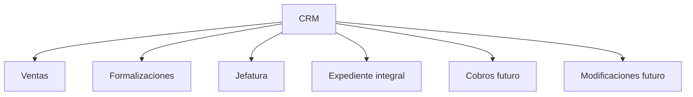

# 00 - Indice de Arquitectura Frontend

## Proposito

Este indice permite navegar la documentacion funcional y tecnica del frontend del CRM.

La documentacion debe ser entendible para ingenieros, analistas, usuarios operativos y personas que no conocen el sistema actual.

## Lectura cero

Antes de leer cualquier otro documento frontend, abrir primero la ley canonica de producto y despues el addendum visual:

```txt
apps/api/Arquitectura/00-Producto-CRM-TINK-y-P0.md
00-Producto-CRM-TINK-y-P0-Frontend.md
```

Si `00-Producto-CRM-TINK-y-P0-Frontend.md` contradice a `apps/api/Arquitectura/00-Producto-CRM-TINK-y-P0.md`, gana la ley canonica del producto.

Si `00-Producto-CRM-TINK-y-P0-Frontend.md` contradice a este indice, `AGENTS.md`, una skill, un documento de UX o cualquier documento futuro, gana `00-Producto-CRM-TINK-y-P0-Frontend.md` dentro del frontend hasta que el dueno del producto apruebe una nueva version.

## Regla de uso

Antes de crear pantallas, formularios, tablas, filtros, permisos visibles o flujos de usuario, leer primero `00-Producto-CRM-TINK-y-P0-Frontend.md`, despues este indice y luego los documentos relacionados.

## Lectura obligatoria P0-S1A por orden

0. `00-Producto-CRM-TINK-y-P0-Frontend.md`
1. `22-UX-Identidad-Usuarios-Roles-P0-S1.md`
2. `24-Contrato-Visual-Identidad-P0-S1.md`

Si hay pelea entre estos documentos, gana `00-Producto-CRM-TINK-y-P0-Frontend.md`.

## Consulta tecnica P0-S1A

Estos documentos se consultan solo cuando se revise seguridad, estado frontend o preparacion de implementacion. No agregan alcance nuevo:

1. `21-Seguridad-Autenticacion-BFF-y-Sesion.md`
2. `23-Regla-IDs-Canonicos-y-Proveedores-Frontend.md`
3. `18-P0-Direccion-Frontend-Construccion-Pausada.md`
4. `19-Mapa-de-Implementacion-Frontend.md`

## Lectura futura, fuera de P0-S1

Estos documentos existen para conservar vision, no para autorizar implementacion en P0-S1:

1. `14-Modularizacion-Frontend-por-Areas-y-Roles.md`
2. `15-UX-Calendarios-por-Area-y-Supervision.md`
3. `16-UX-Notas-Adhesivas-y-Anotaciones.md`
4. `17-UX-Dashboard-Leads-SLA-y-Perdida.md`
5. `20-Alcance-P0-Vertical-Leads-Frontend.md`

Solo se leen cuando `00-Producto-CRM-TINK-y-P0-Frontend.md` o una decision aprobada por el dueno del producto habilite ese alcance.

## Documentos

| Archivo | Para que sirve |
| --- | --- |
| `00-Producto-CRM-TINK-y-P0-Frontend.md` | Ley superior de producto frontend: que UI somos, que no somos, P0-S1 y prohibiciones actuales. |
| `01-Resumen-Frontend.md` | Resume la decision tecnica principal del frontend. |
| `02-Arquitectura-Frontend.md` | Explica estructura React, modulos y organizacion. |
| `03-UI-UX-CRM.md` | Define criterios visuales y experiencia diaria del CRM. |
| `04-API-Client-y-Estado.md` | Define contratos, TanStack Query y estado frontend. |
| `05-Testing-Frontend.md` | Define pruebas esperadas del frontend. |
| `06-ADRs-Frontend.md` | Guarda decisiones arquitectonicas del frontend. |
| `07-Skills-Codex-Instaladas.md` | Lista skills locales y su uso esperado. |
| `08-Revision-Blueprint-y-Siguiente-Paso.md` | Resume revision del blueprint desde UI. |
| `09-Decisiones-P0-UX-Permisos-y-Preguntas.md` | Guarda decisiones P0 de UX, permisos y dudas. |
| `10-Contrato-Canonico-Frontend.md` | Regla de no usar nombres legacy/proveedor en UI. |
| `11-UX-Bitacora-Acciones-y-Timeline-Lead.md` | Define timeline, bitacora y filtros del lead. |
| `12-Diccionario-Funcional-y-Acciones-CRM.md` | Define como documentar acciones y flujos funcionales. |
| `13-Flujo-Comercial-CRM.md` | Explica flujo Lead -> Oportunidad -> Estimacion -> Orden de Venta -> Contrato. |
| `14-Modularizacion-Frontend-por-Areas-y-Roles.md` | Define separacion de UI por ventas, formalizaciones, cobros, modificaciones, jefatura y modulos compartidos. |
| `15-UX-Calendarios-por-Area-y-Supervision.md` | Define calendarios separados por area y vista consolidada de jefatura. |
| `16-UX-Notas-Adhesivas-y-Anotaciones.md` | Define UX, librerias y reglas para notas adhesivas/anotaciones contextuales por vista, entidad y accion. |
| `17-UX-Dashboard-Leads-SLA-y-Perdida.md` | Define dashboard ejecutivo, bandejas de leads nuevos/atencion, pausa, perdida y reportes para jefatura. |
| `18-P0-Direccion-Frontend-Construccion-Pausada.md` | Documento corto de direccion P0 frontend; mantiene el stub congelado hasta aprobacion de runtime. |
| `19-Mapa-de-Implementacion-Frontend.md` | Mapa practico de carpetas, responsabilidades, dependencias permitidas y primer vertical slice del frontend. |
| `20-Alcance-P0-Vertical-Leads-Frontend.md` | Alcance comercial futuro de leads: listar, crear, detalle y timeline despues de cerrar identidad. |
| `21-Seguridad-Autenticacion-BFF-y-Sesion.md` | Regla obligatoria de sesion frontend: BFF, cookies seguras, prohibicion de tokens en storage y manejo CSRF. |
| `22-UX-Identidad-Usuarios-Roles-P0-S1.md` | Primera compuerta frontend: usuarios, autenticacion, roles y permisos antes de pantallas de leads. |
| `23-Regla-IDs-Canonicos-y-Proveedores-Frontend.md` | Regla frontend: usar public ids/contratos canonicos del CRM, nunca ids de proveedores externos. |
| `24-Contrato-Visual-Identidad-P0-S1.md` | Contrato visual de identidad: pantallas permitidas, estados, textos, roles, areas y permisos visibles. |

## Mapa rapido de implementacion

Antes de crear o modificar pantallas, componentes, hooks o clientes API, abrir:

```txt
00-Producto-CRM-TINK-y-P0-Frontend.md
22-UX-Identidad-Usuarios-Roles-P0-S1.md
24-Contrato-Visual-Identidad-P0-S1.md
```

Esa lectura define:

- que puede mostrar el stub frontend;
- que queda bloqueado;
- que contrato visual de identidad manda;
- por que leads sigue fuera.

El siguiente slice aprobado en papel es identidad P0-S1A. El documento `20-Alcance-P0-Vertical-Leads-Frontend.md` se consulta despues de aprobar avanzar mas alla de identidad.

## Flujo comercial oficial


Resumen para usuarios:

Un cliente siempre inicia como lead. Si avanza, se convierte en oportunidad, luego se trabaja una estimacion, luego una orden de venta y finalmente queda como contrato firmado.

Resumen para UI:

La pantalla debe mostrar el estado actual, el proximo paso disponible y el historial de lo que ya paso.

## Separacion por areas


