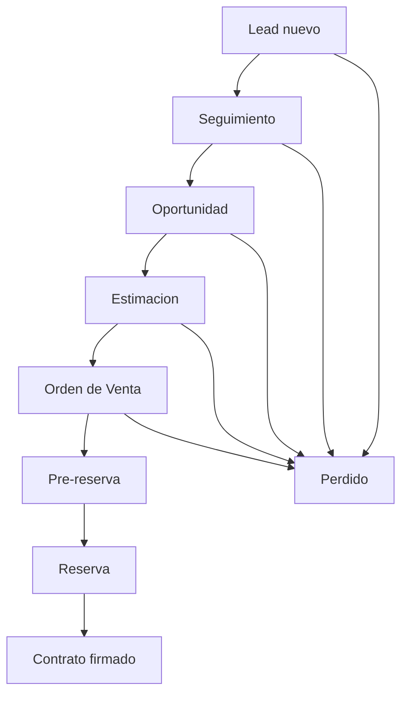

# 13 - Flujo Comercial CRM

## Veredicto

El flujo que debe entender la UI es:

```txt
Lead -> Oportunidad -> Estimacion -> Orden de Venta -> Contrato firmado
```

Todo nace desde el lead.

## Explicacion para usuario

El lead es el cliente o prospecto inicial.

Cuando el cliente muestra potencial real, el vendedor lo convierte en oportunidad.

Desde la oportunidad se prepara una estimacion.

Si el cliente avanza, se crea una orden de venta.

Dentro de la orden de venta se marcan hitos como pre-reserva o reserva.

Cuando todo se completa, se marca contrato firmado.

## Diagrama de usuario



## Como debe comportarse la pantalla

La pantalla del lead debe mostrar:

- estado actual;
- vendedor/responsable;
- proximo paso recomendado;
- acciones disponibles segun permisos;
- timeline de todo lo ocurrido;
- oportunidad asociada si existe;
- estimaciones asociadas si existen;
- orden de venta asociada si existe;
- contrato asociado si existe.

## Regla de acciones disponibles

La UI no decide autorizacion final.

La UI muestra acciones segun permisos efectivos entregados por el API.

Ejemplo:

```txt
lead.status.change
opportunity.create
estimate.create
estimate.approve
sales_order.create
sales_order.reserve
contract.sign
```

Si una persona tiene permiso delegado temporal, la accion puede aparecer mientras el API la permita.

Si una persona tiene denegacion directa, la accion no debe aparecer aunque su rol normalmente la tenga.

## Oportunidad

Vista esperada:

```txt
Resumen de oportunidad
Estado
Monto o valor estimado cuando exista
Responsable
Actividades pendientes
Estimaciones relacionadas
Timeline
```

Regla:

La oportunidad no nace sola; siempre viene desde lead.

## Estimacion

Vista esperada:

```txt
Lista de estimaciones
Estado
Fecha
Monto
Acciones disponibles
Historial
```

Acciones futuras:

```txt
crear
editar
enviar
aprobar
rechazar
caer
cancelar
```

Regla:

Quien puede aprobar o caer una estimacion depende de permisos, no de un rol fijo.

## Orden de Venta

Vista esperada:

```txt
Resumen de orden de venta
Estado
Datos de reserva/pre-reserva
Datos comerciales
Envio a sistema externo
Historial de cambios
```

Regla:

Reserva no es una pantalla aislada obligatoria en P0. Es una marca/estado dentro de la orden de venta y tambien mueve el estado visible del lead.

## Contrato firmado

Vista esperada:

```txt
Estado del contrato
Fecha de firma
Documentos asociados
Responsable
Timeline
```

Regla:

Contrato firmado es el cierre exitoso del flujo.

## Perfil del lead

En P0 no hay campos globalmente obligatorios del perfil para avanzar.

La UI no debe bloquear el avance por cedula, estado civil, ingresos, direccion u otros datos si el API no lo exige para esa accion especifica.

## Corredor

El corredor puede cambiar despues de reserva o contrato.

La UI debe permitirlo si el API devuelve permiso.

Cada cambio debe aparecer en timeline:

```txt
Corredor asignado
Corredor cambiado
Corredor retirado
```

## Timeline visible

Cada avance debe verse en timeline:

| Accion | Texto visible recomendado |
| --- | --- |
| Crear lead | Lead creado |
| Crear oportunidad | Oportunidad creada |
| Crear estimacion | Estimacion creada |
| Aprobar estimacion | Estimacion aprobada |
| Crear orden de venta | Orden de venta creada |
| Marcar pre-reserva | Pre-reserva marcada |
| Marcar reserva | Reserva marcada |
| Firmar contrato | Contrato firmado |
| Marcar perdido | Lead marcado como perdido |
| Cambiar corredor | Corredor actualizado |

## Estados de UI

Cada flujo debe contemplar:

- cargando;
- guardando;
- exito;
- error de validacion;
- sin permiso;
- error de integracion externa;
- accion pendiente de sincronizacion;
- accion registrada localmente.

## Preguntas cerradas

| Pregunta | Decision |
| --- | --- |
| Donde nace el proceso? | Todo nace desde lead. |
| Orden del flujo? | Lead -> Oportunidad -> Estimacion -> Orden de Venta -> Contrato. |
| Reserva es lo mismo que orden de venta? | No exactamente. Reserva es una marca/estado dentro de orden de venta. |
| Pre-reserva, reserva y contrato son modulos separados? | No para P0; son hitos/estados del avance. |
| Quien aprueba estimaciones? | Segun permiso efectivo. |
| Hay campos de perfil obligatorios para avanzar? | No en P0. |
| Puede cambiar corredor despues de reserva/contrato? | Si, si tiene permiso. |

## Preguntas pendientes para diseno futuro

Estas preguntas no bloquean el flujo base:

1. Que columnas exactas debe ver el vendedor en lista de oportunidades?
2. Que datos exactos debe mostrar una tarjeta de estimacion?
3. Que campos debe tener el formulario de orden de venta?
4. Que documentos se muestran en contrato?
5. Que filtros necesita gerencia para oportunidades, estimaciones y ordenes?
