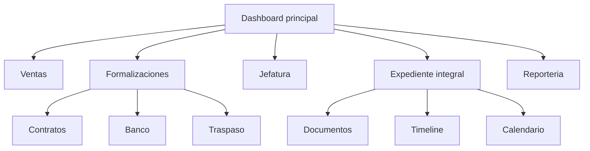
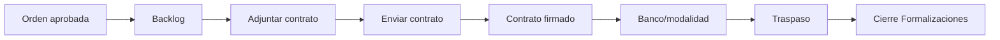

# 14 - Modularizacion Frontend por Areas y Roles

## Veredicto

El frontend debe organizarse por areas de trabajo y flujos de usuario, no como una sola carpeta gigante de CRM.

Cada area debe tener su propia carpeta, pantallas, componentes de negocio, hooks, tipos y documentacion.

Solo lo que realmente usan varios modulos debe vivir en carpetas compartidas.

## Fuentes internas revisadas

### CRM IDEA.pdf

Plantea la vision completa:

- ventas;
- formalizaciones;
- cobros;
- asesoria de modificaciones;
- documentos;
- calendario;
- correo;
- WhatsApp;
- historico de acciones;
- reporting;
- expediente vivo de la compra.

### RESUMEN_EJECUTIVO_CRM_TINK AJUSTADO (1).pdf

Reduce el alcance inicial:

- primera entrega enfocada en Formalizaciones;
- Cobros y Modificaciones quedan para fases posteriores;
- el ERP/sistema externo mantiene cobros;
- contrato se adjunta/envia desde CRM;
- KPIs al final de Formalizaciones;
- objetivo: abrir una orden aprobada y conocer avance de contrato, firma, banco, traspaso, documentos, responsable y bloqueo.

## Estructura esperada

```txt
src/
+-- app/
+-- components/
|   +-- ui/
|   +-- layout/
|   +-- data-table/
|   +-- feedback/
+-- modules/
|   +-- sales/
|   +-- formalizations/
|   +-- collections/
|   +-- modifications/
|   +-- management/
|   +-- customer-journey/
|   +-- documents/
|   +-- calendar/
|   +-- communications/
|   +-- reporting/
|   +-- auth/
|   +-- permissions/
+-- services/
|   +-- api/
|   +-- auth/
+-- stores/
+-- hooks/
+-- types/
```

## Regla de separacion

Cada modulo de `src/modules/*` puede tener:

```txt
components/
pages/
hooks/
queries/
mutations/
schemas/
types/
utils/
docs/
```

Regla:

- si un componente solo sirve para Formalizaciones, vive en `modules/formalizations`;
- si un hook solo sirve para vendedores, vive en `modules/sales`;
- si algo es visual y generico, vive en `components/ui`;
- si algo es una consulta de API de un dominio, vive en `modules/<dominio>/queries`;
- si algo aplica a permisos globales, vive en `modules/permissions` o `services/auth`;
- si algo aplica a todos los formularios, vive en `components/forms` o `hooks`;
- no crear `helpers` globales con reglas de negocio de un modulo.

## Modulos frontend

### sales

Usuarios principales:

- vendedores;
- supervisores de ventas;
- gerencia comercial.

Responsabilidad:

- leads;
- seguimiento;
- oportunidades;
- estimaciones;
- ordenes de venta;
- estado visible del lead;
- pipeline comercial;
- acciones comerciales antes de Formalizaciones.

No debe contener:

- pantallas internas de formalizacion bancaria;
- cobros;
- extras;
- revision fisica;
- entrega de llaves.

### formalizations

Usuarios principales:

- formalizadoras;
- jefatura;
- gerencia con vista de supervision.

Responsabilidad P0:

- backlog de ordenes aprobadas;
- contratos pendientes;
- contrato adjunto;
- envio de contrato;
- contrato firmado;
- modalidad de compra;
- banco;
- asesor bancario;
- gestion bancaria;
- traspaso;
- cierre de Formalizaciones;
- excepciones autorizadas.

Pantallas iniciales:

```txt
FormalizationsDashboard
FormalizationCaseDetail
ContractPanel
BankFormalizationPanel
TransferPanel
FormalizationTimeline
FormalizationReports
```

### collections

Usuarios principales:

- cobros;
- jefatura financiera;
- gerencia.

Responsabilidad futura:

- prereservas;
- proximos a vencer;
- pagos vencidos;
- fideicomisos;
- extras pendientes;
- condicion 100% cancelada;
- estado financiero visible.

P0:

- no construir flujo completo;
- solo preparar arquitectura y contratos si Formalizaciones necesita condicion minima.

### modifications

Usuarios principales:

- asesoras de modificaciones;
- operaciones/construccion cuando aplique;
- jefatura.

Responsabilidad futura:

- bienvenida;
- reunion de extras;
- boletas versionadas;
- extras aprobadas;
- visitas de obra;
- revision fisica;
- unidad aceptada;
- entrega de llaves.

### management

Usuarios principales:

- jefe;
- gerente;
- administradores autorizados.

Responsabilidad:

- aprobaciones;
- excepciones;
- supervision de todas las areas;
- reasignaciones;
- permisos delegados;
- indicadores.

Regla:

`management` no debe duplicar las pantallas operativas de cada area. Debe mostrar resumen, decisiones pendientes y enlaces al detalle del modulo propietario.

### customer-journey

Responsabilidad:

- vista integral del expediente;
- donde esta la compra;
- que area tiene la siguiente accion;
- que condicion bloquea el avance;
- timeline consolidado.

Regla:

Debe leer datos compuestos del API. No debe implementar reglas internas de Formalizaciones, Cobros o Modificaciones.

### documents

Responsabilidad:

- lista de documentos;
- adjuntar contrato;
- adjuntos OneDrive;
- respaldo de aprobaciones;
- comprobantes;
- version de boleta.

### calendar

Responsabilidad:

- calendario de ventas separado para eventos de leads;
- calendario de Formalizaciones separado para contrato, firma, banco y traspaso;
- calendarios futuros de Cobros y Modificaciones;
- vista consolidada de Jefatura/Gerencia segun permisos efectivos;
- eventos del CRM;
- firma bancaria;
- reunion de extras;
- visitas;
- entrega;
- reprogramaciones.

Regla:

El calendario de vendedores no debe mezclarse con los calendarios de otros departamentos. Si Jefatura necesita ver varias areas, debe usar una vista consolidada con filtros por area, equipo, usuario, tipo de evento y permisos.

### communications

Responsabilidad:

- plantillas;
- envio de correo;
- WhatsApp;
- historial de comunicaciones;
- estado de envio.

## Navegacion recomendada



## P0 UX de Formalizaciones



## Banners P0 Formalizaciones

```txt
Contratos pendientes
Contratos enviados pendientes de firma
Formalizacion bancaria sin iniciar
Formalizacion bancaria en proceso
Pendientes de traspaso
Traspaso pendiente autorizado
Cerrados por Formalizaciones
```

Cada banner debe tener:

- contador;
- filtros;
- tabla;
- responsable;
- antiguedad;
- siguiente accion;
- indicador de bloqueo;
- acceso al expediente.

## Regla de lenguaje para usuarios normales

La UI debe explicar estados con palabras claras:

```txt
Contrato pendiente
Contrato enviado
Contrato firmado
Banco sin iniciar
Banco en proceso
Credito formalizado
Pendiente de traspaso
Traspaso realizado
Cerrado por Formalizaciones
```

Evitar:

```txt
estado_formalizacion = 3
flag_reserva = 1
id_estado = 7
```

## Hooks y componentes compartidos

Compartido permitido:

```txt
useDebouncedSearch
useTableState
useCurrentUser
useEffectivePermissions
useToast
useDialogState
PermissionGate
DataTable
DateRangeFilter
StatusBadge
Timeline
DocumentList
```

No compartir:

```txt
useFormalizationBankRules
useSalesLeadTransitionRules
useCollectionsPaymentRules
useModificationExtrasRules
```

Esos hooks pertenecen a su modulo.

## Relacion con API

El frontend no inventa reglas.

El API debe entregar:

- estados permitidos;
- acciones permitidas;
- permisos efectivos;
- motivos por vista;
- datos del expediente;
- timeline;
- bloqueos;
- siguiente accion recomendada cuando aplique.

El frontend renderiza y ejecuta mutaciones canonicas.

## Fases

### P0/P1 - Formalizaciones

Construir:

- dashboard formalizaciones;
- detalle de caso;
- contrato adjunto;
- envio de contrato;
- firma;
- banco;
- traspaso;
- timeline;
- KPIs minimos.

### P2 - Cobros

Preparar despues:

- prereservas;
- vencimientos;
- pagos;
- fideicomisos;
- extras financieros;
- condicion 100% cancelada.

### P3 - Modificaciones

Preparar despues:

- bienvenida;
- extras;
- versiones;
- visitas;
- revision fisica;
- entrega de llaves.

## Preguntas abiertas

Estas preguntas no bloquean la modularizacion:

1. Cuales columnas exactas necesita la tabla de Formalizaciones P0?
2. Que filtros debe usar Jefatura por defecto?
3. Que texto final tendran los botones de contrato?
4. Que pantallas deben ser visibles para vendedor solo en modo consulta?
5. Que datos minimos del ERP/sistema externo se muestran en Formalizaciones?
