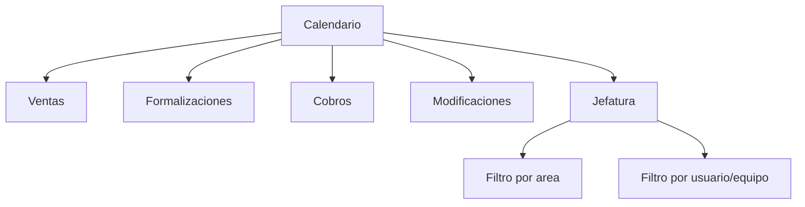

# 15 - UX Calendarios por Area y Supervision

## Veredicto

El calendario de vendedores no se mezcla con calendarios de otros departamentos.

Ventas usa su calendario para eventos de lead, seguimiento, llamadas, reuniones y actividades comerciales.

Formalizaciones, Cobros y Modificaciones tienen calendarios propios por area. Jefatura o gerencia puede ver calendarios consolidados segun permisos efectivos, filtros y rol actual.

## Regla de UI

La UI debe tratar cada calendario como una vista operativa separada:

```txt
Calendario de Ventas
Calendario de Formalizaciones
Calendario de Cobros
Calendario de Modificaciones
Calendario de Jefatura
```

Jefatura no ve "un calendario mezclado"; ve una vista consolidada con filtros.

La UI no debe mostrar ni enviar numeros para estados, acciones, tipos o motivos. Debe trabajar con codigos y etiquetas entregadas por el API.

Correcto:

```txt
eventType: lead_appointment
status: scheduled
label: Primera cita
```

Incorrecto:

```txt
tipo_calendar: Cita
estado_calendar: 1
cita_lead: 1
```

## Calendario de Ventas

Usuarios:

- vendedor;
- supervisor de ventas;
- gerente comercial;
- jefe con permiso.

Eventos:

```txt
seguimiento de lead
llamada
reunion comercial
cita comercial por proyecto
seguimiento de oportunidad
seguimiento de estimacion
```

Pantalla recomendada:

```txt
SalesCalendarPage
SalesCalendarFilters
SalesCalendarEventDrawer
LeadEventForm
```

Filtros:

```txt
vendedor
equipo
proyecto
estado del lead
tipo de evento
fecha
estado del evento
```

## Calendario de Formalizaciones

Usuarios:

- formalizadora;
- jefatura;
- gerencia autorizada.

Eventos:

```txt
seguimiento de contrato
firma pendiente
firma de credito bancaria
seguimiento de formalizacion bancaria
seguimiento de traspaso
cierre de formalizaciones
```

Pantalla recomendada:

```txt
FormalizationCalendarPage
FormalizationCalendarFilters
FormalizationEventDrawer
FormalizationEventForm
```

## Calendario de Cobros

Uso futuro:

```txt
cuota proxima a vencer
pago vencido
promesa de pago
seguimiento de fideicomiso
extras pendientes de cobro
```

No se construye completo en P0, pero debe quedar separado.

## Calendario de Modificaciones

Uso futuro:

```txt
bienvenida
reunion de extras
visita contractual 1
visita contractual 2
visita adicional
revision fisica
entrega de llaves
```

No se construye completo en P0, pero debe quedar separado.

## Calendario de Jefatura

Jefatura ve una vista agregada, no una agenda mezclada.

Debe permitir cambiar filtros si tiene permiso:

```txt
area
usuario
equipo
proyecto
tipo de evento
estado del evento
rango de fecha
solo bloqueos
solo vencidos
```

Ejemplos:

- jefe comercial ve calendario de ventas de sus equipos;
- gerente general puede ver ventas y formalizaciones si el API lo permite;
- jefatura financiera puede ver cobros si el API lo permite;
- supervisor solo ve calendario de su equipo.

## Cambio de rol de un usuario

La agenda propia de una persona no debe desaparecer porque esa persona cambie de rol.

Reglas UX:

- "Mis eventos" muestra todo evento donde el usuario sea dueno, asignado o participante;
- esta vista puede incluir eventos de ventas, formalizaciones u otros dominios si son propios del usuario;
- los filtros por area ayudan a ordenar, pero no ocultan eventos propios de forma inesperada;
- la vista de supervisor si depende del dominio/equipo que esta supervisando;
- un supervisor de ventas ve eventos de ventas de sus vendedores, no eventos privados o de otra area sin permiso.

Ejemplo:

```txt
Un vendedor pasa a Formalizaciones.
Sigue viendo sus citas comerciales anteriores en Mis eventos.
Su nuevo calendario operativo principal puede ser Formalizaciones.
El supervisor de Ventas puede ver las citas comerciales anteriores solo si el API autoriza ese alcance.
```

## Citas por lead y proyecto

Cuando el usuario marca un evento como cita, la UI debe mostrar la secuencia calculada por el API.

Regla:

```txt
mismo lead + mismo proyecto = secuencia continua
mismo lead + otro proyecto = nueva secuencia
```

Ejemplos:

```txt
Lead 100 + Proyecto A + cita = Primera cita
Lead 100 + Proyecto A + otra cita = Segunda cita
Lead 100 + Proyecto B + cita = Primera cita
```

La UI no calcula esta secuencia. El formulario envia:

```txt
eventType: lead_appointment
leadId
projectId
startsAt
endsAt
participants
```

El API responde:

```txt
appointmentLabel: Primera cita
appointmentNumber: 1
```

Si el API responde `additional_appointment`, la UI muestra `Cita adicional`.

## Regla de permisos

La UI nunca calcula acceso final.

El API devuelve:

```txt
calendarScopes
allowedDomains
allowedUsers
allowedTeams
allowedActions
```

La UI usa eso para mostrar:

- tabs disponibles;
- filtros disponibles;
- usuarios seleccionables;
- acciones visibles;
- mensajes de sin permiso.

## Personas notificadas

Un evento puede notificar a varias personas:

```txt
cliente
vendedor
supervisor
jefatura
correo externo autorizado
```

La UI debe mostrar una seccion de participantes/notificados cuando el tipo de evento lo permita.

Estados visuales por participante:

```txt
pendiente de respuesta
aceptado
rechazado
tentativo
solo notificado
```

La UI no debe modelar esto como una casilla simple de "copia jefe". Debe venir del API como lista de participantes.

## Navegacion recomendada



## Componentes compartidos permitidos

Estos componentes pueden ser compartidos porque son visuales o genericos:

```txt
CalendarGrid
CalendarList
CalendarToolbar
CalendarDateRange
CalendarEventBadge
CalendarEventDrawer
CalendarEmptyState
CalendarLoadingState
```

Estos componentes no deben ser compartidos si contienen reglas de dominio:

```txt
SalesLeadEventForm
FormalizationBankEventForm
CollectionsPaymentEventForm
ModificationsVisitEventForm
```

## Estados visuales

Toda vista de calendario debe soportar:

```txt
cargando
sin eventos
sin permiso
error recuperable
filtros sin resultados
evento pendiente de sincronizacion
evento sincronizado
evento con error de sincronizacion
evento vencido
evento completado
evento cancelado
```

## Regla Microsoft 365

La UI puede mostrar estado de sincronizacion con calendario externo, pero no debe exponer nombres tecnicos del proveedor.

Correcto:

```txt
Sincronizado
Pendiente de sincronizar
Error de sincronizacion
```

Incorrecto:

```txt
graphEventId
outlookCalendarId
providerPayload
```

Cuando se cree un evento desde el CRM, la UI debe guardar primero el evento interno mediante el API. La sincronizacion externa ocurre despues desde backend.

Flujo visual:

```txt
Guardar evento -> Pendiente de sincronizar -> Sincronizado
Guardar evento -> Pendiente de sincronizar -> Error de sincronizacion
```

Si falla la sincronizacion externa, el evento interno sigue existiendo y se muestra con estado recuperable.

## Timeline

Crear, editar, cancelar, completar o reprogramar eventos debe aparecer en timeline de la entidad relacionada cuando aplique.

Ejemplo:

```txt
Evento de seguimiento creado
Evento reprogramado
Evento completado
Evento cancelado
```

## Regla final

Si el usuario esta en ventas, su calendario operativo es de ventas.

Si el usuario esta en Formalizaciones, su calendario operativo es de Formalizaciones.

Si una jefatura ve varias areas, la UI debe dejar claro que esta viendo una vista consolidada y filtrada por permisos, no un calendario unico mezclado.
