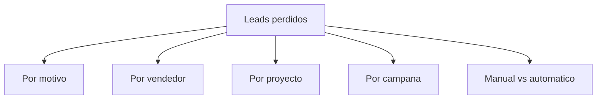
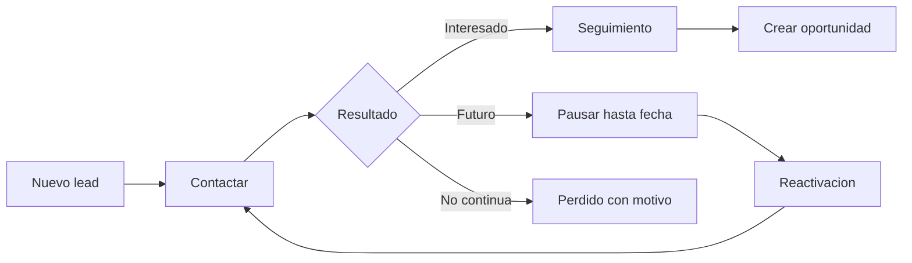
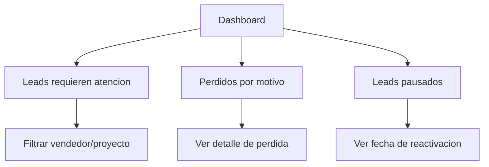

# 17 - UX Dashboard de Leads, SLA y Perdida

## Veredicto ejecutivo

El dashboard debe responder rapido, sin obligar a jefatura a leer reportes largos.

Cada tarjeta debe permitir abrir el detalle y explicar el numero.

```txt
Leads nuevos
Leads requieren atencion
Eventos para hoy
Oportunidades
Ordenes de venta
Contratos firmados
Leads pausados
Leads perdidos por motivo
```

## Regla de lectura

Cada numero del dashboard debe tener:

- definicion clara;
- filtro aplicado;
- fecha de corte;
- permiso aplicado;
- opcion de abrir lista;
- exportacion controlada si el usuario tiene permiso.

Ejemplo:

```txt
Leads requieren atencion: 288
Definicion: leads activos sin accion comercial significativa en 4 dias y sin evento pendiente.
```

## Tarjetas principales

| Tarjeta | Que significa | Click abre |
| --- | --- | --- |
| Leads nuevos | Leads activos sin accion significativa. | Bandeja de nuevos. |
| Leads requieren atencion | Leads sin accion por 4 dias y sin evento pendiente. | Bandeja de atencion. |
| Eventos para hoy | Eventos CRM y externos sincronizados, segun permiso. | Calendario filtrado. |
| Oportunidades | Leads convertidos a oportunidad. | Pipeline/listado. |
| Ordenes de venta | Ordenes en pre-reserva/reserva. | Bandeja de ordenes. |
| Contratos firmados | Ordenes con contrato firmado. | Reporte/listado. |
| Leads pausados | Leads con fecha futura de reactivacion. | Bandeja de pausados. |
| Perdidos por motivo | Leads perdidos agrupados por razon. | Reporte gerencial. |

## Bandeja de leads nuevos

Debe mostrar leads que todavia no tienen accion comercial significativa.

Columnas minimas:

```txt
lead
telefono
correo
proyecto
campana
vendedor
fecha de entrada
tiempo en nuevo
proxima accion sugerida
```

Acciones:

```txt
contactar
crear nota
crear evento
crear cita
poner en seguimiento
marcar perdido
crear oportunidad
```

Regla:

Al ejecutar cualquier accion significativa, el lead sale de "nuevo".

## Bandeja de requiere atencion

Debe explicar por que cada lead esta ahi.

Columnas minimas:

```txt
lead
vendedor
proyecto
ultimo contacto
dias sin accion
ultimo motivo
tiene evento pendiente
estado comercial
prioridad
```

Acciones:

```txt
registrar accion
crear evento
pausar seguimiento
marcar perdido
reasignar
crear oportunidad
```

Regla visual:

```txt
0-3 dias: normal
4-6 dias: requiere atencion
7+ dias: rezagado / critico
```

El color no debe ser el unico indicador. Usar etiqueta textual.

## Pausar seguimiento

Uso:

Cuando el lead sigue vivo, pero el cliente pidio contacto futuro o hay una razon valida para esperar.

Formulario minimo:

```txt
fecha de reactivacion
motivo
detalle opcional
notificarme
crear evento de calendario
```

Validaciones:

- fecha obligatoria;
- motivo obligatorio;
- detalle obligatorio si motivo es `other`;
- no permitir fecha pasada;
- registrar timeline.

Resultado visual:

```txt
Lead pausado hasta 2026-10-05
Motivo: Cliente pidio contacto futuro
```

Cuando llega la fecha, el lead debe aparecer en:

```txt
Reactivados hoy
Requiere atencion
Mis pendientes
```

segun permisos y reglas del API.

## Marcar como perdido

El modal no debe ser generico.

Debe pedir:

```txt
motivo
detalle cuando aplique
confirmacion
```

Debe mostrar:

```txt
estado actual
ultima accion
eventos pendientes
oportunidades/estimaciones/ordenes relacionadas
impacto de la accion
```

Texto recomendado:

```txt
Este lead quedara como perdido y se registrara en la bitacora para revision de jefatura.
```

No recomendado:

```txt
Esta seguro?
```

## Reporte de perdida para jefatura

Vista ejecutiva:

```txt
Perdidos por motivo
Perdidos por vendedor
Perdidos por proyecto
Perdidos por campana
Perdidos por canal
Perdidos automaticos vs manuales
```

Grafico recomendado:



Cada grafico debe abrir lista filtrada.

## Flujo operativo del vendedor



## Flujo de jefatura



## Decisiones y ajustes pendientes de UX

| Tema | Pregunta | Recomendacion |
| --- | --- | --- |
| SLA | Los 4 dias son naturales o habiles? | Cerrado: naturales en P0. |
| Pausa | Cuantos dias maximo se puede pausar un lead? | Definir limite por permiso. |
| Perdida | Quien puede revertir un lead perdido? | Cerrado: supervisor/gerente con permiso. |
| Perdida automatica | Se activa desde P0? | Cerrado: no en P0. |
| Jefatura | Quiere alertas por correo/WhatsApp cuando suben perdidos? | Si, configurable. |
| Reasignacion | Que pasa con leads pausados si cambia vendedor? | Mantener pausa y reasignar responsable. |

## Regla final

La UI debe ser directa:

```txt
numero -> definicion -> lista -> accion -> bitacora
```

Si un usuario pregunta "por que este lead esta aqui?", la pantalla debe responderlo sin abrir base de datos.
