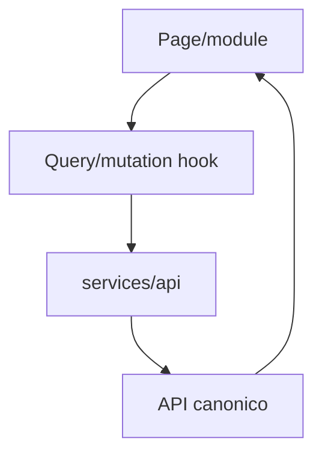

# 19 - Mapa de Implementacion Frontend

## Proposito

Este documento responde una pregunta practica:

```txt
Si voy a construir una pantalla, componente, hook o cliente API, en que carpeta va?
```

Debe usarse antes de crear pantallas, formularios, tablas, filtros, modales, estados locales o integraciones visuales.

Actualizacion de orden: antes de implementar el vertical de leads, se debe cerrar `22-UX-Identidad-Usuarios-Roles-P0-S1.md`.

El primer corte ejecutable actual es identidad. `20-Alcance-P0-Vertical-Leads-Frontend.md` aplica despues de cerrar la compuerta de identidad, no antes.

## Regla principal

El frontend es una experiencia operativa para usuarios de Costa Rica.

El frontend:

- muestra datos canonicos del API;
- captura formularios canonicos;
- muestra permisos efectivos recibidos del API;
- ayuda al usuario a ejecutar acciones;
- nunca calcula la autorizacion final;
- nunca conoce el proveedor ERP activo;
- nunca usa ids de proveedor externo como identidad principal de UI;
- nunca usa estructuras legacy como contrato visual.

## Mapa de carpetas

| Carpeta | Que va aqui | Que no va aqui | Leer antes |
| --- | --- | --- | --- |
| `src/modules/auth` | Compuerta visual de identidad, sesion, usuario actual y permisos visibles. | Reglas finales de autorizacion del backend. | `21`, `22`. |
| `src/modules/sales/dashboard` | Dashboard de ventas, tarjetas, filtros y drill-down. | Reglas de conteo calculadas en UI. | `03`, `17`, `18`. |
| `src/modules/sales/leads` | Lista, detalle, formularios y acciones de leads. | Oportunidades, estimaciones u ordenes completas. | `10`, `11`, `12`, `17`, `18`, `23`. |
| `src/modules/sales/opportunities` | Pipeline y vistas de oportunidad. | Formularios de lead puro. | `13`. |
| `src/modules/sales/estimates` | Pantallas de estimaciones. | Ordenes de venta. | `13`. |
| `src/modules/sales/sales-orders` | Pantallas de ordenes de venta, pre-reserva y reserva. | Formalizacion operativa completa. | `13`, `14`. |
| `src/modules/formalizations` | Flujo de formalizacion cuando se apruebe alcance. | Leads iniciales o dashboard de ventas. | `14`. |
| `src/modules/calendar` | Calendarios por dominio, eventos, citas y estados de sync. | Llamadas directas a Microsoft Graph para reglas CRM. | `15`. |
| `src/modules/notes` | Notas adhesivas, paneles, editor y canvas. | Envio directo por proveedores externos. | `16`. |
| `src/modules/permissions` | Componentes para mostrar/ocultar acciones segun permisos efectivos. | Reglas finales de autorizacion. | `09`. |
| `src/components/ui` | Botones, inputs, badges, dialogs, tooltips genericos. | Logica de negocio. | `03`. |
| `src/components/data-table` | Tabla generica server-side. | Consultas directas a API especificas de un modulo. | `03`, `04`. |
| `src/services/api` | Cliente HTTP tipado y funciones API por contrato canonico. | Transformaciones de proveedores externos, SDKs de ERP o queries directas. | `04`, `10`, `23`. |
| `src/services/auth` | Helpers frontend de sesion visual aprobados. | Guardias backend, tokens persistidos, reglas finales de permisos o llamadas directas a Microsoft Graph. | `09`, `21`, `22`. |
| `src/stores` | Estado UI pequeno: filtros, layout, preferencias. | Cache de servidor o permisos finales. | `04`. |
| `src/types` | Tipos canonicos compartidos en frontend. | Tipos de proveedores externos. | `10`, `23`. |

## Flujo permitido de datos



Regla:

```txt
UI -> services/api -> API
```

Nunca:

```txt
UI -> base de datos
UI -> ERP
UI -> proveedor de mensajeria
UI -> reglas de autorizacion final
UI -> CRM viejo
UI -> Microsoft Graph para reglas CRM
```

Regla de carpetas prohibidas:

```txt
No crear services/netsuite, services/odoo, services/kapso, services/legacy-crm ni adapters de proveedor en frontend.
```

Si una vista necesita una accion relacionada con NetSuite, Odoo, Kapso, Microsoft 365 o CRM viejo, la vista llama `src/services/api` usando contrato canonico. El API enruta hacia el adapter correcto.

## Primer vertical slice aprobado ahora

El siguiente desarrollo real de frontend debe acompanar la compuerta de identidad:

1. Leer `24-Contrato-Visual-Identidad-P0-S1.md`.
2. Mostrar estado del proyecto: identidad y acceso.
3. Preparar layout base sin datos comerciales.
4. Mostrar pasos de usuarios, autenticacion, areas/equipos, roles y permisos.
5. Preparar cliente de sesion/usuario actual solo cuando exista contrato API.
6. Mostrar permisos visibles solo cuando el API los devuelva.

No entra todavia:

- pantallas de leads;
- formalizacion completa;
- cobros;
- modificaciones;
- perdida automatica;
- integraciones directas desde componentes.
- dashboard/pausa/perdida hasta P0-S2;
- calendarios y notas.

## Vertical comercial futuro

Despues de cerrar identidad, el siguiente corte comercial sera:

1. Listar leads desde API.
2. Crear lead con formulario canonico.
3. Ver detalle basico de lead.
4. Ver timeline basico del lead.
5. Mostrar permisos visibles devueltos por API.

## Checklist para cualquier cambio frontend

Antes de tocar codigo:

1. Confirmar modulo correcto.
2. Leer documento de arquitectura relacionado.
3. Confirmar contrato API canonico.
4. Confirmar permisos visibles.
5. Confirmar estados de carga, vacio y error.
6. Confirmar accesibilidad basica.
7. Confirmar que no hay nombres legacy/proveedor.
8. Confirmar que rutas, query keys y acciones usan public ids canonicos del CRM.
9. Implementar con pnpm.
10. Ejecutar `pnpm run typecheck` y `pnpm run build`.

## Estado actual

| Elemento | Estado |
| --- | --- |
| Esqueleto React/Vite | Creado. |
| Pantalla comercial real | No aprobada todavia. |
| Cliente API real | Pendiente de contrato API aprobado. |
| Contrato visual identidad | Creado; manda antes de cualquier pantalla comercial. |
| Compuerta visual de identidad | Siguiente paso permitido. |
| Listado real de leads | Pendiente. |
| Formulario real de crear lead | Pendiente. |
| Timeline visual | Pendiente. |
| Login real MSAL | Pendiente. |
