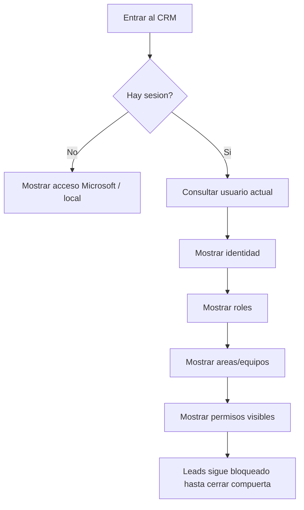

# 24 - Contrato Visual de Identidad P0-S1

## Veredicto

La primera experiencia visual permitida no es leads.

La primera experiencia visual permitida es identidad:

```txt
estado del sistema -> sesion -> usuario actual -> roles -> areas/equipos -> permisos visibles
```

Este documento define que puede mostrar React antes de construir pantallas comerciales.

No autoriza crear login real, CRUD completo de usuarios, pantallas de leads, calendario, notas ni dashboard comercial.

## Fuente API obligatoria

La UI debe alinearse con:

```txt
apps/api/Arquitectura/33-Contrato-API-Identidad-P0-S1.md
```

Si este documento contradice el contrato API, gana el contrato API.

## Objetivo visual actual

La UI debe dejar claro:

- el CRM esta en compuerta de identidad;
- primero se define quien entra;
- luego se define que rol tiene;
- luego se define en que areas/equipos opera;
- luego se muestran permisos efectivos;
- leads viene despues.

## Pantallas permitidas ahora

### 1. Pantalla de estado de identidad

Proposito:

- mostrar que el sistema esta en fase de identidad;
- explicar los pasos sin parecer landing page;
- evitar tarjetas comerciales de leads.

Contenido permitido:

- nombre del sistema;
- estado: `Identidad y acceso`;
- pasos: usuarios, autenticacion, areas/equipos, roles, permisos;
- mensaje: `Leads se habilita despues de cerrar identidad`;
- estado tecnico simple si el API todavia no existe.

No permitido:

- contador de leads;
- tarjetas comerciales;
- boton crear lead;
- dashboard de ventas;
- calendario;
- timeline de lead.

### 2. Vista de usuario actual

Proposito:

- mostrar que usuario esta autenticado cuando el API exista;
- mostrar estado operativo del usuario;
- mostrar proveedor de autenticacion sin exponer tokens.

Campos visibles:

| Campo UI | Fuente API | Regla |
| --- | --- | --- |
| Nombre | `user.displayName` | Mostrar como texto principal. |
| Correo | `user.email` | Mostrar si existe sesion valida. |
| Estado | `user.status` | Traducir visualmente: activo, pendiente, bloqueado, inactivo. |
| Version permisos | `user.permissionVersion` | Mostrar solo en modo tecnico o soporte. |
| Login principal | `auth.primaryProvider` | Mostrar `Microsoft` como principal. |
| Login local | `auth.localStatus` | Mostrar preparado/pendiente/activo segun API. |

### 3. Vista de roles visibles

Proposito:

- mostrar roles que el API devuelve;
- no calcular permisos;
- no permitir editar roles todavia.

Campos visibles:

| Campo UI | Fuente API | Regla |
| --- | --- | --- |
| Codigo | `roles[].code` | Puede mostrarse en modo tecnico. |
| Nombre | `roles[].name` | Texto principal. |
| Estado | `roles[].status` | Badge simple. |

No permitido:

- asignar roles;
- quitar roles;
- crear roles;
- suponer permisos por nombre del rol.

### 4. Vista de areas/equipos

Proposito:

- mostrar alcance organizacional del usuario;
- separar area/equipo de rol;
- permitir entender usuarios con varias areas.

Campos visibles:

| Campo UI | Fuente API | Regla |
| --- | --- | --- |
| Area/equipo | `orgUnits[].name` | Nombre visible. |
| Codigo | `orgUnits[].code` | Modo tecnico. |
| Participacion | `orgUnits[].membership` | Traducir a miembro, jefe, subjefe o supervisor. |
| Alcance | `orgUnits[].scope` | Traducir a alcance visual. |
| Estado | `orgUnits[].status` | Badge simple. |

Regla:

```txt
Una persona puede aparecer en varias areas, pero sigue siendo una sola persona.
```

### 5. Vista de permisos visibles

Proposito:

- mostrar permisos efectivos recibidos del API;
- ayudar a entender que acciones podra ver el usuario;
- no reemplazar autorizacion backend.

Campos visibles:

| Campo UI | Fuente API | Regla |
| --- | --- | --- |
| Permiso | `permissions[].code` | Codigo atomico. |
| Efecto | `permissions[].effect` | `allow` o `deny`. |
| Origen | `permissions[].source` | Rol, permiso personal o sistema. |
| Alcance | `permissions[].scope` | Alcance efectivo. |

Regla:

```txt
El frontend puede ocultar botones por UX, pero el backend decide si la accion se ejecuta.
```

## Textos visibles recomendados

Pantalla de estado:

```txt
CRM TINK esta preparando identidad y acceso.
```

```txt
Primero se define quien entra, que rol tiene y que permisos efectivos recibe.
```

```txt
Las pantallas de leads se habilitan despues de cerrar identidad.
```

Permiso rechazado:

```txt
No se pudo completar la accion con los permisos actuales.
```

Sesion vencida:

```txt
Tu sesion vencio. Ingresa nuevamente.
```

Usuario bloqueado:

```txt
Tu usuario no puede operar el CRM en este momento.
```

## Estados visuales obligatorios

Toda pantalla de identidad debe tener:

- cargando;
- sin sesion;
- sesion activa;
- sesion vencida;
- error recuperable;
- usuario bloqueado;
- permisos no disponibles;
- permisos actualizados.

## Flujo visual conceptual



## Reglas de seguridad frontend

- No guardar access token.
- No guardar refresh token.
- No guardar id token.
- No usar `localStorage` ni `sessionStorage` para tokens.
- No guardar permisos efectivos como fuente permanente.
- No usar ids internos de MySQL.
- No usar ids de NetSuite, Odoo, legacy CRM ni Kapso.
- No llamar Microsoft Graph directo para reglas CRM.
- No llamar NetSuite/Odoo/Kapso directo.
- No mostrar stack traces.

## Estado local permitido

Permitido:

- filtros visuales;
- tabs;
- expandir/colapsar secciones;
- preferencias de layout;
- estado de loading/error;
- seleccion visual temporal.

No permitido:

- permisos finales;
- tokens;
- usuario como fuente permanente;
- roles como fuente permanente;
- areas como fuente permanente;
- reglas de negocio.

## Componentes esperados cuando se apruebe implementar

Nombres conceptuales, no obligan a crear archivos todavia:

```txt
IdentityGatePage
CurrentUserPanel
AuthStatusPanel
RoleSummaryList
OrgUnitScopeList
EffectivePermissionList
IdentityBlockedState
IdentityPendingState
```

## No construir todavia

- `LeadList`;
- `LeadCreate`;
- `LeadDetail`;
- `ActivityTimeline`;
- dashboard de ventas;
- calendario;
- notas adhesivas;
- administracion completa de usuarios;
- editor de roles;
- editor de permisos;
- flujo avanzado de delegaciones.

Regla:

```txt
P0-S1A puede mostrar permisos efectivos, pero no construye administracion avanzada ni delegacion temporal.
```

## Criterio de salida

Este contrato visual queda listo para implementacion cuando:

- el contrato API de identidad este aprobado;
- exista decision de crear runtime o usar placeholders;
- los textos visibles esten aceptados;
- no haya pantallas comerciales en el primer corte;
- la UI no guarde tokens;
- la UI no calcule permisos finales;
- la UI tenga estados de sesion y permisos.

## Pendientes reales

No se necesitan para este documento, pero si para bootstrap real:

1. Correo oficial del primer `owner`.
2. Nombre visible del primer `owner`.
3. Correo oficial del primer `jefe_general`.
4. Nombre visible del primer `jefe_general`.
