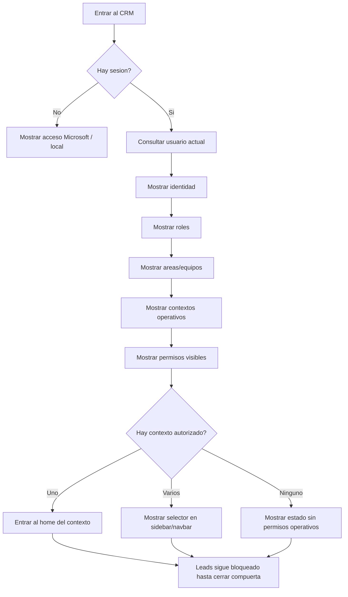

# 24 - Contrato Visual de Identidad P0-S1

## Veredicto

La primera experiencia visual permitida no es leads.

La primera experiencia visual permitida es identidad:

```txt
estado del sistema -> sesion -> usuario actual -> roles -> areas/equipos -> contextos operativos -> permisos visibles
```

Este documento define que puede mostrar React antes de construir pantallas comerciales.

Autoriza la compuerta de identidad conectada al BFF y el shell global autenticado cuando la ley frontend lo indique. No autoriza CRUD completo de usuarios, pantallas de leads, calendario, notas ni dashboard comercial.

## Fuente API obligatoria

La UI debe alinearse con:

```txt
apps/api/Arquitectura/33-Contrato-API-Identidad-P0-S1.md
```

Si este documento contradice el contrato API, gana el contrato API.

## Objetivo visual actual

La UI debe dejar claro:

- el CRM esta en compuerta de identidad;
- primero se define quien entra;
- luego se define que rol tiene;
- luego se define en que areas/equipos opera;
- luego se define que contextos operativos puede abrir;
- luego se muestran permisos efectivos;
- leads viene despues.

## Pantallas permitidas ahora

### 0. Pantalla de login BFF

Proposito:

- mostrar la primera experiencia visual y funcional de acceso;
- preparar el lenguaje visual de identidad;
- mantener separado login local y Microsoft;
- validar responsive, accesibilidad basica y estilo enterprise.

Permitido:

- formulario funcional de correo y contrasena contra el BFF;
- boton funcional de Microsoft contra el BFF;
- enlace visual de recuperacion de contrasena;
- ruta publica canonica `/auth/login` para abrir la pantalla de acceso;
- uso de Ant Design para componentes base;
- estilos propios del modulo `auth`.

Reglas visuales del formulario:

- Microsoft 365 debe verse como metodo principal de acceso corporativo.
- La pantalla de acceso siempre debe estar disponible en `/auth/login`; `/` redirige a esa ruta mientras no exista home operativo autorizado.
- La maqueta `/home/global` no reemplaza el flujo de acceso ni autoriza entrar al sistema sin sesion.
- El acceso local debe verse como alternativa secundaria y agrupada con correo, contrasena, recordarme, recuperacion e ingresar.
- Usar un solo termino visible para la credencial local: `Contrasena`. No mezclar sinonimos en labels, placeholders, enlaces ni errores.
- Los campos deben tener label visible fuera del placeholder.
- Los errores inline deben ir alineados a la izquierda del input.
- El formulario debe reservar espacio suficiente para errores y evitar saltos de layout.
- El error no puede depender solo del color: debe tener texto accionable y senal visual adicional.
- El color de error debe cumplir contraste AA para texto pequeno.
- La validacion no debe aparecer mientras el usuario escribe por primera vez; puede aparecer al perder foco o al enviar.
- Una vez mostrado un error, debe limpiarse en tiempo real cuando el campo queda valido.
- Si no hay conexion durante el submit real, el mensaje visible debe ser especifico: `Sin conexion a Internet`.
- La pantalla publica no debe mostrar version del sistema ni informacion util para fingerprinting.
- El flujo real futuro debe contemplar proteccion anti-bot no intrusiva y manejo visual de sesion concurrente si el API lo exige.

No permitido:

- llamar endpoints inexistentes como `/identity/login`;
- llamar Microsoft Graph directo desde React;
- guardar tokens;
- crear home operativo;
- redirigir a contextos operativos;
- crear rutas comerciales;
- fingir proveedores no aprobados como Google o Apple.

### 0.1. Shell global autenticado

Proposito:

- validar la composicion visual de la barra superior, menu horizontal y fondo base del CRM con sesion real;
- usar el mismo logo corporativo que el login;
- mantener el color de fondo aprobado `#eaedf7`;
- preparar una direccion visual enterprise antes de abrir modulos comerciales.

Permitido:

- ruta `/home/global` protegida por sesion para revision del shell;
- barra superior blanca con logo, selector visual, command bar neutra y acciones globales minimas sin efecto;
- el selector superior debe representar perfiles/contextos asignados, no un filtro decorativo;
- cambiar el perfil seleccionado debe cambiar el menu visible del shell;
- puede existir un perfil visual `Todos` para revision de producto, agrupando las opciones mock de todos los perfiles asignados;
- cuando exista conexion real, `Todos` solo puede mostrarse si el API devuelve un contexto o permiso efectivo de TI/jefatura global que permita ver todos los modulos;
- el perfil `CRM Tink` debe mostrar como opciones visuales Leads, Calendario Outlook, Expedientes, Lista de Eventos, Reporte de Comisiones, Oportunidades, Ordenes de Venta y Tickets;
- pueden existir perfiles visuales mock adicionales, como Finanzas, Mercadeo, Formalizacion y Administracion, solo para validar el patron de cambio de contexto;
- menu horizontal oscuro con color base `#0f172a`;
- header y menu deben compartir un ancho maximo comun para alinear bordes con el futuro canvas central;
- el menu global se lee de izquierda a derecha, alineado al contenedor comun, no flotando al centro cuando queda espacio sobrante;
- labels de menu de alto contraste, visibles y responsive;
- maximo 7 modulos principales de negocio en la barra secundaria: Dashboard, CRM & Clientes, Ventas, Operaciones, Mercadeo, Reportes y Configuracion;
- cada modulo puede declarar opciones hijas en una estructura de datos, por ejemplo Mercadeo -> Campanas, Origenes de Leads, Leads Entrantes y Metricas de Captacion;
- cada opcion hija puede llevar metadata de permiso futuro, pero esa metadata no autoriza acceso por si sola;
- cada opcion hija debe usar microcopy orientado al usuario final, no notas internas de desarrollo;
- el menu desplegable debe incluir iconos de anclaje visual, estado hover/focus visible, borde sutil, sombra suave, conector al item disparador y chevron rotado cuando este abierto;
- Configuracion puede mostrar como ejemplo visual Usuarios y Cuentas, Roles y Seguridad, Catalogos del CRM, Integraciones API y Auditoria y Logs;
- al conectar identidad real, el menu visible debe salir de contextos/permisos efectivos del API; React solo filtra/renderiza por UX y el API valida cada accion real;
- agregar o quitar una opcion visual debe hacerse modificando la configuracion del menu, no duplicando JSX por cada modulo;
- sin flechas laterales para revelar opciones ocultas en desktop;
- las opciones que no quepan deben pasar a `Mas` usando navegacion Priority Plus; no se permite scroll horizontal para resolver zoom o viewport reducido;
- si la vista activa vive dentro de `Mas`, el disparador `Mas` debe mostrarse como activo;
- el shortcut visible del command bar debe mostrar `Ctrl K` o `⌘K` segun el sistema operativo del navegador;
- el selector superior de modulo debe mantener un min-width estable para evitar saltos al cambiar de contexto;
- los labels visibles del menu usan Title Case en subnav, desplegables y titulos relacionados;
- en mobile `<768px`, el header de escritorio y la subnav horizontal se sustituyen por una top app bar compacta de 56px;
- en mobile, la navegacion principal debe vivir en un drawer lateral con backdrop, modulos en acordeon y touch targets minimos de 44px;
- el drawer mobile sigue siendo visual y no autoriza accesos; al conectar identidad real debe filtrarse por contextos/permisos efectivos del API;
- el item activo debe tener una senal visual estable, como pastilla o linea de acento, sin depender de cambiar el ancho por negrita;
- usar un solo acento sobrio para foco, activo y estados clicables; no volver a morado brillante ni salmon de plantilla;
- respetar el zoom del navegador; queda prohibido desactivar `user-scalable` o fijar una composicion que solo funcione a 100%;
- si el viewport efectivo se reduce por zoom, el header y el menu deben compactar, truncar texto secundario o envolver lineas antes de ocultar campos criticos;
- no debe existir overflow horizontal en desktop, tablet ni mobile por culpa del logo, command bar, avatar, badges o labels de menu;
- sin opciones de plantilla o UI kit como Elementos, Paginas, Utilidades, Autenticacion, Formularios o Graficos;
- sin acentos violeta/salmon en busqueda, badges o avatar;
- fondo inferior sin datos, con marca de agua corporativa tenue.

No permitido:

- consultar proveedores externos directo desde React;
- decidir autorizacion final;
- renderizar home comercial por contexto operativo real;
- tratar los perfiles mock como permisos reales;
- proteger rutas con logica incompleta en React;
- crear dashboards, tarjetas de metricas, leads, ventas reales o acciones funcionales;
- cambiar `/auth/login` como ruta canonica de autenticacion.

### 0.2. Canvas visual inicial del dashboard

La estructura visual del cuerpo central queda autorizada solo como maqueta estatica para validar jerarquia, densidad y responsive. No autoriza datos reales, permisos, navegacion comercial ni acciones funcionales.

Permitido:

- header de vista con titulo, subtitulo, filtros globales visuales y accion principal visual;
- fila de KPIs mock de negocio;
- cuerpo asimetrico con seccion principal de operacion y panel lateral de productividad;
- embudo comercial mock;
- tabla mock de negociaciones recientes;
- lista mock de tareas del dia;
- bloque mock de proyectos con mayor movimiento;
- usar el mismo ancho maximo del header y menu para alinear todo el canvas.

No permitido:

- consumir API;
- calcular metricas reales;
- crear acciones funcionales;
- abrir formularios reales;
- resolver permisos en React;
- permitir entrada a una vista por URL sin validacion futura del API.

### 1. Pantalla de estado de identidad

Proposito:

- mostrar que el sistema esta en fase de identidad;
- explicar los pasos sin parecer landing page;
- evitar tarjetas comerciales de leads.

Contenido permitido:

- nombre del sistema;
- estado: `Identidad y acceso`;
- pasos: usuarios, autenticacion, areas/equipos, roles, permisos;
- mensaje: `Leads se habilita despues de cerrar identidad`;
- estado tecnico simple si el API todavia no existe.

No permitido:

- contador de leads;
- tarjetas comerciales;
- boton crear lead;
- dashboard de ventas;
- calendario;
- timeline de lead.

### 2. Vista de usuario actual

Proposito:

- mostrar que usuario esta autenticado cuando el API exista;
- mostrar estado operativo del usuario;
- mostrar proveedor de autenticacion sin exponer tokens.

Campos visibles:

| Campo UI | Fuente API | Regla |
| --- | --- | --- |
| Nombre | `user.displayName` | Mostrar como texto principal. |
| Correo | `user.email` | Mostrar si existe sesion valida. |
| Estado | `user.status` | Traducir visualmente: activo, pendiente, bloqueado, inactivo. |
| Version permisos | `user.permissionVersion` | Mostrar solo en modo tecnico o soporte. |
| Login principal | `auth.primaryProvider` | Mostrar `Microsoft` como principal. |
| Login local | `auth.localStatus` | Mostrar preparado/pendiente/activo segun API. |

### 3. Vista de roles visibles

Proposito:

- mostrar roles que el API devuelve;
- no calcular permisos;
- no permitir editar roles todavia.

Campos visibles:

| Campo UI | Fuente API | Regla |
| --- | --- | --- |
| Codigo | `roles[].code` | Puede mostrarse en modo tecnico. |
| Nombre | `roles[].name` | Texto principal. |
| Estado | `roles[].status` | Badge simple. |

No permitido:

- asignar roles;
- quitar roles;
- crear roles;
- suponer permisos por nombre del rol.

### 4. Vista de areas/equipos

Proposito:

- mostrar alcance organizacional del usuario;
- separar area/equipo de rol;
- permitir entender usuarios con varias areas.

Campos visibles:

| Campo UI | Fuente API | Regla |
| --- | --- | --- |
| Area/equipo | `orgUnits[].name` | Nombre visible. |
| Codigo | `orgUnits[].code` | Modo tecnico. |
| Participacion | `orgUnits[].membership` | Traducir a miembro, jefe, subjefe o supervisor. |
| Alcance | `orgUnits[].scope` | Traducir a alcance visual. |
| Estado | `orgUnits[].status` | Badge simple. |

Regla:

```txt
Una persona puede aparecer en varias areas, pero sigue siendo una sola persona.
```

### 5. Vista de permisos visibles

Proposito:

- mostrar permisos efectivos recibidos del API;
- ayudar a entender que acciones podra ver el usuario;
- no reemplazar autorizacion backend.

Campos visibles:

| Campo UI | Fuente API | Regla |
| --- | --- | --- |
| Permiso | `permissions[].code` | Codigo atomico. |
| Efecto | `permissions[].effect` | `allow` o `deny`. |
| Origen | `permissions[].source` | Rol, permiso personal o sistema. |
| Alcance | `permissions[].scope` | Alcance efectivo. |

Regla:

```txt
El frontend puede ocultar botones por UX, pero el backend decide si la accion se ejecuta.
```

### 6. Vista de contextos operativos disponibles

Proposito:

- mostrar a que home puede entrar el usuario despues de autenticarse;
- separar la sesion global de la operacion diaria por area/rol;
- permitir usuarios con varios roles o areas sin mezclar menus;
- evitar carpetas duplicadas por cada nombre de rol.

Campos visibles:

| Campo UI | Fuente API | Regla |
| --- | --- | --- |
| Codigo contexto | `contexts[].code` | Usar solo como identificador visual/tecnico del CRM. |
| Nombre | `contexts[].name` | Texto principal del selector. |
| Modulo | `contexts[].module` | Debe corresponder a un modulo frontend aprobado. |
| Home | `contexts[].homeRoute` | Ruta inicial del contexto. |
| Estado | `contexts[].status` | Si no esta activo, no debe permitir entrar. |
| Motivo | `contexts[].reason` | Explicacion opcional cuando no esta disponible. |

Ejemplos de contexto:

| Contexto | Home esperado | Regla |
| --- | --- | --- |
| `sales` | Home de ventas/vendedor | No contiene pantallas de cobros, mercadeo ni TI. |
| `collections` | Home de finanzas/cobros | No duplica ventas ni formalizaciones. |
| `marketing` | Home de mercadeo | Vive separado de ventas aunque comparta clientes o leads futuros. |
| `formalizations` | Home de formalizaciones | Maneja su propio menu operativo. |
| `management` | Home de jefatura/gerencia | Consolida accesos permitidos, no autoriza por si solo. |
| `support` | Home de TI/soporte | Solo herramientas aprobadas por permisos efectivos. |

Reglas:

- si existe un solo contexto activo, la UI puede entrar directo a su home;
- si existen dos o mas contextos activos, la UI debe mostrar selector en sidebar/navbar;
- una persona con mercadeo y formalizaciones ve ambos contextos si el API los devuelve;
- un jefe superior o TI puede ver varios contextos solo si el API los devuelve;
- el contexto activo no reemplaza permisos efectivos ni guards backend;
- no se debe deducir el contexto desde NetSuite, Odoo, Kapso ni legacy.
- una URL directa a un home o vista no permite entrar si el API no devuelve ese contexto y permiso efectivo.

Prohibido:

- elegir el home por `roles[0]`;
- asumir que `owner`, `jefe_general` o `soporte_sistemas` ven todo sin respuesta API;
- crear un login separado por rol;
- duplicar la misma pantalla en carpetas `vendedor`, `jefe_ventas`, `subjefe_ventas`;
- guardar el contexto como autorizacion permanente.
- renderizar una vista protegida solo porque la ruta existe o el usuario conoce la URL.

## Textos visibles recomendados

Pantalla de estado:

```txt
CRM TINK esta preparando identidad y acceso.
```

```txt
Primero se define quien entra, que rol tiene y que permisos efectivos recibe.
```

```txt
Las pantallas de leads se habilitan despues de cerrar identidad.
```

Permiso rechazado:

```txt
No se pudo completar la accion con los permisos actuales.
```

Sesion vencida:

```txt
Tu sesion vencio. Ingresa nuevamente.
```

Usuario bloqueado:

```txt
Tu usuario no puede operar el CRM en este momento.
```

Acceso no autorizado:

```txt
No tienes permiso para ver esta vista.
```

## Estados visuales obligatorios

Toda pantalla de identidad debe tener:

- cargando;
- sin sesion;
- sesion activa;
- sesion vencida;
- error recuperable;
- usuario bloqueado;
- permisos no disponibles;
- permisos actualizados.

## Flujo visual conceptual


```mermaid
flowchart TD
  A[Entrar al CRM] --> B{Hay sesion?}
  B -->|No| C[Mostrar acceso Microsoft / local]
  B -->|Si| D[Consultar usuario actual]
  D --> E[Mostrar identidad]
  E --> F[Mostrar roles]
  F --> G[Mostrar areas/equipos]
  G --> H[Mostrar contextos operativos]
  H --> I[Mostrar permisos visibles]
  I --> J{Hay contexto autorizado?}
  J -->|Uno| K[Entrar al home del contexto]
  J -->|Varios| L[Mostrar selector en sidebar/navbar]
  J -->|Ninguno| M[Mostrar estado sin permisos operativos]
  K --> N[Leads sigue bloqueado hasta cerrar compuerta]
  L --> N
  M --> N
```

## Reglas de seguridad frontend

- No guardar access token.
- No guardar refresh token.
- No guardar id token.
- No usar `localStorage` ni `sessionStorage` para tokens.
- No guardar permisos efectivos como fuente permanente.
- No usar ids internos de MySQL.
- No usar ids de NetSuite, Odoo, legacy CRM ni Kapso.
- No llamar Microsoft Graph directo para reglas CRM.
- No llamar NetSuite/Odoo/Kapso directo.
- No mostrar stack traces.
- No usar contexto operativo como autorizacion final.

## Estado local permitido

Permitido:

- filtros visuales;
- tabs;
- expandir/colapsar secciones;
- preferencias de layout;
- estado de loading/error;
- seleccion visual temporal.
- contexto operativo activo validado contra el API.

No permitido:

- permisos finales;
- tokens;
- usuario como fuente permanente;
- roles como fuente permanente;
- areas como fuente permanente;
- reglas de negocio.
- contexto operativo como permiso permanente.

## Componentes esperados para evolucionar identidad

Nombres conceptuales, no obligan a crear archivos todavia:

```txt
IdentityGatePage
CurrentUserPanel
AuthStatusPanel
RoleSummaryList
OrgUnitScopeList
OperatingContextSelector
ContextHomePlaceholder
ContextNavigationPreview
EffectivePermissionList
IdentityBlockedState
IdentityPendingState
```

## No construir todavia

- `LeadList`;
- `LeadCreate`;
- `LeadDetail`;
- `ActivityTimeline`;
- dashboard de ventas;
- calendario;
- notas adhesivas;
- administracion completa de usuarios;
- editor de roles;
- editor de permisos;
- flujo avanzado de delegaciones.

Regla:

```txt
P0-S1A puede mostrar permisos efectivos, pero no construye administracion avanzada ni delegacion temporal.
```

## Criterio de salida

Este contrato visual queda listo para implementacion cuando:

- el contrato API de identidad este aprobado;
- exista decision de crear runtime o usar placeholders;
- los textos visibles esten aceptados;
- no haya pantallas comerciales en el primer corte;
- la UI no guarde tokens;
- la UI no calcule permisos finales;
- la UI pueda representar usuarios con uno, varios o ningun contexto operativo;
- la UI tenga estados de sesion y permisos.

## Pendientes reales

No se necesitan para este documento, pero si para bootstrap real:

1. Correo oficial del primer `owner`.
2. Nombre visible del primer `owner`.
3. Correo oficial del primer `jefe_general`.
4. Nombre visible del primer `jefe_general`.
