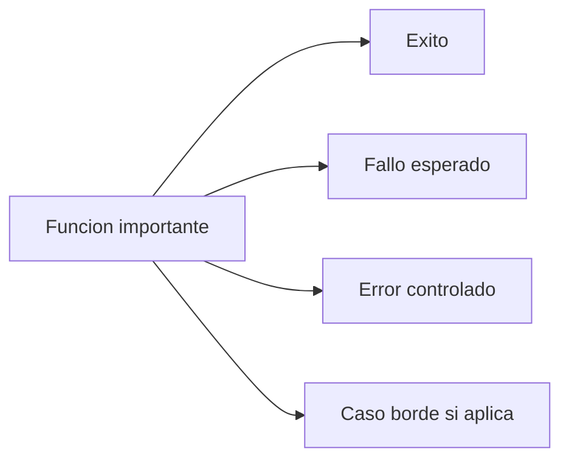
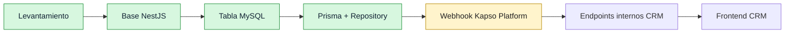

# Construccion Del Proyecto

Bitacora viva del proyecto `API_Kapso_GIT`.

Objetivo: que cualquier persona pueda leer que se hizo, por que se hizo, como se verifico y cual es el siguiente paso.

## Regla Permanente De Pruebas

Toda funcion importante debe estar probada antes de considerarse terminada.

Aplica cuando la funcion:

- ejecuta una accion;
- consulta datos;
- modifica estado;
- valida seguridad;
- devuelve una respuesta usada por el sistema;
- integra Kapso, MySQL, CRM o cualquier dependencia externa.

Minimo por funcion o flujo importante:



Regla operativa:

- Minimo 3 escenarios.
- Preferible 4 escenarios en flujos de BD, seguridad, webhooks, endpoints e integraciones.
- Jest cubre funciones, servicios, repositories y controllers.
- E2E cubre respuestas HTTP completas.
- Playwright cubre lo observable del sistema levantado.
- Cada avance debe actualizar esta bitacora y `tasks/todo.md`.

## Estado Actual



## 2026-08-13 - Levantamiento Inicial

Decision:

- Proyecto completamente nuevo.
- No reutiliza codigo del API Kapso anterior.
- Backend con NestJS.
- Base de datos CRM Ventas es produccion.
- Cambios de BD controlados con `mysql_crm_ventas`.
- No usar Docker.
- Puerto local: `8002`.
- Webhook publico esperado: `/api/v1/webhooks/kapso/platform`.
- Frontend CRM se conectara despues con token interno.

Documentos creados:

- `README.md`
- `docs/requirements.md`
- `tasks/todo.md`

Verificacion:

- Se inspecciono que el repo existia y estaba casi limpio.
- Se confirmo que no se guardaron secretos en documentos versionables.

Siguiente paso definido:

- Crear base NestJS.

## 2026-08-13 - Base NestJS

Se construyo:

- Proyecto NestJS con TypeScript estricto.
- ESLint.
- Prettier.
- Swagger/OpenAPI en `/api/docs`.
- Healthcheck en `/api/v1/health`.
- Logger con `nestjs-pino`.
- Redaccion de headers sensibles.
- Playwright smoke test.
- Comando unico de verificacion: `npm run verify`.

Archivos principales:

- `src/app.module.ts`
- `src/main.ts`
- `src/config/app-config.ts`
- `src/health/health.module.ts`
- `src/health/health.controller.ts`
- `src/health/health.service.ts`
- `scripts/verify-system.ps1`
- `scripts/verify-start-dev.ps1`

Verificacion:

- `npm run lint`
- `npm run typecheck`
- `npm run test -- --runInBand`
- `npm run test:e2e -- --runInBand`
- `npm run build`
- `npm run format:check`
- `npm audit --omit=dev`
- `npm run test:playwright`
- `npm run verify:start:dev`

Resultado:

- Todo paso correctamente.
- El puerto `8002` no quedo ocupado al final.

Siguiente paso definido:

- Crear tabla inicial de integracion en MySQL.

## 2026-08-13 - Tabla MySQL De Integracion

Se inspecciono:

- MySQL `8.0.45`.
- Charset `utf8mb4`.
- Collation `utf8mb4_0900_ai_ci`.
- 31 tablas existentes.
- Tabla probable para usuarios internos: `admins`.

Decision importante:

- La referencia futura de vendedor debe usar `admins.idnetsuite_admin`.
- La tabla nueva usa `idnetsuite_admin_asignado`.
- No se agrego foreign key todavia para no forzar una regla incompleta en produccion.

Tabla creada:

- `kapso_integracion_numero_whatsapp`

Reglas:

- `kapso_phone_number_id` es unico.
- `is_active` permite activar/inactivar desde CRM.
- `ultimo_payload_kapso` guarda el ultimo payload relevante.
- Si Kapso envia `whatsapp.phone_number.deleted`, la integracion del numero se elimina por completo.

Documento actualizado:

- `docs/database.md`

Verificacion:

- Se verificaron columnas en `information_schema.columns`.
- Se verificaron indices en `information_schema.statistics`.
- La tabla quedo vacia.

Siguiente paso definido:

- Conectar NestJS con MySQL.

## 2026-08-13 - Conexion NestJS Con MySQL

Se construyo:

- Prisma `7.9.1`.
- Adapter `@prisma/adapter-mariadb`.
- Driver `mariadb`.
- `prisma/schema.prisma` mapeado a la tabla existente.
- `prisma.config.ts` para Prisma 7.
- `DatabaseModule`.
- `PrismaService`.
- `KapsoWhatsappNumberRepository`.
- `npm run db:check`.

Archivos principales:

- `prisma/schema.prisma`
- `prisma.config.ts`
- `src/database/database.module.ts`
- `src/database/prisma.service.ts`
- `src/database/prisma-client.factory.ts`
- `src/database/mysql-pool-config.ts`
- `src/database/database-check.ts`
- `src/kapso-integrations/kapso-integrations.module.ts`
- `src/kapso-integrations/kapso-whatsapp-number.repository.ts`
- `scripts/db-check.ts`
- `scripts/ensure-database-url.ps1`

Problema encontrado:

- `DATABASE_URL` generado desde `.env` cambiaba el password al pasar por URL encoding/decoding.
- El driver directo con `MYSQL_*` si conectaba.

Solucion:

- Runtime de Prisma usa primero `MYSQL_HOST`, `MYSQL_PORT`, `MYSQL_USER`, `MYSQL_PASSWORD`, `MYSQL_DATABASE`.
- `DATABASE_URL` queda disponible para Prisma CLI/generate.

Verificacion:

- `npm run db:check`

Resultado:

```text
Database check OK
kapso_integracion_numero_whatsapp rows: 0
```

Verificacion completa:

- `npm run verify`

Resultado:

- Todo paso correctamente.
- `db:check` quedo agregado dentro de `npm run verify`.
- No se modificaron datos de la tabla.

## 2026-08-13 - Ampliacion Playwright

Motivo:

- El panel de Playwright solo mostraba 1 prueba porque los demas tests estaban en Jest.
- Se decidio que Playwright tambien debe mostrar pruebas visibles del estado actual del sistema.

Se agregaron pruebas Playwright para:

- health API;
- timestamp del healthcheck;
- ruta inexistente con `404`;
- Swagger UI HTML;
- OpenAPI JSON;
- lectura segura de `kapso_integracion_numero_whatsapp`.

Archivos:

- `test/playwright/health.spec.ts`
- `test/playwright/routing.spec.ts`
- `test/playwright/swagger.spec.ts`
- `test/playwright/database.spec.ts`

Verificacion:

- `npm run test:playwright`

Resultado:

- 6 pruebas Playwright pasaron.

Nota:

- Playwright no reemplaza Jest.
- Jest sigue probando funciones, repository y casos internos.
- Playwright prueba lo observable desde servidor/comandos seguros.

## 2026-08-13 - Webhook Kapso Platform

Fuente tecnica revisada:

- `https://docs.kapso.ai/docs/platform/webhooks/security`
- `https://docs.kapso.ai/docs/platform/setup-links/detect-connection`

Decisiones:

- Endpoint publico: `POST /api/v1/webhooks/kapso/platform`.
- Firma: `X-Webhook-Signature`.
- Evento: `X-Webhook-Event`.
- Trazabilidad: `X-Idempotency-Key`.
- Firma validada con HMAC SHA256 sobre el JSON raw.
- Comparacion de firma con `timingSafeEqual`.
- Respuesta correcta a Kapso: `200 OK`.
- Evento no soportado se acepta con `processed=false` para evitar retries innecesarios.
- Tests Playwright del webhook no escriben en produccion.

Se construyo:

- `KapsoWebhooksModule`.
- `KapsoPlatformWebhookController`.
- `KapsoWebhookSignatureService`.
- `KapsoPlatformWebhookService`.
- Metodos repository para `upsert` de numero creado y `deleteMany` de numero eliminado.

Escenarios probados:

| Pieza        | Escenarios                                                                |
| ------------ | ------------------------------------------------------------------------- |
| Firma        | valida, con prefijo `sha256=`, invalida, header/secret faltante           |
| Servicio     | creado, payload incompleto, eliminado, evento ignorado, error DB          |
| Repository   | upsert completo, upsert con nulos, delete existente, delete inexistente   |
| E2E endpoint | creado OK, eliminado OK, firma invalida, evento faltante, evento ignorado |
| Playwright   | evento firmado ignorado, firma invalida, evento faltante                  |

Verificacion enfocada:

- `npm run test -- kapso-webhook-signature kapso-platform-webhook kapso-whatsapp-number.repository --runInBand`
- `npm run test:e2e -- kapso-platform-webhook --runInBand`
- `npm run test:playwright`

Resultado:

- Unit tests enfocados: 16 escenarios pasaron.
- E2E webhook: 5 escenarios pasaron.
- Playwright: 9 escenarios pasaron.

## Siguiente Tarea

## 2026-08-13 - API Interna Frontend CRM

Objetivo:

- Permitir que el frontend CRM lea y administre integraciones iniciales de numeros WhatsApp.
- Proteger endpoints con token interno.
- No exponer `BigInt` crudo al frontend.
- Evitar escrituras reales en pruebas Playwright sobre produccion.

Se construyo:

- `CrmInternalTokenGuard`.
- `KapsoWhatsappNumbersController`.
- `KapsoWhatsappNumbersService`.
- `GET /api/v1/kapso/whatsapp-numbers`.
- `PATCH /api/v1/kapso/whatsapp-numbers/:id/activate`.
- `PATCH /api/v1/kapso/whatsapp-numbers/:id/deactivate`.
- Repository con `findAll` y `setActiveById`.

Reglas:

- Header principal: `Authorization: Bearer <CRM_API_INTERNAL_TOKEN>`.
- Header alternativo: `X-CRM-API-Token`.
- Sin token o token invalido: `401`.
- Si falta `CRM_API_INTERNAL_TOKEN`: falla cerrado.
- IDs `BigInt` salen como string para evitar errores JSON.
- Activar/inactivar usa `updateMany` y devuelve `404` si no actualiza ningun registro.

Escenarios probados:

| Pieza      | Escenarios                                                                      |
| ---------- | ------------------------------------------------------------------------------- |
| Guard      | Bearer valido, header alternativo valido, sin token, token invalido, sin config |
| Servicio   | listar, lista vacia, activar, desactivar, id invalido, registro faltante        |
| Repository | findAll, activar, desactivar, update inexistente                                |
| E2E API    | listar con token, sin token, token invalido, activar, desactivar                |
| Playwright | listar con token real, sin token, token invalido, activacion bloqueada          |

Verificacion enfocada:

- `npm run test -- crm-internal-token kapso-whatsapp-numbers kapso-whatsapp-number.repository --runInBand`
- `npm run test:e2e -- kapso-whatsapp-numbers --runInBand`
- `npm run test:playwright`

Resultado:

- Unit tests enfocados: 22 escenarios pasaron.
- E2E API interna: 5 escenarios pasaron.
- Playwright: 13 escenarios pasaron.

Nota:

- Se configuro `CRM_API_INTERNAL_TOKEN` en `.env` local sin imprimir el valor.
- `.env` sigue fuera de git.
- Playwright no ejecuta activacion/desactivacion con token para no modificar datos reales en produccion.

## Siguiente Tarea

Crear vista minima en frontend CRM:

- Buscar vista Kapso existente en `produccion/src`.
- Limpiar implementacion previa de Kapso.
- Dejar solo `h1` con `Kapso integracion`.
- Verificar compilacion del frontend si el proyecto lo permite.
- Mantener minimo 3 escenarios por funcion importante.
- Agregar 4 escenarios cuando haya seguridad, BD o integracion externa.
