# Construccion Del Proyecto

Bitacora viva del proyecto `API_Kapso_GIT`.

Objetivo: que cualquier persona pueda leer que se hizo, por que se hizo, como se verifico y cual es el siguiente paso.

## Regla Permanente De Pruebas

Toda funcion importante debe estar probada antes de considerarse terminada.

Aplica cuando la funcion:

- ejecuta una accion;
- consulta datos;
- modifica estado;
- valida seguridad;
- devuelve una respuesta usada por el sistema;
- integra Kapso, MySQL, CRM o cualquier dependencia externa.

Minimo por funcion o flujo importante:

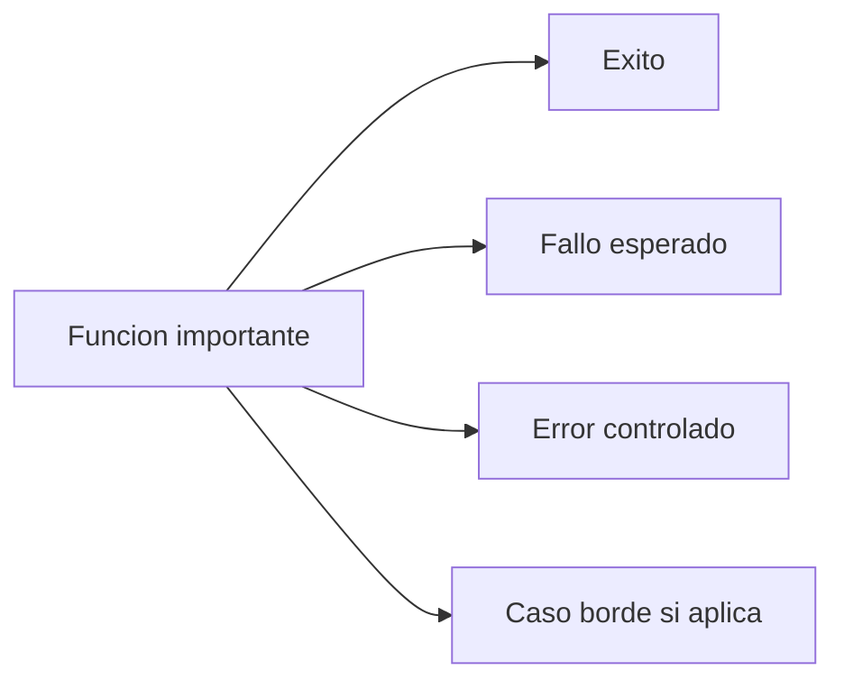

Regla operativa:

- Minimo 3 escenarios.
- Preferible 4 escenarios en flujos de BD, seguridad, webhooks, endpoints e integraciones.
- Jest cubre funciones, servicios, repositories y controllers.
- E2E cubre respuestas HTTP completas.
- Playwright cubre lo observable del sistema levantado.
- Cada avance debe actualizar esta bitacora y `tasks/todo.md`.

## Estado Actual

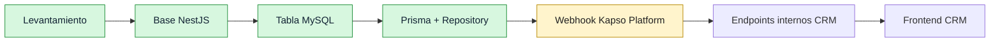

## 2026-08-13 - Levantamiento Inicial

Decision:

- Proyecto completamente nuevo.
- No reutiliza codigo del API Kapso anterior.
- Backend con NestJS.
- Base de datos CRM Ventas es produccion.
- Cambios de BD controlados con `mysql_crm_ventas`.
- No usar Docker.
- Puerto local: `8002`.
- Webhook publico esperado: `/api/v1/webhooks/kapso/platform`.
- Frontend CRM se conectara despues con token interno.

Documentos creados:

- `README.md`
- `docs/requirements.md`
- `tasks/todo.md`

Verificacion:

- Se inspecciono que el repo existia y estaba casi limpio.
- Se confirmo que no se guardaron secretos en documentos versionables.

Siguiente paso definido:

- Crear base NestJS.

## 2026-08-13 - Base NestJS

Se construyo:

- Proyecto NestJS con TypeScript estricto.
- ESLint.
- Prettier.
- Swagger/OpenAPI en `/api/docs`.
- Healthcheck en `/api/v1/health`.
- Logger con `nestjs-pino`.
- Redaccion de headers sensibles.
- Playwright smoke test.
- Comando unico de verificacion: `npm run verify`.

Archivos principales:

- `src/app.module.ts`
- `src/main.ts`
- `src/config/app-config.ts`
- `src/health/health.module.ts`
- `src/health/health.controller.ts`
- `src/health/health.service.ts`
- `scripts/verify-system.ps1`
- `scripts/verify-start-dev.ps1`

Verificacion:

- `npm run lint`
- `npm run typecheck`
- `npm run test -- --runInBand`
- `npm run test:e2e -- --runInBand`
- `npm run build`
- `npm run format:check`
- `npm audit --omit=dev`
- `npm run test:playwright`
- `npm run verify:start:dev`

Resultado:

- Todo paso correctamente.
- El puerto `8002` no quedo ocupado al final.

Siguiente paso definido:

- Crear tabla inicial de integracion en MySQL.

## 2026-08-13 - Tabla MySQL De Integracion

Se inspecciono:

- MySQL `8.0.45`.
- Charset `utf8mb4`.
- Collation `utf8mb4_0900_ai_ci`.
- 31 tablas existentes.
- Tabla probable para usuarios internos: `admins`.

Decision importante:

- La referencia futura de vendedor debe usar `admins.idnetsuite_admin`.
- La tabla nueva usa `idnetsuite_admin_asignado`.
- No se agrego foreign key todavia para no forzar una regla incompleta en produccion.

Tabla creada:

- `kapso_integracion_numero_whatsapp`

Reglas:

- `kapso_phone_number_id` es unico.
- `is_active` permite activar/inactivar desde CRM.
- `ultimo_payload_kapso` guarda el ultimo payload relevante.
- Si Kapso envia `whatsapp.phone_number.deleted`, la integracion del numero se elimina por completo.

Documento actualizado:

- `docs/database.md`

Verificacion:

- Se verificaron columnas en `information_schema.columns`.
- Se verificaron indices en `information_schema.statistics`.
- La tabla quedo vacia.

Siguiente paso definido:

- Conectar NestJS con MySQL.

## 2026-08-13 - Conexion NestJS Con MySQL

Se construyo:

- Prisma Client.
- `prisma/schema.prisma` mapeado a la tabla existente.
- `DatabaseModule`.
- `PrismaService`.
- `KapsoWhatsappNumberRepository`.
- `npm run db:check`.

Archivos principales:

- `prisma/schema.prisma`
- `src/database/database.module.ts`
- `src/database/prisma.service.ts`
- `src/database/prisma-client.factory.ts`
- `src/database/database-check.ts`
- `src/kapso-integrations/kapso-integrations.module.ts`
- `src/kapso-integrations/kapso-whatsapp-number.repository.ts`
- `scripts/db-check.ts`
- `scripts/ensure-database-url.ps1`

Problema encontrado:

- `DATABASE_URL` generado desde `.env` cambiaba el password al pasar por URL encoding/decoding.
- El driver directo con `MYSQL_*` si conectaba.

Solucion:

- Runtime de Prisma usa primero `MYSQL_HOST`, `MYSQL_PORT`, `MYSQL_USER`, `MYSQL_PASSWORD`, `MYSQL_DATABASE`.
- `DATABASE_URL` queda disponible para Prisma CLI/generate.

Verificacion:

- `npm run db:check`

Resultado:

```text
Database check OK
kapso_integracion_numero_whatsapp rows: 0
```

Verificacion completa:

- `npm run verify`

Resultado:

- Todo paso correctamente.
- `db:check` quedo agregado dentro de `npm run verify`.
- No se modificaron datos de la tabla.

## 2026-08-13 - Ampliacion Playwright

Motivo:

- El panel de Playwright solo mostraba 1 prueba porque los demas tests estaban en Jest.
- Se decidio que Playwright tambien debe mostrar pruebas visibles del estado actual del sistema.

Se agregaron pruebas Playwright para:

- health API;
- timestamp del healthcheck;
- ruta inexistente con `404`;
- Swagger UI HTML;
- OpenAPI JSON;
- lectura segura de `kapso_integracion_numero_whatsapp`.

Archivos:

- `test/playwright/health.spec.ts`
- `test/playwright/routing.spec.ts`
- `test/playwright/swagger.spec.ts`
- `test/playwright/database.spec.ts`

Verificacion:

- `npm run test:playwright`

Resultado:

- 6 pruebas Playwright pasaron.

Nota:

- Playwright no reemplaza Jest.
- Jest sigue probando funciones, repository y casos internos.
- Playwright prueba lo observable desde servidor/comandos seguros.

## 2026-08-13 - Webhook Kapso Platform

Fuente tecnica revisada:

- `https://docs.kapso.ai/docs/platform/webhooks/security`
- `https://docs.kapso.ai/docs/platform/setup-links/detect-connection`

Decisiones:

- Endpoint publico: `POST /api/v1/webhooks/kapso/platform`.
- Firma: `X-Webhook-Signature`.
- Evento: `X-Webhook-Event`.
- Trazabilidad: `X-Idempotency-Key`.
- Firma validada con HMAC SHA256 sobre el JSON raw.
- Comparacion de firma con `timingSafeEqual`.
- Respuesta correcta a Kapso: `200 OK`.
- Evento no soportado se acepta con `processed=false` para evitar retries innecesarios.
- Tests Playwright del webhook no escriben en produccion.

Se construyo:

- `KapsoWebhooksModule`.
- `KapsoPlatformWebhookController`.
- `KapsoWebhookSignatureService`.
- `KapsoPlatformWebhookService`.
- Metodos repository para `upsert` de numero creado y `deleteMany` de numero eliminado.

Escenarios probados:

| Pieza        | Escenarios                                                                |
| ------------ | ------------------------------------------------------------------------- |
| Firma        | valida, con prefijo `sha256=`, invalida, header/secret faltante           |
| Servicio     | creado, payload incompleto, eliminado, evento ignorado, error DB          |
| Repository   | upsert completo, upsert con nulos, delete existente, delete inexistente   |
| E2E endpoint | creado OK, eliminado OK, firma invalida, evento faltante, evento ignorado |
| Playwright   | evento firmado ignorado, firma invalida, evento faltante                  |

Verificacion enfocada:

- `npm run test -- kapso-webhook-signature kapso-platform-webhook kapso-whatsapp-number.repository --runInBand`
- `npm run test:e2e -- kapso-platform-webhook --runInBand`
- `npm run test:playwright`

Resultado:

- Unit tests enfocados: 16 escenarios pasaron.
- E2E webhook: 5 escenarios pasaron.
- Playwright: 9 escenarios pasaron.

## Siguiente Tarea

## 2026-08-13 - API Interna Frontend CRM

Objetivo:

- Permitir que el frontend CRM lea y administre integraciones iniciales de numeros WhatsApp.
- Proteger endpoints con token interno.
- No exponer `BigInt` crudo al frontend.
- Evitar escrituras reales en pruebas Playwright sobre produccion.

Se construyo:

- `CrmInternalTokenGuard`.
- `KapsoWhatsappNumbersController`.
- `KapsoWhatsappNumbersService`.
- `GET /api/v1/kapso/whatsapp-numbers`.
- `PATCH /api/v1/kapso/whatsapp-numbers/:id/activate`.
- `PATCH /api/v1/kapso/whatsapp-numbers/:id/deactivate`.
- Repository con `findAll` y `setActiveById`.

Reglas:

- Header principal: `Authorization: Bearer <CRM_API_INTERNAL_TOKEN>`.
- Header alternativo: `X-CRM-API-Token`.
- Sin token o token invalido: `401`.
- Si falta `CRM_API_INTERNAL_TOKEN`: falla cerrado.
- IDs `BigInt` salen como string para evitar errores JSON.
- Activar/inactivar usa `updateMany` y devuelve `404` si no actualiza ningun registro.

Escenarios probados:

| Pieza      | Escenarios                                                                      |
| ---------- | ------------------------------------------------------------------------------- |
| Guard      | Bearer valido, header alternativo valido, sin token, token invalido, sin config |
| Servicio   | listar, lista vacia, activar, desactivar, id invalido, registro faltante        |
| Repository | findAll, activar, desactivar, update inexistente                                |
| E2E API    | listar con token, sin token, token invalido, activar, desactivar                |
| Playwright | listar con token real, sin token, token invalido, activacion bloqueada          |

Verificacion enfocada:

- `npm run test -- crm-internal-token kapso-whatsapp-numbers kapso-whatsapp-number.repository --runInBand`
- `npm run test:e2e -- kapso-whatsapp-numbers --runInBand`
- `npm run test:playwright`

Resultado:

- Unit tests enfocados: 22 escenarios pasaron.
- E2E API interna: 5 escenarios pasaron.
- Playwright: 13 escenarios pasaron.

Nota:

- Se configuro `CRM_API_INTERNAL_TOKEN` en `.env` local sin imprimir el valor.
- `.env` sigue fuera de git.
- Playwright no ejecuta activacion/desactivacion con token para no modificar datos reales en produccion.

## Siguiente Tarea

Crear vista minima en frontend CRM:

- Buscar vista Kapso existente en `produccion/src`.
- Limpiar implementacion previa de Kapso.
- Dejar solo `h1` con `Kapso integracion`.
- Verificar compilacion del frontend si el proyecto lo permite.
- Mantener minimo 3 escenarios por funcion importante.
- Agregar 4 escenarios cuando haya seguridad, BD o integracion externa.

## 2026-09-04 - Asignacion De Admins Y Proyectos A Integraciones Kapso

Objetivo:

- Permitir que una integracion Kapso pueda asignarse a uno o varios admins CRM.
- Permitir que una integracion Kapso pueda asignarse a uno o varios proyectos CRM.
- Administrar esas asignaciones desde `View_Kapso.jsx`.
- Mantener el API como fuente de reglas y validaciones.

Decision tecnica:

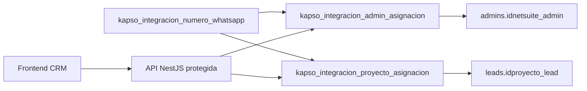

Reglas:

- No se usa un campo con multiples admins concatenados.
- Se creo tabla puente `kapso_integracion_admin_asignacion`.
- Se creo tabla puente `kapso_integracion_proyecto_asignacion`.
- Una misma integracion no puede repetir el mismo `idnetsuite_admin`.
- Una misma integracion no puede repetir el mismo `idproyecto_lead`.
- `admins.idnetsuite_admin` no tiene FK porque en produccion existen valores duplicados.
- `leads.idproyecto_lead` no tiene FK porque `leads` no es catalogo unico de proyectos.
- La API valida que exista al menos un admin activo antes de crear o editar una asignacion.
- La API valida que exista al menos un lead con ese `idproyecto_lead` antes de crear o editar una asignacion de proyecto.
- Eliminar una asignacion no elimina la integracion Kapso.

Endpoints agregados:

| Metodo | Ruta                                   | Uso                                     |
| ------ | -------------------------------------- | --------------------------------------- |
| GET    | `/api/v1/kapso/admin-integrations`     | Lista integraciones con admins/cronjobs |
| POST   | `/api/v1/kapso/admin-integrations`     | Crea asignacion admin-integracion       |
| PATCH  | `/api/v1/kapso/admin-integrations/:id` | Edita admin de una asignacion           |
| DELETE | `/api/v1/kapso/admin-integrations/:id` | Elimina asignacion admin                |
| GET    | `/api/v1/kapso/admins/options`         | Lista admins activos para selector      |
| GET    | `/api/v1/kapso/projects/options`       | Lista proyectos desde `leads`           |
| GET    | `/api/v1/kapso/phone-numbers/options`  | Lista integraciones para selector       |

Frontend:

- Vista construida en `produccion/src/app/views/kapso/View_Kapso.jsx`.
- Estilos en `produccion/src/app/views/kapso/View_Kapso.css`.
- Tabla con integracion, numero, estado, admins asignados, cronjobs configurados y acciones.
- Modal para crear/editar asignaciones de admin.
- Modal para crear/editar asignaciones de proyecto.
- Selector de administradores con busqueda por nombre, correo o `idnetsuite_admin`.
- Selector de proyectos con busqueda por `proyecto_lead` o `idproyecto_lead`.
- Confirmacion para eliminar asignacion.
- Cliente Kapso frontend ahora envia token interno en `Authorization` y `x-crm-api-token`.

Verificacion enfocada:

- `npm run prisma:generate`
- `npm run typecheck`
- `npm run test -- kapso-admin-assignment --runInBand`
- `npm run test:e2e -- kapso-admin-assignment --runInBand`
- `npm run lint`
- `npm run test:playwright`
- Frontend: `npm run build`
- Frontend enfocado: `npx eslint src\api\api.js src\store\kapso\Api_provider_kapso.js src\app\views\kapso\View_Kapso.jsx --ext js,jsx --quiet`

Nota:

- `npm run lint` global del frontend sigue fallando por errores preexistentes fuera de Kapso.
- La compilacion del frontend si pasa.

## 2026-09-04 - CORS Para Frontend CRM Local

Problema:

- El frontend `http://localhost:5173` no podia llamar al API `http://localhost:8002`.
- El navegador bloqueaba el preflight `OPTIONS` por falta de `Access-Control-Allow-Origin`.

Decision:

- Habilitar CORS en NestJS desde el bootstrap real.
- Permitir por defecto:
    - `http://localhost:5173`
    - `http://127.0.0.1:5173`
- Agregar `CRM_FRONTEND_ORIGINS` para dominios adicionales de produccion.

Verificacion:

- Unit test de origenes CORS.
- E2E de preflight contra `/api/v1/kapso/admin-integrations`.

## 2026-09-03 - Prueba Real Kapso Con Ngrok

Objetivo:

- Confirmar que Kapso real puede llamar el webhook publico por ngrok.
- Confirmar que el API responde correctamente.
- Confirmar que la integracion queda registrada en MySQL produccion.

Evidencia del log:

- Evento recibido: `whatsapp.phone_number.created`.
- Endpoint: `POST /api/v1/webhooks/kapso/platform`.
- Payload version: `v2`.
- Respuesta API: `200`.
- Firma recibida y ocultada en logs.
- `X-Idempotency-Key` recibido.

Evidencia de base de datos:

- `npm run db:check` confirmo `kapso_integracion_numero_whatsapp rows: 1`.
- Registro creado con `status=created`.
- Registro creado con `is_active=true`.
- `kapso_phone_number_id` guardado correctamente.
- `kapso_project_id` guardado correctamente.
- `kapso_customer_id` guardado correctamente.

Dato importante:

- El payload real de Kapso v2 recibido solo incluyo llaves principales: `customer`, `phone_number_id`, `project`.
- Por eso `display_phone_number`, `phone_number`, `business_account_id` y `business_name` quedaron `NULL`.
- Para completar esos datos hace falta una sincronizacion posterior contra API de Kapso o ampliar el mapeo si Kapso envia esos campos en otro evento.

Siguiente decision tecnica:

- Crear comando seguro para listar integraciones (`npm run kapso:numbers`) sin exponer payload completo.
- Investigar/implementar sincronizacion de detalle de numero desde Kapso.

## 2026-09-03 - CLI Seguro Para Monitoreo De Integraciones

Objetivo:

- Revisar desde consola los numeros WhatsApp integrados sin tocar datos.
- Evitar imprimir secretos, tokens o payload crudo de Kapso.
- Dejar el comando dentro de la verificacion normal del proyecto.

Se construyo:

- `npm run kapso:numbers`.
- Presenter `createKapsoWhatsappNumberMonitorRows`.
- Salida JSON compacta con `total` y `data`.
- Enmascarado de `displayPhoneNumber`, `phoneNumber` y `businessAccountId`.
- Listado de `payloadKeys` en lugar de `ultimoPayloadKapso` completo.
- Inclusion de `scripts/**/*.ts` en lint, format y typecheck.

Resultado real de solo lectura:

- `npm run kapso:numbers` devolvio `total: 1`.
- Registro activo: `isActive=true`.
- Estado: `created`.
- Payload detectado con llaves: `customer`, `phone_number_id`, `project`.
- Campos de detalle siguen pendientes de sincronizacion: `displayPhoneNumber`, `phoneNumber`, `businessAccountId`, `businessName`.

Escenarios probados:

| Pieza     | Escenarios                                                                 |
| --------- | -------------------------------------------------------------------------- |
| Presenter | serializa BigInt/Date, lista vacia, campos nulos/payload raro, JSON seguro |
| CLI real  | lectura Prisma contra MySQL produccion sin modificar datos                 |

Verificacion enfocada:

- `npx jest --config jest.config.js --runTestsByPath test/kapso-integrations/kapso-whatsapp-number-monitor.spec.ts --runInBand`
- `npm run kapso:numbers`
- `npm run lint`
- `npm run typecheck`

Resultado:

- Unit test presenter: 4 escenarios pasaron.
- CLI real: lectura OK con 1 integracion.
- Lint: OK.
- Typecheck: OK.

Riesgo tecnico detectado:

- `npm audit --omit=dev` todavia reporta vulnerabilidades transitivas en Prisma/adapter MariaDB.
- `npm audit fix` normal actualizo dependencias compatibles del lockfile, pero no elimina todo.
- La correccion restante sugerida por npm requiere `npm audit fix --force` y cambio mayor/breaking; queda pendiente de decision tecnica, no se aplica automaticamente.

Siguiente decision tecnica:

- Investigar endpoint oficial de Kapso para traer detalle completo del numero.
- Implementar sincronizacion manual/API solo cuando el endpoint y contrato esten confirmados.

## 2026-09-03 - Webhook WhatsApp Por Numero

Objetivo:

- Cuando exista una integracion activa de numero WhatsApp, crear o actualizar en Kapso el webhook especifico de ese numero.
- Recibir eventos de mensajes y conversaciones en `POST /api/v1/webhooks/kapso/whatsapp`.
- No guardar mensajes todavia; solo validar firma/evento y responder correctamente.

Fuente oficial revisada:

- Kapso crea webhooks con `POST https://api.kapso.ai/platform/v1/whatsapp/webhooks`.
- Kapso lista webhooks con `GET https://api.kapso.ai/platform/v1/whatsapp/webhooks`.
- Si el body incluye `phone_number_id`, el webhook queda asociado a ese numero.
- Eventos confirmados por documentacion:
    - `whatsapp.message.received`
    - `whatsapp.message.sent`
    - `whatsapp.conversation.created`
    - `whatsapp.conversation.inactive`
    - `whatsapp.conversation.ended`
    - `whatsapp.contact.identity_changed`
    - `whatsapp.contact.marketing_preference_changed`
    - `whatsapp.message.delivered`
    - `whatsapp.message.read`
    - `whatsapp.message.failed`

Decision importante:

- La UI de Kapso muestra "Meta agent handover", pero no se encontro el nombre tecnico oficial en la documentacion consultada.
- No se agrego un evento inventado para evitar fallos de API o una configuracion falsa.
- Cuando Kapso confirme el nombre exacto, se agrega a `KAPSO_WHATSAPP_WEBHOOK_EVENTS`.

Se construyo:

- `KapsoPhoneWebhookClient`.
- `ensureKapsoPhoneWebhooks`.
- `npm run kapso:webhooks:ensure`.
- `KapsoWhatsappWebhookController`.
- `KapsoWhatsappWebhookSignatureGuard`.
- Endpoint `POST /api/v1/webhooks/kapso/whatsapp`.
- Variables:
    - `KAPSO_WHATSAPP_WEBHOOK_URL`
    - `KAPSO_WHATSAPP_WEBHOOK_SECRET`

Reglas:

- El comando busca webhooks existentes antes de crear.
- Si existe webhook activo con la misma URL y numero pero le faltan eventos, lo actualiza.
- Si ya existe completo, no crea duplicados.
- Si falta configuracion, falla cerrado.
- El endpoint WhatsApp valida firma con el secret WhatsApp.
- La persistencia de mensajes/conversaciones queda para la siguiente etapa.

Incidente tecnico resuelto:

- Node estaba tomando una variable `KAPSO_API_KEY` previa del entorno de Windows.
- `dotenv/config` no sobrescribe variables ya existentes.
- Se creo `src/config/load-env.ts` con `override: true` y `quiet: true`.
- Runtime, scripts y Playwright cargan ahora el `.env` local del repo como fuente controlada.

Resultado real en Kapso:

- Integraciones activas en BD: `1`.
- Webhooks creados: `0`.
- Webhooks ya completos: `0`.
- Webhooks actualizados: `1`.
- Numero confirmado: `1197677976762773`.
- Endpoint configurado: `/api/v1/webhooks/kapso/whatsapp`.
- Eventos configurados: `10`.

Escenarios probados:

| Pieza      | Escenarios                                                              |
| ---------- | ----------------------------------------------------------------------- |
| Cliente    | crea faltante, evita duplicado, actualiza incompleto, config incompleta |
| Ensure CLI | crea, cero integraciones, existente, actualizado, error Kapso           |
| E2E        | evento WhatsApp firmado, firma invalida, evento faltante                |
| Playwright | evento WhatsApp firmado, firma invalida, evento faltante                |

Verificacion enfocada:

- `npx jest --config jest.config.js --runTestsByPath test/kapso-integrations/kapso-phone-webhook-client.spec.ts test/kapso-integrations/kapso-phone-webhook-ensure.spec.ts test/config/app-config.spec.ts --runInBand`
- `npm run test:e2e -- kapso-whatsapp-webhook --runInBand`
- `npm run kapso:webhooks:ensure`

Resultado:

- Unit tests enfocados: 13 escenarios pasaron.
- E2E WhatsApp webhook: 3 escenarios pasaron.
- Kapso real: webhook por numero actualizado correctamente.

Siguiente decision tecnica:

- Correr verificacion completa.
- Luego implementar persistencia de eventos WhatsApp solo cuando se defina el modelo de chats/conversaciones.

## 2026-09-04 - Knip Para Higiene De Codigo

Objetivo:

- Agregar una revision estatica para detectar codigo muerto y dependencias mal declaradas.
- Evitar que el proyecto acumule archivos, exports o paquetes que nadie usa.
- Incluir esta revision dentro de `npm run verify`.

Que es Knip:

- Herramienta para proyectos JavaScript/TypeScript.
- Parte de archivos de entrada, sigue imports y arma un grafo del proyecto.
- Reporta archivos no alcanzados, exports no importados, dependencias no usadas y dependencias usadas pero no declaradas.

Se construyo:

- `knip.json`.
- Script `npm run knip`.
- Paso `knip` dentro de `scripts/verify-system.ps1`.

Configuracion aplicada:

- Entradas principales: `src/main.ts`, `scripts/**/*.ts`, `nest-cli.json`, tests Jest, E2E y Playwright.
- Proyecto analizado: `src/**/*.ts`, `scripts/**/*.ts`, `test/**/*.ts`, `prisma/**/*.prisma` y configs raiz.
- `pino-pretty` queda ignorado como dependencia dinamica porque Pino lo usa por nombre en `transport.target`.

Limpieza aplicada por hallazgos reales:

- Se removio `mariadb` directo de `package.json` porque no se importa directamente desde el codigo.
- Se removio `ts-loader` porque no hay configuracion Webpack que lo use.
- `AppConfigError` dejo de exportarse porque solo se usa dentro de `app-config.ts`.
- Se elimino el export muerto `resolveMysqlCredentials`; se conservan `readMysqlCredentials` y `parseMysqlUrl`.
- `Request` de Express paso a `import type` para no marcarlo como dependencia runtime.

Verificacion enfocada:

- `npm run knip`

Resultado:

- Knip paso sin hallazgos.

Nota:

- Knip no reemplaza lint, typecheck ni tests.
- Su funcion es encontrar codigo/dependencias muertas o mal conectadas.

## 2026-09-04 - Resolucion De Audit Prisma

Objetivo:

- Resolver `npm audit --omit=dev`.
- Evitar `npm audit fix --force` sin control.
- Quitar dependencias transitivas vulnerables usadas por Prisma 7 y el adapter MariaDB.

Causa confirmada:

- `@prisma/adapter-mariadb` dependia de `mariadb@3.4.5`, reportado vulnerable y sin fix disponible en esa ruta.
- `prisma@7.x` arrastraba vulnerabilidades via `@prisma/config`, `deepmerge-ts` y `mysql2`.

Decision aplicada:

- Mantener Prisma como ORM.
- Cambiar a Prisma clasico `6.19.3`.
- Quitar `@prisma/adapter-mariadb`.
- Quitar `prisma.config.ts`.
- Volver a declarar `url = env("DATABASE_URL")` en `prisma/schema.prisma`.
- `createPrismaClient()` usa `DATABASE_URL` si existe o la construye en memoria desde `MYSQL_*`.

Archivos principales:

- `prisma/schema.prisma`
- `src/database/prisma-client.factory.ts`
- `src/database/database-url.ts`
- `package.json`
- `package-lock.json`

Verificacion esperada:

- `npm audit --omit=dev`
- `npm run db:check`
- `npm run test`
- `npm run build`

Nota:

- No se tocaron tablas ni datos de produccion.
- Este cambio solo modifica la forma en que Prisma se conecta desde Node.

## 2026-09-03 - Sync Manual De Numeros Desde Kapso

Objetivo:

- Completar detalles que no llegaron en el webhook real `whatsapp.phone_number.created`.
- Mantener la sincronizacion protegida por token interno CRM.
- No ejecutar sincronizacion real contra produccion sin una orden explicita.

Fuente oficial revisada:

- Kapso Platform API lista numeros con `GET https://api.kapso.ai/platform/v1/whatsapp/phone_numbers`.
- Autenticacion requerida: header `X-API-Key`.
- Respuesta documentada incluye `phone_number_id`, `business_account_id`, `display_phone_number`, `display_phone_number_normalized`, `verified_name`, `customer_id` y `status`.

Se construyo:

- `KapsoPlatformClient`.
- `POST /api/v1/kapso/whatsapp-numbers/sync`.
- `POST /api/v1/kapso/whatsapp-numbers/:id/sync`.
- Upsert de detalle por `kapso_phone_number_id`.
- Mapeo seguro:
    - `business_account_id` -> `business_account_id`.
    - `verified_name/display_name/name` -> `business_name`.
    - `display_phone_number` -> `display_phone_number`.
    - `display_phone_number_normalized` -> `phone_number`.
    - `customer_id` -> `kapso_customer_id`.
    - `status` -> `status`.
    - payload completo -> `ultimo_payload_kapso`.
    - momento de sync -> `last_sync_at`.
- Boton `Sync` por fila en `View_Kapso.jsx`, junto a `Asignar`.

Regla visual:

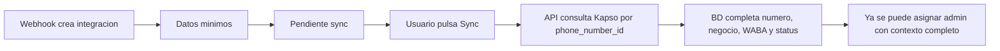

Nota:

- Si el webhook de Kapso solo envia identificadores, la tabla puede mostrar `Pendiente sync`.
- El sync por fila consulta el detalle oficial del numero en Kapso antes de asignar o revisar una integracion.

Escenarios probados:

| Pieza      | Escenarios                                                                                              |
| ---------- | ------------------------------------------------------------------------------------------------------- |
| Cliente    | API key OK, sin API key, API key rechazada, item invalido ignorado                                      |
| Servicio   | sync global exitoso, sync individual, faltante local, lista vacia, error Kapso, error BD                |
| Repository | upsert con detalle Platform API, buscar por id local                                                    |
| E2E API    | sync global con token, sync individual con token, sync sin token, listado/activar/desactivar existentes |
| Frontend   | boton Sync llama API por id local, recarga datos y bloquea doble click mientras sincroniza              |

Verificacion enfocada:

- `npx jest --config jest.config.js --runTestsByPath test/kapso-integrations/kapso-platform-client.spec.ts test/kapso-integrations/kapso-whatsapp-number-sync.spec.ts test/kapso-integrations/kapso-whatsapp-number.repository.spec.ts --runInBand`
- `npm run test:e2e -- kapso-whatsapp-numbers --runInBand`

Resultado:

- Unit tests enfocados: 20 escenarios pasaron.
- E2E sync/API interna: 7 escenarios pasaron.
- Prueba real ejecutada despues: `POST /api/v1/kapso/whatsapp-numbers/sync` devolvio `{"synced":2}`.
- La integracion real `1197677976762773` quedo con numero `+506 7045 2242`, WABA `3174045732780123`, negocio `RDG Ventas`, status `CONNECTED` y `last_sync_at`.

## 2026-09-04 - Correccion Modelo Proyectos A Configuracion Cronjob

Problema:

- La asignacion directa `integracion Kapso + proyecto` no era el modelo correcto.
- La relacion correcta debe ser una configuracion ejecutable por cronjob.

> Nota 2026-09-10: este modelo fue corregido nuevamente. El cronjob ahora es general y los proyectos viven en una tabla hija separada.

## 2026-09-10 - Separacion Cronjob General Y Proyectos Ejecutables

Problema corregido:

- El cronjob no pertenece directamente a un admin.
- La seccion de integraciones solo debe manejar `Integracion + Numero + Estado + Admins asignados`.
- Los cronjobs deben vivir en una seccion aparte.
- Cada cronjob puede tener uno o varios proyectos configurados.
- En la vista CRM, el proyecto del cronjob se configura solo con `Integracion Kapso` + `Proyecto CRM`.
- El campo `idnetsuite_admin` queda nullable en API/BD para compatibilidad futura, pero no se muestra en la vista actual.

Modelo vigente:

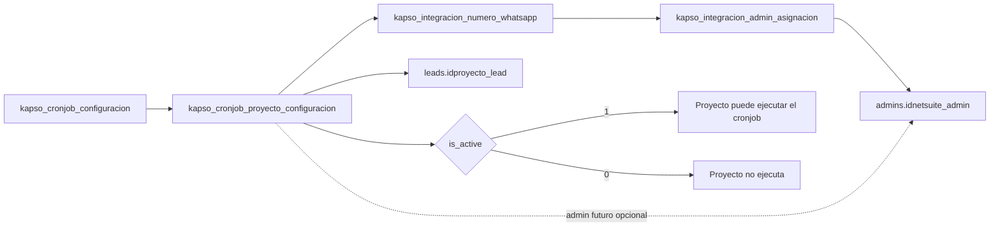

Se construyo:

- Tabla nueva `kapso_cronjob_proyecto_configuracion`.
- `kapso_cronjob_configuracion` queda como configuracion general del cronjob.
- Las columnas legacy `kapso_integracion_numero_whatsapp_id`, `idnetsuite_admin` e `idproyecto_lead` de `kapso_cronjob_configuracion` quedaron nullable por compatibilidad.
- API CRUD protegida para cronjobs generales.
- API CRUD protegida para proyectos asignados a cronjobs.
- Vista CRM simplificada: no pide admin al asignar proyectos al cronjob.
- Vista CRM separada en dos pestañas:
    - `Integraciones`: admins por integracion.
    - `Cronjobs`: cronjobs generales y proyectos ejecutables.

Endpoints vigentes:

| Metodo | Ruta                                         | Uso                                           |
| ------ | -------------------------------------------- | --------------------------------------------- |
| GET    | `/api/v1/kapso/cronjob-configs`              | Lista cronjobs con proyectos configurados     |
| POST   | `/api/v1/kapso/cronjob-configs`              | Crea cronjob general                          |
| PATCH  | `/api/v1/kapso/cronjob-configs/:id`          | Edita cronjob general                         |
| POST   | `/api/v1/kapso/cronjob-configs/:id/projects` | Agrega proyecto ejecutable a un cronjob       |
| PATCH  | `/api/v1/kapso/cronjob-project-configs/:id`  | Edita proyecto ejecutable de un cronjob       |
| DELETE | `/api/v1/kapso/cronjob-project-configs/:id`  | Elimina proyecto ejecutable de un cronjob     |
| GET    | `/api/v1/kapso/projects/options`             | Lista proyectos; acepta `idnetsuiteAdmin`     |
| GET    | `/api/v1/kapso/admin-integrations`           | Lista solo integraciones con admins asignados |

Reglas:

- `cronjob_id` es unico.
- El cronjob general puede estar activo/inactivo.
- La vista operativa no elimina cronjobs generales; solo permite activar o inactivar porque son configuraciones de flujo.
- El API tampoco expone eliminacion del cronjob general; cualquier pausa debe hacerse con `PATCH isActive=false`.
- Cada proyecto configurado tambien puede estar activo/inactivo.
- `idnetsuite_admin` en el proyecto del cronjob es nullable y reservado para uso futuro.
- Desde la vista CRM se envia `idnetsuiteAdmin: null`.
- El proyecto se valida de forma general contra `leads.idproyecto_lead`.
- En el modal de proyectos se ocultan los proyectos ya asignados al mismo `cronjob + integracion` para evitar duplicados antes de guardar.

Verificacion agregada:

- Unit tests para cronjob general.
- Unit tests para proyectos de cronjob sin admin y con admin.
- E2E para CRUD de cronjob general.
- E2E para CRUD de proyectos de cronjob.
- Playwright para bloqueo sin token en cronjob y proyecto de cronjob.

## 2026-09-10 - Cronjob Envio Template Inicial

Objetivo:

- Crear un flujo aislado para el cronjob `envio_template_inicial`.
- El cronjob debe tomar solo proyectos activos configurados en `kapso_cronjob_proyecto_configuracion`.
- Buscar leads pendientes de template inicial solo dentro de esos proyectos.
- Enviar el template Kapso `saludo`.
- Registrar el resultado funcional en `bitacoras`.
- Marcar el lead como procesado para que no se envie dos veces.

Regla de seleccion:

```sql
whatsapp_template_contact_sent = 2
AND segimineto_lead = '01-LEAD-INTERESADO'
AND estado_lead = 2
AND idproyecto_lead IN (proyectos activos del cronjob)
```

Flujo:

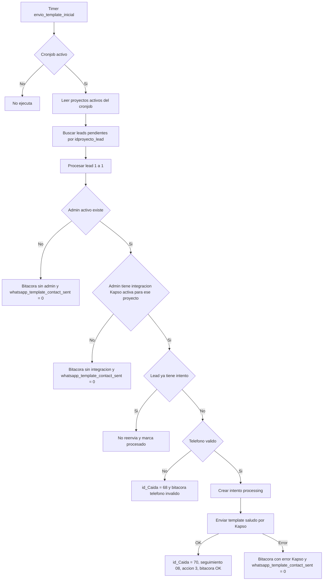

Implementado:

- Carpeta: `src/kapso-cronjobs/envio-template-inicial`.
- Modulo padre: `src/kapso-cronjobs/kapso-cronjobs.module.ts`.
- Cliente Kapso para `POST /meta/whatsapp/v24.0/{phone_number_id}/marketing_messages`.
- Servicio con candado en memoria para evitar doble ejecucion simultanea en el mismo proceso.
- Tabla `kapso_envio_template_inicial_intento` con `UNIQUE(id_lead)` para evitar mas de un intento por lead.
- Runner con `setInterval`, desactivado en `NODE_ENV=test`.
- Comando manual: `npm run kapso:cron:envio-template-inicial`.
- Mapeo Prisma ampliado para columnas reales de `leads` y tabla `bitacoras`.

Datos usados para template `saludo`:

| Parametro | Fuente                |
| --------- | --------------------- |
| `{{1}}`   | `leads.nombre_lead`   |
| `{{2}}`   | `admins.name_admin`   |
| `{{3}}`   | `leads.proyecto_lead` |

Actualizacion de lead al enviar correctamente:

| Campo                            | Valor                 |
| -------------------------------- | --------------------- |
| `whatsapp_template_contact_sent` | `0`                   |
| `segimineto_lead`                | `08-LEAD-SEGUIMIENTO` |
| `accion_lead`                    | `3`                   |
| `actualizadaaccion_lead`         | fecha/hora actual     |
| `actualizado_lead`               | fecha/hora actual     |
| `id_Caida`                       | `70`                  |

Bitacora:

- `bitacoras.id_lead_bit` usa `leads.idinterno_lead`.
- `bitacoras.id_admin_bit` usa `admins.idnetsuite_admin`.
- Si el admin no existe, se usa admin `0` porque existe en produccion y evita romper la FK.

Variables opcionales:

| Variable                                   | Uso                                 | Default  |
| ------------------------------------------ | ----------------------------------- | -------- |
| `KAPSO_ENVIO_TEMPLATE_INICIAL_ENABLED`     | `1` activa el timer automatico      | inactivo |
| `KAPSO_ENVIO_TEMPLATE_INICIAL_INTERVAL_MS` | Intervalo del poller                | `60000`  |
| `KAPSO_ENVIO_TEMPLATE_INICIAL_BATCH_SIZE`  | Cantidad maxima de leads por pasada | `10`     |

Verificacion agregada:

- Cliente Kapso: exito, API key faltante, 401, error Kapso, respuesta invalida.
- Servicio cronjob: desactivado, exito, sin integracion, telefono invalido, error Kapso, doble ejecucion.

## 2026-09-11 - Normalizacion Telefonica E Intentos Unicos

Objetivo:

- Normalizar telefonos antes de llamar a Kapso.
- Basar la regla en los ultimos 2000 registros de `leads`.
- Garantizar un solo intento tecnico por lead.
- Guardar trazabilidad del intento en una tabla propia.

Analisis de produccion:

| Muestra                                 | Resultado |
| --------------------------------------- | --------- |
| Ultimos leads revisados                 | `2000`    |
| Telefonos vacios                        | `0`       |
| Telefonos de 8 digitos                  | `90`      |
| Telefonos `506` + 8 digitos             | `1847`    |
| Telefonos internacionales 11-15 digitos | `1890`    |
| Telefonos repetidos sospechosos         | `1`       |

Regla de formato para Kapso:

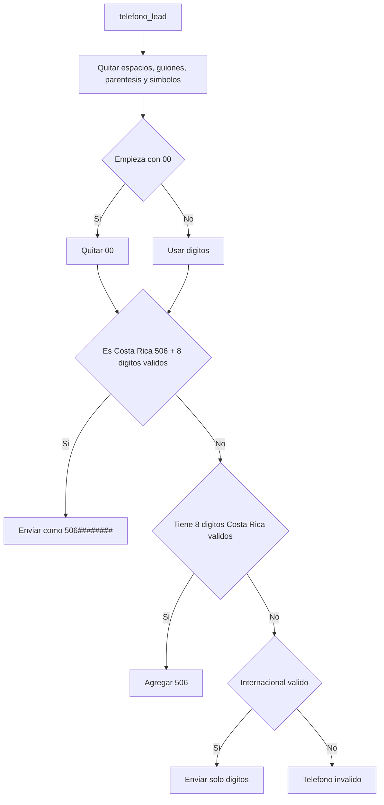

Casos:

| Entrada            | Salida        | Estado           |
| ------------------ | ------------- | ---------------- |
| `8751-5938`        | `50687515938` | CR OK            |
| `8751 5938`        | `50687515938` | CR OK            |
| `+50687-51-5939`   | `50687515939` | CR OK            |
| `+506 8751 5938`   | `50687515938` | CR OK            |
| `0034 612 345 678` | `34612345678` | INTL OK          |
| `+49 8383 1142`    | `4983831142`  | INTL OK          |
| `974 1234 5678`    | `97412345678` | INTL OK          |
| `88888888`         | --            | Invalido         |
| `5058640540`       | --            | Invalido ambiguo |

Tabla nueva:

- `kapso_envio_template_inicial_intento`.
- `id_lead` unico.
- Estados: `processing`, `sent`, `failed`, `invalid_phone`.
- Guarda `kapso_message_ids`, `to_phone_number`, `error_message`, `raw_response` y `kapso_conversation_id`.

Regla de intento:

- Si ya existe intento para el lead, no se vuelve a llamar Kapso.
- Si el telefono es invalido, se guarda intento `invalid_phone`, bitacora e `id_Caida = 68`.
- Si Kapso acepta el envio, se actualiza intento a `sent`, se guarda el mensaje y `telefono_lead` queda normalizado con el mismo numero aceptado por Kapso.
- Si Kapso responde error, se actualiza intento a `failed`, se guarda bitacora y solo se cambia `whatsapp_template_contact_sent = 0`.
- Si luego llega webhook de respuesta con `conversation.id`, se actualiza `kapso_conversation_id`.

## 2026-09-11 - Respuestas del template saludo

Objetivo:

- Procesar solo respuestas del cliente al template inicial `saludo`.
- Registrar la decision en `bitacoras`.
- Cambiar `id_Caida` solo cuando la respuesta esta mapeada.
- No guardar conversaciones ni mensajes completos en esta etapa.

Entrada:

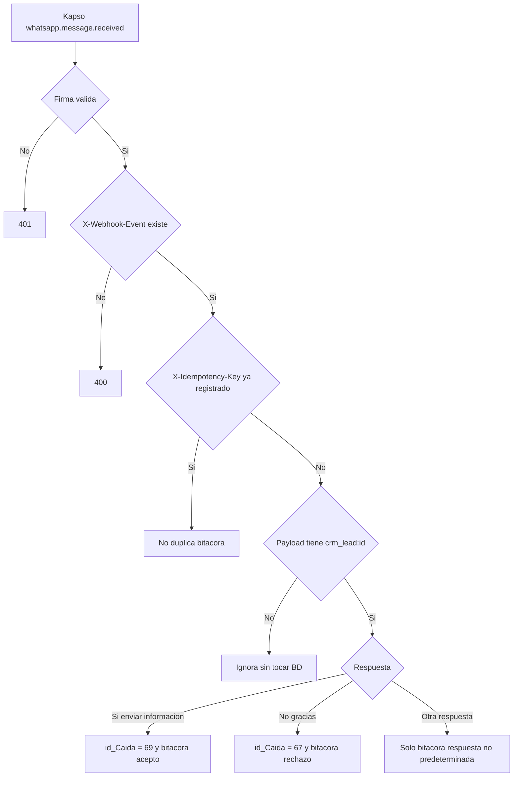

Reglas:

| Respuesta cliente         | Accion                       |
| ------------------------- | ---------------------------- |
| `Sí, enviar información`  | `id_Caida = 69` + bitacora   |
| `No, gracias`             | `id_Caida = 67` + bitacora   |
| Cualquier otra respuesta  | Solo bitacora                |
| Sin `crm_lead:{id}`       | Ignora sin modificar datos   |
| Idempotency key duplicado | Ignora sin duplicar bitacora |

Notas tecnicas:

- El template se envia con `biz_opaque_callback_data = crm_lead:{id};template:saludo`.
- El webhook busca ese marcador en el payload para relacionar la respuesta con `leads.id_lead`.
- La bitacora incluye un marcador `[Kapso webhook idem:{key}]` para evitar duplicados por reintentos de Kapso.
- La extraccion de respuesta soporta `interactive.button_reply.title`, `interactive.button_reply.id`, `button.text`, `button.payload`, `text.body` y `kapso.content`.

Verificacion agregada:

- Unit tests: acepta, rechaza, respuesta no mapeada, idempotencia duplicada y payload sin lead.
- E2E: firma valida delega al servicio, accion mapeada, firma invalida y header faltante.

## 2026-09-11 - Logs De Monitoreo Kapso

Objetivo:

- Guardar en archivo los logs del API durante pruebas reales con Kapso.
- Ver respuestas de Kapso, webhooks recibidos y decisiones del cronjob sin entrar a la BD.
- Poder limpiar logs facilmente cuando ya no sirven.

Archivo principal:

```txt
logs/api-kapso.log
```

Comandos:

| Comando              | Uso                                         |
| -------------------- | ------------------------------------------- |
| `npm run logs:check` | Verifica que la carpeta de logs exista      |
| `npm run logs:tail`  | Ver logs en vivo desde `logs/api-kapso.log` |
| `npm run logs:clear` | Borrar archivos `.log` dentro de `logs`     |

Nota de verificacion general:

- `npm run verify` incluye `logs:check` y `kapso:numbers` porque son seguros y terminan solos.
- `npm run verify` no incluye `logs:tail` porque queda abierto monitoreando.
- `npm run verify` no incluye `logs:clear` porque borra evidencia de pruebas reales.
- `npm run verify` no incluye `kapso:cron:envio-template-inicial` porque puede enviar templates reales.

Eventos registrados:

| Evento                                  | Significado                                 |
| --------------------------------------- | ------------------------------------------- |
| `kapso.template.send.request`           | Se va a llamar Kapso para enviar template   |
| `kapso.template.send.success`           | Kapso acepto el envio y devolvio respuesta  |
| `kapso.template.send.failed`            | Kapso rechazo o fallo el envio              |
| `kapso.template.send.unusable_response` | Kapso respondio OK pero sin mensaje usable  |
| `kapso.template.initial.sent`           | Cronjob marco template inicial como enviado |
| `kapso.template.initial.invalid_phone`  | Cronjob detecto telefono invalido           |
| `kapso.whatsapp.response.processed`     | Webhook de respuesta del cliente procesado  |

Seguridad:

- No se guardan API keys.
- No se guardan firmas de webhook.
- Headers sensibles siguen redactados como `[redacted]`.
- El numero destino se guarda enmascarado en logs del request de envio.

## 2026-09-11 - Refactor De Claridad Backend

Objetivo:

- Revisar el codigo backend creado para Kapso.
- Reducir repeticion sin cambiar contratos, tablas ni endpoints.
- Dejar mas visible la regla de negocio de envio inicial y respuesta del cliente.

Cambios:

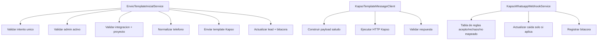

Notas tecnicas:

- La creacion de bitacoras del cronjob queda centralizada para evitar diferencias entre ramas de error.
- El payload del template `saludo` queda separado del manejo HTTP.
- Las respuestas del cliente usan una tabla de decision clara:
  `accepted_info -> 69`, `rejected_info -> 67`, `unmapped_response -> sin caida`.
- No se ejecuto el cronjob real ni se enviaron templates reales durante este refactor.

## 2026-09-11 - Refactor Archivo Por Archivo En `src`

Objetivo:

- Revisar `src` completo, no solo los archivos mas grandes.
- Reutilizar reglas repetidas.
- Agregar comentarios utiles en archivos que no explicaban decisiones de negocio o seguridad.
- Mantener el comportamiento actual del API.

Refactor aplicado:

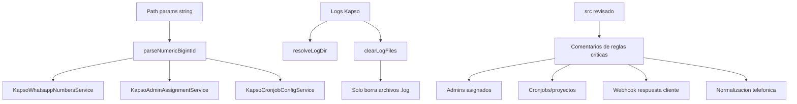

Archivos tocados:

| Archivo                                        | Cambio                                                                 |
| ---------------------------------------------- | ---------------------------------------------------------------------- |
| `src/common/ids/parse-numeric-bigint-id.ts`    | Helper comun para convertir ids numericos a `bigint`                   |
| `src/common/logging/clear-log-files.ts`        | Documenta y separa regla: limpiar solo `.log`                          |
| `src/common/logging/log-files.ts`              | Documenta rutas de logs de monitoreo                                   |
| `src/common/logging/pino-http-options.ts`      | Documenta doble salida de logs                                         |
| `src/common/phone/whatsapp-phone-number.ts`    | Documenta formato esperado por Kapso y placeholders invalidos          |
| `src/kapso-integrations/*assignment*`          | Documenta relacion integracion-admin y proteccion contra dependencias  |
| `src/kapso-integrations/*cronjob*`             | Documenta cronjob general, proyectos ejecutables y admin opcional      |
| `src/kapso-integrations/kapso-platform.client` | Documenta cliente de solo lectura y fallback `phone_number_id/id`      |
| `src/kapso-integrations/*webhook*`             | Documenta asegurar webhook sin duplicar                                |
| `src/kapso-webhooks/*whatsapp*`                | Documenta idempotencia, marker `crm_lead` y respuestas del cliente     |
| `src/kapso-cronjobs/envio-template-inicial/*`  | Documenta runner apagado por default, intento unico y transaccion lead |

Verificacion enfocada:

- Test nuevo `parseNumericBigintId`: rojo inicial por modulo inexistente y luego verde.
- `npm run typecheck`.
- Tests de servicios que usan ids: WhatsApp numbers, admin assignment y cronjob config.

## 2026-09-11 - Refactor Legibilidad Runner y Cronjob

Objetivo:

- Aplicar el patron senior solicitado: constantes arriba, env vars centralizadas,
  funciones cortas con responsabilidad clara y comentarios de intencion.
- Evitar que `envio_template_inicial` ejecute dos ciclos al mismo tiempo.
- Mantener intacto el comportamiento funcional del envio de template y bitacora.

Flujo del runner actualizado:

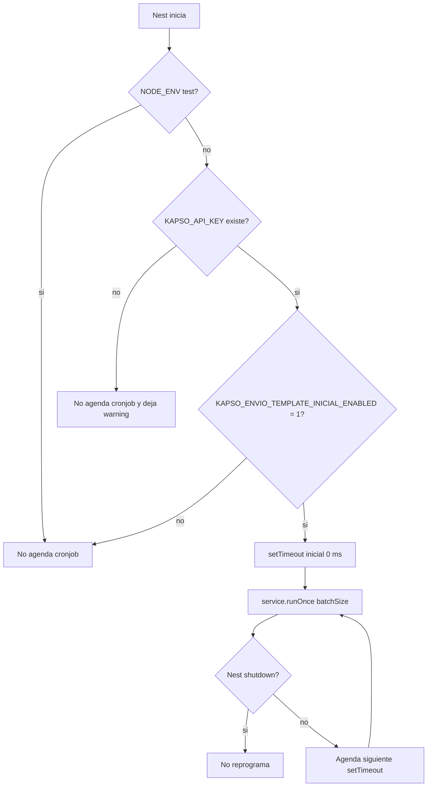

Cambios tecnicos:

| Archivo                                                                          | Cambio                                                                                 |
| -------------------------------------------------------------------------------- | -------------------------------------------------------------------------------------- |
| `src/kapso-cronjobs/envio-template-inicial/envio-template-inicial.runner.ts`     | Reemplaza `setInterval` por `setTimeout` encadenado para impedir ejecuciones solapadas |
| `src/kapso-cronjobs/envio-template-inicial/envio-template-inicial.service.ts`    | Centraliza resultados base, eventos de log, defaults de template y ramas de negocio    |
| `src/kapso-cronjobs/envio-template-inicial/envio-template-inicial.repository.ts` | Reutiliza un solo builder para data de bitacora                                        |
| `src/kapso-integrations/kapso-platform.client.ts`                                | Centraliza env key y URL de detalle                                                    |
| `src/kapso-integrations/kapso-phone-webhook.client.ts`                           | Reutiliza payload/headers para crear y actualizar webhook                              |
| `src/kapso-integrations/kapso-whatsapp-numbers.service.ts`                       | Centraliza dependencias de sync y reutiliza sync de numero + webhook                   |
| `test/kapso-cronjobs/envio-template-inicial.runner.spec.ts`                      | Agrega 6 escenarios del runner con timers falsos                                       |

Prueba roja encontrada:

- Antes del refactor, el test de no solapar ciclos fallo con 6 llamadas a
  `runOnce` mientras la primera seguia pendiente. Eso confirmo el problema del
  `setInterval`.

Verificacion enfocada:

- `npm run test -- envio-template-inicial.runner.spec.ts --runInBand`: 6 tests OK.
- `npm run test -- envio-template-inicial.service.spec.ts envio-template-inicial.runner.spec.ts --runInBand`: 13 tests OK.
- `npm run test -- kapso-platform-client.spec.ts kapso-phone-webhook-client.spec.ts --runInBand`: 10 tests OK.
- `npm run test -- kapso-whatsapp-numbers.service.spec.ts --runInBand`: 6 tests OK.

## 2026-09-11 - Refactor Completo Carpeta `envio-template-inicial`

Objetivo:

- Revisar solo `src/kapso-cronjobs/envio-template-inicial`.
- Dejar cada archivo con intencion clara, constantes arriba y reglas de negocio comentadas.
- Agregar cobertura directa para el repository del cronjob.

Mapa final de responsabilidades:

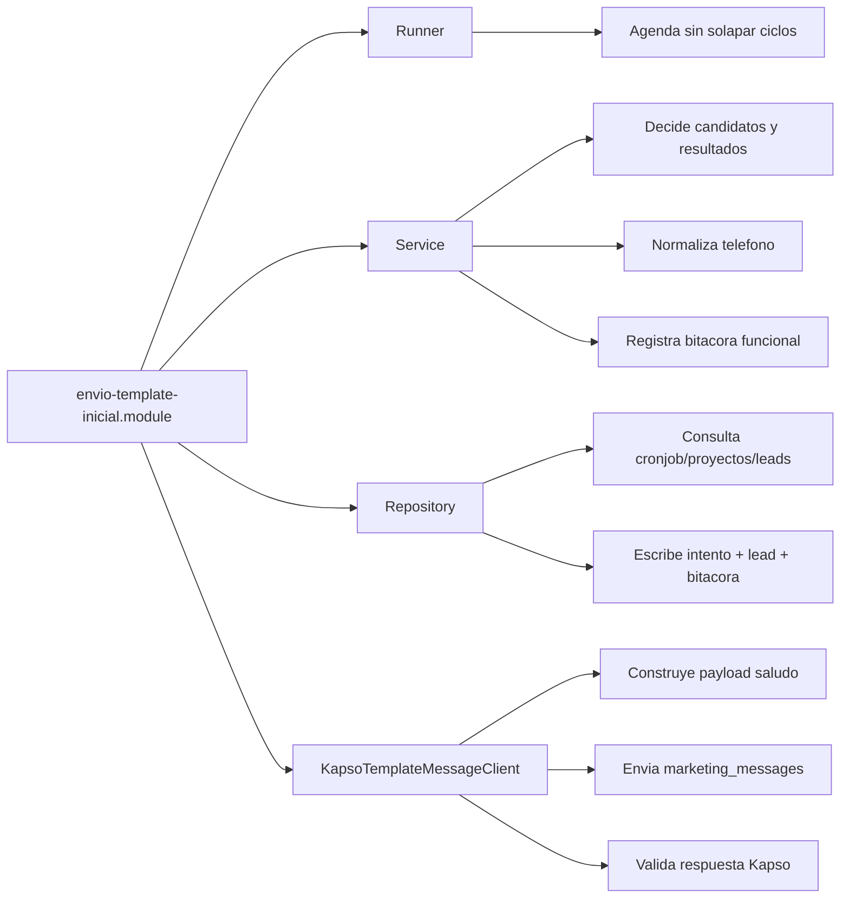

Cambios:

| Archivo                                                         | Cambio aplicado                                                               |
| --------------------------------------------------------------- | ----------------------------------------------------------------------------- |
| `envio-template-inicial.constants.ts`                           | Agrupa cronjob, template, estados CRM, caidas y defaults con comentarios      |
| `envio-template-inicial.module.ts`                              | Documenta que cada cronjob nuevo debe vivir en su propio modulo/carpeta       |
| `envio-template-inicial.runner.ts`                              | Runner serial con `setTimeout`, env keys centralizadas y shutdown controlado  |
| `envio-template-inicial.service.ts`                             | `processBatch`, ramas claras de skip, telefono invalido y envio exitoso       |
| `envio-template-inicial.repository.ts`                          | Builder unico para data de bitacora y constante para `fechSegBit` legacy      |
| `kapso-template-message.client.ts`                              | Separa API key, URL, headers, payload, lectura JSON y logs de respuesta Kapso |
| `test/kapso-cronjobs/envio-template-inicial.repository.spec.ts` | Agrega 6 escenarios directos de repository                                    |
| `test/kapso-cronjobs/envio-template-inicial.service.spec.ts`    | Agrega escenarios: sin proyectos ejecutables y admin inexistente/inactivo     |

Verificacion enfocada:

- `npm run test -- envio-template-inicial.repository.spec.ts envio-template-inicial.service.spec.ts envio-template-inicial.runner.spec.ts kapso-template-message-client.spec.ts --runInBand`
- Resultado: 4 suites OK, 26 tests OK.

## 2026-09-11 - Auditoria Adversarial De Tests

Objetivo:

- Revisar `test/` y ejecutar la suite.
- Agregar escenarios borde para intentar romper HMAC, tokens, webhooks, ids, telefonos y cronjob.
- Si un escenario cae, corregir el contrato real; si no, dejar documentado que resiste.

Bug real encontrado:

- `parseKapsoRouteId("0")` respondia 404 porque `!0n` es `true` en JavaScript.
- Fix: comparar contra `null` en `src/kapso-integrations/parse-kapso-route-id.ts`.

Falsos positivos del ataque (tests mal calibrados, no bugs de produccion):

- `crypto.timingSafeEqual` en Node actual lanza `RangeError`, no `TypeError`.
- En Windows `API-KAPSO.LOG` colisiona con `api-kapso.log`; el contrato sigue siendo suffix `.log` case-sensitive.

Cobertura nueva:

- Specs directos de `timing-safe-equal`, `assertWebhookSignature`, `assertInternalToken`, `readWebhookRawBody`, headers, classify/payload WhatsApp, `parseKapsoRouteId`, P2002, query flags, puertos TCP, payload `saludo` y mapping de bitacora.
- Escenarios extra en HMAC, telefonos, ids, platform webhook, WhatsApp webhook, runner, cronjob config, CORS, DATABASE_URL y clear-log-files.

Verificacion:

- `npm run test -- --runInBand`: 45 suites, 323 tests OK.
- `npm run test:e2e -- --runInBand`: 6 suites, 33 tests OK.
