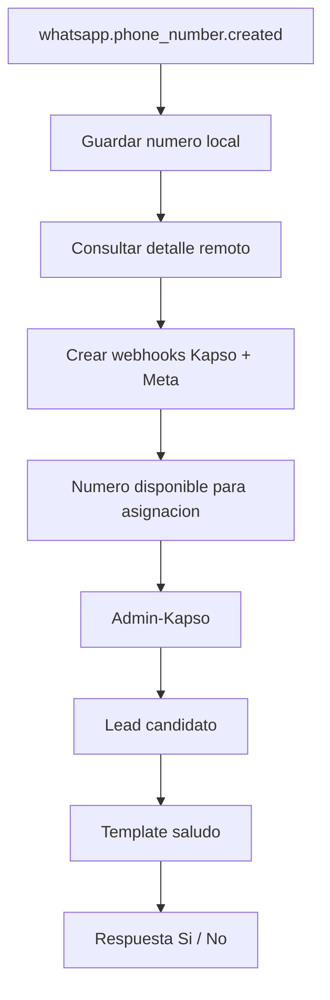

# Modulo Kapso

Modulo NestJS encargado de conectar CRM Ventas con Kapso Platform API.

La documentacion completa del flujo de negocio esta en el README raiz del proyecto. Este archivo resume responsabilidades tecnicas del modulo.

## Responsabilidades

- Recibir webhooks de Kapso Platform, Kapso Events y Meta Relay.
- Sincronizar numeros de WhatsApp hacia `kapso_phone_numbers`.
- Crear webhooks Kapso y Meta por cada numero conectado.
- Administrar asignaciones `Asesor -> Numero Kapso`.
- Guardar catalogo local de templates aprobados.
- Administrar flujos de negocio por proyecto.
- Detectar leads candidatos y enviar el template inicial `saludo`.
- Procesar respuestas de botones.
- Evitar reprocesos usando `flow_uuid + idinterno_lead`.
- Registrar bitacoras CRM cuando el flujo no puede continuar.

## Archivos Clave

| Archivo                                               | Responsabilidad                                              |
| ----------------------------------------------------- | ------------------------------------------------------------ |
| `controllers/kapso.controller.ts`                     | REST de Kapso, setup redirects, catalogos y flujos           |
| `controllers/kapso-webhooks.controller.ts`            | Webhooks Platform, Events y Meta                             |
| `controllers/admin-kapso-integrations.controller.ts`  | CRUD de asignaciones Admin-Kapso                             |
| `services/kapso-sync.service.ts`                      | Orquestacion, workers, envio de templates y respuestas       |
| `services/kapso-platform-api.service.ts`              | Cliente HTTP hacia Kapso                                     |
| `repositories/kapso.repository.ts`                    | Persistencia de numeros Kapso                                |
| `repositories/admin-kapso-integrations.repository.ts` | Consultas CRM, asignaciones, flujos, templates y ejecuciones |
| `common/phone-number.helpers.ts`                      | Normalizacion y validacion de telefonos para WhatsApp        |

## Flujos Principales



## Template Inicial

| Campo      | Valor                     |
| ---------- | ------------------------- |
| Accion     | `lead_initial_greeting`   |
| Template   | `saludo`                  |
| Idioma     | `es_ES`                   |
| Categoria  | `MARKETING`               |
| Estado     | `approved`                |
| Parametros | `{{1}}`, `{{2}}`, `{{3}}` |

Mapeo:

| Parametro | Origen                |
| --------- | --------------------- |
| `{{1}}`   | `leads.nombre_lead`   |
| `{{2}}`   | `admins.name_admin`   |
| `{{3}}`   | `leads.proyecto_lead` |

## Estados de Ejecucion del Lead

| Estado                  | Significado                         |
| ----------------------- | ----------------------------------- |
| `reserved`              | Lead reservado para el flujo        |
| `initial_template_sent` | Template inicial enviado            |
| `answered_yes`          | Cliente acepto recibir informacion  |
| `answered_no`           | Cliente rechazo recibir informacion |
| `invalid_phone`         | Telefono invalido, no se reintenta  |
| `manual_intervention`   | Asesor tomo el control              |
| `completed`             | Flujo finalizado                    |
| `failed`                | Error tecnico terminal              |

## Reglas CRM Importantes

- Identificador operativo del lead: `leads.idinterno_lead`.
- Relacion de proyecto: `leads.idproyecto_lead -> proyectos.id_ProNetsuite`.
- Relacion de asesor: `leads.id_empleado_lead -> admins.idnetsuite_admin`.
- Respuesta `No, gracias`: cambia el lead a perdido con `id_Caida = 67`.
- Telefono invalido: bitacora con `id_caida = 68` sin modificar el lead.

## Verificacion Recomendada

```bash
npm run typecheck
npm run lint
npm test
npm run test:e2e
npm run build
```
