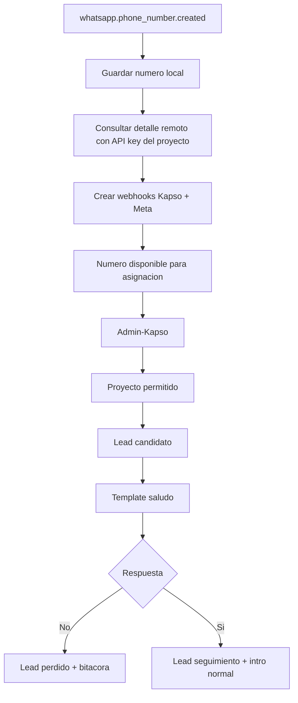

# Modulo Kapso

Modulo NestJS encargado de conectar CRM Ventas con Kapso Platform API.

La documentacion completa del flujo de negocio esta en el README raiz del proyecto. Este archivo resume la estructura tecnica del modulo para ubicar rapido cada responsabilidad.

## Responsabilidades

- Recibir webhooks de Kapso Platform, Kapso Events y Meta Relay.
- Sincronizar numeros de WhatsApp hacia `kapso_phone_numbers`.
- Crear webhooks Kapso Events y Meta Relay por cada numero conectado.
- Administrar asignaciones `Asesor -> Numero Kapso`.
- Guardar catalogo local de templates aprobados.
- Administrar flujos de negocio por proyecto.
- Administrar adjuntos por flujo, proyecto y paso.
- Detectar leads candidatos y enviar el template inicial `saludo`.
- Procesar respuestas explicitas de botones.
- Enviar intro normal por proyecto con adjuntos opcionales dentro de la ventana de conversacion.
- Evitar reprocesos usando `flow_uuid + idinterno_lead`.
- Registrar bitacoras CRM cuando el flujo avanza, se detiene o no puede continuar.

## Archivos Clave

| Archivo                                               | Responsabilidad                                               |
| ----------------------------------------------------- | ------------------------------------------------------------- |
| `controllers/kapso.controller.ts`                     | REST de Kapso, setup redirects y catalogos.                   |
| `controllers/kapso-webhooks.controller.ts`            | Webhooks Platform, Events y Meta.                             |
| `controllers/admin-kapso-integrations.controller.ts`  | CRUD Admin-Kapso, flujos por proyecto y adjuntos.             |
| `services/kapso-sync.service.ts`                      | Orquestacion, workers, envio de templates y respuestas.       |
| `services/kapso-platform-api.service.ts`              | Cliente HTTP hacia Kapso.                                     |
| `repositories/kapso.repository.ts`                    | Persistencia de numeros Kapso.                                |
| `repositories/admin-kapso-integrations.repository.ts` | Consultas CRM, asignaciones, flujos, templates y ejecuciones. |
| `common/phone-number.helpers.ts`                      | Normalizacion y validacion de telefonos para WhatsApp.        |

## Flujo Tecnico Principal



## Rutas de Flujos por Proyecto

Estas rutas alimentan la pestana `Flujos por proyecto` del CRM.

| Ruta                                                                 | Uso                                         |
| -------------------------------------------------------------------- | ------------------------------------------- |
| `GET /api/v1/kapso/business-flows`                                   | Lista flujos, pasos y proyectos permitidos. |
| `POST /api/v1/kapso/business-flows/:flowUuid/projects`               | Permite un proyecto para ejecutar un flujo. |
| `DELETE /api/v1/kapso/business-flows/:flowUuid/projects/:idProyecto` | Quita un proyecto permitido del flujo.      |
| `GET /api/v1/kapso/flows/:flowUuid/projects/:id/media`               | Lista adjuntos del proyecto para una etapa. |
| `POST /api/v1/kapso/flows/:flowUuid/projects/:id/media`              | Sube un adjunto por request.                |
| `DELETE /api/v1/kapso/flow-project-media/:id`                        | Desactiva metadata y borra el archivo.      |
| `GET /api/v1/kapso/media/:storedFilename`                            | Sirve un adjunto por UUID de archivo.       |

Regla de relacion:

```text
leads.idproyecto_lead -> proyectos.id_ProNetsuite
```

El API puede recibir `id_proyecto` o `id_ProNetsuite`, pero guarda la configuracion operativa con `id_ProNetsuite`.

## Template Inicial

| Campo      | Valor                     |
| ---------- | ------------------------- |
| Accion     | `lead_initial_greeting`   |
| Template   | `saludo`                  |
| Idioma     | `es_ES`                   |
| Categoria  | `MARKETING`               |
| Estado     | `approved`                |
| Parametros | `{{1}}`, `{{2}}`, `{{3}}` |

Mapeo:

| Parametro | Origen                |
| --------- | --------------------- |
| `{{1}}`   | `leads.nombre_lead`   |
| `{{2}}`   | `admins.name_admin`   |
| `{{3}}`   | `leads.proyecto_lead` |

## Estados de Ejecucion del Lead

| Estado                  | Significado                          |
| ----------------------- | ------------------------------------ |
| `reserved`              | Lead reservado para el flujo.        |
| `initial_template_sent` | Template inicial enviado.            |
| `answered_yes`          | Cliente acepto recibir informacion.  |
| `answered_no`           | Cliente rechazo recibir informacion. |
| `intro_sent`            | Intro normal enviada.                |
| `intro_failed`          | Intro normal fallo.                  |
| `invalid_phone`         | Telefono invalido, no se reintenta.  |
| `manual_intervention`   | Asesor tomo el control.              |
| `completed`             | Flujo finalizado.                    |
| `failed`                | Error tecnico terminal.              |

## Reglas CRM Importantes

- Identificador operativo del lead: `leads.idinterno_lead`.
- Relacion de proyecto: `leads.idproyecto_lead -> proyectos.id_ProNetsuite`.
- Relacion de asesor: `leads.id_empleado_lead -> admins.idnetsuite_admin`.
- Respuesta `No, gracias`: cambia el lead a perdido con `id_Caida = 67`.
- Respuesta `Si, enviar informacion`: cambia el lead a seguimiento, registra `id_caida_bit = 69` y envia la intro normal.
- Intro normal: usa adjuntos activos de `kapso_flow_project_media`; si no hay adjuntos, envia solo texto.
- Telefono invalido: bitacora con `id_caida_bit = 68` sin modificar el lead.
- Texto libre no se interpreta automaticamente como Si o No.

## Adjuntos

- Se guardan fisicamente en `archivos/{flow_uuid}/proyectos/{idProyectoNetsuite-nombre-proyecto}/{uuid.ext}`.
- Se relacionan por `flow_uuid + id_proyecto_netsuite + step_code`.
- La etapa actual usa `step_code = intro`.
- La metadata queda en `kapso_flow_project_media`.
- Al eliminar un adjunto desde el CRM, se desactiva la metadata y se borra el archivo fisico.
- El archivo se sirve por `GET /api/v1/kapso/media/:storedFilename`.
- Si la metadata esta activa pero el archivo fisico ya no existe, el servicio desactiva esa metadata al listar o servir el archivo.

## Verificacion Recomendada

```bash
npm run typecheck
npm run lint
npm test
npm run test:e2e
npm run build
```
